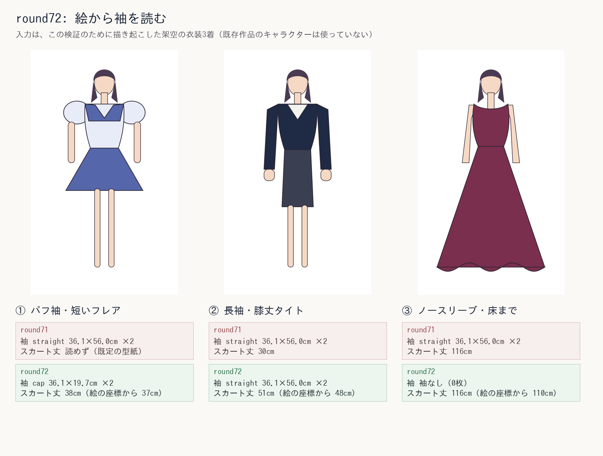

# PatternForge — AI型紙生成支援システム

採寸値・デザイン画から「縫える型紙」を自動生成し、パタンナー・アパレル
ブランド・個人の作り手の型紙作成業務を効率化するWebサービス。

> **このコードを初めて読む人は、先に [`docs/はじめに.md`](docs/はじめに.md)
> を読んでください（10分ぶん）。**
>
> このREADMEは1万行あり、これまでに直したこと全部の記録になっています。
> **あとから「なぜこうなっているのか」を調べるための資料**であって、
> 最初に通して読むものではありません。コードのコメントに `round42:` の
> ような番号が書いてあるので、その番号でこのファイルを検索してください。

## これは何をするアプリか

1. ネックライン・袖・スカートなどのパーツ構成を選ぶ（またはイラストをAIに判定させる）
2. バスト・ウエスト・ヒップ・身長・袖丈・肩幅の採寸値を入力する
3. 標準Mサイズのテンプレート型紙を、採寸値との差分でパーツごとに比例変形する
4. 縫い代・合印・布目線を自動で付与する
5. rectpackで生地に自動配置（ネスティング）し、布ロス率を最小化する
6. A4分割PDF（実寸1:1、家庭用プリンタで印刷して貼り合わせ可能）・SVGプレビュー・
   DXF（業務用の自動裁断機・CADソフト向け、round5で追加）の3形式を出力する

Flask + 素のHTML/CSS/JSの簡易UIから、上記を一気通貫で試せる。

## クイックスタート

```bash
python3 -m venv .venv && source .venv/bin/activate   # 任意
pip install -r requirements.txt
cp .env.example .env       # 必要ならANTHROPIC_API_KEY等を設定（未設定でも動く）
python3 app.py             # http://127.0.0.1:5000 で起動
```

テスト（2,200件以上、外部ネットワーク・APIキー不要）:

```bash
pip install -r requirements-dev.txt
pytest
```

テンプレート型紙SVGを作り直したい場合（既に `pattern_templates/` に生成済みだが、
デザインを調整する際の再生成用）:

```bash
python3 scripts/generate_templates.py
```

## アーキテクチャ

```
engine/
  svgpath.py          SVG path (d属性) の解析・変形・ポリライン化・回転・平行移動
  templates_db.py     60種のテンプレート型紙SVGをロード・検索（part_type, variation）
  measurements.py     採寸値(Measurements)と標準Mサイズ(STANDARD_M)
  part_specs.py       パーツ種ごとの採寸→変形ルール（横のみ/縦横両方など）
  scaling.py          採寸差分による比例変形（体型スケーリング）
  darts.py            バスト-ウエスト差に基づくウエストダーツ、推定バストポイント(BP)に
                      先端を寄せる脇ダーツ、ヒップ-ウエスト差に基づくスカート/パンツの
                      ウエストダーツの自動算出・追加（順にfront_bodice/back_bodice、
                      front_bodiceのみ(front_bodice_zip_panelは非対応)、
                      skirt(tight・mermaid)のみ、front_pants/back_pants全バリエー
                      ションが対象。線形スケーリングの限界を補う）
  seam.py             縫い代(polygon offset、辺ごとに幅を変えるoffset_polygon_variable
                      含む)・合印・布目線の生成
  nesting.py          rectpackによる2次元ネスティング（複数アルゴリズム×複数ソート順を
                      総当たりして最良を選択。布目安全のため回転は既定オフ）
  pdf_export.py       SVGプレビュー出力 / A4分割PDF出力（Sutherland-Hodgmanクリッピング）/
                      dxf_export.pyの呼び出しによるDXF出力の束ね役(export_pattern)
  dxf_export.py       CAD・自動裁断機向けのDXF出力（ezdxf使用。round5で追加）
  segmentation.py     イラスト→パーツ領域抽出（アルファチャンネル/背景色推定による簡易
                      シルエット分割 / SAM連携）
  part_classifier.py  パーツ領域→part_type判定（簡易モック / Claude API連携）
  pipeline.py         上記すべてをつなぐエンドツーエンドの生成フロー（前後左右のラベル付け・
                      AI関与範囲の説明文生成を含む）

pattern_templates/    標準Mサイズのテンプレート型紙SVG（60種、scripts/で生成）
scripts/
  generate_templates.py          テンプレート型紙SVGを生成するスクリプト（データはコードで管理）
  build_pattern_label_font.py    パーツラベル用フォントアセットの生成スクリプト
  check_production_readiness.py  本番公開前チェックスクリプト（round7で追加。下記
                                  「公開前チェックリスト」参照）

web/
  templates/index.html          採寸入力・パーツ選択フォーム + 結果パネル
  templates/signup.html 等      アカウント登録・ログイン・マイページ・料金ページ等
  templates/terms.html          利用規約
  templates/privacy.html        プライバシーポリシー
  templates/legal.html          運営者情報（特定商取引法に基づく表示）
  templates/404.html, 500.html  エラーページ（app.pyのerrorhandlerから使用）
  templates/guide.html          使い方ガイド（操作マニュアル。/guide、ログイン不要）
  templates/_nav.html, _footer.html, _flash.html  共通ヘッダー/フッター/通知
  static/app.js         フォーム送信・結果表示（ロジックはサーバ側にすべて置く）
  static/style.css      素のCSSで組んだ最小デザインシステム（外部CDN不使用）

app.py                 Flask本体（ルーティング・レート制限・生成物の自動クリーンアップ・
                        セキュリティヘッダー・認証/プラン制御・エラーページ。
                        ロジックはengine/に委譲）
store.py               ユーザー・ジョブ所有権・利用回数を保存するSQLiteの薄いラッパー
                        （商用サービス化の一環。下記「商用サービス化」参照）
mailer.py              メール送信の抽象化（既定はConsoleMailer、設定次第でSMTP送信）
billing.py             決済の抽象化（既定はモック、設定次第でStripe連携）
wsgi.py                 本番運用向けWSGIエントリポイント（gunicorn等から `wsgi:app` として起動）
tests/                  pytest（789件。ネットワーク・APIキー不要で全部通る）
generated/              生成されたSVG/PDF/DXFの出力先（.gitignore対象。既定1時間で自動削除）
patternforge.db         ユーザー・ジョブ所有権・利用回数のSQLiteファイル（.gitignore対象。
                        初回起動時に自動作成される）
```

`engine/` はFlaskに依存していない。CLIやFastAPI、別のUIから使う場合も
`from engine.pipeline import PatternForgePipeline, build_garment_spec` を
呼ぶだけで完結する。

## 採寸→型紙変形の考え方

`engine/part_specs.py` にパーツ種ごとの変形ルールを定義している。
パーツごとに「横のみ(スカート幅)」「縦横両方(袖丈)」のように、どの採寸値を
どの方向の変形に使うかを個別に定義することで、精度を担保している:

| パーツ種 | 幅(X)の基準 | 丈(Y)の基準 |
|---|---|---|
| front_bodice / back_bodice | バスト | 身長 |
| sleeve | 肩幅 | 袖丈 |
| skirt | ヒップ | （固定・変形しない） |
| pants | ヒップ | 身長 |
| collar / cuffs / waistband | 対応する採寸の近似値 | （固定） |

標準Mサイズは `engine/measurements.py` の `STANDARD_M`（JIS L 4005 成人女子M
相当の概算値）。極端な入力でテンプレートが破綻しないよう、倍率は
`part_specs.MIN_SCALE`〜`MAX_SCALE`(0.7〜1.6倍)にクランプしている。

- **入力検証の許容範囲とテンプレート変形の限界が食い違い、範囲外の採寸値が
  何の警告も無く別の値として扱われていた問題（修正済み）**: `Measurements`
  の入力検証(`measurements.py`の`_VALID_RANGES`)はbust=50〜160cmのように
  「単位/桁間違いらしい値を早期に弾く」ためだけの広い範囲を許容している
  一方、実際にテンプレートを変形できる範囲は上記のMIN_SCALE〜MAX_SCALE
  (標準サイズ83cmの0.7〜1.6倍 ≒ 58.1〜132.8cm)に限られる。実際に
  `/api/generate`へbust=160cmとbust=132.8cm(=83×1.6)を送って比較した
  ところ、生成される前身頃・後身頃の型紙(width_cm)が完全に同一になる
  ことを確認した——つまりbust=133cm以上のどの値を入力しても常に同じ
  (132.8cm相当の)型紙しか返らず、しかも入力した採寸値がそのまま使われた
  かのように何の警告も表示していなかった。これは仕立て業者が扱う実際の
  プラスサイズ・小さめサイズの顧客(採寸プロフィール機能はまさにこうした
  複数体型の顧客を想定している)にとって、生地を実際に裁ってから初めて
  気づきうる実害のある不整合。`engine/scaling.py`に
  `measurement_clamp_warnings()`を新設し、6項目(バスト・ウエスト・
  ヒップ・身長・袖丈・肩幅)それぞれについてクランプが発生したかどうかと、
  実際に使われた相当値を算出。`PipelineResult.summary()`経由で
  `/api/generate`のJSONレスポンスに`measurement_warnings`として含め、
  トップページにも赤枠の警告(`#measurement-clamp-warning`)として表示
  するようにした(実際にPlaywright経由の本物のChromiumでbust=160cmを
  送信し、警告が表示されること・標準的な採寸値では表示されないことの
  両方を確認済み)。なお、この修正はテンプレート自体が変形できる範囲を
  広げるものではない(それには標準サイズと大きく異なる体型用の別
  テンプレート追加等、より大きな変更が必要)。あくまで「範囲外の入力に対して
  実際に何が起きているかを正直に開示する」対応であり、正確な型紙が必要な
  場合は依然として手作業での補正が必要になる。
  - **ドキュメント側の追随漏れ（修正済み）**: 上記の修正後、`/guide`
    (使い方ガイド)のFAQには依然「採寸値は許容範囲を外れるとエラーに
    なります」としか書かれておらず、入力検証の範囲内であっても新しい
    赤枠警告が出る場合がある(=入力検証の範囲とテンプレート変形の実効
    範囲は別物である)ことが説明されていなかった。実際に`/guide`を
    curlで取得して確認し、上記の警告文言に対応するFAQ項目を追記した。
    回帰テストは`tests/test_app.py`の
    `test_guide_page_explains_the_measurement_clamp_warning`に追加した。

## ウエストダーツ（線形スケーリングだけでは表現できない体型差の補正）

上記の表の通り、体型スケーリングは基本的に「X/Y均一倍率」の線形変形である。
しかしバスト基準で身頃の幅を決めると、バスト-ウエスト比が標準Mサイズと
大きく異なる体型（くびれが強い/弱い体型）ではウエストが太すぎる型紙になって
しまう。これに対して `engine/darts.py` が、標準的な運針の考え方
（摘み量 = バスト比とウエスト比それぞれで決めた裾半幅の差分 − 着用ゆとり、
1本あたり2.5cmを超えたら2本に分割）に沿った最小限のウエストダーツを
front_bodice/back_bodiceの裾ラインに自動追加する。ダーツはテンプレートの
セグメント順序に依存せず「裾（y座標最大の水平線）」を幾何的に検出して
挿入するため、8種のネックライン×前後身頃のどのバリエーションにも同じ
ロジックで対応できる。生成結果には `darts_applied`（追加したダーツの
合計本数）が含まれ、UIにも「ウエストダーツをN本追加しました」という
通知が出る。

正直な範囲の限定として、これは**裾から真上に伸びる単純なウエストダーツ**
のみであり、肩・脇からバスト頂点へ収束する本当のバストダーツや、
プリンセスラインのような分割線は再現していない。また対象はfront_bodice/
back_bodiceのみで、袖・スカート・パンツ等のダーツ表現は無く、線形
スケーリングのままである（`engine/darts.py` のモジュールdocstring参照）。

### 脇ダーツ（バスト絶対値に応じた追加補正）

ウエストダーツはあくまで「バスト比とウエスト比の"差"」に反応するもので、
バスト-ウエスト比が標準的な体型（差が無い体型）では、バストが標準より
大きくてもダーツは追加されない。しかしバストが大きいほど、身体の
凸曲面を平面の型紙で表現しきれない不足が別途生じる。これに対応する
ため、`apply_bust_dart()`（`engine/darts.py`）を追加した。

- 対象はfront_bodiceおよびfront_bodice_zip_panel（round6で追加。後ろ身頃には
  通常バストダーツを使わないためback_bodiceは対象外）。
- 摘み量は「バストが標準Mサイズ(83cm)を超えた分 × 0.10」を経験則の係数
  として算出し、3.0cmでクランプする（`BUST_DART_COEFFICIENT`/
  `MAX_BUST_DART_INTAKE_CM`）。0.3cm未満の差分はノイズとして無視する。
- 位置は、前身頃の脇線（袖付け〜裾の直線区間）を幾何的に検出し
  （`_find_side_seam_segment_indices`、ウエストダーツの裾検出と同じ
  「セグメント順序に依存せず幾何で探す」設計）、その袖付け寄り30%の
  高さに、脇から中心前へ向かって摘み込むV字ノッチを挿入する。左右
  対称に両方追加できる場合のみ追加し、片側でも安全に置けなければ
  両方とも諦める（左右非対称を避けるため）。
- `darts_applied`にはウエストダーツと脇ダーツの合計本数が入る（区別した
  内訳は現状返していない）。

ウエストダーツと同様、これも**脇線上の簡易な摘みであり、バスト頂点に
実際に収束する本当のバストダーツではない**（バスト頂点の位置そのものは
計測していない）。全採寸範囲・両方向の脇線描画順序に対して非自己交差
な多角形になることを`tests/test_darts.py`で確認している。

#### 肩ダーツ・プリンセスラインの再調査（round7、実装は見送り）

「もっと本物のバストダーツやプリンセスラインに近づけられないか」を実際に
調査した(詳細は`engine/darts.py`モジュールdocstringの「round7: 『本当の
バストダーツ・プリンセスライン』の再調査」参照)。結論は、どちらも現行の
テンプレート構造を変えずには実装できないため、round7では見送った。

- **肩ダーツ**: `scripts/generate_templates.py`の輪郭生成を実際に読むと、
  前身頃には独立した「肩線」の直線区間が無く、肩先の点から直接アームホールの
  ベジエ曲線が始まり、上端はネックライン自体の曲線が肩先同士を直接
  橋渡ししていることが分かった。既存の脇ダーツ・ウエストダーツはどちらも
  「直線(L)セグメントを検出してV字に置き換える」設計であり、この設計を
  曲線区間にそのまま使うことはできない。曲線分割の幾何計算を新たに実装
  するか、テンプレートの輪郭設計自体を変える(肩線をアームホールから
  分離する)必要があり、既存テンプレート全て(round9時点で60種)の
  再生成・再検証が要る規模の変更になる。
- **プリンセスライン**: 前身頃をBPを通る曲線の切り替え線で2枚に分割する
  構造で、round5の`front_bodice_zip_panel`(中心前での直線分割)より本質的に
  大きい変更になる。切り替え線自体が曲線である必要があり、根拠となる実測
  データが無い状態で「それらしい曲線」を当てずっぽうで設計することは、
  他の箇所(グレーディングルールの精度向上等)で避けてきた「根拠のない
  精度向上の主張」と同じ問題になる。加えて新しいpart_typeを追加すると
  `PART_SCALE_RULES`・`PAIR_LABELS`・ダーツ対象集合・
  `engine/compatibility.py`の脇線長チェック(前後身頃の脇線が"ちょうど2本"
  という前提)・ネスティング・PDF/DXF出力ラベルなど、「front_bodiceは
  1part_typeである」ことを前提にしたコード全体に変更が波及し、round7の
  1タスクとして安全に収められる規模を超える。

round5・round6で実装した「脇ダーツをBPへ収束させる」補正(上記参照)が、
現行のテンプレート構造の中で実装可能な現実的な近似の到達点であると判断し、
実際のパタンナー監修の下でテンプレート自体を設計し直す将来の対応候補として
記録するに留めた。

#### 前開きファスナー×脇ダーツの併用対応（round6で追加）

round5で「前開きファスナー」(`front_zip`)を、中心前で実際に左右2枚
(`front_bodice_zip_panel`)に裁ち割りし、見返し(`FACING_WIDTH_CM`=4cm)分を
加えた構造に変更した際、このpart_typeは意図的に脇ダーツの対象から除外して
いた。理由は、脇ダーツの幾何検出ロジック(`_find_side_seam_segment_indices`)
が「左右対称で、脇線が2本ある」という前提を置いており、中心前で分割済みの
片側パネル(脇線が1本、対して中心前は見返し分の張り出しを含む縁)にそのまま
適用すると、中心前の縁を誤ってもう1本の脇線として検出しかねなかったため。

round6でこの制限を解消した。`front_bodice_zip_panel`の輪郭を実際に調べると、
「ほぼ垂直かつ十分に長い直線」という脇線の判定条件に当てはまる縦線が
ちょうど2本存在する（外側の脇線と、中心前の見返し/裁ち割り線）。この2本を
本数だけでは区別できないため、新設した`_bust_dart_zip_panel_side_index`で
「外側の脇線はネックラインから遠い(y座標の上端が中心前の縁より大きい)
はず」という2本目の幾何的性質を追加の判定軸として使い、交差検証に成功した
場合のみ外側の脇線と判定する（失敗時は安全側に倒してダーツを諦める）。
バストダーツの計算そのものは`_bust_dart_notch`に切り出し、front_bodice
(中心前=左右2本の脇線の中点)とfront_bodice_zip_panel(中心前=実際の見返し/
裁ち割り線のx座標)の両方から、ダーツの基準となる中心前のx座標を引数として
渡す形に共通化している。front_bodice_zip_panelでは外側の脇線1本のみに
ダーツを追加し、パネル1枚あたり1本(前身頃全体では左右2枚で計2本)になる。
中心前の見返し/裁ち割り線自体には一切手を加えない。

なお、ウエストダーツ(`apply_waist_dart`)は今回もfront_bodice_zip_panelの
対象外のままにしている。ウエストダーツは「裾の両端=中心前と脇線」という
関係を前提にしているが、片側パネルの裾の両端は「外側の脇線の裾側の点」と
「見返し分張り出した中心前の裾側の点」であり、両者の間には見返し幅
(`FACING_WIDTH_CM`)分のずれがある。この補正には既存ロジックの単純な
使い回し以上の変更が必要で、脇ダーツほど需要が高くないと判断し、round6の
対応範囲からは外した（引き続き「既知の制約」節に記載する）。

**round6で発見・修正した不具合**: 上記の調査中に、既存の脇ダーツ実装
(`apply_bust_dart`)に、ダーツ挿入後のパスが元のセグメントの終点へ戻らず、
脇線の「ダーツの口から元の終点まで」の区間が黙って消失し、後続の袖ぐり
形状も歪んだ位置にずれてしまう不具合を発見した(round5から存在していた、
今回新たに作り込んだものではない)。ダーツを縫い閉じた後の脇線の長さが
「元の脇線長 − ダーツの口の幅(4cm)」に正しく一致することをテストで確認し、
修正した(`tests/test_darts.py`の
`test_apply_bust_dart_preserves_seam_length_minus_the_dart_mouth`)。

### スカートのウエストダーツ（ヒップ-ウエスト差の補正）

`skirt`は従来、幅をヒップ比のみで一様に変形しており、ウエストは一切
考慮していなかった。`skirt(flare)`のようにウエストで摘まずフレアで逃がす
デザインでは問題にならないが、`skirt(tight)`のようなフィットしたスカート
では、ヒップに対してウエストが標準より細い体型（多くの体型がこれに該当
する、いわゆる「洋なし型」）で、実際にはウエストラインがたるむ結果に
なる。`apply_skirt_waist_dart()`（`engine/darts.py`）は、身頃のウエスト
ダーツと同じ「ヒップ比とウエスト比の差分から摘み量を算出し、セグメント
順序に依存せず幾何(上端の水平線)からダーツの挿入位置を探す」設計で、
skirt(tight)のウエストライン(上端)にダーツを追加する。

- 対象は`skirt(tight)`のみ。`flare`/`pleated`/`wrap`は意図的にウエストで
  摘まないデザインのため対象外(`SKIRT_DART_ELIGIBLE_VARIATIONS`)。
- 摘み量の算出式・クランプ値は身頃のウエストダーツ(`compute_dart_plan`)と
  同じ大きさ感で、ヒップ比・ウエスト比に置き換えただけ
  (`compute_skirt_dart_plan`)。
- ダーツの先端(ウエストラインから下向きの長さ)は、身頃の裾ダーツとは
  上下が逆向き（ウエストラインから裾側へ向かって下向きに伸びる）。
- `skirt`はquantity=2(前+後)で同じテンプレートを2回使うため、前後それぞれ
  独立にダーツが計算・追加される（実務では前後で摘み量やダーツ数が
  異なることも多いが、ここでは前後同一のロジックを適用する簡易近似）。
- 身頃の裾ダーツで見つかった「セグメント描画方向への暗黙の依存」と同種の
  問題を最初から踏まないよう、上端セグメントの左右端をmin/maxで明示的に
  求める設計を最初から採用している。全採寸範囲・両方向の上端描画順序に
  対して非自己交差な多角形になることを`tests/test_darts.py`で確認済み。

- **裾セグメントの描画方向を暗黙に仮定していたため、方向が逆だとダーツが
  無条件に無効化されてしまう問題（確認済み・現在のテンプレートからは
  到達不能だが、防御的に修正済み）**: `apply_waist_dart()`の安全確認
  (ダーツの端点が中心前・脇線に寄り過ぎていないかのクリアランスチェック)は、
  裾のLセグメントが「開始点のx座標 < 終了点のx座標」(=左から右へ描かれて
  いる)ことを暗黙に仮定しており、`hem_start[0]`をそのまま裾の左端、
  `hem_end[0]`をそのまま裾の右端として比較していた。同梱の全テンプレート
  (`pattern_templates/*bodice*.svg`)は実際に確認したところ全て左→右方向で
  裾を描いているため、現状のテンプレート一式では問題にならない。しかし
  幾何的には全く同じ形状で裾だけを右→左に描いた合成テンプレートで実際に
  `apply_waist_dart()`を呼んで比較したところ、左→右版では正しく2本の
  ダーツが追加される体型(bust=100/waist=64)でも、右→左版では本来追加
  されるべきダーツが無条件に無効化され、線形スケーリングのみへ静かに
  フォールバックしてしまうことを確認した(方向の仮定が反転し、クリアランス
  チェックの比較対象が常に「裾の左端」のつもりで実際には「裾の右端」を
  見てしまうため)。将来テンプレートが追加/変更された際に同じ罠を踏まない
  よう、`hem_start[0]`/`hem_end[0]`のどちらが小さいかに依存せず、min/maxで
  裾の左端・右端を明示的に求めてから比較するように修正した。修正後は
  裾の描画方向に関わらず、同じ体型・同じテンプレートに対して同じダーツ本数・
  同じ配置(裾ラインのx座標の集合)になることを実際に比較して確認した。
  回帰テストは`tests/test_darts.py`の
  `test_apply_waist_dart_works_regardless_of_hem_segment_drawing_direction`
  に追加した。

### パンツのウエストダーツ（ヒップ-ウエスト差の補正）

`pants`も従来、幅をヒップ比のみで一様に変形しており、ウエストは一切考慮
していなかった。スカートと違い、パンツには「意図的にウエストで摘まない
デザイン」という選択肢が実質存在しない（flare/wide/tapered/shorts、
どのシルエットでもウエスト自体はきちんと合わせる必要がある）ため、
`apply_pants_waist_dart()`（`engine/darts.py`）は**全パンツバリエーション
が対象**という点が、スカートのウエストダーツ（`skirt(tight)`・
`skirt(mermaid)`のみ対象）と異なる。設計自体はスカートのウエストダーツと
ほぼ同一で、`compute_pants_dart_plan()`は`compute_skirt_dart_plan()`と
同じ「ヒップ比とウエスト比の差分から摘み量を算出し、セグメント順序に
依存せず幾何(上端の水平線)からダーツの挿入位置を探す」ロジックをそのまま
流用している。

- 対象は`pants`の全バリエーション（`""`/`wide`/`tapered`/`shorts`/`flare`、
  `PANTS_DART_ELIGIBLE_VARIATIONS`）。
- 摘み量の算出式・クランプ値はスカートのウエストダーツと同じ大きさ感
  （ヒップ比・ウエスト比ベース、`PANTS_DART_EASE_CM`等はスカート側の
  `SKIRT_DART_*`定数と同値）。
- `pants`もquantity=2(左右または前後、テンプレートとしては同一片を2回
  使用)で、それぞれ独立にダーツが計算・追加される簡易近似である点も
  スカートと同様。
- 上端セグメントの左右端をmin/maxで明示的に求める「セグメント描画方向に
  依存しない」設計を最初から採用しており、全採寸範囲・両方向の上端描画
  順序に対して非自己交差な多角形になることを`tests/test_darts.py`で
  確認済み。

これも**簡易な直線ダーツであり、股上・股下の立体的なフィット調整（本来の
パンツ設計で重要な要素）は一切再現していない**。線形スケーリング＋この
ウエストダーツだけでは表現しきれない体型差が残ることを、README・
UI双方で明記する。

## パーツ間の縫い合わせ長さの整合性チェック（round6で追加）

各part_type(front_bodice/skirt/waistband等)は、`PART_SCALE_RULES`(採寸差分
による線形の比例変形)と、上記のダーツ機能によって、それぞれ**独立に**
体型スケーリング・ダーツ追加されている。この設計は実装をシンプルに保てる
一方、実際に縫い合わされる2つの辺(例: 前身頃の脇線と後ろ身頃の脇線、
スカートのウエストラインとウエストバンド)が、スケーリングやダーツの結果
として異なる長さになってしまう可能性を作り込みやすい、という副作用がある。

`engine/compatibility.py`の`check_seam_compatibility()`は、生成済みの
`FinalizedPart`の輪郭(`stitch_line`)から実際の縫い合わせ辺の長さを幾何的に
測り、組み合わせるはずの2辺の長さが一定以上(絶対1.5cmまたは相対5%の
どちらか大きい方)ずれている場合に警告として報告する。チェックしているのは
次の4組:

- 前身頃(front_bodice/front_bodice_zip_panel)の脇線 vs 後ろ身頃(back_bodice)
  の脇線
- スカート(skirt)のウエストライン vs ウエストバンド(waistband)
- パンツ(front_pants/back_pants)のウエストライン vs ウエストバンド
- 袖(sleeve)の袖口 vs カフス(cuffs)

長さの算出は、ダーツで摘まれた分を正しく差し引いた「縫い閉じた後の実際の
長さ」で行う。具体的には、輪郭の各辺のうち両端点の座標(側面線ならx座標、
ウエストライン/袖口なら y座標)が対象の直線に一致する辺だけを合計する
実装になっており、ダーツのV字ノッチ(口→先端→口)のうち「先端へ向かう
斜めの2辺」は自動的にこの合計から除外される(先端に向かう辺は対象の
直線からy/xがずれるため)。これにより、ダーツの有無・本数を意識せずに
「実際に縫い合わされたときの長さ」を測ることができる。

生成結果APIには`compatibility_warnings`として返り、通常生成・複数サイズ
一括生成のどちらの画面でも、既存の採寸クランプ警告(赤)とは区別した
アンバー色の警告ボックスとして表示する。

**round6時点の実測結果と、round7での根本修正**

round6でこのチェッカーを追加した直後は、特定の組み合わせで**標準Mサイズの
採寸値でも、ほぼ常に**警告が出ていた。原因はダーツやスケーリングの計算
ロジックのバグではなく、`waistband`は「ウエスト比」、`cuffs`は「袖丈比」で
それぞれ独立にスケーリングしており、相手パーツ(`skirt`/`sleeve`)側は
「ヒップ比」「肩幅比」等の全く別の採寸項目で独立にスケーリングされていた
ため、両者が偶然にも一致する保証が構造的に無かったことにあった(実測値の
一例、標準Mサイズ`bust=84/waist=68/hip=92/height=160`:
`skirt`のウエストライン合計≈40.4cmに対し`waistband`≈72.1cm、差約32cm)。

round7で、`waistband`/`cuffs`を「独立した採寸比率」ではなく「実際に縫い
合わせる相手パーツ(`skirt`/`pants`のウエストライン、`sleeve`の袖口)の
完成後の長さ」から直接導出する方式に変更した
(`engine/scaling.py`の`scale_band_to_target_width()`、
`engine/pipeline.py`の`_waistband_target_width_cm()`/
`_cuffs_target_width_cm()`参照)。実際のパタンナー業務でも、ウエストバンド/
カフスは単独で採寸から起こすのではなく「縫い合わせる相手の完成後の辺の
長さ」に合わせて作るのが通常であり、この変更はその考え方をそのまま
コード化したものである。この結果、テンプレート同士の基準寸法が独立で
揃わないという根本原因そのものが解消され、標準的な採寸に限らず幅広い
体型・全variationの組み合わせで警告が出ないことを確認している
(`tests/test_compatibility.py`の`test_skirt_waistband_no_longer_mismatches_after_round7_fix`
等、パラメータ化した回帰テストで確認)。

ただし、ウエストバンド/カフスは相手パーツと**完全に同じ長さ**にはしていない。
ボタン/ホック等の打ち合わせ分(`WAISTBAND_CLOSURE_EASE_CM=3.0cm`)、カフスの
開閉のゆとり分(`CUFFS_EASE_CM=2.0cm`)を意図的に加えて長く作る(実際の
洋裁でも、バンドが開き寸法と完全に同じ長さだと閉じたときにきつすぎて
着脱できないため、通常そうする)。このチェッカーは、その意図的な差分を
「不整合」と誤判定しないよう、比較対象の期待値にあらかじめこのゆとり分を
加えてから許容誤差判定を行う。カフスは左右2枚がそれぞれ独立に閉じる輪
(手首を通す筒)なので、ゆとり分もカフスの枚数分だけ加算する。

なお、この修正は`GarmentSpec.parts`内の並び順に依存しない実装にしてある。
手動選択モード(`build_garment_spec()`)は元々`waistband`/`cuffs`を相手
パーツより後ろに置くため単純な1パスでも足りるが、イラストからのAI判定
モード(`generate_from_illustration()`)はAIが検出した領域の順序がそのまま
`parts`の順序になるため、`waistband`が`skirt`より先に来ることもありうる。
`_build_from_spec()`は「band系以外を先にスケーリング」→「band系を
スケーリング」→「元の順序でfinalize」という3パス構成にすることで、この
順序に依存せず正しく動作する。

一方、`front_bodice`の脇線と`back_bodice`の脇線は、脇ダーツが入らない
標準的な体型では一致する(警告は出ない)。バストが標準より大きく脇ダーツが
入る体型でのみ、その分だけ前身頃側が短くなり警告が出る(これは
テンプレートの不整合ではなく、ダーツを入れれば当然その分短くなるという
正しい幾何的帰結であり、round7でも変更していない)。

**このチェッカーができないこと(正直な範囲の限定)**

- あくまで「境界線の長さ」という1次元の量の比較であり、形状(カーブの
  曲率、ノッチ位置等)の整合性までは見ていない。長さが一致していても
  縫い合わせたときに形が合わない可能性は別途ある。
- 襟ぐり(ネックライン)と衿(collar)の長さ比較は非対応。ネックライン形状の
  バリエーション(ラウンド/V/タートル等)によって輪郭上の位置・形が大きく
  異なり、他のパーツ(脇線・裾のような単純な水平/垂直線)と同じ単純な幾何
  規則で汎用的に検出するのが難しく、プロトタイプで試したところ誤検出が
  多かったため見送った。
- 縫い代(seam_allowance)を含めた裁断線(cut_line)ではなく、縫い線
  (stitch_line)同士の長さを比較している。縫い代の付け方自体に誤りが
  あっても、このチェッカーでは検出できない。

## AI連携部分について（重要・正直な現状）

このプロダクトが利用しているAI関連の技術要素と、現状の実装レベルは以下の通り。

- **Claude API(パーツ判定)**: `engine/part_classifier.py` に本番実装
  (`ClaudePartClassifier`)がある。`ANTHROPIC_API_KEY` を設定すれば実際に
  Claude Vision APIを呼んでJSON判定する。未設定時は `MockPartClassifier`
  （領域ラベルからの決定的な割り当て）にフォールバックし、キーなし・オフラインでも
  パイプライン全体を最後まで動作確認できる。
- **SAM(パーツ分割)**: `engine/segmentation.py` に `SAMSegmenter` の実装が
  あるが、SAMの重み(チェックポイント)はこのリポジトリに同梱していない
  （数百MB〜あり、配布・環境構築のコストが高いため）。
  `SAM_CHECKPOINT_PATH` を設定すれば自動的にそちらへ切り替わる。
  未設定時は `SimpleSilhouetteSegmenter`（明度ベースの輪郭抽出+8頭身プロポー
  ションのヒューリスティック分割）にフォールバックする。
- **MiDaS(深度推定)**: 縫い代補正の補助として検討したが、技術難易度・
  投資対効果の観点から現時点では本実装に含めていない。**round7で
  再検討・詳細化**した(想定用途・実際に取得を試みた結果・不採用の
  具体的な技術的根拠を`engine/segmentation.py`冒頭docstringの
  【round7での再検討】に追記)。要点だけ述べると、(1)想定していたのは
  「イラストの深度から、ダーツ/ギャザー/プリーツの分量を推定する」用途
  だったが、(2)この開発環境からMiDaSの学習済み重みを実際に取得しようと
  したところ、配布元(github.com/huggingface.co)がこの環境のネットワーク
  許可リスト外で到達できず(`HTTP 400`/`403 Forbidden`を実際に確認)、
  実測評価はできなかった(ただしこれはこの検証環境固有の制限であり、
  不採用の決定的な理由ではない)、(3)不採用の実質的な理由は別にあり、
  MiDaSが学習・検証されているのは自然写真の陰影・遮蔽の手がかりであって、
  このアプリが受け取る単色・フラット塗りのイラストとは前提が大きく
  異なる点、および仮に深度マップが得られても「深度→cm単位のパターン
  修正量」という変換ロジックを検証データ無しに作ることになり、これまで
  一貫して避けてきた「未検証の精度向上の主張」に該当してしまう点である。

つまり「手動でパーツを選ぶ」モードが常に確実に動く既定の経路で、
「イラストからAI判定」モードはAPIキー/SAM重みを用意すればそのまま本番品質
に切り替わる、というプラガブルな設計にしてある。本番運用ではまず手動モードで
安定運用を確認し、需要が見えた段階でAPIキー/SAM重みを用意してAI判定モードを
有効化する、という段階的な立ち上げ方を想定している。

なお「AIがどこまでやっているか」を利用者に誤解させないよう、生成結果には
必ず `ai_contribution`（画面では「AIはどこまで関与したか」欄）を表示する。
手動モードでは「このジョブではAIは使用していません」、イラストモードでは
「AIが行ったのはパーツ領域の種類判定のみで、型紙の輪郭自体はテンプレート+
体型スケーリングで生成している」という趣旨の説明文を、実行結果ごとに
動的に生成して表示する（`engine/pipeline.py` の `ai_contribution_note()`）。

- **Claude応答のJSON解釈失敗時、生の応答テキストがクライアントへ漏れる
  問題（実バグ、修正済み）**: `engine/part_classifier.py`の
  `_extract_json()`は、Claude応答から`{...}`を取り出せなかった場合、
  以前は`ValueError(f"...: {text!r}")`のように、Claudeが返した生の
  応答テキストをそのまま例外メッセージに埋め込んでいた。この`ValueError`
  は`app.py`の`/api/generate`では「こちらが文言を完全に制御している安全な
  入力エラー」用の`except ValueError`（`str(exc)`をそのままJSONレスポンス
  の`error`フィールドとしてクライアントへ返す設計）で処理されるため、
  Claudeが「JSONのみで回答してください」という指示に従わなかった場合、
  そのAIの生テキストがそのまま利用者のブラウザまで届いてしまう。
  実際に、本物の`_extract_json()`を通す偽の分類器（Claudeが説明文だけを
  返してJSON抽出に失敗する状況を再現）を使い、Flaskのテストクライアントで
  イラストモードの`/api/generate`まで実際に送ったところ、HTTP 400の
  `error`フィールドにその生テキストがそのまま含まれて返ってくることを
  確認した。想定外の例外は既にエラーIDだけを返すよう「正常化」されている
  （上記「セキュリティ・信頼性の強化について」参照）のに、この経路だけ
  素通りしていた。波括弧はあるが中身が壊れているケース(`json.loads`自体が
  失敗するケース)や、`_to_result()`が未知の`part_type`を検出した場合の
  メッセージも同様の埋め込みがあったため、まとめて修正した。生の内容は
  `logging`でサーバー側にだけ残し、クライアントには「AIによるパーツ判定に
  失敗しました。手動選択モードをお試しください。」という定型の安全な
  案内文だけを返すようにした。回帰テストは`tests/test_part_classifier.py`
  の`test_extract_json_error_does_not_leak_raw_claude_response_text`ほか
  4件で固定した。

## ネスティング（AI配置）について

生地への自動配置には `rectpack` を使っている。これはパーツの**外接矩形**を
2次元ビンパッキングする実装であり、パーツの輪郭同士を隙間なく組み合わせる
本格的な不定形ネスティングではない（`engine/nesting.py` のdocstring参照）。
複数のパッキングアルゴリズム（Guillotine系・MaxRects系）×複数のソート順を
総当たりし、配置不能パーツが少なく布ロス率が低い結果を自動選択している。
実測では組み合わせにより布ロス率はおよそ8〜25%で、パーツの形状・組み合わせに
依存する(単体パーツのみのように生地に対してパーツ点数が少ない場合は
40%前後まで上がることもある)。round6で、この範囲を大きく超えて悪化する
特定の組み合わせ(前開きファスナー+袖で約60%)を発見・改善した経緯は
下記「round6でのネスティング再調査」参照。

**布目方向（回転）について**: 90度回転を許可すると布ロス率はさらに下がるが、
回転したパーツは生地の縦地（布目線）からズレるため、先染めチェック・
ストライプ・起毛など方向性のある生地では実際に裁断できない配置になってしまう
（「布目方向制約にも対応」という要件と矛盾する）。そのため既定は
`allow_rotation=False`（布目安全モード。全パーツの布目線を生地の縦地に揃える）
とし、ニット・無地など方向性のない生地を使う場合のみ、UIの「④ 生地の配置
設定」チェックボックスで明示的にオンにする設計にした。オンにして実際に
回転が発生した場合は、結果パネルに警告（⚠）を表示する。

**矩形パッキング後の圧縮パスについて**: `engine/nesting.py` の
`_compact_placement()` が、矩形パッキングの結果に対して「180度回転
（常に布目安全。90度回転と違いallow_rotationの設定に関係なく使える）で、
外接矩形の隙間に実ポリゴン(縫い代込みの裁断線)がどこまで実際に詰め込める
か」を貪欲に探す軽量な後処理を行う。台形(スカート等)やカーブした袖の
ペアでは、実際にパーツ同士が触れ合うところまで詰め直されることを確認
している。正直な実測として、複数パーツが混在する現実的な衣装1式では
布ロス率の改善は数値上わずか(実測でおよそ0〜0.3ポイント程度)であり、
本格的な不定形ネスティングの代替にはならない。安全性については、圧縮後
に必ず実ポリゴン同士の重なりを再検証し、悪化や想定外の重なりを検出した
場合は圧縮を諦めて元の矩形配置をそのまま返す(fail-safe。
tests/test_nesting.py参照)。

**round5でのネスティング改善の試みと、正直な実測結果**: `_compact_placement()`
を、(1)処理順を複数(現在の位置の昇順・面積の大きい順の2通り)試し、
(2)それぞれ改善しなくなるまで反復する、という形に拡張した。ただし実際に
標準M寸の様々な衣装スペック(単体3〜6枚程度の一般的な組み合わせから、
8パーツ種を混在させた36枚の合成テストケースまで)で比較したところ、
**ほとんどの組み合わせで追加の改善は数値上ゼロだった**。原因を調べたところ、
rectpackの初期配置+単発の圧縮パスの時点で、この「貪欲に原点側へ寄せる」
手法が到達できる局所最適に既に達してしまっており、処理順を変えても最終的な
詰め方が同じ結果に収束することが多いためだとわかった。さらに踏み込んで、
乱数によるパーツペアの入れ替えを何十回も試す局所探索も試作したが、
(1)効果が乱数のシードや具体的なパーツ構成に大きく左右され安定した改善とは
言えない、(2)60回の試行だけで1リクエストあたり数秒の追加処理時間がかかり
Webサービスの応答としては割に合わない、と判断し本番コードには含めなかった。
結果として、この拡張が実際に保証するのは「単発の圧縮パスより悪化しない」
という安全性のみで、追加の布ロス改善はほぼ期待できない、という誇張しない
実測結果をそのまま記録しておく(詳細な数値は`engine/nesting.py`の
`_compact_placement`のdocstring、回帰テストは
`tests/test_nesting.py`の
`test_iterative_and_multi_order_compaction_rarely_beats_a_single_pass`参照)。

**round6でのネスティング再調査と、実際に見つかった改善**: round5までは
「詰め込みアルゴリズム3種×並べ替え順2種(面積順のSORT_AREA・周囲長順の
SORT_PERI)」しか試していなかった。round6でrectpackが提供する残り全ての
並べ替え戦略(SORT_DIFF・SORT_SSIDE・SORT_LSIDE・SORT_RATIO・SORT_NONE)を
追加で比較したところ、細長いパーツと幅広いパーツが混在する組み合わせ
(例: 前開きファスナー(縦長の左右2パネル)+袖)で、round5までの2種類の
並べ替え順のどちらも「本来1段に収まるはずの配置」を見つけられず、不要な
2段目を使ってしまい布ロス率が**約0.60**まで悪化する実例を発見した。追加した
5種類のうちSORT_DIFF・SORT_LSIDE・SORT_NONEのいずれもが、同じ構成で
本来の1段構成(布ロス率**約0.20**)を見つけられることを確認し、
`_SORT_ALGO_CANDIDATES`にrectpackの全並べ替え戦略を追加した。「試した
候補の中で布ロス率が最小のものを採用する」という既存の`_best_of`の設計を
一切変えていないため、既存のケースの結果が悪化することは無く、実測でも
処理時間への影響は誤差の範囲内だった(rectpack自体の矩形パッキングが
非常に高速なため)。

正直な副作用として、`_best_of`が「圧縮前の生の詰め込み結果」の布ロス率
だけを見て最良候補を1つ選び、圧縮(`_compact_placement`)はその1件にしか
適用しない(全候補に圧縮を適用すると処理時間が実測で数倍に増えるため
見合わない)設計のままなので、候補を追加したことで「圧縮前は僅差で
2位だったが、圧縮後には僅差で1位より優れていたはずの候補」が選ばれなく
なるケースが理論上あり得る。実際に標準M寸の身頃+パンツの組み合わせで、
0.5ポイント未満のごくわずかな悪化(約0.28→約0.28、0.34ポイント程度)を
1件確認した。今回の改善幅(前開きファスナーのケースで約40ポイント)に
比べれば無視できるほど小さく、「圧縮は最良候補1件にのみ適用する」という
既存の設計判断自体を変える理由には当たらないと判断し、そのまま許容する
ことにした(詳細は`engine/nesting.py`の`_SORT_ALGO_CANDIDATES`定数の
コメント、回帰テストはtests/test_nesting.pyの
`test_round6_expanded_sort_candidates_fix_a_previously_badly_packed_case`
参照)。

**round7でのネスティング再々調査(3回目)と、実際に見つかった改善**:
round6は「並べ替え戦略(sort_algo)」側の探索余地を広げたが、「詰め込み
アルゴリズム(pack_algo)」側は`_PACK_ALGO_CANDIDATES`の3種類
(GuillotineBssfSas・GuillotineBafSas・MaxRectsBssf)のまま据え置きだった。
rectpackが実際に提供するpack_algoは、Guillotine系18種・MaxRects系4種・
Skyline系6種の合計28種類あり、この未探索領域を再調査した。46通りの
衣装スペック(ネックライン×袖・スカート・パンツ・衿・カフス・
ウエストバンドの組み合わせ)×2種類の体型×2種類の生地幅=184ケースを、
現行3種と全28種それぞれで比較したところ、184ケード中3ケース
(約1.6%)で、全28種まで広げると布ロス率が0.5ポイント超改善することを
確認した。最も差が大きかったケース(vネック+ベル袖+ワイドパンツ+
シャツカラー+ゴムウエストバンドの組み合わせ、やや大きめの体型)では、
生地幅・アルゴリズムの総当たり(圧縮パス込み)後の最終的な布ロス率が
**約0.22→約0.198**まで改善した。

ただし全28種類を毎回試すと、1リクエストあたりの平均処理時間が
約2.6msから約32ms(最大63ms)へと約12倍に増えることも実測された
(`_best_of`は既に3種×7並べ替え×2生地幅=42通りを試す設計のため、
28種類に広げると28×7×2=392通りに増える計算)。そこで、どのpack_algoが
実際にこれら3ケースの改善を生んでいるかを個別に特定したところ、
MaxRectsBl・MaxRectsBaf・SkylineMwflのいずれかだけで全28種類と同じ
最良値に到達できることが分かった(残り22種類は、この184ケースの
いずれにおいても現行3種類を上回る結果を一度も出さなかった)。この
3種類のみを追加した6種類構成で同じ184ケースを再検証し、全28種類と
完全に同じ最良値(悪化ゼロ)を平均約7.0ms・最大約13.6ms(現行3種類比で
約2.7倍、全28種類比で約4.6倍高速)で再現できることを確認した上で、
`_PACK_ALGO_CANDIDATES`にMaxRectsBl・MaxRectsBaf・SkylineMwflの3種類を
追加した。「試した候補の中で布ロス率が最小のものを採用する」という
既存の`_best_of`の設計を一切変えていないため、既存のケースの結果が
悪化することは無い(詳細は`engine/nesting.py`の`_PACK_ALGO_CANDIDATES`
定数のコメント、回帰テストはtests/test_nesting.pyの
`test_round7_expanded_pack_candidates_fix_a_previously_badly_packed_case`
参照)。

正直な注記として、今回追加した3種類以外の残り22種類のpack_algoが
「今回検証した184ケース以外の、未知の衣装スペック・体型・生地幅の
組み合わせ」で改善をもたらす可能性を完全に否定することはできない
(調査は有限のケース数によるサンプリングであり、全網羅ではない)。
処理時間コスト(全28種類では1リクエストあたり最大63ms)と、実際に
確認できた効果(184ケース中3ケースのみ、うち今回追加した3種類だけで
全て説明できる)とを比較し、残り22種類は追加しないことにした。将来
未知の悪いケースが実際に発見された場合は、その具体的なケースを元に
再度同様の調査を行う想定である。

- **配置不能パーツ(`NestingResult.unplaced`)がSVG/PDFから無言で消える
  問題（当時「到達不能」と書いたが、**round35でその判断が誤りだったと
  判明**。下の【round35で訂正】を参照）**:
  `nest_parts()`は、どのフォールバック生地幅候補にもパーツの外接矩形が
  収まらない場合、そのパーツを`unplaced`リストに入れるだけで例外を
  投げない設計になっている(1パーツの失敗だけで型紙全体の生成を止めない
  ためのfail-soft設計)。しかし`engine/pdf_export.py`側の
  `render_layout_svg()`/`render_a4_pdf()`はどちらも`result.parts`だけを
  描画しており、`unplaced`は実際に生成したSVG/PDFのどこにも一切
  出力されていなかった。つまり理論上、パーツが1つ静かに欠落した「不完全な
  型紙」が、警告なしに正常な生成結果として利用者に渡ってしまう経路が
  存在した。この経路が実際のUIから到達可能かどうかを、`build_garment_spec`
  が受理する採寸・パーツ構成の全組み合わせ(ネックライン×袖×スカート×
  パンツ×衿×カフス×ウエストバンド×回転許可、かつ採寸値は`MIN_SCALE`〜
  `MAX_SCALE`(0.7〜1.6倍)の両端を含む極端な値)で1,200通り以上を実際に
  `scale_template()`→`finalize_part()`→`best_fabric_width()`まで実行して
  総当たり検証したところ、最大でも単一パーツの幅は114cmで、既定の
  生地幅候補(最大150cm)の範囲内に常に収まり、`unplaced`が発生する
  組み合わせは現時点では見つからなかった(=現在のテンプレート・スケール
  範囲では実際には到達しない)。この検証は、square_neck/boat_neck/
  sweetheart・puff/bell/cap・collar/cuffs/pants/waistband/skirtの新
  バリエーションを追加するたびに全テンプレート(現在47種)×スケール範囲の
  両端(MIN_SCALE/MAX_SCALE)の組み合わせで再実行しており（直近では
  cap袖・skirt(mermaid)・pants(flare)・ruffle_collar・cuffs(ruffle)
  追加後に576通りを再検証）、依然として最大幅は114cm(waistband標準)の
  ままで変化しないことを確認済み。

  - **【round35で訂正】この「到達不能」という結論は、その後の追加によって
    崩れていた。** round9で入れたサーキュラースカートは、幅がヒップに
    ほぼ比例して伸びる(半径がウエスト円周から決まり、丈がヒップに連動する)
    ため、ヒップの大きい人では生地幅(150cm)を超える。round35で
    ウエスト60〜150 × ヒップ70〜170を10cm刻みで総当たりした110通りを
    実際に生成して数えたところ、**70通り(64%)でスカートが生地幅に
    収まらず、型紙から丸ごと消えていた**。1cm刻みで境目を探すと
    **ヒップ143cm**から消え始める。「ヒップ143cm以上の人が
    サーキュラースカートを選ぶと、スカートの無いワンピースの型紙が
    出てくる」状態が、round9からround34までずっと続いていたことになる。
    上の総当たり検証そのものは当時正しかった。誤りは**「一度総当たりして
    確認したから、以後も到達不能である」と書いてしまったこと**で、
    その後バリエーションを追加するたびに再検証すると書きながら、
    サーキュラースカートのように**幅が採寸に比例して伸びる**新種の
    パーツが入ったときに、検証のしかた(固定47テンプレート×スケール両端)
    では捉えられないことに気付けなかった。到達不能性は、機能が増えれば
    黙って失われる性質のものだという反省として残す。
    round35では`engine/panel_split.py`を追加し、分けてよい種類のパーツ
    (スカート・パンツ)は縦の分割線で2〜4枚に分けて収めるようにした
    (詳細はround35の節)。ただし分けてはいけない種類のパーツ(身頃・衿・
    カフス・ウエストバンド)や、分けても`MIN_PANEL_WIDTH_CM`を下回る/
    `MAX_PANELS`を超える極端な幅では**今も発生しうる**。以下の警告表示は
    「防御的ハードニング」ではなく、**実際に使われる経路**である。

  当初は実際に踏んだ実害のある「見つかったバグ」
  ではなく、将来テンプレートやスケール範囲が変わった場合に備えた防御的
  ハードニングのつもりで、(1)`/api/generate`のJSON応答に
  `unplaced_warnings`(具体的なパーツ名を含む案内文)を追加、(2)結果パネルに
  既存の採寸クランプ警告よりも強い赤色の警告ボックスを追加、(3)SVGの
  上部に警告バナー(欠落パーツ名を明記)を描画するよう`render_layout_svg()`
  を修正、(4)A4分割PDFの通常タイルページの前に専用の警告ページを挿入する
  よう`render_a4_pdf()`を修正、という4か所全てに反映した。
  `tests/test_pdf_export.py`の
  `test_unplaced_parts_do_not_silently_vanish_from_svg_or_pdf`で、
  意図的に生地幅を大きく超えるパーツを混在させて`unplaced`を強制発生させ、
  SVG/PDF両方に警告が実際に出力されることを確認し、
  `test_svg_and_pdf_have_no_unplaced_warning_when_everything_is_placed`で
  全パーツが配置できた通常時には警告が一切出ないことを回帰テストとして
  固定した。
  - **この修正作業中に発見・自己修正した副次的なフォントバグ**:
    警告文の最初の下書き（「型紙が不完全です」等）で使った漢字の一部
    (不・完・全・配・置・採・寸・見・直・含)が、A4分割PDF描画用の
    埋め込み日本語フォントサブセット(`engine/assets/
    pattern_label_ja_subset.ttf`)の許可文字リスト(`REQUIRED_KANJI`、
    `scripts/build_pattern_label_font.py`)にまだ登録されておらず、
    実際に生成したPDFを`pypdf`でテキスト抽出したところ、該当の漢字だけが
    ヌル文字(`\x00`)に化けていることに気付いた。これは本プロジェクトが
    以前に発見・修正した「布目確認」等の欠落グリフバグと全く同じ種類の
    不具合を、今回追加した文言自身が新たに踏んだ形になる。`REQUIRED_KANJI`
    に上記10文字を追記し、`build_pattern_label_font.py`を再実行して
    フォントサブセットを再構築することで修正し、再度テキスト抽出して
    正しく表示されることを確認した。

## パーツの前後・左右ラベルと合印について

`sleeve`・`cuffs`（左/右）、`front_pants`/`back_pants`（左脚/右脚）、`skirt`（前/後）のように
数量2以上で生成されるパーツには、`engine/pipeline.py` の `PAIR_LABELS` に
基づいて型紙上に前後左右のラベル（例:「sleeve(curve) 左」）を自動付与する
（`engine/seam.py` の `FinalizedPart.display_name`）。単純な複製ではなく
「どちらの型紙か」を裁断時に区別できるようにするための最小限の対応。

また `skirt(tight)` の後ろ身頃には、ダーツ位置を示す追加の合印
（`SKIRT_BACK_DART_NOTCHES`）を付与している。これは本格的なダーツ形状の
自動生成（下記「既知の制約」参照）ではなく、あくまで印付けの補助。

- **A4分割PDF側にパーツ識別ラベルが一切無かった問題（修正済み）**: 実際に
  型紙を生成してPDFをA4サイズにレンダリングし目視確認したところ、画面上の
  SVGプレビューには表示される上記のラベル（「左脚」「sleeve(curve) 左」等）
  が、実際に家庭用プリンタで印刷して裁断に使う`render_a4_pdf`側には
  一切描かれていなかった。40ページ分を貼り合わせた後、どの裁断線がどの
  パーツかを画面のプレビューと見比べながら判別するしかなく、印刷物単体では
  使い物にならない状態だった。パーツの中心点が含まれるA4タイルに、
  回転有無の注記（布目線とズレる可能性がある旨）も含めて1回だけ描くように
  修正した。
- **上記の修正で判明した、日本語グリフとPDFの組み込みフォントの相性問題
  （修正済み）**: reportlab（A4分割PDF生成に使用）の組み込み標準フォント
  (Helvetica等)は日本語グリフを持たない。実際に生成したPDFを見ると、
  ページ情報テキストに元々あった「枚」の文字がHelveticaのまま描画されて
  いたため豆腐(■)になっていた実バグも同時に見つかった。ASCII+ひらがな+
  カタカナ+実際に使う漢字だけを抜き出した軽量サブセットフォント
  (`engine/assets/pattern_label_ja_subset.ttf`、IPAゴシックからの派生。
  ライセンスは同ディレクトリの`PATTERN_LABEL_FONT_LICENSE.txt`、再構築
  手順は`scripts/build_pattern_label_font.py`)を同梱・登録し、パーツラベル・
  ページ情報の両方をこのフォントで描画するようにした。サブセットに漏れが
  あると（実際に「布目確認」「型紙なし」の一部漢字を1回抜け漏れさせた）、
  その文字だけが無言で空白になる問題があるため、`tests/test_pdf_export.py`
  に、コード中で実際に使われる文字列を全て集めてフォントのグリフ表と
  照合する回帰テストを追加している。フォント資産が読み込めない環境でも
  クラッシュはさせず、Helveticaへ自動フォールバックする（この場合日本語
  部分は文字化けするが、PDF自体は生成できる）。
- **画面プレビュー用SVGの日本語ラベルが、A4分割PDFと同じ「閲覧環境の
  フォント資産に依存する」問題をそのまま抱えていた点（修正済み）**:
  上記のPDF側修正はファイル自体にフォントを埋め込む方式で解決済みだったが、
  `render_layout_svg`（画面表示用のプレビューSVG）は`font-family:'Noto Sans
  JP','Noto Sans CJK JP','Hiragino Sans',sans-serif`という指定だけで、
  実際のフォントデータは埋め込んでいなかった。実際に生成したSVGを本物の
  ブラウザ(Playwright経由のChromium)で開いて確認したところ、この
  サンドボックスには`Noto Sans CJK JP`が入っていたため一見問題なく表示され
  たが、これは環境依存であり、これらの名前のCJK対応フォントが1つも無い
  閲覧環境（縮小されたコンテナイメージのブラウザ、フォントを絞った企業PC等）
  では、A4分割PDFで以前あったのと全く同じ「パーツ識別ラベルの漢字部分が
  文字化けする」不具合が画面プレビュー側で再発しうる状態だった。PDFで
  使っている同じサブセットフォントを、base64のdata URIとして
  SVG自体に`@font-face`で埋め込むことで、閲覧環境に依存しないようにした
  （フォント名の末尾には元のシステムフォント名も残し、将来ラベル文言を
  増やしてサブセットに無い文字を使ってしまった場合の保険としている）。
  - **同時に見つかった、SVGとPDFで表記が違っていた問題（修正済み）**:
    90度回転配置されたパーツの注記が、SVGだけ「↻90°(要:布目確認)」、
    PDFは「(90度回転・布目確認)」という別の文言になっていた。実際に
    前者の文字（"↻" U+21BB・"°" U+00B0・"要" U+8981）をサブセットフォントの
    グリフ表(`charToGlyph`)と照合したところ、いずれも収録されていな
    かった。つまり仮にSVG側もPDFと同じ埋め込み方式にするだけでは、この
    3文字だけ文字化けが残ってしまう状態だった。SVG側の文言をPDFと完全に
    同じ「(90度回転・布目確認)」に統一することで、表記の不一致と文字化けの
    両方を解消した。回帰テストは`tests/test_pdf_export.py`の
    `test_svg_preview_embeds_jp_subset_font_for_environment_independent_rendering`
    と`test_svg_preview_rotation_note_matches_pdf_wording_and_font_coverage`
    に追加している。
  - **正直な注記（開発時のツールの限界）**: この不具合は、`requirements-dev.txt`
    に任意の目視確認ツールとして宣言している`cairosvg`で実際に生成SVGを
    PNG化して確認した際に見つかったが、その後の調査で
    **`cairosvg`自体がCSSの`@font-face`を一切解釈しない**
    （内部で`cairo`の`select_font_face`にフォント名を渡すだけで、埋め込み
    フォントデータや`font-family`のコンマ区切りフォールバック順は見ていない
    ことを`cairosvg`のソース(`cairosvg/text.py`)で確認済み）ことが分かった。
    そのため`@font-face`埋め込み後の見た目を`cairosvg`で確認すると、
    存在しないフォント名を指定したのと同じ扱いになり、埋め込み前よりも
    文字化けが悪化して見える（実際に確認済み）。**`cairosvg`は今後もこの
    プロジェクトのSVG出力の日本語表示の正しさを確認する目的には使えない**
    ため、そうした確認をする場合は実際のブラウザ（このリポジトリの検証では
    Playwright経由のChromium）でのスクリーンショット確認に頼ること。
- **丈の長いパーツで、A4分割PDFの布目線が1ページにしか描かれない問題
  （修正済み）**: パンツの脚・丈の長いスカートのように、パーツの縦幅が
  A4タイル1枚の高さ(27.7cm)を超えることは実際の生成結果でもよくある
  （例: 身長180cm相当の採寸値でパンツを含めて生成すると、脚パーツの高さは
  115.9cmで、A4タイル5段分に相当する）。実際に生成したPDFの各ページの
  content streamを検査(`pypdf`でページごとの描画命令を抜き出し、布目線の
  ストローク色`0 0 .8 RG`が出現するページ数を数える)して見つけた実バグ:
  布目線(grainline)は合印と同じ「線分全体の中点がこのタイルに入っている
  かどうか」だけで描画対象タイルを判定し、対象であれば元の(クリップして
  いない)線分をそのまま描画していた。合印は数mm程度の短い印なので中点
  判定で実質問題ないが、布目線はパーツの縦幅いっぱいに伸びる長い線分の
  ため、線分全体の中点が属するタイル1枚にしか描画されず、実際にその
  布目線が視覚的に通過している他のタイル(複数枚に渡ることが多い)には
  一切描かれていなかった。高さ72cm(タイル3段分)のテスト用パーツで
  実際に確認したところ、修正前は6ページ(3段×2列)中1ページにしか布目線が
  描画されていなかった。Liang-Barsky法による線分クリッピング
  (`_clip_segment_to_rect`)を追加し、各タイルに実際に交差する区間だけを
  描画するように修正した。修正後、同じテストパーツで3段全てに布目線が
  描画されることを確認し、実際のHTTPサーバー経由(身長180cm・パンツ込みの
  フル生成)でも、48ページ中31ページに布目線が描画される(修正前はパーツ数
  12に対して最大12ページ相当にしかならなかったはずが、大幅に増えている
  ことを確認)ことを確認した。回帰テストは`tests/test_pdf_export.py`の
  `test_grainline_is_drawn_on_every_a4_tile_it_actually_passes_through`に
  追加している。布目線は「生地の縦地に対してパーツを正しい向きで裁断する」
  ための実用上重要な目印であり、貼り合わせて使う大きなパーツほど、この
  目印がほとんど無くなってしまう実害のある不具合だった。
  - **正直な注記**: 合印(notch)は同じ「中点判定+無クリップ描画」の
    パターンだが、実際の長さ(数mm)がA4タイル1枚よりずっと短いため、
    同種の描き漏れは実用上起きない。今回は実害が確認できた布目線のみを
    修正しており、合印側は意図的に変更していない。

イラストからAI判定するモードでは、`sleeve`/`cuffs`/`pants`/`skirt`のような
一対必要なパーツ種を、`variation`まで含めて重複排除すると危険（例:
左右の袖領域をAIが別々のバリエーションと誤判定すると、straight×2枚+
curve×2枚の合計4枚が生成されてしまう）なため、`part_type`単位で重複排除し
常に2枚(1対)にまとめている。逆に手動モードと違って、以前は`skirt`が
「2枚一対必要なパーツ」の判定から漏れており、イラストモードで後ろスカート
が生成されないまま型紙が完成してしまう不具合があった（修正済み。
`tests/test_pipeline.py` に回帰テストあり）。

## 縫い代のオフセットについて

`engine/seam.py` は `shapely` が使える場合はその `buffer()` で縫い代
オフセットを行い、無い場合は自前実装（各辺を法線方向にずらして再交差させる
古典的手法）にフォールバックする。縫い代(1〜1.5cm程度)は型紙のサイズに比べ
て十分小さいため、この近似で実用上問題ない…はずだったが、実際に手を動かして
検証したところ、両方に実バグがあった。

- **「shapelyが無い場合はフォールバックする」という説明自体が、実際のアプリ
  では到達不能（確認済み）**: `engine/nesting.py`は`from shapely.geometry
  import Polygon`をtry/exceptなしで無条件にimportしている。`engine/
  pipeline.py`はその`nesting.py`を（`seam.py`とともに）モジュールレベルで
  importするため、実際にshapelyを`ImportError`が起きるよう偽装してみたところ
  `import engine.pipeline`自体が起動時に`ImportError`で丸ごと失敗することを
  確認した。つまり、このアプリ（`app.py`経由はもちろん、READMEの
  「アーキテクチャ」節が案内する`from engine.pipeline import
  PatternForgePipeline`によるライブラリとしての直接利用も含めて）は、
  そもそもshapely無しでは起動段階で止まる。`engine/seam.py`の
  「shapelyが使えなければ自前実装に切り替える」という説明は、実際には
  この経路のどこからも到達できない、有効になっていない防御だった。
- **自前実装(`_offset_polygon_fallback`)自体も、この製品の本物のテンプレート
  に対しては壊れていた（修正済み）**: 実際に本物の`front_bodice`テンプレート
  （首元がカーブで凹んでいる、= 凹頂点を含む輪郭）に対して直接この関数を
  呼び出し、結果を`shapely.geometry.Polygon(...).is_valid`で検証したところ、
  常に`False`（自己交差した無効な多角形）で、面積も正しい値
  （shapely経由の結果）の約4倍(7410cm² vs 1892cm²)に膨らんでいることを
  確認した。原因は2つ重なっていた: (1) 2直線交点を求める`_line_intersect`
  自体に、標準公式のPx・Py各項で`(x1-x2)`と`(y1-y2)`が入れ替わっている
  という長年気付かれていなかった実装ミスがあり、「x=-1の垂直線」と
  「y=-1の水平線」という最も単純な例でさえ交点(-1,-1)ではなく無関係な
  点(-2,0)を返していた。(2) 凹頂点でも常に隣接オフセット辺を無限直線として
  miter joinで交差させていたため、凹頂点では2本の直線がオフセット方向とは
  逆側の遠方で交差し、輪郭がその部分だけ内側に折れ込んで自己交差していた。
  さらに「外向き」の判定自体も、辺の中点から図形全体の重心へのベクトルで
  判定する辺単位のヒューリスティックだったため、首元カーブ付近の辺だけ
  重心が直感的な外側と逆にあり、法線が逆向きに誤判定されることも確認した。
  `_line_intersect`の項の入れ替えを修正し、凹頂点はmiterではなくbevel
  (面取り)にし、外向き判定を辺ごとではなく輪郭全体で1回だけ行うように
  変更した結果、本物の18種のテンプレート全てでshapely経由の正しい面積との
  相対誤差が5%未満まで改善したことを確認した。
  - **正直な残る限界**: 修正後も、一部のテンプレートでは鋭い頂点付近に
    ごく小さな自己交差が残ることを`shapely`の`is_valid`検証で確認している
    （面積の誤差自体は5%未満に収まっている）。この自前実装はあくまで
    shapelyという専用ライブラリの代替を素朴な手法で再現したものであり、
    上記の通り実際のアプリからは到達しない経路のための保険に過ぎないため、
    完全な多角形クリッピング(Weiler–Atherton等)の実装までは行っていない。
  - 回帰テストは`tests/test_seam.py`の`test_line_intersect_finds_the_correct_crossing_point`・
    `test_offset_polygon_fallback_matches_exact_square_offset`・
    `test_offset_polygon_fallback_handles_the_real_concave_front_bodice_template`
    で固定した。実際のアプリが使う経路（shapely使用時の`offset_polygon`）
    自体はこれらの修正の影響を受けておらず、変更前と同じ挙動のままである
    （実際にサーバーを起動し`/api/generate`→`/download/<job_id>/svg`まで
    一通り実行し、生成されたSVGの縫い代線(`<polygon>`)が問題なく描画される
    ことも確認した）。

### 辺ごとに異なる縫い代幅（round5「縫い代のプリセット」機能）

`engine/seam.py`の`offset_polygon_variable()`で、輪郭の「裾」（y座標が
最大で水平な辺）だけ他の辺と異なる縫い代幅にできるようにした。三つ折り
ヘムなど、裾だけ折り返し分を多く取りたい場合を想定している。
`finalize_part()`に`hem_seam_allowance_cm`（省略時はNone=従来通り全辺
一律）を渡すと使え、`engine/pipeline.py`の
`generate_from_selection`/`generate_from_illustration`にも同名の引数
（インスタンス生成時の既定値を1回だけ上書きできる）として公開し、
`/api/generate`のフォームからも`seam_allowance_cm`(0.3〜3.0cm)・
`hem_seam_allowance_cm`(0.3〜8.0cm、空欄なら未指定=通常と同じ)として
入力できる。

- **裾の判定方法**: `darts.py`がウエストダーツの挿入位置を探すのに使って
  いる考え方（y座標が最大の水平な辺=裾）を、閉多角形の辺単位に一般化した
  もの。ウエストダーツを追加した後は、裾のうちダーツのV字の脚（斜めの辺）
  部分は「水平ではない」ため裾扱いにならず、通常の縫い代幅のままになる
  （裾全体が一律にhem幅になるとは限らない、という正直な限界がある）。
  collar/cuffs/waistbandのような帯状パーツにも同じ判定を機械的に適用して
  おり、「片方の長辺がたまたまy最大」というだけの理由でhem幅が付くことが
  ある（実務上、縫い代が広すぎて困ることはない）。
- **実装で見つかった実バグとその修正**: 辺ごとに異なる幅を持たせる処理は、
  最初は上記「縫い代のオフセットについて」節にある自前実装
  (`_offset_polygon_per_edge`、`_offset_polygon_fallback`をmiter/bevel
  joinのまま辺ごとの幅に一般化したもの)をそのまま流用していた。ところが
  実際に本物の`front_bodice`テンプレート（首元が凹んだ輪郭）に対して、
  標準の縫い代(1.0cm)からわずか0.2cm違うだけの裾幅(1.2cm)を指定しただけで
  `shapely.geometry.Polygon(...).is_valid`が`False`（自己交差した無効な
  多角形）になることを確認した。これは前節で「shapelyが使える実際のアプリ
  からは到達しない経路の保険に過ぎない」と説明していたのと全く同じ凹頂点の
  弱点だが、この新機能は**shapelyが使える環境でも**辺ごとの幅が異なる限り
  必ずこの自前実装を経由する設計だったため、実際のアプリ上で(=単なる
  理論上の保険ではなく)front_bodiceのような凹んだテンプレートに縫い代
  プリセットを使うと壊れた型紙が出力される、という実害のあるバグだった。
  - **修正**: shapelyが使える場合は自前のmiter/bevel計算をやめ、
    (1)まず全辺base幅で従来通りshapelyの`buffer()`（丸みのある角、
    自己交差の心配が無い頑健な演算）を作り、(2)裾と判定された辺だけ、
    その両端を接線方向にわずかに延長した帯状の四角形を作って、
    hem幅がbase幅より広ければ`union`（張り出しを追加）、狭ければ
    `difference`（その分だけ削る）する、という合成方式
    (`_offset_polygon_variable_shapely`)に切り替えた。union/differenceは
    shapelyの頑健な多角形演算なので、辺単位の手計算交差処理と違って
    自己交差した無効な多角形を生む余地が無い。実際に本アプリの全パーツ種
    (front_bodice/back_bodice/front_bodice_zip_panel/front_pants/
    back_pants/skirt/sleeve/collar/cuffs/waistband)の代表バリエーション
    ×縫い代0.3〜8cmの組み合わせで検証し、全て有効な単純多角形になる
    ことを確認した(`tests/test_seam.py`の
    `test_offset_polygon_variable_is_valid_across_every_part_type_and_allowance_range`)。
  - **正直な近似の限界**: この合成方式では、裾の両端（隣の辺との継ぎ目）
    付近がshapelyのmiter/round join相当の完全な角にはならず、ごく僅かに
    (0.1cm程度、接線方向に延長した帯の幅ぶん)外側へ膨らむ近似が残る
    （`test_finalize_part_hem_seam_allowance_only_widens_the_bottom_edge`
    で許容誤差付きの回帰テストとして固定）。これは縫い代が意図せず不足する
    方向ではなく、わずかに余分に残る方向の誤差なので、裁断後にその部分だけ
    余分な布をトリムすれば実用上問題ない。
  - shapelyが無い環境（前節の通り、このアプリでは実際には起動段階で
    到達しない）だけ、引き続き自前のmiter/bevel計算(`_offset_polygon_per_edge`)
    にフォールバックする。そちらは前節と同じ「鋭い頂点付近でごく小さな
    自己交差が残ることがある」という既知の限界を持ったままである。

## DXF出力について（round5で追加）

SVG（画面プレビュー）・A4分割PDF（家庭用プリンタでの印刷・貼り合わせ用）に
続く3つ目の出力形式として、業務用の自動裁断機（カッティングプロッタ）や
CADソフト（Illustrator・各種CAM）にそのまま読み込めるDXFを追加した。
`/api/generate`のレスポンスに`download.dxf`として含まれ、UIの結果パネルにも
「DXFをダウンロード（業務用裁断機・CAD向け）」ボタンとして表示される。

- **実装**: `engine/dxf_export.py`の`render_dxf()`。DXF自体はASCIIベースの
  テキスト形式だが、HEADER/TABLES/BLOCKS等のセクション構成が複雑で、
  自前実装は「一見開けるが実は壊れているファイル」を生むリスクが高いため、
  shapely/reportlab/svgwriteと同じ方針で`ezdxf`という専用ライブラリに
  頼っている(新規依存として`requirements.txt`に追加)。
- **A4分割は行わない**: PDFと違い、DXFを読み込む側の機材・ソフトウェアは
  元々実寸で扱える前提のため、生地全体を1枚の図面として実寸1:1で出力する。
- **レイヤー構成**: `CUT_LINE`(裁断線)・`STITCH_LINE`(縫い線、DASHED線種)・
  `NOTCH`(合印)・`GRAINLINE`(布目線)・`LABEL`(パーツ名)・`WARNING`(配置
  できなかったパーツがある場合の警告)。
- **座標系の変換**: このアプリの内部座標(SVGと同じ、左上原点・Y軸下向き)を、
  DXF/CADの慣習(Y軸上向き)に合わせて上下反転して出力している。反転しないと
  CADソフトで開いたときに型紙が上下逆さまに表示されるため。
- **正直な制約**:
  - 縫い線の破線(DASHED線種)が実際に破線として表示されるかは、DXFを開く
    ソフト側の線種スケール設定に依存する（初期状態では実線に見えるCADソフトもある）。
  - パーツ名ラベル(日本語を含む)はDXFのTEXTエンティティとして埋め込んで
    おり、実際にezdxfで書き出したファイルを読み戻して文字列が一致することは
    確認済みだが、読み込み側のCADソフトが使うフォント(SHXフォント等)が
    日本語グリフを持たない環境では文字化けする可能性がある。PDF側のように
    専用の埋め込みフォントでグリフそのものを保証する仕組みはDXFの
    TEXTエンティティには無い。
  - 配置できなかったパーツ(unplaced)がある場合はDXF内にも警告テキストを
    描画するが、CADソフトでレイヤーを非表示にする等で見落とされる可能性が
    あるため、`PipelineResult.summary()`の`unplaced_warnings`（UI上にも
    表示される）と併せて確認することを前提にしている。
  - 実際に生成したDXFを`ezdxf.readfile()`で読み戻し、レイヤー構成・
    エンティティ数・ラベル文字列・警告テキストが期待通りであることを
    `tests/test_dxf_export.py`で確認しているが、市販の実際のCADソフト
    (AutoCAD、Illustrator等)での見た目の確認までは行っていない
    （フォーマット自体はDXF R2010形式で標準的なはずだが、正直な限界として
    明記しておく）。

## 複数サイズの一括生成（サイズ展開、round5で追加）

「S/M/Lを一式まとめて発注したい」というブランド・作り手向けのユースケースを
想定し、同じパーツ構成(ネックライン・袖・スカート等)を複数サイズ分まとめて
生成できるモードを追加した。UIの「① 入力モード」に「複数サイズを一括生成
（サイズ展開）」を追加し、入力した採寸値を基準サイズ(M相当)とみなして、
生成したいサイズ(XS/S/M/L/XLから複数選択)ごとに採寸値を機械的に増減させる。

- **実装**: `engine/measurements.py`の`graded_measurements(base, size)`。
  バスト・ウエスト・ヒップは4cm刻み、肩幅・袖丈は1cm刻み、身長は号数で
  変えない、というJIS L4005のS/M/L系列で一般的に見られる傾向を単純化した
  線形の近似ルール(`STANDARD_SIZE_GRADE_CM`)を採用している。
  `engine/pipeline.py`の`PatternForgePipeline.generate_multi_size()`が、
  指定した各サイズについて通常の1サイズ生成(`_build_from_spec`)を完全に
  独立して繰り返し呼び出し、`engine/pdf_export.py`の
  `export_multi_size_bundle()`で各サイズのSVG/PDF/DXFを1つのZIPにまとめる。
  `/api/generate`に`mode=multi_size`と`sizes`(複数選択可)を渡すと使え、
  各サイズは個別の`job_id`を持つため単体でも`/download/<job_id>/<fmt>`で
  取得できるほか、`/download/<bundle_job_id>/zip`でまとめてダウンロード
  できる(UIには両方のリンクを表示する)。
### カスタムグレーディングルール対応（round7で追加）

round6の調査(下記「正直な限界」参照)で、「本物のグレーディングルールは
ブランド・アイテムごとの職人的なノウハウであり、根拠のある公開された標準値が
見つからないため、既定値(`STANDARD_SIZE_GRADE_CM`)自体の精度向上は見送った」
という結論に至った。存在しない「より正確な既定値」を推測で作ることは、実際には
精度が上がっていないのに精度が上がったという誤った印象を与えかねない。

そこでround7では、自社・当該アイテム固有のグレーディングルールを既に把握して
いる利用者(仕立て業者・ブランド等)が、そのルールをそのまま入力できるように
した。UIの「複数サイズを一括生成」内に「カスタムグレーディングルールを使う」
という折りたたみ項目があり、バスト・ウエスト・ヒップ・身長・肩幅・袖丈の
6項目のうち、上書きしたい項目だけを号数1段階あたりの増減量(cm)で入力できる
(空欄の項目は既定値のまま使われる、部分的な上書きが可能)。

- **実装**: `engine/measurements.py`の`validate_custom_grade_cm(grade_cm)`が
  入力値を検証する(キー名が6項目に含まれるか、値が数値か、現実的な範囲
  (-20〜20cm。号数1段階あたりの増減量であり実際の採寸値ではないため、
  既定値の最大4.0cmよりはるかに広いが、採寸値をそのまま誤入力するような
  単位違いは早期に弾く)に収まっているか)。検証済みの辞書を
  `graded_measurements(base, size, grade_cm=...)`に渡すと、指定した項目だけ
  `STANDARD_SIZE_GRADE_CM`を上書きしてグレーディングする。
  `PatternForgePipeline.generate_multi_size(..., custom_grade_cm=...)`が
  この一連の流れをまとめ、`MultiSizeResult.effective_grade_cm()`で実際に
  使われた刻み幅(既定値+上書き分)を、`grading_precision_notes()`で実際の
  刻み幅に基づいた相対変化率の診断を、それぞれ取得できる。`/api/generate`
  (`mode=multi_size`)には`grade_bust`・`grade_waist`・`grade_hip`・
  `grade_height`・`grade_sleeve_length`・`grade_shoulder_width`という
  任意フィールドで渡し、レスポンスの`grade_cm_used`(実際に使われた刻み幅
  全項目)・`custom_grade_cm_applied`(カスタムルールを使ったかどうか)で
  確認できる。UIでもカスタムルールを使った場合はその内訳を明示する。
- **正直な限界**: この機能は「利用者が自社のルールを正確に知っている」こと
  を前提としており、本プロジェクト自身がより正確なグレーディングルールを
  提供するわけではない(round6の調査結論は変わっていない)。入力値の妥当性
  検証(範囲チェック)はしているが、入力された数値自体が実務的に正しいかは
  検証しようがない(パタンナー・ブランド側の責任範囲)。

### 正直な限界（round5〜round6時点、グレーディングルール自体について）

- グレーディングルール(`STANDARD_SIZE_GRADE_CM`)は実際のブランド・
  アイテムごとの職人的なグレーディングノウハウを反映したものではなく、
  「基準として入力した1サイズ分の採寸値から、目安となる前後のサイズを
  機械的に算出する」ための単純化した線形の近似に過ぎない。実務では
  ブランドごとに異なるグレーディングルールを使うのが一般的である。
  round7で、自社のルールが分かる利用者向けにカスタムルール対応を追加した
  (上記参照)。
- 各サイズは完全に独立して生成されるため、輪郭やダーツの形状に
  サイズ間の一貫性を持たせる高度な処理(例えば「Lサイズだけダーツの
  角度が不自然に変わる」ことが無いようにするような調整)は行っていない。
  それぞれのサイズの採寸値に対して、通常の1サイズ生成と全く同じ
  ルール(体型スケーリング・ダーツ自動算出)を個別に適用しているだけ。
  round6でこれを実際に調査したところ(`engine/measurements.py`の
  `detect_dart_count_inconsistencies`docstring参照)、bust/waist/hipの
  組み合わせ1331通りを総当たりで検証した結果、42通り(約3.2%)で
  「あるサイズのダーツ本数が、両隣のサイズと比べて谷または山になる」
  というサイズ順に見て不連続な変化が見つかった。原因はダーツの要否・
  本数が**比率**のしきい値で決まる一方、グレーディングは**絶対cm刻み**で
  各部位を動かすという、2つの計算方式の組み合わせによるもので、各サイズ
  単体で見れば算出結果自体は正しい(バグではない)。この不整合を修正する
  (ダーツ判定ロジックをサイズ単体の比率ではなく基準サイズからの差分の
  推移に基づいて設計し直す)には、既に単一サイズ生成でも使われている
  ダーツ判定ロジックへの変更が必要でリスクが高いため、round6では
  より低リスクな対応として、この不整合を検出して利用者に開示する診断
  機能(`detect_dart_count_inconsistencies`、APIレスポンスの
  `size_consistency_warnings`、UIのアンバー色の警告ボックス)を追加する
  に留めた。
- round6ではグレーディングルール自体の精度向上も調査した
  (`engine/measurements.py`の`grading_relative_change_notes`docstring
  参照)。検討した3つの方向性のうち、「号数が離れるほどcm刻みを大きくする
  累進グレーディング」と「絶対cm刻みではなく倍率(相対%)刻みに変更する」の
  2つは、実際のアパレル業界標準や実測データの裏付けが無いまま数値だけを
  それらしく変える結果になり、正直さの観点から採用を見送った。「体型に
  対して符号が逆(バストを増やしたらウエストが減る等)のような明らかな
  バグが無いか」の調査では、5パターンの具体例で計算を追った限りバグは
  見つからなかった。一方で、既存の絶対cm刻みルールには「基準値が小さい
  体型ほど、同じcm変化が相対的に大きな%変化になる」という未文書化だが
  実務上有用な性質があることが分かったため、これを診断情報として開示する
  機能(`grading_relative_change_notes`、APIレスポンスの
  `grading_precision_notes`、UIの青色の情報ボックス)を追加した。
  ウエスト・バスト・ヒップのいずれかで基準値比±15%を超える号数について、
  「目安として扱ってほしい」という注記を出す。グレーディングルール自体の
  数値(`STANDARD_SIZE_GRADE_CM`)は変更していない(変更するには実際の
  アパレル業界のグレーディング実務データが必要で、それが無い状態での
  変更は憶測に基づく改悪になりかねないため)。
- 極端な基準値(例えばバストが上限近く)から更にXLへグレーディングすると、
  `Measurements`側の現実的な範囲チェック(`_VALID_RANGES`)に引っかかり
  `ValueError`になることがある。これは意図した挙動(グレーディングルール
  のバグではなく、入力値の妥当性チェックがそのまま働いている)である。
- 利用回数の課金は、生成したサイズ数に関わらず1回のAPIリクエストにつき
  1回分のみ(3サイズ生成しても3回分課金する設計にはしていない)。
- ZIPの中身(各サイズのSVG/PDF/DXF)は、個別ダウンロードリンクが指す
  ファイルと全く同じものであり、あえて二重に提供している(まとめて
  欲しい人にはZIPを、1サイズだけ確認したい人には個別リンクを、の
  両方に対応する設計上のトレードオフとして、その分ディスク使用量が
  増えることを許容している)。

## フロントエンドについて

Tailwind CDN等の外部リソースに依存していない（`web/static/style.css` に
素のCSSで最小限のデザインシステムを実装）。社内ネットワークや、外部への
アウトバウンド接続が制限された環境にデプロイした場合でも、Flaskサーバ自体が
動けばUIは崩れずに表示される。

生成結果パネルには、生成内容を利用者に分かりやすく伝えるための表示を
追加している。

- **詰め合わせ効果の比較バー**: 「各パーツを1枚ずつ縦に積んだだけ」の参考値
  (`naive_used_length_cm`、`PipelineResult.naive_baseline_length_cm()`)と、
  実際のネスティング結果(`used_length_cm`)を並べたバーで表示する。あくまで
  「詰めなかったらどうなるか」という参考比較であり、実際の裁断現場の標準的な
  配置手法と比較したものではない点をUI上の注記でも明示している。
- **生成パーツ一覧**: 各パーツの名称・サイズ(cm)をチップ表示する
  (`summary()["parts"]`)。ダーツが入ったパーツは名称に `[ダーツN本]` が
  そのまま表示される。
- **AI関与バッジ**: 「AI使用」/「ルールベースのみ」のバッジと、AI判定ログの
  各行に判定方式（モック/Claude API）のピル表示を追加し、`ai_contribution`
  のテキストだけでは埋もれがちな「AIが関与したかどうか」を視覚的に分かりやすくした。
- **ローディング/エラー表示**: 生成中はCSSのみのスピナーを表示し、エラー時は
  赤系の背景枠で `#form-error` を強調する（一目で状態が分かるようにするため）。
- **入力モード切り替え時のステップ番号ずれ（修正済み）**: 実際にブラウザで
  画面を操作して見つかった不具合。「イラストからAI判定」モードに切り替えると
  「③ パーツ構成」の見出しごと非表示になるが、直後の見出しが常に固定の
  「④ 生地の配置設定」だったため、画面上は①②④としか見えず一見壊れている
  ように見えていた。`app.js`の`setMode()`で、非表示にする見出しの数に応じて
  後続の番号を③/④に振り直すよう修正した。
- **favicon未提供によるコンソールエラー（修正済み）**: Playwrightで実際に
  ブラウザを操作しながらコンソールログを確認したところ、全ページで
  `favicon.ico`の404エラーが発生していた。ブラウザは各テンプレートの
  `<link rel="icon">`タグの有無に関係なく、サイトルートの`/favicon.ico`を
  毎回自動的にリクエストするため、ファイルを用意していないだけでは
  防げない。ブランドカラー(`#1e293b`)の「P」モノグラムのSVG/ICOアイコン
  (`web/static/favicon.svg` / `favicon.ico`)を新規に作成し、`/favicon.ico`
  ルートで配信するようにした。あわせて全13テンプレートの`<head>`に
  `<link rel="icon">`を追加し、ブラウザタブにもアイコンが表示されるようにした
  （地味だが、実際に配信されている一般向けサービスとしての完成度に関わる
  部分のため対応した）。
- **袖なし選択時のカフス連動、およびモバイル幅での表示（確認済み・問題無し）**:
  「袖の形」を「なし（ノースリーブ）」に変更すると「カフスを含める」が
  自動でオフ＆操作不可になり、袖を選び直すと再度操作可能になる挙動
  (`app.js`の`syncCuffsAvailability`)、およびモバイル幅(390x844)での
  イラストモード切り替え・型紙生成の一連の操作を、実際にPlaywrightで
  操作して確認した。レイアウト崩れ・コンソールエラーとも無し。

## SEO・アクセシビリティについて（実際に一般公開する前提での確認）

実際に一般公開するサービスを想定し、検索エンジン・スクリーンリーダー等の
「ブラウザで画面を見るだけでは気付きにくい」経路でも確認した。

- **`robots.txt` / `sitemap.xml` が存在しなかった問題（修正済み）**: 検索
  エンジンのクローラ向けの案内が一切無く、`/robots.txt`・`/sitemap.xml`とも
  404だった。`/robots.txt`（ログイン必須のマイページ・トークン付きURLである
  メール確認・パスワード再設定・ダウンロード等を明示的に`Disallow`し、
  `Sitemap:`で`/sitemap.xml`を指す）と、公開してよいページのみを列挙した
  `/sitemap.xml`をそれぞれ新規route（`app.py`の`robots_txt()`/
  `sitemap_xml()`）で追加した。
- **主要ページに`<meta name="description">`が無かった問題（修正済み）**:
  検索結果のスニペットに使われる説明文が無く、検索エンジン側が本文から適当に
  抜粋するに任せた状態だった。トップページ・使い方ガイド・料金・新規登録・
  ログイン・利用規約・プライバシーポリシー・運営者情報の各ページに、内容に
  即した説明文を追加した。
- **フォームの`<label>`が`<input>`と紐付いていなかった問題（修正済み）**:
  採寸値6項目・ネックライン/袖/スカートの選択欄・保存済みプロフィール選択欄
  などで、見た目上はラベルがあるものの`for`属性が無く`<input>`側の`id`とも
  紐付いていなかった。ラベルをクリックしても対応する入力欄にフォーカスが
  移らず、スクリーンリーダーでも項目名が正しく読み上げられない状態だった
  （Playwrightで実際にラベル要素をクリックし、フォーカスが移る先の要素IDを
  確認する形で不具合を再現・修正確認した）。すべてのログイン/登録/再設定
  フォームを含めて`for`/`id`を紐付けた。プロフィール名の入力欄は見た目上は
  placeholder文言で十分なため、`.visually-hidden`ユーティリティクラスで
  スクリーンリーダー向けにのみラベルを追加している。
- **ログイン/登録/パスワード再設定フォームに`autocomplete`属性が無かった
  問題（修正済み）**: 実際にPlaywrightで`/signup`・`/login`・
  `/forgot-password`を開いてブラウザの実コンソールログを確認したところ、
  いずれのページでも「Input elements should have autocomplete attributes」
  という警告が出ていた。email/password欄に`autocomplete`が無いと、ブラウザ
  やOSのパスワードマネージャーによる自動入力・新しいパスワードの生成提案・
  保存確認の候補として正しく認識されない場合がある（実際に本来のブラウザの
  ヒューリスティックだけに頼ると、こうした周辺機能の質にばらつきが出る）。
  `/signup`は`autocomplete="email"`/`"new-password"`、`/login`は
  `autocomplete="username"`/`"current-password"`、`/forgot-password`の
  メール欄は`"email"`、`/reset-password/<token>`の新パスワード欄は
  `"new-password"`をそれぞれ指定するよう修正し、実際に同じ4ページを
  Playwrightで開き直して、上記コンソール警告が0件になったこと、
  signup→logout→loginの一連の実操作フローに機能面での回帰が無いことを
  確認した。回帰テストは`tests/test_app.py`の
  `test_auth_forms_declare_autocomplete_attributes_for_password_managers`
  に追加した。
- **サインアップ・パスワード再設定フォームでのタイプミスに気付けない
  問題（実際に一連の操作を動かして発見・修正済み）**: 実際にサーバーを
  起動し、サインアップ→ログイン→パスワード再設定という一連の流れを
  実際のHTTPリクエストで動かして確認したところ、`/signup`・
  `/reset-password/<token>`にはパスワードの確認用(2回目入力)欄が無く、
  かつ入力内容を目視確認する手段(表示切り替え)も無いことに気付いた。
  この場合、利用者は自分が実際に打った文字列を一度も見ないまま送信する
  ことになり、タイプミス(隣接キーの打ち間違い、日本語入力モードが
  オンのままだった等)に気付けない。確認用欄が無いこのアプリでは
  「確認欄との不一致チェック」というセーフティネットも働かないため、
  直後のログインで「自分が設定したはずのパスワードでログインできない」
  という分かりにくい詰みに陥りやすい。`web/static/password_toggle.js`を
  追加し、`/signup`・`/login`・`/reset-password/<token>`の3画面すべての
  パスワード入力欄に「表示/隠す」トグルボタンを付与した。サーバー側の値・
  検証ロジックには一切手を入れておらず、`type="password"`と`type="text"`を
  切り替えるだけの純粋な表示上のトグルなのでセキュリティ上の影響は無い
  （送信される値は変わらない）。CSP(`script-src 'self'`、インライン
  scriptは許可していない)の都合上、インラインではなくこの外部ファイルと
  して実装している。回帰テストは`tests/test_app.py`の
  `test_password_fields_load_the_show_password_toggle_script`・
  `test_password_toggle_script_is_served_and_syntactically_valid_js`に
  追加した。

## イラスト判定の頑健性について

`SimpleSilhouetteSegmenter` は、透過PNG（アルファチャンネル）ならアルファ値、
そうでなければ画像四隅の色から背景色を推定し、そこからの色距離でシルエットを
切り出す（`engine/segmentation.py`）。前景の占有率が極端に小さい/大きい場合
（無地一色の画像や、シルエットがほぼ画面全体を覆う画像など）は「パーツを
抽出できなかった」と判断して空配列を返し、エラーメッセージで手動モードへの
切り替えを促す。これでも複雑な背景やポーズには対応できないため、より頑健な
判定が必要な場合はSAM連携（下記）へ切り替えることを想定している。

- **実写画像でのテストにより見つかり、修正済みの不具合（3件）**: 実際の
  スマートフォン写真を想定した特性（EXIF回転情報付き・12MP相当の高解像度・
  白背景/複雑背景/透過PNG/グレースケール/人物着用写真/ブランドタグの写り込み/
  1枚に複数の衣類が写った「コーディネート写真」など）を持つテスト画像を
  用意し、`engine/segmentation.py`と`/api/generate`の実処理を通して検証した。
  1. **EXIF回転タグ未対応（修正済み）**: 多くのスマホ写真は、ピクセル配列が
     センサー向きのまま保存され、表示時にどれだけ回転すべきかをEXIFの
     Orientationタグに記録している。以前は`Image.open()`の結果をそのまま
     使っていたため、縦向きで撮った服の写真が内部的には横向きの画素配列の
     まま処理され、ネックライン・裾の位置判定が全てずれる不具合があった。
     `app.py`の`_load_uploaded_image`で`PIL.ImageOps.exif_transpose()`により
     見た目通りの向きに正規化するよう修正した。
  2. **高解像度画像での処理速度（修正済み）**: 実写の12MP相当(4000x3000px)の
     画像で前景マスクを計算する処理に、フル解像度のままだと実測で約6秒、
     25MP相当では約8秒かかっていた（同期処理のため、その間ワーカーが
     ブロックされ他の利用者のリクエストにも影響しうる）。この処理は
     「だいたいこの辺にパーツがある」という大まかな当たりを付けるためだけの
     ものでピクセル単位の精度が不要なため、`SimpleSilhouetteSegmenter`に
     長辺1600px上限で解析用に縮小してから計算し、結果のバウンディング
     ボックスだけを元解像度の座標系に逆変換する`MAX_ANALYSIS_DIMENSION`を
     追加した。同条件で12MP相当が約0.3秒、25MP相当が約0.4秒まで短縮された
     （切り出し(crop)自体は元の解像度のまま行うため、精度への影響は無い）。
  3. **タグ・ロゴの写り込みや複数衣類の混在によるバウンディングボックスの
     歪み（修正済み）**: 前景マスク全体の最小/最大座標だけでbboxを決めていた
     ため、本体の衣類とは無関係な小さな写り込み（ブランドタグ・ロゴシール等）
     が隅にあるだけでネックライン等の境界が実測で4割近くずれるケースを確認した。
     また「コーディネート写真」のように1枚に離れた2つの衣類が写っている場合、
     両方を囲む無意味な合成矩形になっていた。`scipy.ndimage.label`で前景マスクを
     8近傍の連結成分に分割し、最大のもの（本体の衣類とみなす）だけを採用する
     ように修正し、`requirements.txt`に`scipy`を追加した（SAMのように重い
     チェックポイントを要する依存ではなく、標準的な科学計算ライブラリの
     ラベリング機能のみを使う軽量な追加）。なお複数衣類が写っている場合に
     「大きい方だけを採用し、もう一方は無視する」のは既知の制約であり、
     どちらの衣類を採ってほしいかをAIが判断することはできない。
  4. **（今後の課題として明記）人物が着用した写真**: モデルが着用した写真を
     アップロードすると、頭・手足まで含めた身体全体の輪郭が「服の範囲」として
     誤認識され、ネックライン・裾の位置が服単体の画像に比べて大きくずれる
     ことを確認した。アルゴリズム的に「服単体か人物着用か」を判別するのは
     追加のML無しには困難なため、今回はUI（トップページのヒント文）と
     使い方ガイドの両方に「服だけが写った画像（人が着用していないもの）を
     推奨」という案内を追加する対応に留めた。より確実に解決するには、人物
     検出モデルによる警告表示や、本物のSAM連携（人物と衣類を区別できる
     セグメンテーション）への切り替えが必要。

## 運用面（レート制限・生成物の掃除・本番起動）について

- **レート制限**: `app.py` の `_RateLimiter`（スライディングウィンドウ）
  により、同一クライアントからの `/api/generate` 呼び出しを既定60秒間に
  20回までに制限する（超過時はHTTP 429）。クライアント識別は既定で
  `request.remote_addr` のみを使う。`X-Forwarded-For` はクライアントが
  自由に送れるヘッダーなので、信頼できるリバースプロキシの背後で動かして
  いない限りこれを鍵にはしない（さもないと、そのヘッダーをリクエストごとに
  変えるだけでレート制限を無制限に迂回できてしまう）。実際にプロキシ配下で
  動かす場合のみ `PATTERNFORGE_TRUST_PROXY_HEADERS=1` を設定すること。
  - **round6でプロセス間の共有に対応（既知の制約の解消）**: round5までは
    `_RateLimiter`の実体がプロセス内メモリ(dequeベースのスライディング
    ウィンドウ)のみで、`gunicorn -w N`のような複数ワーカー構成では各
    ワーカーが別々にカウントするため、実際の上限が実質N倍緩んでいた
    （例えばworker数4なら「60秒に20回」が実質80回まで通ってしまう）。
    round6で、プランごとの1日あたり利用回数上限
    (`store.check_and_increment_usage`)と同じ`store.py`のSQLiteに実体を
    移し(`store.check_rate_limit`、`BEGIN IMMEDIATE`による直列化)、
    複数ワーカー/複数プロセス構成でも正しく共有されるようにした。実際に
    `tests/test_store.py`の
    `test_check_rate_limit_never_exceeds_limit_under_true_multiprocess_concurrency`
    で、`multiprocessing.Process`による本物の別OSプロセス20個から同じ
    バケット・同じキーで同時にアクセスし、上限(5回)ちょうどだけが許可
    されることを確認済み(上記の日次利用回数上限の複数プロセステストと
    同じ手法)。ヒット記録は`_cleanup_old_outputs`の定期掃除サイクルで
    古い行がまとめて削除される。特定用途で厳密な分散レート制限（例えば
    多数のサーバーインスタンスにまたがる構成）が必要な場合は、引き続き
    Redis等の専用ストアへの置き換えを検討する余地はあるが、単一のSQLite
    ファイルを共有する現状の構成(複数ワーカー/複数プロセス、単一ホスト)
    では追加の対応は不要という判断である。
  - **`PATTERNFORGE_TRUST_PROXY_HEADERS=1`有効時のレート制限が丸ごと
    迂回できた問題（修正済み）**: 実際にこの環境変数を有効にしてサーバを
    起動し、`/login`へ間違ったパスワードで15回連続POSTしたところ、
    `X-Forwarded-For`ヘッダーの先頭部分（クライアントが自由に書ける、
    信頼できるプロキシより手前の値）を1回ごとに変えるだけで一度も429に
    ならず、レート制限（ログイン総当たり対策・生成/ダウンロード連打対策・
    メール送信爆撃対策のいずれも）が完全に無効化されることを確認した。
    以前の`_client_key()`はヘッダーの値をそのまま丸ごと鍵に使っていたため、
    単一の信頼できるプロキシが末尾に追記する「実際に接続してきたIP」が
    同じでも、先頭のなりすまし部分が違うだけで別々の鍵として扱われて
    いた（既定のTRUST_PROXY_HEADERS未設定時にこの手口が効かないことは
    既に`test_rate_limit_cannot_be_bypassed_by_spoofing_forwarded_for_header`
    でテスト済みだったが、有効時に同じ迂回ができてしまうことは未検証
    だった）。ヘッダーをカンマ区切りで分解し、末尾（信頼できる直近の
    プロキシ自身が追記した部分）だけを鍵に使うよう修正し、実際に
    サーバへ「先頭を変えても末尾が同じなら11回目以降429」「末尾自体が
    異なる本当の別クライアントなら別バケット」の両方を確認した。
    正直な限界として、単一のプロキシがX-Forwarded-Forを正しく追記モードで
    運用している前提であり、複数段のプロキシを経由する構成では、末尾から
    「信頼するプロキシの段数」分だけ遡って取る必要がある（現状は1段のみ
    対応）。
  - **リバースプロキシ配下で、確認/再設定メールのURLが常に内部向けの
    `http://`リンクになっていた問題（修正済み）**: `PATTERNFORGE_FORCE_HTTPS=1`
    と`PATTERNFORGE_TRUST_PROXY_HEADERS=1`を設定した状態で実際に開発用
    サーバを起動し、本番でよくある構成(nginx等がTLSを終端し、アプリへは
    平文HTTPで転送する)を想定して`X-Forwarded-Proto: https`・
    `X-Forwarded-Host: real-service.example.com`付きで`/forgot-password`へ
    実際にPOSTしたところ、メール本文に載る再設定URLが
    `http://127.0.0.1:5000/reset-password/...`のような、外部の利用者からは
    アクセスできない/HTTPSの意図に反するリンクになることを確認した。原因は
    `url_for(..., _external=True)`(確認メール・パスワード再設定メールの
    URL生成に使用)がFlask/Werkzeugの既定動作として、実際にTLS終端した
    生のソケット接続かどうかだけでスキームを判断し、`X-Forwarded-Proto`/
    `X-Forwarded-Host`を一切見ていなかったこと。これはコード上の想定漏れ
    というだけでなく実害があり、`PATTERNFORGE_FORCE_HTTPS=1`を設定して
    いても、リバースプロキシ配下で動かす限りメールのリンクは常に内部向けの
    誤ったURLになってしまう。`PATTERNFORGE_TRUST_PROXY_HEADERS=1`のときのみ
    (既存のX-Forwarded-For対応と同じ「信頼できる単一のリバースプロキシ」
    という前提)、Werkzeug標準の`ProxyFix`(`x_proto=1, x_host=1`。
    `x_for`はレート制限側の`_client_key()`で既に正しく扱っているため
    重複させないよう`x_for=0`)を適用するように修正し、実際に同じ手順を
    再度実行してリンクが`https://real-service.example.com/reset-password/...`
    のように、外部から見えるホスト名・スキームで正しく生成されることを
    確認した。回帰テストは`tests/test_proxy_headers.py`の
    `test_reset_link_uses_forwarded_https_scheme_and_host_when_trust_proxy_headers_enabled`
    に、また「信頼できるプロキシを経由していないのに、クライアントが自分で
    このヘッダーを送るだけでメールのリンク先を書き換えられてしまわないか」
    という逆方向の確認を
    `test_reset_link_ignores_forwarded_headers_when_trust_proxy_headers_disabled`
    に追加した。
- **生成物の自動掃除**: `generated/` 以下のSVG/PDFと、`store.py` の
  jobsテーブルの古い行は、既定1時間（`PATTERNFORGE_OUTPUT_TTL_SECONDS` で
  変更可）で自動削除され、ディスクが無制限に肥大化しない。以前はこの掃除を
  `/api/generate` のたびに同期的に実行していたため、生成物が増えるほど
  毎リクエストのレイテンシが線形に悪化する問題があった。今は前回実行から
  最短60秒（`_CLEANUP_MIN_INTERVAL_SECONDS`）空けたうえでバックグラウンド
  スレッドに投げるため、リクエストのレイテンシから掃除コストを切り離している。
- **`/healthz`がDBの実際の到達性を確認していなかった問題（修正済み）**:
  実際に`patternforge.db`をSQLiteヘッダを持たない壊れたテキストファイルに
  置き換えた状態でサーバーを起動・稼働させて確認した実バグ。以前の
  `/healthz`はDBに一切触れず、プロセスが応答できる限り常に200
  `{"ok": true}`を返していた。この状態で実際に`/signup`へPOSTすると
  正しく500（エラーIDを含む、内部詳細を漏らさないハンドラ経由）になる
  ことを確認したが、その間も`/healthz`は「正常」を返し続けていた。つまり
  DBファイルの破損・ロック・ディスクフル等でsignup/login/型紙生成といった
  中核機能が丸ごと機能しなくなっていても、ロードバランサやオーケストレータ
  のヘルスチェックだけは正常判定を続け、障害に気付けない・トラフィックを
  振り分け続けてしまう監視上の盲点になっていた。`store.py`に軽いクエリ
  (`SELECT 1`)でDBへの到達性だけを確認する`Store.ping()`を追加し、
  `/healthz`はこれが失敗した場合に503
  `{"ok": false, "error": "database unavailable"}`を返すよう修正した。
  修正後、同じ手順（DBファイルを壊れた内容に置き換えたまま稼働中の
  サーバーへ`/healthz`を叩く）で実際に503が返ることを確認済み。回帰テストは
  `tests/test_store.py`の`test_ping_raises_when_database_file_is_corrupted`・
  `tests/test_app.py`の`test_healthz_reports_unhealthy_when_database_is_unreachable`
  に追加している。
- **本番起動**: `python3 app.py` はFlask開発用サーバであり検証にしか向かない。
  実運用では `wsgi.py` を経由して `gunicorn -w 2 -b 0.0.0.0:8000 wsgi:app`
  のようにWSGIサーバへ委譲すること。複数ワーカーで動かす場合は
  環境変数 `SECRET_KEY` を固定値で設定すること（未設定だとワーカーごとに
  異なる鍵でセッションが署名され、ログイン状態やジョブの所有権が
  ワーカー間で一致しなくなる）。

## セキュリティ・信頼性の強化について（商用提供に向けた監査結果の反映）

有料の顧客に使ってもらう前提で内部監査を行い、見つかった問題を修正した。
主な修正点:

- **画像デコンプレッションボム対策**: 圧縮率の高いPNG（単色に近いイラスト等）
  は、ファイルサイズは小さいままピクセル数だけを巨大化できる。
  `SimpleSilhouetteSegmenter` は画像をnumpy配列に複数回コピーするため、
  対策無しでは1回のアップロードでgunicornワーカーをOOMさせ、同じワーカーが
  処理中の他の顧客のリクエストまで巻き添えにしうる。`Image.open()`直後・
  `load()`より前に幅×高さを検査し、`PATTERNFORGE_MAX_IMAGE_PIXELS`
  （既定2,500万px）を超える画像は実際のデコードコストを払わずに400で拒否する
  ようにした（`app.py` の `_load_uploaded_image`）。
  - **追加修正（実際に1.5万x1.5万pxのPNGを送って発見）**: Pillow自身も同種の
    対策として、既定でMAX_IMAGE_PIXELS（約1.79億px、上記の独自上限より
    ずっと緩い）を超える画像を`Image.open()`の時点で`DecompressionBombError`
    として例外にする。これが有効なままだと、上記の自前チェック（2,500万px）
    に到達する前に`open()`自体が失敗し、広い`except Exception`に捕まって
    「画像を読み込めませんでした。対応形式(PNG/JPEG等)かご確認ください」
    という的外れなメッセージになっていた（実際には正しいPNG形式のまま
    だった）。`Image.MAX_IMAGE_PIXELS = None`でPillow側のチェックを無効化し、
    常に上記の自前チェックを「解像度が大きすぎます」という正しい案内文で
    先に発生させるように修正した（自前の上限がPillowの既定よりずっと厳しい
    ため、安全性は変わらない）。
- **ジョブの所有権チェック**: 以前はジョブID（12桁16進数、推測は困難だが
  誰でもアクセス可能）を知っているだけで誰でもダウンロードできた。ジョブIDは
  「SVGを開く」リンクのReferer等で漏れうるうえ、身体測定値に由来する
  個人性のあるファイルなので、生成したブラウザセッション（未ログイン時は
  匿名visitor_id、ログイン時はユーザーID）以外からはダウンロードできない
  ようにした（`store.py` のjobsテーブルで所有権を管理）。存在しない場合と
  所有者が違う場合を同じ404にし、他人のジョブIDの存在を外部から探索できない
  ようにしている。
- **エラーメッセージの正常化**: 以前は想定外の例外を `str(exc)` のまま
  クライアントに返していたため、ライブラリ内部のエラー文字列やファイル
  パスが有料顧客に漏れる恐れがあった上、全ての異なるバグが同一の汎用
  メッセージに潰れ、サポート側がログと紐付けられなかった。エラーIDを発行し、
  サーバー側ログにはフルの例外情報を残し、クライアントにはIDだけを返す
  ようにした。
- **本番エントリポイントでのロギング**: `logging.basicConfig(...)` が
  `if __name__ == "__main__":` の中にしか無く、本番の起動経路である
  `gunicorn wsgi:app` ではこの分岐を通らないため、エラーログが一切のハンドラ
  無しで実行されていた。モジュールレベルで設定するよう修正。
- **セキュリティヘッダー**: すべてのレスポンスに `X-Content-Type-Options`・
  `X-Frame-Options`・`Referrer-Policy`・`Content-Security-Policy` を付与した。
  ダウンロードしたSVGファイルには `Cache-Control: private, no-store`
  （共有プロキシ/CDNに顧客のファイルがキャッシュされて別の利用者に渡る
  ことを防ぐ）と `Content-Security-Policy: sandbox`（SVG内の埋め込み
  scriptを無効化。現状は自由入力欄が無いため実害は無いが、将来追加された
  ときの保険）を追加している。
- **フロントエンドのXSS対策**: `app.js` の動的表示は元々サーバ側の許可
  リストで検証済みの値のみを埋め込んでいたため実害は無かったが、
  `innerHTML` へのテンプレートリテラル埋め込みという書き方自体は、将来
  自由入力欄が増えたときに無自覚なXSSになりうる。`createElement`/
  `textContent` でDOMを組み立てる書き方に変更した。
- **ダウンロードのレート制限**: 生成本体とは別に `/download` にも
  レート制限（既定60秒90回）を追加した。
- **ログインへの総当たり攻撃対策が無かった問題（修正済み）**: 実際にサーバを
  起動し、実在する1アカウント宛に間違ったパスワードで60回連続`/login`へ
  POSTしたところ、全て通常の400（認証失敗）としてそのまま処理され、429や
  ロックアウトが一切発生しないことを確認した（同一IPからの無制限の
  パスワード総当たりが可能な状態だった）。`/api/generate`・`/download`・
  メール送信系エンドポイントには既に同じ`_RateLimiter`によるIPベースの
  レート制限があるのに、`/login`にだけ無かったという見落としだったため、
  同じパターンで`_login_rate_limiter`（既定60秒10回）を追加し、実際に
  サーバへ11回目以降のログイン試行が429で拒否されること、直前まで
  正しいパスワードでも429の間はログインできないことを確認した。
  - **round6時点の正直な限界と、round7での対応**: 他のIPベース制限と同様、
    単一IPを前提にした安全弁であり(round6でプロセス間の共有には対応済み。
    上記「運用面」参照)、IPをローテーションする分散的なパスワードスプレー
    攻撃までは防げない、という限界があった。round7で
    `store.check_account_lockout()`を追加し、IPベースの制限とは別に
    メールアドレス単位でも失敗回数を記録するようにした。ローリング
    ウィンドウ(既定15分)内に`ACCOUNT_LOCKOUT_THRESHOLD`(既定5回)以上の
    失敗が溜まると、`ACCOUNT_LOCKOUT_BASE_SECONDS`(既定30秒)から倍々に
    増える指数バックオフでロックアウトし、`ACCOUNT_LOCKOUT_MAX_SECONDS`
    (既定15分)で頭打ちにする。ロック中は`db.authenticate()`(bcrypt/scrypt
    相当のコストがかかる実際のパスワード照合)自体を呼ばずに拒否するため、
    ロック中の計算コストも抑えられる。実在しないメールアドレスに対しても
    同じように失敗を記録・判定するため、ロックアウトの有無からアカウントの
    実在を外部に漏らすこともない(`authenticate()`の応答時間対策と同じ
    考え方)。`tests/test_store.py`(単体、複数OSプロセスでの競合状態確認を
    含む)と`tests/test_app.py`(統合、IPローテーションを模した「IP制限は
    無効化してアカウント単位だけで弾かれる」テストを含む)で検証済み。
    CAPTCHA表示のような、より踏み込んだ対策は今回のスコープ外としている。
- **ログイン応答時間からメールアドレスの登録有無が漏れる問題（修正済み）**:
  `store.py`の`authenticate()`を実際にwerkzeug.security.check_password_hash
  (意図的に遅いscrypt由来の検証)を使って計測したところ、実在するメール
  アドレス宛に間違ったパスワードで認証すると平均約93ms、実在しない
  メールアドレスの場合は平均約0.2msと、応答時間に約430倍もの差がある
  ことを確認した。以前は`authenticate()`がメールアドレスでDBを検索して
  ヒットしなかった時点で即座に`None`を返しており、パスワードハッシュの
  検証コスト自体を一切払っていなかったのが原因だった。これは`/login`の
  応答時間を外部から計測するだけで、パスワードを一切知らなくても
  「そのメールアドレスがこのサービスに登録済みかどうか」を高い精度で
  判定できてしまう、実際に悪用可能なタイミングサイドチャネルだった
  （フィッシング先の絞り込みや、特定人物がこのサービスの利用者かどうかの
  詮索に使われうる）。実在しない場合でも同じ検証コストのダミーハッシュ
  検証(`store._dummy_password_hash`)を必ず実行するように修正し、実際に
  同条件で再計測して比率が1.02倍程度（誤差の範囲内）まで縮まったこと、
  実際にサーバを起動してHTTP経由でも同様の応答時間になることを確認した。
- **`/forgot-password`の応答時間からもメールアドレスの登録有無が漏れる
  問題（修正済み）**: 上記と同じ観点で、パスワード再設定リクエストの
  応答時間も実際に計測した。`/forgot-password`は表示文言こそ「常に同じ」
  に揃えてあった（既存のコメント参照）が、実在するメールアドレスの場合は
  実際にメール送信処理（トークン発行+`mail.send()`呼び出し）まで行い、
  実在しない場合はそれを丸ごとスキップしていたため、応答時間には差が
  残っていた。実際にaiosmtpdでローカルSMTPシンクを立て、
  `PATTERNFORGE_MAIL_BACKEND=smtp`（本番で推奨している構成）で実際に
  サーバを起動して計測したところ、実在するメールアドレスへのリクエストは
  平均約20ms、実在しない場合は平均約10msと約2倍の差があることを確認した
  （既定のConsoleMailerでも約1.5倍の差が実測された。実際のSMTPプロバイダ
  (Gmail/SES等)を使う本番構成では、TLSハンドシェイク・認証を含む本物の
  ネットワーク往復が発生するため、この差はさらに大きくなりうる）。
  パスワードハッシュの件と違い、ネットワーク往復そのものの時間をCPU側だけで
  事前に再現することはできないため、リクエスト全体の処理時間が一定の下限
  （既定0.3秒、`PATTERNFORGE_FORGOT_PASSWORD_MIN_SECONDS`で変更可）を
  下回っていた場合は残り時間分だけ待ってから応答する方式(`app.py`の
  `_pad_to_min_response_time`)で揃えた。実際に同じSMTPシンク構成で
  再計測し、両方の応答時間が約0.311秒とほぼ完全に一致することを確認した。
  - **正直な限界**: 実際のメール送信がこの下限を超えて掛かった場合(遅い
    SMTPプロバイダ等)は、その回だけ応答時間差が残ってしまう。下限値は
    実際に使うSMTPプロバイダの典型的な応答時間を踏まえて環境ごとに
    調整すること。
- **採寸プロフィール名のXSSエスケープ（実際に検証、問題なし）**: プロフィール名
  (`name`)は利用者が自由入力できる文字列で、`/`（採寸フォーム）の
  プロフィール選択欄と`/account`のプロフィール一覧の両方にそのまま表示される
  ため、実際に`<script>alert(1)</script>`という名前でプロフィールを作成し、
  両ページのレスポンスHTMLとJSレンダリング後のDOMを確認した。Jinja2の
  autoescapeにより両ページとも`&lt;script&gt;...`へ正しくエスケープされて
  おり、`app.js`側のDOM挿入(`option.textContent = ...`)も`innerHTML`では
  なく`textContent`で行われているため、生のタグが混入する経路は見つからな
  かった。将来テンプレート側で`|safe`を付け忘れたり、文字列結合で新しい
  出力経路を追加したりすると壊れうるため、`tests/test_app.py`の
  `test_profile_name_containing_script_tag_is_html_escaped_everywhere`で
  回帰テストとして固定した。
- **採寸値のNaN/Infinity/全角数字入力（実際に検証、問題なし）**: 採寸値
  フォーム(`bust`等)に`float('nan')`・`float('inf')`・`float('-inf')`に
  相当する文字列や、全角数字(`８４`)・指数表記(`84e2`)を実際に送って挙動を
  確認した。NaN/Infinity/-Infinityはいずれも`engine/measurements.py`の
  範囲チェック（NaNとの比較は常にFalseになる性質を利用した現実的な範囲外
  判定）で正しく拒否され、サーバーがクラッシュすることはなかった。全角数字は
  Python標準の`float()`が実際に正しく数値として解釈するため、意図せず有効な
  入力として通る（実害のない仕様、むしろ使い勝手として妥当な挙動）ことを
  確認した。
- **A4分割PDFの「実寸1:1」の主張（実際に検証、問題なし）**: 家庭用プリンタで
  印刷して貼り合わせれば実際の身体サイズと一致する、というこの製品の中心的な
  主張を、実際に生成したPDFを`pdfplumber`で開いて型紙タイルの外枠の実測
  サイズ(pt→cm変換)を測定することで検証した。実測値は`19.0000cm x
  27.7000cm`と、`engine/pdf_export.py`の`A4_USABLE_W_CM`/`A4_USABLE_H_CM`
  （A4サイズから左右上下1cmの余白を引いた値）に小数点以下4桁まで一致して
  おり、`reportlab.lib.units.cm`（1cm=28.346456692913385pt）も数学的に正しい
  値(72/2.54)であることを確認した。SVG出力側も`viewBox`と`size`に実cm単位を
  使っており、PDF/SVGどちらも実寸との食い違いは見つからなかった。ページ
  サイズ自体が標準A4であることは
  `tests/test_pdf_export.py`の
  `test_a4_pdf_page_is_actually_physical_a4_size_for_1to1_printing`で
  回帰テストとして固定した（`pdfplumber`はこの検証作業のためだけに使った
  一時的な確認手段であり、`pypdf`とは違ってテストコード自体には追加して
  いない＝プロジェクトの依存関係は増やしていない）。
- **テンプレートSVGの属性抽出が`id`属性に化けうる問題（確認済み・現在の
  テンプレートからは到達不能だが、防御的に修正済み）**: `engine/templates_db.py`
  の`TemplateDB._attr()`は、パスデータ(`d`属性)や`data-part`等を
  `re.search(rf'{name}\s*=\s*"([^"]*)"', svg)`という無anchorの正規表現で
  SVGソース文字列から抜き出していた。`name="d"`で検索する場合、この正規表現は
  属性名の直前に境界（空白やタグの開始）を要求していないため、`<path
  id="mypart" ... d="M 8 0.0 L 30 60.0 Z" />`のように`id`属性が`d`属性より
  前に書かれていると、"`i`+`d="`"の`d="`部分に先にマッチし、パスデータの
  つもりで`id`属性の値（`"mypart"`）を取得してしまう。実際に合成SVGで
  `_attr(svg, "d")`を呼んで`"mypart"`が返ることを確認し、さらにこの文字列を
  そのまま`engine/svgpath.py`の`parse_path()`に渡すと、数値もコマンド文字も
  一切含まないため`IndexError: list index out of range`が発生することも
  実際に確認した。`TemplateDB._load_all()`はテンプレート読み込み時に例外を
  握っていないため、これは1テンプレートのデータ欠損では済まず、
  `PatternPipeline.__init__()`（＝アプリ起動時）自体が丸ごと落ちる規模の
  問題になる。現在`pattern_templates/`にある18種の実テンプレートSVGは
  どれも`<path>`要素に`id`属性を持たないため（確認済み）、今のところは
  到達しない。将来だれかがテンプレートSVGにidを追加した場合に備え、
  `_attr()`の正規表現を`rf'(?<![\w-]){re.escape(name)}\s*=\s*"([^"]*)"'`
  （属性名の直前が英数字・アンダースコア・ハイフンでないことを要求する
  negative lookbehind）に変更し、`id`のようなname自身を末尾に含む別属性への
  誤マッチを防いだ。修正後、`id`が`d`より前にある合成SVGを一時ディレクトリに
  書いて実際に`TemplateDB(template_dir=...)`へ読み込ませ、正しいパスデータ
  (`[("M", [8.0, 0.0]), ("L", [30.0, 60.0]), ("Z", [])]`)が取得できることを
  確認した。回帰テストは`tests/test_templates_db.py`の
  `test_attr_extraction_is_not_confused_by_id_attribute_before_d`
  （idがdより前にある合成テンプレートでの正しい抽出）と
  `test_attr_still_matches_a_standalone_d_attribute_with_no_id_present`
  （通常ケースの非破壊確認）で固定した。

## テストについて（依存関係宣言の正直さ）

`tests/test_pdf_export.py`は、生成したPDFから実際にテキストを抽出して
検証するために`pypdf`を使っているが、この`pypdf`が**`requirements.txt`
にも`requirements-dev.txt`にも一切宣言されていない**状態が長く続いていた
（実バグ、修正済み）。この開発サンドボックスには`pypdf`が偶然プリインストール
されていた（`pip show pypdf`で確認したところ、無関係な汎用PDFツール
`camelot-py`の依存関係として入っていただけだった）ため、これまでのラウンドの
`pytest`実行では毎回問題なく通ってしまい、長らく気付かれていなかった。

実際に`python3 -m venv`でこのサンドボックス特有のプリインストール状態を
一切引き継がない、まっさらな仮想環境を作り、READMEにこのあと書いてある
クイックスタートの手順（`requirements.txt`→`requirements-dev.txt`の順に
インストールして`pytest`を実行するだけ）をそのままなぞったところ、
`ModuleNotFoundError: No module named 'pypdf'`で該当テストだけが確実に
失敗することを再現できた。つまり**この README が新規の開発者に案内している
クイックスタートの手順は、実際には最後まで通らない状態だった**。
`requirements-dev.txt`に`pypdf>=3,<4`を追記して修正し、再度まっさらな
仮想環境を作り直して全テストスイートを実行し、`208 passed`（追加した
2件の回帰テストを含む。詳細は上記の各項目を参照）となることを確認した。

- **正直な教訓**: サンドボックスやCI環境に別の目的で入っている汎用ツールが
  たまたま項目のimportを満たしてしまうと、依存関係の宣言漏れは`pytest`を
  何度実行しても気付けない。この種の見落としを機械的に検出する仕組み
  （CI設定や、定期的にまっさらな仮想環境でクイックスタート手順そのものを
  再現するようなチェック）は、現状このプロジェクトには無い。

## 商用サービス化：アカウント・利用プラン（本物/モックの区別）

「顧客に売れるレベル」を目指すにあたり、匿名・無制限で誰でも使えるだけ
では提供できない機能（利用回数の制御、アカウントごとの状態管理、
メール確認・パスワード再設定、決済）を `store.py`（SQLite）・`mailer.py`・
`billing.py` で追加した。**正直な区別**として、何が本物の実装で何が
モック実装かを明記する（第2ラウンドで、以前ここに書かれていた「メール確認・
パスワード再設定は未実装」という記述は解消済み。以下が最新の状態）:

- **本物の実装**: パスワードのハッシュ化(`werkzeug.security`)・セッション
  管理・ジョブの所有権チェック・プランごとの1日あたり利用回数の強制
  （`BEGIN IMMEDIATE`で直列化済み、下記参照）・メールアドレス確認と
  パスワード再設定の使い捨てトークン発行/検証（有効期限・使用済み判定・
  目的(purpose)不一致の判定を含む）・パスワード再設定時の既存セッション
  無効化（`session_version`、下記参照）・メール/パスワード再設定エンドポイントの
  レート制限（IPベース＋ユーザー単位のクールダウンの二重）。
- **設定次第で本物になるもの（環境変数が無ければ安全なモックに自動フォールバック）**:
  - メール送信: `mailer.py`。既定は`ConsoleMailer`（実際には送信せず、
    開発中はUIに確認/再設定URLを直接表示する）。`PATTERNFORGE_MAIL_BACKEND=smtp`
    と`SMTP_HOST`等を設定すると、実際に`smtplib`経由でメールを送る。
  - 決済: `billing.py`。`STRIPE_SECRET_KEY`と`STRIPE_PRICE_ID`が未設定
    の間は、「アップグレード」ボタンがDB上のplan列をテストモードで即座に
    切り替えるだけのモックのまま（実際のクレジットカード処理は一切
    発生しない）。両方設定すると、実際にStripe Checkout Session
    (サブスクリプションモード)を作成してリダイレクトし、`/billing/webhook`
    でStripeからのWebhook（署名検証込み）を受けて支払い確定/解約を
    確定させる、実際に課金できる経路になる。料金ページ・マイページの
    両方に、どちらのモードで動いているかを明示している。
    - **実際に本物のstripeライブラリでWebhookイベントを構築して見つかった
      重大な実バグ（修正済み）**: このサンドボックスにはStripeキーを
      設定できないため、`billing.StripeCheckoutProvider`を本物の
      secret_keyで構築し、本物のHMAC署名を計算してPOSTする(本番のStripe
      連携と同じ経路)ことで検証した。以前は`app.py`の
      `billing_webhook()`が、Webhookイベントの中身(`obj`)に対して
      `obj.get("client_reference_id")`のようにdict風の`.get()`を呼んで
      いたが、本物のstripeライブラリ(stripe-python 15系)が実際に返す
      `stripe._stripe_object.StripeObject`は`__getitem__`は使えるが
      `.get()`は実装されておらず、呼ぶと
      `AttributeError: 'get' is a dict method, but a StripeObject is not a dict`
      になっていた。既存のテストは`construct_webhook_event`自体を素の
      dictを返すモックに置き換えていたため、この不整合に長らく気付けず、
      **本物のStripe連携ではWebhookが来るたびに毎回500エラーになり、
      支払い確定(plan更新)・解約確定のどちらも一度も成功しない**状態
      だった(is_mockの間は無関係なので、このサンドボックスでの動作
      確認だけでは気付けない類のバグ)。`obj`を`.to_dict()`で素のdictに
      変換してから使うよう修正し、本物のStripeObjectを使った結合テスト
      (`test_billing_webhook_works_with_real_stripe_object_not_just_plain_dict`)
      を追加した。
    - **支払い失敗後もproプランが無制限に使い続けられてしまう問題
      （修正済み）**: 上記と同じ手法(本物のstripeライブラリ・本物のHMAC
      署名)で、実際のStripeの支払い失敗の流れ――カード決済失敗
      (`invoice.payment_failed`)の後、サブスクリプションが`past_due`
      状態になる(`customer.subscription.updated`)――を再現してサーバに
      送ったところ、以前はこのイベント種別を一切処理しておらず、支払いが
      失敗してもplanが"pro"のままで生成回数が無制限のまま変わらないことを
      確認した。Stripeは支払い失敗の直後に`customer.subscription.deleted`
      を送るわけではなく(数日間のリトライ期間があり、Stripe側の
      Smart Retries設定によってはリトライを使い切っても自動キャンセルされず
      `unpaid`のまま残ることもある)、代わりに`customer.subscription.updated`
      イベントの`status`フィールドで段階的な状態変化を通知してくるため、
      既存の2種類(`checkout.session.completed`・
      `customer.subscription.deleted`)だけでは支払い失敗を検知できていな
      かった。`status`が`active`/`trialing`（支払い正常）以外
      (`past_due`/`unpaid`/`incomplete_expired`等)になったらfreeへ戻し、
      リトライ課金が成功して`active`に復帰した場合は同じイベントで自動的に
      proへ復帰するよう修正した。実際にサーバへ「checkout完了→pro」
      「past_due→free」「activeへ復帰→pro」「unpaid→free」の一連の流れを
      本物の署名付きWebhookで送って確認し、未知の顧客IDや`customer`
      フィールド欠落時にクラッシュしないことも確認した。
    - **Webhookの配信順序が入れ替わると支払い状態が誤って巻き戻る問題
      （修正済み）**: 上記と同じ手法で、Stripeの実際のタイムライン
      ――支払いが失敗して生成時刻t1の`past_due`イベント(A)が作られ、
      その後リトライ課金が成功して生成時刻t2(>t1)の`active`イベント(B)が
      作られる――を想定し、**Bをサーバへ先に届け、Aを(再送・配信遅延を
      想定して)その後に届ける**、という手順を実際に本物のstripeライブラリ・
      本物のHMAC署名でcurlから`/billing/webhook`へ送って再現した
      (Stripeは公式ドキュメントで「Webhookイベントの配信順序は保証
      されない」と明記しており、これは理論上の懸念ではなく実際に起こり
      うる)。以前は`app.py`がイベントの`created`(生成時刻)を一切見ずに
      受信した順にそのまま`db.set_plan()`を呼んでいたため、実際の直近の
      状態はB(active→pro)であるにもかかわらず、後から届いた古いA
      (past_due)によってplanが"free"に巻き戻され、そのまま固定されて
      しまう実バグを確認した(顧客からすれば、正常に課金され続けている
      にもかかわらずProプランの機能が使えなくなる)。`store.py`に
      `apply_billing_event()`を新設し、`users`テーブルに追加した
      `last_billing_event_at`列へ最後に適用したイベントの`created`を
      記録、次に来たイベントの`created`がそれより古い場合は無視する
      ようにして、配信順序に依存せず常に最新の(生成時刻が最も新しい)
      イベントの内容へ収束するように修正した(`checkout.session.completed`・
      `customer.subscription.deleted`・`customer.subscription.updated`の
      3種類全てに適用)。修正後、同じ手順(B→Aの順で送信)を実際にサーバへ
      再送して、古いAが無視されplanが"pro"のまま維持されることを確認
      済み。回帰テストは`tests/test_store.py`の
      `test_apply_billing_event_rejects_stale_out_of_order_event`、
      `tests/test_billing_and_email.py`の
      `test_billing_webhook_does_not_downgrade_plan_on_stale_out_of_order_event`
      (HTTP経路のエンドツーエンド確認)に追加した。
    - **真の複数OSプロセスでの再確認（確認済み・問題無し）**: 上記の修正は
      単一の開発用サーバへの順序付きcurl呼び出しでしか検証していなかった
      (後述する通り、開発用サーバは実際には1リクエストずつ完全に直列処理
      しているため、2つのWebhookが本当に同時に処理される状況を再現できて
      いなかった可能性がある)。そこで実際に`gunicorn -w 4`を起動し、
      古い(past_due)イベントと新しい(active)イベントをPythonの
      `threading`で本当に同時に(どちらのgunicornワーカープロセスに割り
      振られるか制御しない状態で)20ラウンドPOSTしたところ、割り振られた
      ワーカーの組み合わせに関係なく毎回正しく新しい方の内容に収束し、
      500エラーも一切発生しないことを確認した。この確認を
      `multiprocessing.Process`+`multiprocessing.Barrier`で固定化した
      `tests/test_store.py`の
      `test_apply_billing_event_ordering_holds_under_true_multiprocess_concurrency`
      を追加した。
    - **解約(`/account/downgrade`)の即時反映が配信順序保護をすり抜けて
      いた問題（修正済み）**: 上記の`last_billing_event_at`による配信順序
      保護は`/billing/webhook`側にしか入れていなかった。一方、
      `/account/downgrade`（利用者がマイページから「解約」操作をした
      とき）は、Webhookでの正式な確定を待たずにUI上へ即座に反映するため
      `db.set_plan(user.id, "free")`を直接呼んでいたが、これは
      `last_billing_event_at`を更新しない。このため、実際に(1)決済成功
      Webhookでpro化(生成時刻100)→(2)`/account/downgrade`で解約→
      (3)解約より前に生成されていた(生成時刻150。1より新しいので
      `apply_billing_event`のstale判定は素通りする)`active`系Webhookが
      配信遅延で後から届く、という手順を実サーバー+本物のstripeライブラリ
      によるHMAC署名付きWebhookで直接実行して再現したところ、解約した
      にもかかわらずplanが"pro"へ意図せず巻き戻ってしまう実バグを確認
      した。修正として`/account/downgrade`の即時反映も
      `db.apply_billing_event(user.id, time.time(), "free")`を通す
      ようにし、現在時刻を`last_billing_event_at`として記録することで、
      解約操作より前に生成された古いWebhookが後から届いても無視される
      ようにした（正式な`customer.subscription.deleted`が解約より後に
      届く分には、その`created`は当然この即時反映より新しいため問題なく
      適用される。このことは`test_account_downgrade_still_lets_a_later_genuine_cancellation_webhook_confirm_free`
      で確認済み）。回帰テストは`tests/test_billing_and_email.py`の
      `test_account_downgrade_updates_last_billing_event_at_so_stale_webhook_cannot_revert_it`
      に追加した（なお`/account/downgrade`自体はこれまでテストが一つも
      無かったため、この修正を機に初めてHTTP経路の回帰テストを整備した）。
      なお`/account/upgrade`のモックモード用の`db.set_plan(user.id, "pro")`
      については、モックモードでは本物のStripe Webhookが届くことは
      そもそも無いため、同種の配信順序リスクは存在しないと判断し、
      意図的に修正対象から外している。
  - **正直な限界**: メールアドレス確認自体は実装済みだが、`email_verified`
    がFalseのままでも生成・アップグレード等の機能は一切制限していない
    （サインアップ直後から使える、というこのプロダクトの前提UXを壊さない
    ための意図的な判断）。つまり現状「確認は取れるが、確認しなくても
    困らない」状態であり、迷惑ユーザー対策として機能させるには、
    未確認ユーザーの機能を絞る対応を別途検討する必要がある。
- **プラン設計**: 未ログイン(anon)は1日3回、ログイン済みFreeは1日10回、
  Proは無制限（`store.DEFAULT_DAILY_LIMITS`）。未ログインで生成したジョブは、
  その後アカウント登録/ログインすると自動的に引き継がれる
  （`app.py` の `_adopt_anonymous_jobs_into_account`）。実際に起動した
  サーバへ、クッキーを保持したままanon上限(3回)まで`curl`でリクエストを
  送り、4回目以降が正しく429・案内文付きのJSONになること、入力検証で
  400になったリクエスト（採寸値・パーツ選択のミス）はカウントに含まれない
  ことを確認済み（問題無し）。ジョブ引き継ぎ自体も、実際に匿名で型紙を
  1件生成→同じブラウザセッションでサインアップ→サインアップ後も同じ
  ジョブがダウンロードでき、マイページの履歴にも表示されることを確認した
  （引き継ぎは署名付きセッションCookieに保存された`visitor_id`単位で
  スコープされており、他人の匿名ジョブを引き継げる余地は無い）。
- **確認メール再送・パスワード再設定メールのクールダウンが、並行リクエストの
  下ではすり抜けられていた問題（修正済み）**: サインアップ直後に1回だけ
  連続で再送した場合は正しく「しばらく待って」の案内になり、実際にメールが
  再送されないことを以前確認していた（この確認自体は今も正しい）。しかし
  これは順番に1回ずつ試した場合の確認に過ぎず、実際に本物のスレッド
  (SQLite I/O中にGILが解放される、真の並行実行)で同一ユーザー・同一
  メールアドレスに対して20並行で`/account/resend-verification`
  （および`/forgot-password`）相当の処理を実行したところ、20回中18回も
  クールダウンをすり抜けてメールを送信してしまう実バグを確認した。原因は
  `store.py`の`seconds_since_last_token()`(単純なSELECT)でクールダウンを
  確認し、経過していれば別途`create_email_token()`(単純なINSERT)を呼ぶ
  という2段構えになっていたこと――利用回数カウンタ・採寸プロフィール件数
  上限で以前修正したのと全く同じ種類のTOCTOU(check-then-act)レースが、
  第2回監査 指摘#3で要求された「同一被害者へのメール爆撃を防ぐDB側の
  ユーザー単位クールダウン」自体には適用されていなかった。`store.py`に
  `try_create_email_token_with_cooldown()`を新設し、クールダウン確認と
  トークン発行を`BEGIN IMMEDIATE`による1つのトランザクションにまとめる
  ことで、並行呼び出しのうち最初の1件だけがトークンを発行するように修正
  した。修正後、同じ20並行スレッドでの再現手順で1件しか発行されないこと、
  さらに`multiprocessing.Process`+`multiprocessing.Barrier`で実際に別々の
  OSプロセスから12並行で呼んでも1件しか発行されないこと、実際に
  `gunicorn -w 4`(本物の複数OSプロセス)を起動して同一メールアドレスへ
  本物のHTTPリクエストを20並行でPOSTしても再設定メールのログが1件しか
  出力されないことの3段階で確認した。回帰テストは`tests/test_store.py`の
  `test_try_create_email_token_with_cooldown_only_one_winner_under_true_thread_concurrency`・
  `test_try_create_email_token_with_cooldown_only_one_winner_under_true_multiprocess_concurrency`、
  `tests/test_billing_and_email.py`の
  `test_resend_verification_cooldown_holds_under_concurrent_requests`・
  `test_forgot_password_cooldown_holds_under_concurrent_requests`
  （いずれもHTTP経路でのエンドツーエンド確認）に追加した。
- **利用回数カウンタの並行性（修正済み）**: 以前は読み取り→判定→書き込みが
  アトミックでなく、極めて近いタイミングの並行リクエストで上限をすり抜ける
  既知のレースがあった。`BEGIN IMMEDIATE`で書き込みロックを先に取得する
  実装に修正し、20スレッド並行での結合テスト
  (`test_usage_counter_never_exceeds_limit_under_concurrent_requests`)で
  上限を超えないことを確認済み。
  - **正直な追記: 過去の「実際にサーバへN並行のcurlリクエストを送って
    再現・確認した」という記述についての検証と、本物の複数プロセスでの
    再確認（確認済み・問題無し、かつ検証手法自体の抜けを1件発見）**:
    `python3 app.py`で起動する開発用サーバの並行処理能力を、実際に
    フルセット型紙生成リクエスト(約0.24秒/件)を5〜8並行でcurl送信し、
    各リクエストの実際の完了時刻を計測して調べた。その結果、並行送信
    したリクエストほど完了までの時間が(キューで待たされて)線形に伸びる
    ことを実測し、`python3 app.py`はFlask/Werkzeugの既定
    (`threaded=False, processes=1`)通り、**実際には1リクエストずつ完全に
    直列処理している**ことを確認した。つまり開発用サーバへの複数curl
    リクエストだけでは、読み取り→書き込みが本当に重なり合う競合状態を
    HTTPレベルで再現することはできない(サーバー内で順番に1件ずつ処理
    されるため、後続のリクエストは常に先行リクエストの書き込み完了後に
    処理が始まる)。既存のスレッドベースの結合テスト自体は同一プロセス内の
    本物のPythonスレッドを使っており有効な検証だが、本番で実際に使う
    `gunicorn -w N`は互いに独立したOSプロセス(別々のPythonインタプリタ・
    別々のメモリ空間)であるため、スレッドだけの検証では捉えられない
    種類の不具合が理論上ありうる。そこで実際に`gunicorn -w 4`を起動し、
    ログイン済みユーザーの本物のセッションCookieで(a)採寸プロフィールの
    上限(49件保存済みの状態から20並行POST)、(b)日次生成回数の上限
    (freeプランの上限10回に対して25並行POST)の両方を本物のHTTP経由で
    検証したところ、いずれも正しく上限通り(それぞれ1件・10件のみ成功、
    残りは400/429)に収まり、`gunicorn`のログにも"database is locked"等の
    未処理例外は一切現れなかった(=`BEGIN IMMEDIATE`による保護は、単一
    プロセス内のスレッド並行だけでなく、真の複数OSプロセスの並行アクセス
    でも正しく機能している)。この確認を継続的に自動テストへ固定化する
    ため、`multiprocessing.Process`で実際に別々のOSプロセスを起動して
    同じ検証を行う
    `test_usage_counter_never_exceeds_limit_under_true_multiprocess_concurrency`・
    `test_measurement_profile_limit_never_exceeded_under_true_multiprocess_concurrency`
    (`tests/test_store.py`)を追加した。
- **型紙の生成そのものが失敗しても、本日の利用回数が消費されてしまう
  問題（修正済み）**: `/api/generate`は「入力検証(採寸値・パーツ構成の
  組み合わせ・画像の妥当性)を通過したリクエストだけを1回分の利用回数として
  数える。単純な入力ミスで400になったリクエストまで課金対象にすると
  利用者体験が悪い」という方針で設計されていたが、実際の実装では
  `check_and_increment_usage()`の呼び出し位置が「実際の生成処理(イラスト
  モードのAI判定・ネスティング等)より前」になっていた。このため、採寸値・
  パーツ構成自体は正しくても、生成処理そのものが失敗した場合(実際に
  イラストから背景が単色に近い画像を渡し、パーツ領域を検出できずに
  `ValueError`になる経路や、パイプライン内部の想定外の例外(500)を実際に
  発生させて確認した)には、利用者は型紙を1件も受け取れていないにも
  関わらず、本日の利用回数が1回消費されてしまうことを確認した。これは
  上記の設計方針が「単純な入力ミス」に限定してしまっており、それより後の
  生成時点の失敗まで想定していなかったことが原因。無制限のAPIリクエストを
  防ぐため利用回数の確認自体は生成処理より前で行う(=並行リクエストに対する
  `BEGIN IMMEDIATE`によるアトミックなcheck-and-incrementは維持する)必要が
  あるため、`store.py`に該当日・オーナーキーの利用回数を1回分取り消す
  `refund_usage()`を新設し、`app.py`の`/api/generate`が生成処理の失敗
  (`ValueError`・その他の想定外の例外のいずれも)を検知した場合に、既に
  加算していた分をrefundするようにした。修正後、実際に(1.パイプライン内部で
  例外を起こす 2.失敗の前後でusage_today()を比較)という手順で、失敗した
  リクエストの前後で利用回数が変化しないことを確認した。一方、上限到達に
  よる429は元々加算前に判定しているため影響が無く、正常に生成できた
  リクエストは引き続き正しく1回として数えられることも確認済み。回帰テストは
  `tests/test_store.py`の`test_refund_usage_decrements_the_counter`・
  `test_refund_usage_does_not_go_below_zero`・
  `test_refund_usage_is_scoped_to_owner_and_day`、および
  `tests/test_app.py`の
  `test_failed_generation_does_not_consume_daily_usage`・
  `test_illustration_mode_failure_does_not_consume_daily_usage`に追加した。
- **スキーマ移行の並行性（修正済み）**: 複数ワーカーが同時に`Store()`を
  構築すると、以前はスキーママイグレーション(`_migrate`)が
  "duplicate column name" エラーで落ちる可能性があった。`BEGIN IMMEDIATE`
  による直列化と、万一の重複列エラーの無害化(no-op化)の両方で対応済み。
- **セッション無効化（修正済み）**: パスワード再設定後も、再設定前に
  発行済みのセッションCookieが（盗まれていた場合など）有効なままログイン
  状態を保てる問題があった。`users.session_version`をパスワード変更の
  たびにインクリメントし、リクエスト毎にセッションに埋め込んだ値と
  比較することで、古いCookieを自動的に無効化するようにした。
- **パスワード再設定リンクが、無効なパスワードの入力1回で使い捨てられて
  しまう問題（修正済み）**: 実際にサーバーを起動し、`curl`で
  「パスワード再設定を要求→届いたリンクへ短すぎるパスワード(8文字未満)を
  送って400を確認→**同じリンク**へ今度は有効なパスワードを送る」という
  手順をそのまま再現したところ、2回目が成功するはずなのに「再設定用
  リンクが無効、または有効期限が切れています」という、あたかもリンクの
  期限切れが原因であるかのような誤ったエラーになり、実際にはパスワードは
  変更されず旧パスワードでログインできてしまう状態(=利用者は正しい
  パスワードを入力し直しただけで、最初から/forgot-passwordに戻って
  メールを再送してもらうしかなくなる)を確認した。原因は`app.py`の
  `reset_password_submit`が`db.consume_email_token(token, "reset")`で
  トークンを先に使用済みにしてから`db.set_password()`を呼ぶ2段階の
  処理になっていたため、後段のパスワード長チェック(`ValueError`)で失敗
  しても、前段で既に消費したトークンは元に戻らないことだった。
  トークンの検証・消費とパスワード変更を1つのDBトランザクションで行う
  `store.Store.reset_password_with_token()`を新設し、パスワードの長さ
  チェックをトークンの消費(email_tokensのUPDATE)より前に行うことで、
  検証に失敗した場合はトークンが一切消費されない(温存され、同じリンクで
  再試行できる)ように修正した。修正後、同じ手順を実際にサーバへ再度
  送って「1回目は400で失敗」「2回目(同じリンク・有効なパスワード)は
  成功しログイン画面へ」「新しいパスワードで実際にログインできる」
  「旧パスワードはもう使えない」ことをすべて確認済み。既存のテスト
  (`test_reset_password_rejects_short_password`)は「短いパスワードが
  400で拒否される」ことしか検証しておらず、その後にリンクがまだ使える
  かどうかを見ていなかったためこの不具合を見つけられていなかった。
  回帰テストとして`tests/test_billing_and_email.py`に
  `test_reset_password_link_survives_a_failed_short_password_attempt`
  (まさにこの手順を再現し、2回目の成功とパスワードの実際の変更まで確認)を、
  `tests/test_store.py`に`reset_password_with_token`単体の
  `test_reset_password_with_token_does_not_burn_token_on_invalid_password`
  等を追加した。
- **メール確認リンクが、企業のメールセキュリティゲートウェイの自動
  「事前アクセス」によって、本人がクリックする前に使用済みになってしまう
  問題（修正済み）**: `/verify/<token>`はGETリクエストだけでトークンを
  消費する設計になっていた。Microsoft Defender for Office 365のSafe Links
  など、企業のメールセキュリティゲートウェイが、利用者が実際にクリック
  する前にメール本文中のリンクを自動的に「事前アクセス」してマルウェア
  検査を行うことは広く知られている挙動で、このアプリの想定利用者
  （仕立て業者・アパレル業務など、企業のメール環境を使う可能性が高い層）
  にとって現実的に起こりうる。実際に「本人とは別のクライアントが先に
  確認用リンクへGET(=セキュリティゲートウェイの事前アクセスを模擬)→
  本人が同じリンクを実際にクリック」という手順を再現したところ、1回目の
  アクセスで確認自体は完了する(`email_verified`は正しく`True`になる)ものの、
  2回目にリンクを開いた本人には「確認用リンクが無効、または有効期限が
  切れています。マイページから再送してください。」という、実際には
  何も問題が無いにもかかわらず失敗したかのような誤った表示になることを
  確認した。原因は`consume_email_token()`が「使用済みかどうか」だけで
  成功/失敗を判定しており、「(誰か・何かによって)既に確認済みという
  結果自体は正しく達成されているかどうか」を見ていなかったこと。
  `store.py`に、used_at/expires_atに関わらずトークンが指すuser_idを返す
  読み取り専用の`peek_verify_token_user_id()`を追加し、`app.py`の
  `verify_email`で`consume_email_token`が失敗した場合のフォールバックとして
  使うよう修正した。対象ユーザーが既に`email_verified`済みであれば
  （=事前アクセス等によって確認自体は既に完了している）エラーではなく
  成功として案内し、そうでない場合（本当に存在しない/期限切れ/purpose
  不一致のトークン）は従来通りエラーを表示する。実際に同じ再現手順を
  修正後のコードで再実行し、本人の2回目のアクセスでも「確認しました」と
  表示されるようになったこと、存在しないトークンや、一度も確認されず
  期限切れになったトークンでは引き続き正しくエラーになる(フェイルセーフが
  壊れていない)ことの両方を確認した。回帰テストは`tests/test_store.py`の
  `test_peek_verify_token_user_id_returns_user_id_regardless_of_used_or_expired_state`・
  `test_peek_verify_token_user_id_returns_none_for_unknown_or_wrong_purpose_token`、
  および`tests/test_billing_and_email.py`の
  `test_verify_link_still_shows_success_after_automated_prefetch_uses_it_first`
  （実際に別クライアントでの先行GET→本人のアクセスという手順をend-to-endで
  再現）に追加した。
- **CSRF対策（round6で完全実装。それまでは部分的な対応だった）**: 状態変更
  エンドポイント（ログアウト・アップグレード等）に、他サイトの自動送信
  フォームからCookie付きで叩かれてしまう、古典的なCSRFの余地が残っていた。
  当初(この監査の時点)は`SESSION_COOKIE_SAMESITE=Lax`を設定し、クロスサイト
  POSTへのCookie送出をブラウザ側でブロックする、実効性のある部分的な緩和策
  のみを入れ、全エンドポイントを対象にした完全なCSRFトークン方式は既存の
  30箇所以上のテストへの影響が大きいため見送って**既知の制約として明記**
  していた。
  - **round6での完全実装**: `app.py`の`_get_or_create_csrf_token()`が
    ログイン有無に関わらず利用者ごとにトークンを発行し(署名付きセッション
    Cookieに保存するため改ざん不可)、`_csrf_protect()`という単一の
    `@app.before_request`フックで、GET/HEAD/OPTIONS以外の**全リクエスト**
    (`/billing/webhook`を除く。下記参照)を対象に、セッション内のトークンと
    リクエスト側のトークン(フォームの`csrf_token`フィールド、またはJSで
    手動組み立てしたリクエスト向けの`X-CSRFToken`ヘッダー)が
    `hmac.compare_digest`で一致するかを検証する。個別デコレータ方式では
    なく単一のbefore_requestフックにしたのは、実際に洗い出した時点で
    状態変更エンドポイントが10個以上あり、手動でのデコレータ付け忘れが
    現実的なリスクだったため。全ての`<form method="post">`にトークンの
    hidden inputを追加し(`_nav.html`のログアウトフォーム、
    `login.html`/`signup.html`/`forgot_password.html`/`reset_password.html`/
    `account.html`(確認メール再送・アップグレード/ダウングレード・
    プロフィール削除)/`pricing.html`)、トップページの生成フォーム
    (`#generate-form`)にもhidden inputを追加して`new FormData(form)`経由で
    自動的に送信されるようにした。JSで手動組み立てしているAjaxリクエスト
    (採寸プロフィール保存、`/api/profiles`)は、`_nav.html`に埋め込んだ
    `<meta name="csrf-token">`から`app.js`が値を読み取って明示的に付与する。
    `/billing/webhook`だけはCSRF検証の対象外(`_CSRF_EXEMPT_ENDPOINTS`)に
    している。これはStripeサーバーからの直接呼び出しでブラウザセッション
    (延いてはセッションCookie)自体を経由しないため、CSRFトークンという
    仕組みそのものが成立せず、代わりにStripeの署名検証
    (`Stripe-Signature`ヘッダー)というCSRFより強い方式で既に保護されている
    ため。回帰テストは新設の`tests/test_csrf.py`(正規のトークンでの成功、
    トークン無し・不一致・別セッションのトークンでの拒否、GET等の安全な
    メソッドが対象外であること、webhookの除外を確認)に加え、既存の
    100件以上のPOSTテストが引き続き通ることも確認済み(`tests/conftest.py`
    の`client` fixtureがテスト専用の固定トークンをセッションに埋め込み、
    `client.post`をラップしてフォームデータに自動補完することで、既存
    テストの大半は変更不要にした)。`SESSION_COOKIE_SAMESITE=Lax`は、
    トークン方式の実装に不備があった場合の多層防御として引き続き有効に
    している。
  - **実装中に自己発見・回避した実バグ(下記Playwright検証と同種の罠)**:
    `_csrf_protect`の検証失敗時、当初はログイン失敗時などと同じ
    `flash()`+`redirect()`のUXパターンを使っていたが、これは下記
    「`_login_required`の実バグ」と全く同じ罠を`_csrf_protect`自身が
    踏むことに実装中に気づいた。`SameSite=Lax`により、他サイトからの
    自動送信フォームによるクロスサイトPOSTは本物のセッションCookieを
    伴わずに届く(=このリクエストのsessionは空)。この状態で`flash()`
    (session書き込み)を呼ぶと、Flaskは空の新規セッションにフラッシュ
    メッセージを書き込んで`modified`扱いにし、302応答にSet-Cookieを
    付与してしまう。ログイン中の利用者のブラウザはこれを同一オリジンから
    の正当な応答として受け取り保存するため、本来のログイン済みセッション
    Cookieが空の新規セッションで上書きされ、CSRFを試みられただけで
    利用者が強制的にログアウトされるところだった。`_login_required`の
    修正と同じ考え方(`flash()`を使わずクエリ文字列だけでエラー状態を
    伝える)で実装時点で回避し、`request.referrer`(攻撃者ページである
    可能性がありオープンリダイレクトになりうる)も使わず、リダイレクト先を
    常に固定の安全なページ(トップページ、`csrf_error=1`付き)にした。
    回帰テストは`tests/test_csrf.py`の
    `test_csrf_failure_redirect_does_not_set_a_new_session_cookie`
    (Cookie無しのリクエストへのCSRF失敗応答にSet-Cookieが含まれないことを
    確認)に追加した。
  - **実際にPlaywright経由の本物のブラウザでCSRFを試して確認した結果
    （本体の防御は機能。ただし副作用のバグを1件発見・修正済み）**:
    上記の`SameSite=Lax`が実際に機能するかどうかを、`/etc/hosts`に
    2つの別ドメイン(検証用の`victimapp.test`と`attacker.test`、どちらも
    127.0.0.1)を追加し、`attacker.test`側に自動送信フォームを置いた
    ページを本物のChromium(Playwright)で開き、ログイン中の別オリジン
    (`victimapp.test`)への状態変更POST(採寸プロフィール削除)を実際に
    発火させて検証した。**保護対象の操作自体(プロフィール削除)は実際に
    ブロックされ、DB上もプロフィールは削除されなかった**ことを確認した
    （このドキュメントの主張通り、`SameSite=Lax`は機能している）。
    - **ただしその過程で、実際に発見・修正した実バグ**: クロスサイトPOSTは
      Cookie無しでサーバーに届くため、`_login_required`が`flash()`
      （session書き込み）を呼んで`/login`へリダイレクトしていた。この
      302応答には、Cookie無しで処理されたことにより作られた真新しい
      (未ログインの)セッションのSet-Cookieが付与されており、ブラウザは
      これを同一オリジンからの正当な応答として受け取って保存する。この
      結果、ログイン中の利用者のブラウザに残っていた**本来のログイン済み
      セッションCookieが、同じCookie名で上書きされてしまい、利用者は
      何もしていないのに強制的にログアウトされる**という実バグを実際に
      Cookie値の変化を追跡して確認した(保護対象の操作は実行されない
      ため実害は限定的だが、意図しないログアウトはそれ自体UXとして
      問題があり、繰り返されれば煩わしい)。`_login_required`の
      リダイレクトを`flash()`(session書き込み)を使わずクエリ文字列
      (`/login?login_required=1`)で理由を伝える方式に変更し、この
      リダイレクト応答がセッションを一切変更しない(Set-Cookieを出さない)
      ようにして修正した。修正後は同じ手順で実際にブラウザのCookie値が
      CSRF試行の前後で完全に不変であることを確認済み。回帰テストは
      `tests/test_app.py`の
      `test_login_required_redirect_does_not_touch_session_cookie`・
      `test_login_page_shows_notice_via_query_param_not_flash`に追加した。
- **スケールの限界**: SQLite1ファイルはこの規模のサービスには十分だが、
  複数サーバーに水平分散する構成にはそのままでは向かない。SQL操作は
  `store.py`に閉じているため、将来PostgreSQL等に置き換える場合も他の
  コードへの影響は少ない想定（接続は呼び出しごとに開閉する単純な実装の
  ため、高頻度アクセスが増えた場合は接続プールへの置き換えも検討する）。
- **採寸プロフィール機能（本物の実装）**: 仕立て業者・アパレル業務のように
  「複数の顧客・家族分の採寸値を繰り返し使う」実運用を想定し、ログイン
  済みユーザーが採寸値（バスト・ウエスト・ヒップ・身長・袖丈・肩幅）を
  名前付きで保存・呼び出しできる機能を追加した（`store.py`の
  `measurement_profiles`テーブル・`create_measurement_profile`/
  `list_measurement_profiles`/`get_measurement_profile`/
  `delete_measurement_profile`、`app.py`の`POST /api/profiles`・
  `POST /account/profiles/<id>/delete`、トップページのフォームと
  マイページの一覧・削除UI）。他ユーザーのプロフィールは一切参照・削除
  できないようユーザーIDで厳密にスコープしており、乱用防止のため
  1ユーザーあたり上限50件（`store.MAX_MEASUREMENT_PROFILES_PER_USER`）を
  設けている。保存直後はページ再読み込みなしで選択欄に反映される
  （Ajax/`app.js`）。他ユーザーの権限で自分のプロフィールを削除できない
  こと、49件保存済みの状態から51件目を保存しようとすると正しく拒否
  されることは、実際にサーバを起動してcurlで確認済み。
  - **上限の並行性バグ（修正済み）**: 上記「利用回数カウンタの並行性」と
    同種の実バグ。以前の`create_measurement_profile`は素朴な
    `SELECT COUNT(*)`→(上限未満なら)`INSERT`だったため、49件保存済みの
    状態から20並行リクエストを送ると、本来1件しか通らないはずが実際には
    複数件通ってしまい上限を超えるプロフィールが保存されていた
    （実際にサーバへ20並行の`curl`リクエストを送って再現・確認した）。
    `BEGIN IMMEDIATE`で書き込みロックを先に取得してから件数確認→INSERTを
    行うよう修正し、同条件で再現しないことを確認済み
    (`test_measurement_profile_limit_never_exceeded_under_concurrent_requests`)。
- **採寸値の入力検証（確認済み・問題無し）**: 0・負数・極端に大きい/小さい値・
  数値以外の文字列・`NaN`/`Infinity`を実際に生成APIへ送って確認した。
  いずれも400エラーで適切に拒否され、クラッシュや不自然な型紙が生成される
  ことは無かった（`app.py`の`_parse_measurements`が正の値チェックと
  現実的な範囲(cm)チェックの両方を行っている）。
- **トークン有効期限（確認済み・問題無し）**: メール確認・パスワード再設定の
  トークンについて、DB上の`expires_at`を実際に過去の時刻へ書き換えて
  「1時間/24時間経過後」の状態を再現し、それぞれ実際にHTTPリクエストで
  使おうとすると正しく拒否され（パスワードは変更されず旧パスワードでの
  ログインが有効なまま、メール確認は未確認のまま）、案内文と共に元の
  ページへリダイレクトされることを確認した。
- **生成物の自動掃除(TTL)の実動作（確認済み・問題無し）**: `generated/`内に
  意図的に古い(mtimeを2時間前に書き換えた)SVG/PDFファイルと、対応する
  古い`jobs`テーブル行を用意し、実際に`/api/generate`を呼んで掃除処理を
  誘発させたところ、古いファイル・行のみが削除され、新しいものは残る
  ことを確認した。
  - **ダウンロード中の掃除処理との競合（確認済み・問題無し）**: `/download`
    は`os.path.isfile()`でファイルの存在を確認した後に`send_from_directory()`
    を呼んでいるため、その一瞬の間にバックグラウンドの掃除スレッドが同じ
    ファイルを削除すると、理論上「存在確認はTrueだったのに実際には読めない」
    という競合状態がありうる。実際にこの競合を(`os.path.isfile`を差し替えて
    存在確認の直後に本物のファイルを削除する形で)強制的に再現したところ、
    Flask/Werkzeugの`send_from_directory()`が内部で再度存在確認を行い、
    素の`FileNotFoundError`ではなく`werkzeug.exceptions.NotFound`を発生
    させるため、500エラーにはならず、既存の404ハンドラ経由で正常な404
    ページが返ることを確認した(fail-safeなライブラリ側の挙動により、
    この競合はアプリケーション側で追加対応する必要が無い)。
  - **SECRET_KEY未設定時の複数ワーカーでのセッション破損（実際に確認・
    ドキュメント通りの挙動）**: 「SECRET_KEY未設定だとワーカーごとに
    異なる鍵になり、ログイン状態が壊れる」という既存の注記(下記
    `SECRET_KEY`の項および`wsgi.py`)を、実際に`gunicorn -w 4`を
    `SECRET_KEY`未設定で起動し、ログイン済みの同じセッションCookieで
    `/account`に30回連続アクセスしたところ、リクエストが割り振られる
    ワーカー次第で200(ログイン中)と302(未ログイン扱い)がランダムに
    混在することを実際に確認した。既知の制限として明記されている内容
    そのものだが、実際に起きる現象として初めて実機で確認した。
- **使い方ガイドページ（`/guide`）**: 生成の手順・採寸プロフィールの使い方・
  アカウント/プラン・よくある質問・お問い合わせ導線をまとめた操作マニュアルを
  ログイン不要のページとして用意し、ヘッダー・フッターの両方から常時
  リンクしている。実際の利用者が迷わず使えるようにするための、単なる
  埋め草ではない実用ドキュメントという位置づけ。
- **サインアップ時のメールアドレス形式チェックが甘すぎた問題（修正済み）**:
  Stripe連携のバグ（前述）と同じ観点――「本物の外部ライブラリ／実際の入力を
  通していない経路にバグが潜んでいないか」――で`store.py::create_user`を
  再点検した。以前は`"@" in email`しかチェックしておらず、`'abc@'`・
  `'@example.com'`・`'a@b'`・空白を含むアドレス・`'山田太郎@example.com'`の
  ようなマルチバイト文字を含むローカルパート・`'a@@b.com'`のような
  `@`が複数あるものまで、実際に`Store()`を使ってサインアップが通ってしまう
  ことを確認した。これ自体は入力検証の不備だが、実際にはさらに実害がある:
  こうした不正な形式のアドレスが登録できてしまうと、`mailer.SMTPMailer.send()`
  経由の実際のメール送信で、「To」ヘッダーにマルチバイト文字が生のUTF-8
  バイト列としてそのまま出力される（`aiosmtpd`で実際にローカルSMTPサーバを
  立てて確認: `b'To: \xe5\xb1\xb1...'`のような不正な形式のヘッダーになる）。
  これはSMTPUTF8拡張に対応していないメールサーバー相手には配送失敗の
  原因になりうる。空白を含まない・`@`がちょうど1個・ローカルパートと
  ドメインパートが半角英数字と一部記号のみ・ドメイン部にドットが1つ以上、
  という現実的な最低ラインを強制する正規表現(`store._EMAIL_RE`)に
  差し替え、実際に上記の不正な形式のアドレス全てが拒否されること
  （直接の関数呼び出しと、実際にサーバを起動してcurlでの
  `/signup`へのHTTP POSTの両方で確認）、`person@example.com`や
  `user.name+tag@sub.example.co.jp`のような現実的なアドレスは引き続き
  受理されることを確認した(`tests/test_store.py`の
  `test_create_user_rejects_malformed_email_formats`/
  `test_create_user_accepts_realistic_email_formats`)。
  - **上記の修正後も残っていた、長さの上限が無い問題（実際にサーバーを
    起動して発見・修正済み）**: `_EMAIL_RE`は文字種・形式だけを見ており、
    `+`(1回以上の繰り返し)に長さの上限が無いため、実際にサーバーを起動して
    `/signup`へローカルパートが100,000文字の「メールアドレス」をHTTP POST
    したところ、200で受理されアカウントが作成されてしまうことを確認した。
    これは(1) 実際にSMTP送信を設定した運用では、RFC上限を超えるアドレスを
    受け付けるメールサーバーは存在しないため「アカウントは作成できたのに
    確認メールが永遠に届かない」という気付きにくい詰みを生む、(2) 1リクエスト
    あたり最大`MAX_CONTENT_LENGTH`(12MB)までの任意長の文字列を`email`カラムに
    書き込めてしまう、実質無制限のDB容量消費経路になる、という2つの実害が
    ある。RFC 5321の実務上の上限(254文字、`store.MAX_EMAIL_LENGTH`)を追加し、
    これを超えるものは形式チェックより前に拒否するようにした。実際に
    サーバーを再起動してcurlで100,000文字のアドレスが400で拒否されることを
    確認済み。境界値(ちょうど254文字)は引き続き受理されることも含め、
    `tests/test_store.py`の
    `test_create_user_rejects_email_over_the_rfc_practical_length_limit`/
    `test_create_user_accepts_email_exactly_at_the_length_limit`で固定した。
  - なお同じラウンドで、Claude Vision API連携(`part_classifier.py`)についても
    同じ観点で再点検した。こちらは本物の`anthropic`SDKが返す`TextBlock`等の
    オブジェクト（`.text`属性を持たないブロック種別を含む）を模した
    テスト用オブジェクトを使って検証したが、既存コードが`getattr(block,
    "text", "")`で既に防御的に実装されていたため、Stripeの件のような
    実バグは見つからなかった（問題無し）。SMTPメール送信自体
    （`mailer.SMTPMailer`）についても`aiosmtpd`で実際にローカルSMTPサーバを
    立てて送受信させ、日本語の件名・本文が正しくRFC 2047エンコードされ、
    文字化けせずに届くことを確認した（問題無し）。
- **暗黙的TLS(SMTPS。通常ポート465)のSMTPサーバに一切接続できなかった
  問題（修正済み）**: 上記のSMTP関連確認は全て`STARTTLS`(平文で接続後、
  `STARTTLS`コマンドでTLSに切り替える方式。通常ポート587)を前提にした
  もので、`mailer.SMTPMailer`は`smtplib.SMTP`+`starttls()`しか実装して
  いなかった。実際に自前でTLS終端テストサーバ(Pythonの`ssl`モジュールで
  自己署名証明書を使い、接続直後からTLSハンドシェイクを要求する暗黙的TLS
  ソケット。ポート465相当の挙動を再現)を立てて`SMTPMailer.send()`から
  接続させたところ、クライアント側は平文で`EHLO`を送ろうとするのに対し
  サーバー側は接続直後からTLSハンドシェイクを待っているため噛み合わず、
  ハンドシェイクがタイムアウトして`smtplib.SMTPServerDisconnected`で
  送信が毎回失敗することを確認した。これはコード上の想定漏れというだけ
  でなく実害があり、暗黙的TLSのみを提供するSMTPプロバイダ（ポート465は
  RFC 8314で暗黙的TLSの標準ポートとされており、実務でよく使われる構成）
  を設定してしまうと、確認メール・パスワード再設定メールが利用者に一切
  届かないまま、サーバーログにしか記録されない静かな障害になる
  （`app.py`側は`mail.send()`の例外を握りつぶしてサインアップ自体は
  失敗させない設計にしているため、画面上は成功したように見えてしまう）。
  `SMTPMailer`に`implicit_tls`を追加し、有効な場合は`smtplib.SMTP`ではなく
  `smtplib.SMTP_SSL`で最初からTLS接続するようにした。`get_default_mailer()`
  では新しい`SMTP_IMPLICIT_TLS`環境変数を追加し、未設定時は`SMTP_PORT=465`
  なら自動的に有効化する（設定漏れによる無言の送信失敗を防ぐための既定値。
  自動判定を上書きしたい場合は明示的に0/1を設定できる）。修正後、同じ
  自前TLS終端テストサーバへ`implicit_tls=True`で接続させ、TLSハンドシェイク
  が正常に完了し、EHLO〜DATAの一連の対話・実際のメール本文の送信まですべて
  成功することを確認した。回帰テストは`tests/test_mailer.py`の
  `test_smtp_mailer_uses_implicit_tls_via_smtp_ssl_not_starttls`
  （`starttls()`が呼ばれたら失敗させるフェイクで、暗黙的TLS時に本当に
  `SMTP_SSL`経路を使っていることを確認）、
  `test_get_default_mailer_auto_detects_implicit_tls_for_port_465`、
  `test_get_default_mailer_does_not_assume_implicit_tls_for_port_587`、
  `test_get_default_mailer_allows_overriding_implicit_tls_autodetection`
  に追加した。
- **Stripe側で既にサブスクリプションが存在しない状態だと、`/account/downgrade`
  が永久に失敗し続け、利用者がUIからFreeプランへ戻れなくなる問題
  （修正済み）**: `billing.StripeCheckoutProvider.cancel_subscription()`は
  `stripe.Subscription.cancel()`を呼ぶだけで、その例外を一切区別せず
  `app.py`側の広い`except Exception`まで伝播させていた。Stripeダッシュ
  ボードから運営者や利用者本人が直接キャンセルした場合、支払いリトライを
  使い切ってStripe側で既に失効している場合など、何らかの理由でローカルDBの
  `stripe_subscription_id`が指す先がStripe側にもう存在しない状態になる
  ケースは実運用で普通に起こりうる。この状態を、本物のstripeライブラリが
  実際に投げる例外クラス(`stripe.InvalidRequestError`、
  `code="resource_missing"`)を使って再現し、実際に`/account/downgrade`へ
  2回連続でPOSTしたところ、1回目・2回目とも「解約処理に失敗しました」という
  同じエラーになり、ローカルDBのplanが"pro"のまま一度も更新されないことを
  確認した。原因が構造的に「対象が既に存在しない」ことなので、利用者が何度
  再試行しても状況は変わらず、サポートへの問い合わせなしにはFreeプランへ
  戻る手段が無い状態だった。`cancel_subscription()`内で`InvalidRequestError`
  を捕捉し、`code`が`resource_missing`の場合のみ「キャンセルの目的(=対象の
  サブスクリプションが無効な状態であること)は既に達成されている」とみなして
  例外を握りつぶし、正常終了として扱うように修正した。一方、認証エラーや
  ネットワーク障害、`resource_missing`以外の`InvalidRequestError`（実際に
  キャンセルできたか分からない場合）はこれまで通り呼び出し元に伝播させ、
  ローカルのplanを不用意にfreeへ更新しない安全側の挙動を維持している
  （この2種類の例外を実際に投げさせて、修正後もplanが"pro"のまま・
  エラー表示も出ることを確認済み）。回帰テストは`tests/test_billing.py`の
  `test_cancel_subscription_treats_resource_missing_as_already_cancelled`・
  `test_cancel_subscription_still_raises_for_other_invalid_request_errors`・
  `test_cancel_subscription_still_raises_for_network_errors`
  （`billing.StripeCheckoutProvider`単体、本物のstripe例外クラスを使用）、
  および`tests/test_billing_and_email.py`の
  `test_account_downgrade_succeeds_even_when_stripe_subscription_is_already_gone`・
  `test_account_downgrade_still_reports_failure_for_genuine_stripe_errors`
  （実際に`/account/downgrade`へHTTP POSTするend-to-end確認）に追加した。

## round8で追加した機能（アカウント削除・再生成・エラー監視・B2B API・組織アカウント）

round7までの実際の動作確認（本README「実際に動かしてみた」系の各節参照）を
踏まえて、「他に追加した方がいい機能・改善すべき点」を洗い出し、そこで
挙がった項目を全て実装したのがround8。1つずつ、実装レベルと正直な限界を
明記する。

### アカウント削除（退会）・データエクスポート

個人情報保護法（APPI）が求める開示請求・削除請求への対応、およびサービスを
離れる利用者が自分のデータを持ち出せるようにするための機能。実際に一般公開
する以上、利用規約・プライバシーポリシー（公開前チェックリスト参照）を実効
あるものにするには、退会手段そのものが無いのは片手落ちだと判断した。

- `GET /account/export`: 保存済みの採寸プロフィール全件・生成履歴（メタ
  データのみ）・発行済みAPIキーの一覧（ハッシュは含めない）・組織所属状況を
  まとめてJSONファイルとしてダウンロードできる（`store.Store.export_user_data`）。
  パスワードハッシュは含めない。
- `GET/POST /account/delete`: パスワードを再入力しないと削除できない
  （ログイン済みセッションを乗っ取られた状態からの誤操作・悪用を防ぐため）。
  実際に削除するテーブルは`store.Store.delete_user_account`のdocstringに
  明記した。実サブスクリプション契約がある場合は、削除前に自動で解約
  （`billing.py`経由）を試み、失敗したら削除自体を中止する。
- **正直な限界**: `login_failures`（メールアドレス単位のログイン失敗記録）は
  user_idと直接紐付いていないため削除しない。組織のオーナーは、他のメンバー
  がいる間は退会できない（先に組織を解散する必要がある）。過去にダウンロード
  され利用者の手元に保存されたファイル自体は当然削除できない。

### 生成履歴からの再生成

生成物（SVG/PDF/DXF）自体は`OUTPUT_TTL_SECONDS`（既定1時間）で自動削除
されるため、それを過ぎるとマイページからの再ダウンロードは失敗していた。
入力（採寸値・パーツ構成・サイズ展開設定等）を`jobs.spec_json`列にJSONで
保存しておき、`POST /account/jobs/<job_id>/regenerate`で同じ入力から作り
直せるようにした。

- 対応するのは手動選択モード・サイズ展開モードのみ。**イラストモードは
  アップロード画像自体を保持していないため再生成できない**（正直な限界。
  マイページにも表示しない）。
- 再生成も通常の生成と同じく、1日あたりの利用回数上限を1回消費する
  （無制限に無料で作り直せると上限の意味が無くなるため）。所有者チェックも
  通常のダウンロードと同様に行い、他人の生成履歴は再生成できない。

### エラー監視（Sentry、任意）

`SENTRY_DSN`環境変数を設定すると、想定外の例外を`sentry_sdk`経由で通知する
ようになる（未設定時はこれまで通りログのみ）。`sentry-sdk`パッケージは
必須依存に含めていないため、`SENTRY_DSN`を設定したのに未インストールの
場合は起動時に警告ログを出すだけで、通常通り動作を継続する（実際に
インストールせずに`SENTRY_DSN`だけ設定して起動し、警告が出た上で通常通り
起動することを確認済み）。パフォーマンストレース(`traces_sample_rate`)は
既定0（オフ）。

### B2Bプログラマティックapi（APIキー）

自社システムからPatternForgeを呼び出したい法人顧客向けに、マイページから
発行できるAPIキー（`pf_live_...`）による認証を追加した。

- `POST /account/api-keys`でキーを発行（生の値はこの応答でしか見られない。
  DBにはSHA-256ハッシュのみ保存）、`POST /account/api-keys/<id>/revoke`で
  失効。1ユーザーあたり有効なキーは最大10件（`store.Store.MAX_API_KEYS_PER_USER`）。
- `POST /api/v1/generate`が本体。`Authorization: Bearer <キー>`ヘッダーで
  認証し、ブラウザのCookie/CSRFトークンとは完全に別経路で動く。利用回数
  上限・レート制限は鍵の持ち主（組織所属なら組織）のプランにそのまま従う
  （API専用の別枠は用意していない）。
- **正直な限界（スコープ）**: `/api/generate`（ブラウザフォーム向け）にある
  イラストモード・サイズ展開モードには対応しておらず、手動選択モードのみの
  最小構成。今後の拡張候補。

### 組織アカウント（チーム機能、最小構成）

アパレルブランド等、複数人のチームでプランと利用回数上限を共有したいという
ニーズに応える最小限の実装。詳細な設計意図・正直な限界は`store.py`の
「組織アカウント」の節に集約して書いてあるので、ここでは要点のみ:

- `POST /org/create`で組織を作成、`POST /org/invite`（オーナーのみ）で
  既存/未登録どちらのメールアドレスにも招待メールを送れる（招待リンクの
  有効期限は7日間）。`GET/POST /org/invites/<token>(/accept)`で受諾。
  `POST /org/members/<id>/remove`でメンバーを外す・自主退会、
  `POST /org/disband`（オーナーのみ）で組織自体を解散する。
- 組織に所属するユーザーは、生成物の所有権キーが`org:<org_id>`になり、
  **プラン・1日あたりの利用回数・生成履歴を組織のメンバー全員で共有する**
  （個人のプランは無視される。`app.py`の`_current_owner_key`/
  `_current_plan_name`参照）。同じ組織のメンバーは互いの生成履歴・
  ダウンロードにアクセスできる、意図的な設計。
- **正直な限界（スコープ）**:
  - 1ユーザーが同時に所属できる組織は1つまで（`org_members`の
    `UNIQUE(user_id)`制約）。個人アカウントと組織を併用したい場合は、
    別のメールアドレスで別アカウントを作る必要がある。
  - 組織プランの切り替えは、個人プラン同様Stripe未設定時のモック
    切り替えのみに対応している。**実際のStripe連携での組織単位請求は
    未実装**（今後の拡張候補）。設定済みの環境で組織のアップグレードを
    試みると、案内メッセージを出すだけで実行はしない。
  - オーナーの権限移譲機能は無い。オーナーが退会したい場合、他に
    メンバーがいなければそのまま退会できるが、メンバーがいる間は先に
    組織を解散する必要がある。

これら5機能はいずれも`tests/test_store.py`・`tests/test_app.py`に
回帰テストを追加した上で、実際にサーバーを起動してのend-to-end確認
（APIキーの発行→使用→失効、組織の作成→招待→受諾→利用回数プール共有の
実際の確認、パスワード誤り時の削除拒否等）を行っている。

## round9で追加した内容（型紙バリエーションの拡充・日本語表示の修正）

round8までの実装が一段落したところで、「主機能（型紙生成）で選べる服の
バリエーションを増やす」「実際にアプリを動かして改善点を洗い出す」の
2方向で改善してほしいという要望を受け、両方を実施した。

### 実際に動かして見つけた実バグ: プルダウン・AI判定ログの表示が英語のまま

開発用サーバーを起動し、`index.html`（型紙生成フォーム）を実際にレンダリング
して確認したところ、ネックライン・袖の形・スカートの形・衿・カフス・パンツ・
ウエストバンドの各プルダウンが、いずれも
`<option value="{{ n }}">{{ n }}</option>`という実装になっており、
選択肢の**表示テキストそのもの**が内部識別子（`round_neck`、
`peter_pan_collar`のような英語スネークケース）のまま利用者に見えていた。
日本語UIのアプリでこれがそのまま出るのは明確なUXの不具合であり、
`web/static/app.js`のAIパーツ判定ログ表（イラストモードでのみ表示）も
同様に生の識別子を表示していた。日本語ラベルへの変換機構がアプリのどこにも
存在しないことも確認した上で、次の対応を行った。

- 新設した`labels.py`に、variation識別子→日本語ラベルの変換辞書
  (`VARIATION_LABELS_JA`)とpart_type識別子→日本語ラベルの変換辞書
  (`PART_TYPE_LABELS_JA`)を集約した（変換の唯一の原典）。
- `index.html`側は、`app.py`に登録したJinjaフィルタ`style_label`経由で
  プルダウンの表示テキストにこれを使う（送信される`value`自体は引き続き
  内部識別子のまま変えていない。バックエンドのバリデーション・保存形式への
  影響を避けるため）。
- `app.js`側（AI判定ログ表）は、CSPの`script-src 'self'`によりインライン
  scriptで値を渡せないため、`index.html`の`#classification-section`要素に
  `data-variation-labels`/`data-part-type-labels`という`data-*`属性
  （非実行属性でCSPの対象外）としてJSON化した辞書を埋め込み、そこから
  読み取るようにした。
- **正直な限界（意図的に対象外にした範囲）**: `engine/seam.py`の
  `FinalizedPart.display_name`（PDF/DXF出力で実際に型紙パーツへ印字される
  ラベル、およびAPIレスポンス`parts[].display_name`）は、この変換の対象に
  **含めていない**。ここは英語識別子のまま(`front_bodice(round_neck)`の
  ような形式)。理由は、`tests/test_app.py`・`tests/test_dxf_export.py`
  など複数のテストファイルが現在の英語表記に依存しており、変更すると
  PDF/DXF出力・パーツラベルの実際の見た目・複数テストにまたがる変更に
  なるため。ブラウザUI（プルダウン・AI判定ログ表）の表示を直す今回の
  スコープを超えると判断し、見つかった課題としてここに正直に記録する
  （将来の対応候補）。
  - **（round32で解消）** 実際にPDFを印刷して確認したところ、裁断中に
    いちばん見る文字が`front_bodice(round_neck)`のままだった。辞書を
    `engine/part_names.py`へ集約して日本語名にし、機械が要る識別子は
    `FinalizedPart.identifier`とAPIの`part_type`/`variation`として別に
    出すようにした（テスト側もそちらを見るよう直した）。上記round32の節参照。
- 回帰防止として`tests/test_labels.py`に、「`engine/pipeline.py`の
  各STYLE集合(NECKLINES等)の値が全て`VARIATION_LABELS_JA`に登録されている
  こと」「`REQUIRED_PARTS`の全part_typeが`PART_TYPE_LABELS_JA`に登録されて
  いること」を確認するテストを追加した。これにより、今後新しいバリエー
  ションを追加した際にラベル登録を忘れると、その場でテストが落ちて
  気付けるようにした（今回見つかった不具合と同種の退行を防ぐ狙い）。

### 新しいバリエーション6種の追加

既存の各パーツ種に、それぞれ1つずつ新しいバリエーションを追加した
(`engine/pipeline.py`の各STYLE集合、`engine/templates_db.py`の
`REQUIRED_PARTS`、`scripts/generate_templates.py`に追記。テンプレート
総数は47種→60種)。

- 袖: `three_quarter`（7分袖）。straightと同じ袖山カーブを丈16cmで
  打ち切り、裾をわずかに絞った、ストレート袖と長袖の中間的な丈。
- スカート: `circle`（サーキュラースカート）。flareよりさらに裾を大きく
  広げ、裾を直線ではなく緩い曲線にして円裁ちらしい丸みを近似した。
  **正直な限界**: 実際の円裁ち(1/4円・1/2円パネル)の正確な円弧幾何では
  なく、既存flareパネルの延長線上の近似(直線の脇線+曲線の裾)にとどまる。
  flare/pleated/wrapと同様、意図的にウエストで摘まないデザインのため
  `SKIRT_DART_ELIGIBLE_VARIATIONS`の対象外。
- 衿: `convertible_collar`（コンバーチブルカラー/開襟シャツの衿）。
  既定の`""`（標準＝スタンドカラー）と紛らわしくならないよう、左右の
  襟先が角状に大きく尖って開く、既存4種とは異なる輪郭にした。
- カフス: `button_tab`（ボタンタブ付き）。standardと同じ帯の右端に、
  ボタン留め用オーバーラップを表す矩形のタブを追加した近似（実際の
  ボタン穴位置の合印までは含まない）。
- パンツ: `cropped`（クロップド丈）。standard(丈100)とshorts(丈32)の
  中間の丈(75)。他の全パンツバリエーションと同様、追加時に
  `PANTS_DART_ELIGIBLE_VARIATIONS`にも忘れずに加えた（ここへの追加漏れは
  「そのバリエーションだけウエストダーツが効かない」という気付きにくい
  不具合になるため、既存のコードコメントで注意喚起されていた箇所）。
- ウエストバンド: `contour`（体に沿うコンター）。standard/wideのような
  上下平行な直線の帯ではなく、上端・下端とも中央がわずかに持ち上がる
  緩いカーブにして、シェイプドウエストバンドの見た目を近似した。

いずれも標準Mサイズの比率から起こした簡易原型の輪郭差でしかなく、実際の
縫製に必要な分量計算（ボタン位置、円裁ちの正確な円弧、ウエストバンドの
実際の体型ごとの曲線量等）は行っていない、という既存バリエーション群と
同種の限界を持つ。

### 前開きファスナー(front_zip)対応ネックラインの拡大

round7時点までは、前開きファスナー用の`_zip`テンプレートを用意している
ネックラインが`round_neck`/`v_neck`の2種のみで、`square_neck`/
`boat_neck`/`sweetheart`を`front_zip=True`と組み合わせると
`build_garment_spec`が明確な`ValueError`を返す仕様だった。この制限自体は
「未対応」という誠実な表明ではあったが、`scripts/generate_templates.py`の
中心前分割ヘルパー`_front_zip_panel_d`が実際には特定のネックラインに
依存しない汎用実装であることを確認できたため、対応ネックラインを
`turtle_neck`を除く5種へ拡大した(`ZIP_COMPATIBLE_NECKLINES`)。

- 導出方法: round_neck/v_neckの既存前開き版は、「非ファスナー版の
  `neck_d`のうち、肩点(shoulder_l/shoulder_r)そのものを指す座標だけを、
  新しい肩点(左+1cm/右-1cm、見返し分の調整)へ機械的に置き換える」という
  規則で作られていた。square_neck/boat_neck/sweetheartについても、
  同じ規則を一貫して適用して新規に導出した(`scripts/generate_templates.py`
  の該当コメント参照)。実際のパタンナー監修による検証は行っておらず、
  既存2種と同じ「機械的な相対オフセット保持」という近似の範囲であることに
  注意。
- `turtle_neck`のみ対象外のまま残した: タートルネックの台襟(スタンド
  カラー状の立ち上がり)自体がネックライン開口部の縁になっており、
  round_neck等のような「肩→肩を結ぶ単純な開口カーブ」と構造が異なるため、
  中心前分割アルゴリズムが安全に適用できる保証がない。台襟部分の分割
  方法を別途設計する将来の対応候補として残す。
- 追加した3ネックライン×前開きの組み合わせについて、`front_bodice_zip_panel`
  が採寸値の全域(`_VALID_RANGES`の範囲)で有効な多角形になることを
  shapelyで検証するテストを追加した(round_neck/v_neckに既にあった
  `test_front_bodice_zip_panel_is_valid_across_full_measurement_range`を
  拡張)。

### 動作確認の方法（実際に動かしてみて改善点を洗い出す）

上記の労力に加え、開発用サーバーを実際に起動し、Proプランへモック
アップグレードしたテストユーザーで、ネックライン×袖×スカートの
組み合わせ、新規追加した6バリエーション、拡大した前開き×5ネックライン
（およびturtle_neckでの拒否）、複数の新バリエーションを組み合わせた
「詰め合わせ」構成を、レート制限に配慮して間隔を空けながら実際に
`/api/generate`へPOSTし、200が返ること・PDFファイルが実際に生成される
ことまで確認した。この過程で、匿名/未ログインでの連続リクエストが
1日の生成回数上限(3回/日)やIPベースのレート制限(20回/60秒)に
すぐ抵触して大量の429が出るという、機能不具合ではなくセキュリティ機能が
意図通り動いているだけの事象にも遭遇したため、その旨をここに記録する
（本README「運用面」節のレート制限の仕様通りの挙動であり、対応は不要と
判断した）。

## round10で追加した内容（定型に当てはまらない自由形状パーツ「カスタムパーツ」）

「アニメ画像からのコスプレ生成やラフイラストからの舞台衣装など定型的な
デザインがないものも型紙生成できるようにしてほしい」という要望を受けて
追加した機能。それまでの型紙生成は、AIによるイラスト判定・手動選択の
どちらであっても、最終的な形状は必ず`pattern_templates/`の既存60種の
いずれか（ネックライン・袖・スカート等）に当てはめる「テンプレート＋
体型比率での変形」方式だった。マント・翼・肩当て・胸当て等の装甲プレート・
小道具のように、そもそも定型カテゴリに当てはまらない形状は、この方式では
原理的に対応できない。

対応にあたり、着手前に利用者へ次の3点を確認した（AskUserQuestion）。
いずれも最大スコープ（両方対応）の回答だったため、以下の設計で実装している。

1. **対応範囲**: 体に沿わない平面的な小道具（マント・翼・装甲プレート等）
   だけでなく、身頃等の体にフィットする本体も含めて対応する
   （回答: 「両方お願い」）。ただし後者には正直な限界がある（後述）。
2. **実寸校正の方法**: 画像から取得した輪郭には実寸(cm)の情報が無いため、
   (a) 利用者が直接cm値を入力する方式、(b) 既存の採寸値(バスト・身長等)を
   参照線の実寸として流用する方式の両方に対応する（回答: 「両方できるように
   して」）。
3. **輪郭の取得方法**: (a) 画像から自動抽出する方式、(b) 手動でクリックして
   トレースする方式の両方に対応し、実際には自動抽出した輪郭を出発点として
   手動で頂点を調整できる、両方を組み合わせた形にする（回答: 「自動抽出＋
   手動調整の両方」）。

### 正直な限界（最初に明記する）

`engine/custom_panel.py`のモジュールdocstringにも同じ内容を記載しているが、
最も重要な点なのでここにも明記する。

- **画像に写っている輪郭は「体にドレープした状態の見た目」であり、平らな
  状態の型紙パーツの形そのものではない。** 実際の縫製では、身頃・スカートの
  ように体に沿ってドレープする部分の型紙は、見た目の輪郭とは異なる形状
  （ゆとり分・ダーツ・見返し等を織り込んだ、体に巻き付けた時に初めて見た目
  通りになる形）をしている。この機能は輪郭を**そのまま**拡大縮小するだけ
  なので、体にフィットさせたい部分に使うと、縫い上げたときに見た目通りの
  フィット感にならない可能性が高い。利用者への確認で「本体も含めて両方
  対応」という回答だったため機能自体は制限していないが、この限界は
  UI（`index.html`のカスタムパーツ欄の警告文）・README双方で明示している。
- 正直に実力を発揮できるのは、**体に沿わない平面的なパーツ**（マント・帯・
  旗・翼・EVAフォーム等で作る装甲プレートのような硬質な小道具）である。
  実際のコスプレ制作でも「参考画像を印刷し、実寸に拡大縮小してから輪郭通り
  に切り出す」という手法が広く使われており、この機能はその手法をそのまま
  コード化したものに近い。
- 校正（画像のピクセル距離→実寸cm）は、利用者が指定した参照線2点間の直線
  距離1本だけを基準にした**一様な**拡大縮小である。画像が斜めから描かれて
  いる(パース/遠近感がある)場合、実際の形状とはズレが生じる。
- 自動抽出した輪郭は`engine/segmentation.py`の`SimpleSilhouetteSegmenter`の
  前景マスク検出と同じ限界（複雑な背景・人物着用写真等では精度が落ちる）を
  持つ。手動トレース（頂点のクリック指定・ドラッグ調整）はこの限界を受けない
  が、利用者自身の手間が増える。
- mirror(左右反転)機能は単純な水平反転であり、実際の左右で絵柄・パースが
  非対称な場合まではケアしない。

### 実装

- **`engine/custom_panel.py`（新規）**: 校正(`calibrate_points_to_cm`。参照線
  1本の実寸cmを基準に一様スケーリングし、外接矩形の左上を原点に平行移動)、
  実寸の解決(`resolve_reference_cm`。直接入力cm、または既存の採寸値
  `ALLOWED_MEASUREMENT_FIELDS={bust,waist,hip,height,sleeve_length,
  shoulder_width}`からの流用)、cm座標→パス区間形式への変換
  (`points_to_segments`。shapelyの`buffer(0)`で自己交差を可能な範囲まで
  自動修復)、左右反転(`mirror_points_x`)を提供する。頂点数・寸法・参照線長の
  妥当性は`CustomPanelError`(ValueErrorのサブクラス)で早期に検出する。
- **`engine/segmentation.py`**: `SimpleSilhouetteSegmenter.auto_trace_outline()`
  を追加。既存の前景マスク検出はそのまま再利用し、そこからMoore近傍法
  （8近傍を時計回りに追跡し、Jacobの停止条件で早期終了を防ぐ）で輪郭画素列を
  抽出、shapelyの`Polygon.simplify()`で扱いやすい頂点数まで単純化して返す。
  OpenCV等の新規重量級依存を避け、既存のnumpy/shapelyのみで実装した。
- **`engine/pipeline.py`**: `PartRequest`に`custom_segments`フィールドを追加し、
  値がある場合はテンプレートDB検索をバイパスしてそのまま使う。
  `build_custom_panel_requests(label, points_cm, quantity, mirror)`で
  校正済みcm座標から`PartRequest`を組み立てる（`part_type="custom_panel"`）。
  数量>1の場合は「①②③…」の連番ラベルを付与する。
- **`engine/part_specs.py`**: `PART_SCALE_RULES["custom_panel"]`を
  `x_measure=None, y_measure=None`(=常に倍率1.0)にすることで、校正済みの
  実寸cmが採寸値によって再スケーリングされないようにした。ダーツ付与
  (`engine/darts.py`)は元々「対象part_typeの許可リストに入っていない
  part_typeには何もしない」設計だったため、`custom_panel`は追加コード無しで
  自然にダーツ0本になる。縫い代オフセット(`engine/seam.py`)は多角形の
  巻き方向(時計回り/反時計回り)を自動判定するため、トレース/反転した任意の
  多角形でも向きを気にせず使える。
- **`app.py`**: `POST /api/custom-panel/trace`（アップロード画像から輪郭を
  自動抽出して返す補助API。1日の生成回数上限は消費しないが、IPベースの
  レート制限(`_custom_panel_trace_rate_limiter`、20回/60秒)は適用する）と、
  `POST /api/generate`（手動モード限定）の`custom_panels_json`フォーム
  フィールド（パーツごとに`label`・`points`・`ref_point_a`/`ref_point_b`・
  `reference_cm`または`measurement_field`・`quantity`・`mirror`を持つJSON
  配列）・`include_body_garment`（本体パーツを含めるかどうか。既定は含める。
  「含めない」を選ぶとカスタムパーツだけの型紙を生成できる）を追加した。
  生成履歴からの再生成(round8機能)にも対応し、`spec_json`には校正済みの
  最終cm座標を保存する(再生成時に校正計算をやり直す必要がない)。
  **正直な限界**: イラストモード・サイズ展開モードとの併用は現時点で未対応
  （曖昧に無視するのではなく、`custom_panels_json`が指定されていれば明確な
  400エラーを返す）。サイズ展開は各パーツを採寸比率で再スケーリングする
  仕組みだが、カスタムパーツは校正済みの実寸cmを一切スケーリングしない
  ため、「サイズ展開したのに小道具だけサイズが変わらない」という分かり
  にくい挙動になることを避けるための意図的な制限。
- **フロントエンド（`web/templates/index.html`・`web/static/app.js`）**:
  手動モードに「④ カスタムパーツ」欄を追加。パーツごとに画像アップロード＋
  「画像から輪郭を自動抽出」ボタン、自動抽出結果を下敷き表示する`<canvas>`
  （クリックで頂点追加、既存の頂点/参照点A・Bはドラッグで調整。Pointer
  Events APIでマウス・タッチ・ペン入力を統一的に扱う）、校正方法の選択
  （直接cm入力／既存採寸値の流用）、枚数・左右反転チェック、パーツの追加・
  削除ができる。送信前にラベル・頂点数(3以上)・参照点A/B・校正値の入力を
  クライアント側でも検証し、サーバーへの無駄なリクエストを減らす。

### 実際に動かして見つけた実バグ（Playwrightでブラウザを操作して確認）

開発用サーバーを実際に起動し、Playwrightで実際にブラウザを操作して
「画像アップロード→自動抽出→ドラッグで頂点調整→参照点指定→カスタム
パーツのみで生成→SVG/PDFダウンロード」を一気通貫で確認したところ、
自動抽出後に背景として表示するはずの画像が真っ白のまま表示されず、
「画像の読み込みに失敗しました」という状態になる実バグを見つけた。

原因は、当初`URL.createObjectURL(file)`で生成した`blob:` URLを``の
`src`に使っていたこと。このアプリのCSP(`app.py`の`_set_security_headers`)は
`img-src 'self' data:`のみを許可しており`blob:`を含んでいないため、ブラウザに
静かにブロックされていた(コンソールにCSP違反として出るのみで、画面上は
`img.onerror`が呼ばれて分かりにくいエラー文だけが表示される状態)。CSPを
緩める(`blob:`を新たに許可する)のではなく、既に許可済みの`data:` URLを使う
`FileReader.readAsDataURL()`に切り替えて解消した。この修正後、実際に
ドラッグでの頂点調整・参照点A/Bのクリック指定・mirror(左右反転)によるペア
生成・`include_body_garment=0`でのカスタムパーツのみ生成・実際のSVG/PDF
ダウンロードとラベル印字まで、コンソールエラー無しで一通り確認済み。

### テスト

`tests/test_custom_panel.py`(校正・反転・パス変換。21件)、
`tests/test_contour_tracing.py`(Moore近傍法での輪郭追跡そのもの。7件)、
`tests/test_auto_trace_outline.py`(画像→前景マスク→輪郭抽出の一連の流れ。
6件)、`tests/test_custom_panel_pipeline.py`(`PatternForgePipeline`への
統合。7件)、`tests/test_custom_panel_app.py`(`/api/custom-panel/trace`・
`/api/generate`のcustom_panels_json処理・再生成のHTTP層。17件)を追加した
（テスト総数789件、round9時点の731件から+58件）。

## 公開前チェックリスト（一般向けサービスとして立ち上げる場合）

このリポジトリはコードとして商用レベルの品質・セキュリティ対応まで済ませて
あるが、実際に一般公開する（誰でもアカウント登録して料金を払える状態にする）
前に、運営者側で必ず対応すべき項目を以下にまとめる。

**round7で追加: `scripts/check_production_readiness.py`**（下記チェック項目の
自動検出）。以下の箇条書きは「読んで気を付ける」ためのものだが、実際に
設定し忘れたりプレースホルダー値のまま公開してしまう事故は「読んだつもり」
だけでは防げない。本番相当の環境変数を実際に読み込んだシェルから

```
python3 scripts/check_production_readiness.py
```

を実行すると、`SECRET_KEY`未設定・`FLASK_DEBUG=1`・生成物/DBの保存先が
書き込み不可・メール送信/決済が未設定(コンソールログ/モック決済に無言で
フォールバック)・Stripeのテストモード鍵/プレースホルダー文字列の混入・
Stripe決済は有効なのにWebhook検証鍵が未設定(支払い確定が永久に失敗する)・
法的表示ページ(`/terms`・`/privacy`・`/legal`)のプレースホルダー未差し替え、
といった項目を自動で検出し、CRITICAL/WARNING/INFOに分類して一覧表示する
(CRITICALが1件でもあれば終了コード1を返すため、デプロイスクリプトの
ゲートとしても使える)。

**正直な限界**: これは環境変数の値とテンプレートファイルの中身だけを見る
静的チェックであり、実際にSMTPサーバーへ接続できるか・Stripeの鍵が本当に
有効か、といった外部疎通確認は行わない(確認できないことを確認できるかの
ように見せないため)。詳細は`scripts/check_production_readiness.py`の
モジュールdocstring参照。

- **法的表示ページの実データ差し替え（必須）**: `/terms`（利用規約）・
  `/privacy`（プライバシーポリシー）・`/legal`（運営者情報・特定商取引法に
  基づく表示）の3ページを用意済みだが、事業者名・所在地・連絡先・管轄裁判所
  などは `web/templates/terms.html` / `privacy.html` / `legal.html` 内に
  `[事業者名を入力]` のようなプレースホルダーのまま残している（画面上は
  オレンジ色のバッジで分かるようにしている）。有料プランを実際に販売する前に、
  実在する事業者情報に差し替えること。内容についても、実際のサービス運用に
  合わせて弁護士等のレビューを推奨する。
- **`SECRET_KEY` の固定値設定（必須）**: 未設定だと起動ごと・ワーカーごとに
  ランダムな鍵になり、複数ワーカー構成でログイン状態が壊れる。
- **HTTPSでの配信 + `PATTERNFORGE_FORCE_HTTPS=1`（必須）**: 一般公開する
  ドメインでは必ずHTTPSで配信し、`SESSION_COOKIE_SECURE`を有効化すること。
- **本物のメール送信・決済連携の設定（実際に課金する場合は必須）**:
  `SMTP_HOST`等・`STRIPE_SECRET_KEY`/`STRIPE_PRICE_ID`/`STRIPE_WEBHOOK_SECRET`
  を設定しない限り、メールはコンソールログに、決済はテストモードの即時切替
  のままになる（安全な既定動作。上記「商用サービス化」参照）。
  Stripeを使う場合はテストモードでの一連の動作確認後、本番キーに切り替えること。
- **エラー監視の設定（推奨、必須ではない）**: `SENTRY_DSN`環境変数と
  `pip install sentry-sdk`で、想定外の例外をSentryへ通知できる
  （round8で追加。「round8で追加した機能」の節参照）。未設定でも
  従来通りログには残るため、必須ではないが実運用では強く推奨する。
- **本番用WSGIサーバでの起動**: `gunicorn -w 2 -b 0.0.0.0:8000 wsgi:app` 等。
  `python3 app.py` は開発用サーバであり本番配信には使わないこと。
  複数ワーカー時は`patternforge.db`（SQLite）を共有ストレージ上に置くこと。
- **バックアップ運用**: `patternforge.db`（ユーザー・ジョブ所有権・利用回数）
  の定期バックアップを別途用意すること（このリポジトリにはバックアップ機構は
  含まれていない）。
- **CSRF対策**: round6で状態変更リクエスト全体を対象にした完全なトークン
  方式を実装済み（上記「商用サービス化」参照）。追加対応は不要。
- **サポート窓口の整備**: エラーページ（`web/templates/500.html`）に表示する
  エラーIDから実際にサポートへ問い合わせできるよう、`/legal`の連絡先を
  実際に運用する窓口に差し替えること。

## round11の改良（出来上がる型紙の質を上げるための4分野）

「出来上がる作品(=生成される型紙)がよりよいものになるように」という依頼を
受け、(1)型紙の精度・フィット感、(2)カスタムパーツの精度・使い勝手、
(3)生地の無駄・ネスティング効率、(4)出力(PDF/SVG/DXF)の見やすさ・実用性、
の4分野で改良した。いずれも「思いつきで直す」のではなく、まず実測して
問題が本当にあることを確かめ、変更後に効果とコストの両方を測り直している。

### (3) 生地の無駄・ネスティング効率

**生地幅候補に140cmを追加**（`engine/nesting.py` `DEFAULT_FABRIC_WIDTHS_CM`）

従来は110cm(シングル幅)と150cm(ダブル幅)しか試していなかった。実務で
広く流通する140cm幅を候補に加え、実際の衣装スペック72通り×2体型で
総当たり実測したところ、**26通り(約36%)で布ロス率が改善し、悪化は0件**。
最大のケースでは布ロス率が約0.125→約0.063と半減した。コストは1リクエスト
あたり約25〜85msの増加で、round7で許容した水準と同程度。

**圧縮対象を「圧縮前に同点だった候補」まで拡大**（`_tied_distinct_candidates`）

round6のdocstringに「圧縮パスは圧縮前1位の候補にしか適用しないため、
僅差の候補を取りこぼす」という制約を正直に記録していた。これを解消できるか
実測で検証した経緯は次の通り:

1. 素朴に「上位K件(K=4)を全て圧縮」する実装を試した。162ケース中25件(15%)
   が改善したが、処理時間が3〜4倍(6パーツ構成で191→785ms)になった。
   round5で局所探索を見送ったのと同じ基準で、**この実装は不採用**とした。
2. 取りこぼしの原因を絞り込んだところ、「僅差の2位」ではなく
   **「圧縮前の指標が完全に同点で、配置だけが異なる候補」**が本体だった
   (圧縮前の布ロス率は外接矩形ベースの指標のため、配置が違っても値が
   一致することが多い)。
3. そこで対象を「同点かつ配置が実際に異なる候補」に絞り、配置が同一の
   候補は除外(`_placement_signature`)、上限3件で打ち切る方式に変更した。
   同じ162ケースで再測定すると、**改善31件(19%)と素朴なK=4より効果が高く、
   処理時間は6パーツ構成で163→331msと大幅に低い**。これを採用した。

**正直な限界**: 上限3件は実測から決めた値で、6件にすると改善は36/162(22%)
までわずかに増えるがコストも増える。また効くのは「圧縮前が同点」のケースに
限られ、round6が記録した制約のうち「圧縮前にわずかな差がある候補」の
取りこぼしは未解消のまま残っている。

**round12での訂正**: round11執筆時点では「最大の改善ケースで布ロス率が
約0.263→約0.131と半減する」と書いていたが、これはround12で判明した袖
テンプレートの寸法不正(下記round12の節を参照)が作り出していた配置に依存
していた。袖を正しい寸法に直した状態で432ケースを測り直すと、改善するのは
52ケース、**改善幅の中央値は0.14ポイント**とごくわずかで、1ポイント以上
改善するのは6ケースだけだった(ただしその6ケースでは最大12.4ポイント
改善しており、生地代としては無視できない)。「ごく一部のケースで大きく効き、
大半では誤差程度」というのが正しい効果の姿である。処理時間が約2倍になる
コストに対して、ごく一部とはいえ生地が実際に節約できる価値を取って採用を
継続しているが、round11の記述は効果を過大に見せていたのでここで訂正する。

### (1) 型紙の精度・フィット感

**袖ぐり⇔袖山の整合性チェックを追加**（`engine/compatibility.py`、5つ目の検査）

身頃と袖は互いに独立した採寸項目(身頃=バスト比、袖=肩幅比)でスケーリング
しており、両者の釣り合いを見る仕組みが無かった。そこで袖ぐりの弧長と
袖山カーブの弧長を幾何的に測って比較する検査を追加した。

ただし**他の4つの検査と違い、絶対値どうしの比較にはしていない**。実測すると、
基準体型(STANDARD_M)ですら袖ぐりの合計は袖山の合計より恒常的に1.3〜1.64倍
長く、これは特定の体型やダーツの副作用ではなくテンプレート自体の意匠上の
特性だった。絶対値で比べると袖を含む生成のほぼ全てで警告が出てしまい、
「常に出る警告」は実質ノイズでしかなく、警告システム全体が無視される
ようになりかねない。そこで基準体型で実測した比率
(`_ARMHOLE_TO_CAP_BASELINE_RATIO`、袖のvariationごと)をベースラインとし、
そこからの乖離だけを警告する方式にした。この比率は体型によって実際に
大きく動く(バスト140/肩幅30で2.33、バスト60/肩幅50で1.17、基準体型は1.64)
ため、指標として意味を持つ。基準体型ではどの袖でも警告が出ないこと、
極端な体型では両方向で警告が出ることをテストで固定している。

**帯状パーツのスケールクランプを緩和**（`engine/part_specs.py` `clamp_scale_for_part`）

テンプレート変形の安全域(標準の0.7〜1.6倍)は、曲線を含み縦横両方向に
変形するパーツが破綻しないための値である。一方 collar/cuffs/waistband は
単純な矩形をX方向にだけ伸縮するため、倍率がいくつでも自己交差は起こらない。
にもかかわらず同じ狭い範囲を適用していた結果、**採寸として有効な入力の
両端で必ずクランプが効いていた**。実測では、ウエスト150cmの利用者に対して
ウエストバンドが本来2.273倍にすべきところ1.6倍で頭打ちになり、
**約3割短い型紙**が出ていた(生地を裁ってから気づく類の実害)。
帯状パーツ専用の広い範囲を導入し、有効な採寸値の全域でクランプが起きない
ようにした。極端な形状にならないことは、両端の採寸で実際にテンプレートを
変形して多角形として妥当であることをテストで確認している。

**前開きパネルにウエストダーツを対応**（`engine/darts.py` `_apply_waist_dart_zip_panel`）

round6で「裾の中点=中心前という前提が前開きパネルには成り立たない」という
理由で見送っていた制限を解消した。前提そのものを使わず、脇ダーツで実績の
ある「輪郭上のほぼ垂直な2本の直線(外側の脇線・中心前寄りの見返し線)を
幾何的に見分ける」手法を流用し、裾の位置をその2本の端点から直接求める。
この方式なら見返し幅の値をダーツ側で知る必要がない。

実装中に実測で見つかった罠: 前開きパネルの輪郭はshapelyの交差計算で作られる
ため最初の頂点が「脇線が裾に接する角」になっており、**裾の最長区間がZによる
暗黙のクローズ辺**として表現されていた。`cmd == "L"`だけを見る既存の裾検出は
これを拾えず、隣にある見返し用の短い橋渡し辺(4cm)を裾と誤判定してしまう。
正規化してから処理するよう対処し、この罠自体を回帰テストに固定した。

### (4) 出力(PDF)の見やすさ・実用性

**A4分割PDFの先頭に「貼り合わせ図と記号の凡例」ページを追加**

従来はいきなり実寸1:1のタイルページが並ぶ構成で、(a)何枚をどう貼り合わせる
のか全体像が分からない、(b)線種・記号(実線=裁断線、破線=縫い線、短い線=
合印、矢印の線=布目線)の意味が印刷物のどこにも書かれていない、という
不便があった。生地全体を縮小した貼り合わせ図(タイルの区切り・行列番号・
パーツ名)と記号の凡例、印刷時の注意を1枚にまとめて先頭に置いた。

**細いパーツでのラベル文字はみ出しを修正**（`_fit_label_to_width`）

パーツ幅を一切見ずに常に9ptで描いていたため、幅より長いラベルが裁断線の
外へはみ出していた。標準パーツでは露見しないが、カスタムパーツは幅2cmまで
許容され利用者が付けた任意の名前が入るため容易に起こる。実測では**幅5.0cmの
パーツに6.35cm必要なラベル**が左右に0.7cmずつはみ出していた。貼り合わせた
型紙の上でははみ出した文字が隣のパーツに重なり、ラベルの目的そのものを
損なう。文字サイズの自動縮小と、下限でも収まらない場合の省略に変更した。

**フォント未収録文字が黙って消える事故への対処**（`PDF_STATIC_TEXTS`）

埋め込みフォントはサブセットのため、未収録の文字をreportlabに渡すと
豆腐(□)ですらなく**何も描かれずに黙って消える**。実際、上記の全体図ページを
追加した際に漢字の登録漏れがあり、生成PDFを画像化して初めて「記号の凡例」が
「の」とだけ描かれていることに気付いた(例外も警告も出ない)。そこで描画する
固定文言を`PDF_STATIC_TEXTS`に集約し、フォント生成スクリプトとテストの
両方がそこを参照する形にして、**目視ではなくテストで検出できる**ようにした。

この過程で既存の不具合も見つかった: 警告ページの`⚠`(U+26A0)は元フォント
(IPAゴシック)自体に収録が無く、以前から警告記号だけが消えていた。
フォントに実在する表記(`▲ 警告:`)へ改めた。

### (2) カスタムパーツの精度・使い勝手

**トレース中に実寸(cm)をリアルタイム表示**

従来は送信して初めて「小さすぎます/大きすぎます」と分かり、意図した寸法に
なっているかも裁つまで確かめられなかった。校正後の実寸を画面側でも計算し
(サーバー側`calibrate_points_to_cm`と同じ式)、頂点・参照点・基準寸法・
縫い代のどれを操作してもその場で更新するようにした。**仕上がり寸法(縫い線)と
裁断寸法(縫い代込み)を併記**している——実機確認の際、片方だけ表示すると
生成結果の一覧(裁断線の外寸)と食い違って見えることに気付いたため。

**頂点の個別削除(ダブルクリック)**

従来は「最後の頂点を削除」しか無く、途中の1点を直すにはそれ以降を全部
消して引き直す必要があった(自動抽出した輪郭は点数が多く手戻りが大きい)。
輪郭として成立する下限(3点)は下回れないようにしてある。

**参照点モードの操作が効かない不具合を修正**（実機確認で発見）

「参照点Aを指定」を押した直後でも、置きたい位置に既存の頂点があると
参照点が置かれず、代わりにその頂点のドラッグが始まっていた(利用者からは
ボタンを押したのに何も起きないように見える)。参照線は輪郭の角に合わせて
引きたいことが多く、自動抽出した輪郭は頂点が密なため、かなりの確率で
これを踏む。明示的にモードを選んでいる間はそのモードを優先するよう修正した。

**画面側とサーバー側の定数の食い違いを検出するテストを追加**

寸法プレビューはサーバー側の判定値を画面側にも書き写している。片方だけ
変更すると「画面上は問題なしなのに送信するとエラー」という分かりにくい
食い違いになるため、値が揃っていることをテストで固定した。実際にこの
テストが、書き写し間違い(参照線の最小ピクセル距離を2.0ではなく5と書いて
いた)を検出している。

## round12の改良（袖が「実際に縫える寸法」になっていなかった問題の修正）

round11に続いて「出来上がる作品をよりよくする」ための調査を進めたところ、
これまでの改良がすべて前提にしていた**テンプレート自体の寸法**に、
型紙として成立していない箇所があることが分かった。

### 見つかった問題

袖テンプレートは「標準Mサイズ」と称していたが、標準体型(STANDARD_M、
袖丈52cm)で生成すると次の状態だった:

| 項目 | round11まで | あるべき値 |
|---|---|---|
| 袖丈 | **22cm** | 52cm（入力した袖丈そのもの） |
| 袖幅（二の腕まわり・平置き） | **20cm** | 31cm前後（成人女子Mの二の腕+ゆとり） |
| 袖山カーブ長 | **22.1cm** | 38cm前後（袖ぐり36.2cm+いせ込み2cm） |

つまり、

1. **利用者が袖丈52cmと入力しても、丈22cmの袖しか出てこなかった。**
   このアプリはA4を実寸1:1で印刷する設計なので、印刷して裁つと本当に
   22cmになる。倍率は標準体型比なので、標準体型の人ほど「等倍=22cmのまま」
   という一番おかしな結果になっていた。
2. **袖山カーブが袖ぐりより14cm以上短く、袖を袖ぐりに縫い付けることが
   物理的にできなかった。** 二の腕も通らない幅だった。

round11で追加した袖ぐり⇔袖山チェックが、この差を「基準体型でも常に存在する
もの」として比率で吸収する作りになっていたのは、まさにこの寸法不正が原因
だった。当時は「テンプレートの意匠上の特性」と解釈したが、実際には設計上の
欠陥であり、比率ベースの判定はそれを覆い隠していた。

### 直した内容

身頃の袖ぐり(片腕36.2cm)を動かせない基準として、そこに縫い付けられる袖を
作り直した(`scripts/generate_templates.py`の袖の節に導出を記載):

- **袖山カーブ長 = 袖ぐり + いせ込み約2cm ≒ 38.5cm**。いせ込みは、袖山を
  袖ぐりよりわずかに長く作って丸みを出す洋裁の定石(布帛で1.5〜3cm)。
- **袖幅 31cm**。成人女子Mの二の腕まわり約27cm+ゆとり4cm相当で、上の
  袖山カーブ長とも整合する。
- **袖山の高さ 10cm**。製図の目安(袖ぐり÷3 ≒ 12cm)よりやや低いが、
  「袖山カーブ長を袖ぐりに合わせる」ことを優先した結果である(高さ12cmだと
  袖山が41.2cmとなり、いせ込みが5cmまで増えて縫い付けにくくなる)。
  袖山が低い袖は腕が上げやすい代わりに脇のシワが増える、という実際の
  設計上のトレードオフに沿っている。
- **袖丈 = 入力した袖丈そのもの**(標準体型で52cm)。

パフ袖だけは、膨らみを出すためにわざと袖山を大きく作り、縮めて付ける
(袖ぐり比で約9cm、うち通常のいせ込み2cm+デザイン上のギャザー約7cm)。

あわせて、round11で比率ベースにしていた袖ぐり⇔袖山チェックを、**本来の
絶対値比較に戻した**。標準体型・小柄・大きめのいずれでも警告は出ず、
バストと肩幅の釣り合いが極端に外れた体型でのみ警告が出ることを確認している。

### この修正で分かったこと（テストの書き方について）

袖の寸法を直した結果、ネスティングのテストが2件落ちた。どちらも
「布ロス率 < 0.21」のような**絶対値のしきい値**でテストしており、
改良自体は有効なままなのにテンプレートの寸法変更だけで落ちるものだった。
round7のテストは、しきい値をやめて**round6相当の候補セットとの直接比較**に
書き換えた(「追加した候補が効いていること」というテストの本来の意図を、
テンプレートの寸法に依存せず表現できる)。

## round12(続き): 身頃原型を作り直し、着られる寸法にした

袖の修正過程で、身頃にも同じ種類の欠陥があることが分かった。標準体型
(バスト83cm)で前身頃30cm+後身頃30cm=**胴回り60cm**しかなく、31cm不足して
いた。実寸1:1で印刷して裁っても着られない寸法である。

### なぜ寸法調整では直せなかったか

round11までの身頃は「肩線」を独立した線分として持たず、輪郭上ではネック
ラインの曲線が左右の肩先を直接つないでいた(round7の調査でも確認されて
いた構造)。この構造だと、

- **胴回りだけ広げる**と、肩幅が14cmのまま取り残されて袖ぐりが47cmに膨らみ、
  「肩が極端に狭く袖ぐりが非常に大きい」ドルマン風の別のシルエットになる。
- **肩幅も広げる**と、ネックラインが肩先どうしを結ぶ構造上、首の開きが
  肩幅と同じだけ広がってしまう。

つまり首の開き・肩幅・胴回りを独立に決められない構造そのものが原因だった。

### 作り直した内容

肩線とネックラインを分離した身頃原型に作り直した。寸法はいずれも
STANDARD_M(バスト83・肩幅37・身長158)から、文化式婦人原型で一般に使われる
算出式を単純化して求めている(`scripts/generate_templates.py`に各値の根拠を
コメントで残した)。

| 項目 | 値 | 根拠 |
|---|---|---|
| 1枚の幅 | 45.5cm | (バスト83 + ゆとり8) ÷ 2 |
| 肩先の位置 | 中心±18.5cm | 肩幅37 ÷ 2 |
| 首幅(片側) | 6.86cm | バスト/24 + 3.4 |
| 前首ぐりの深さ | 7.76cm | バスト/24 + 4.3 |
| 後首ぐりの深さ | 2.5cm | 前より浅くするのが通例 |
| 肩下がり | 前5.30 / 後4.50cm | 身長/20 − 2.6（後ろは0.8cm水平寄り） |
| 袖ぐり深さ | 23.5cm | 実測で選定（下記） |
| 袖ぐり(片腕) | 39.7cm | 前19.5 + 後20.2。目安のバスト/2=41.5cmに収まる |

袖ぐり深さ23.5cmは実測で選んだ値である。製図の式(バスト/12+13.7≒20.6cm)を
そのまま使うと、肩先と脇の下の距離が短くなりすぎて、袖ぐり曲線を標準的な
長さ(片腕40cm前後)にするには弦から11cm以上えぐる非現実的な形が必要になった。
深さを23.5cmにすると、えぐり量2.5cm(自然な範囲)で袖ぐり39.7cmになる。

**結果**: 標準体型で胴回りがちょうど91cm(バスト83+ゆとり8)になり、
バスト100cmの体型でも109.6cm(必要108cm)と、体型に追従して着られる寸法に
なった。

### ネックラインの指定方法も作り直した

round11までは15種のネックラインを「肩先どうしを結ぶ生のパス文字列」として
絶対座標で手書きしており、身頃の寸法を変えるたびに全種を引き直す必要が
あった(前開き版はさらに肩点をずらした別座標を用意していた)。round12で
`_neckline_d(種別, 深さ, 幅)`という宣言的な指定に改め、丸首/V/スクエア/
ボート/スウィートハート/タートルの6種類の作り方を1箇所にまとめた。

副産物として、**ボートネックが本来の意味に直った**。round11までは肩幅点
そのものを広げてボートネックを表現していた(肩幅が変わってしまう)が、
肩線と首ぐりを分離したので「首の開きだけを左右に広げる」という本来の
定義で作れるようになった。

### 作業中に見つけて直したもの

- **スウィートハートネックが尖っていた**: 首の付け根のすぐ隣から急に深く
  落とす制御点にしていたため、丸みではなく左右2本の尖った切れ込みになって
  いた。実際にレンダリングして初めて分かったもので、3案を描き比べて
  「首の付け根の直後はほぼ横に出てから丸くくぼむ」形に直した。
- **スクエアネックが脇線と誤認されていた**: スクエアネックの首ぐりは縦の辺
  (深さ5.8cm)を持つため、`side_seam_length`の「十分に長い縦線」の条件を
  満たしてしまい、脇線候補が4本になって判定不能になった。長さのしきい値を
  上げて誤魔化すのではなく、「脇線は必ずパーツの左右いずれかの端にある」と
  いう本来の性質を条件に加えて区別するようにした。
- **袖を新しい袖ぐりに合わせ直した**: 袖ぐりが36.2→39.7cmになったため、
  袖山カーブ長を41.98cm(いせ込み+2.28cm)、袖幅32cm、袖山の高さ12cmに再調整
  した。袖山の高さは製図の目安(袖ぐり÷3≒13.2cm)により近づいた。

検証として、テンプレート47種 × 極端な採寸値を含む体型35通り(計1620通り)で、
縫い線・裁断線の両方が自己交差しない妥当な多角形になることを確認している。

### round11の改良を1つ撤回した

身頃と袖の寸法を正したうえで、round11で入れた「ネスティングで圧縮前に同点
だった候補もまとめて圧縮する」改良を測り直したところ、**効果が最大0.43
ポイント・中央値0.17ポイントまで落ち、0.5ポイント以上改善するケースは
432通り中1件も無くなった**。一方コストは変わらず、ネスティングの処理時間は
約2倍(6パーツ構成で150→308ms)のままだった。

round11で「布ロス率が0.263→0.131に半減する」と報告した劇的なケースは、
当時の袖が異常に小さかった(袖丈22cm・袖山22cm)ために生まれていた特殊な
配置に依存しており、寸法を正すと消えた。つまりあの改良は、別の欠陥が
作った歪んだ状況にだけ効いていた。「効果が薄いのに処理時間が倍になる」のは
round5で局所探索を見送ったときと同じ判断基準に当たるため、この改良は撤回し
round10までの実装に戻した(テストスイート全体の実行時間も137秒→96秒に戻った)。

**教訓**: 最適化の効果を測るときは、測定対象そのものが正しい前提に立って
いるかを先に確かめる必要がある。この一件はREADMEにもそのまま残しておく。

## round12(続き): スカート・パンツも実寸に作り直し、幅の決め方を直した

身頃・袖と同じ調査を下半身にも行ったところ、同じ種類の欠陥が残っていた。

### 見つかった問題(標準体型: ウエスト66・ヒップ91・身長158)

| 項目 | 修正前 | あるべき値 |
|---|---|---|
| スカートのウエスト周(前後2枚) | **40cm** | 68cm（ウエスト66+ゆとり2） |
| スカートのヒップの張り出し | **無し**（ウエストから裾へ単調に細くなるだけ） | 95cm（ヒップ91+ゆとり4） |
| パンツのウエスト周(4枚) | **40cm** | 68cm |
| パンツの裾幅(1枚) | **4cm**（脚まわり8cm） | 21cm（脚まわり42cm） |
| パンツの股上 | **総丈100cmのうち50cm** | 25cm（身長/8+5） |

タイトスカートはウエストから裾へ単調に細くなるだけで腰の張り出しがまったく
無く、そもそも腰を通らない形だった。パンツは足首が通らない裾幅だった。

### 直した内容

いずれもSTANDARD_Mから寸法を導出し直した(`scripts/generate_templates.py`に
根拠をコメントで記載):

- **スカート**(1枚=前半身または後半身): ウエスト側34cm、ヒップ側47.5cm
  (ウエストから18cm下)、丈60cm。タイトとマーメイドにはヒップのカーブを
  明示的に入れ、フレア・プリーツ・ラップ・サーキュラーは裾へ広がる分で
  ヒップ寸法を満たす(実際に18cm下の幅を計算して47.5cm以上あることを確認)。
- **パンツ**(1枚=前または後の片脚): ウエスト側17cm、ヒップ側23.75cm、
  股上25cm、股下71cm、総丈96cm。股ぐりの出しは前5.7cm・後9.1cmと、
  後ろを大きく取る実務の定石に合わせた。裾は脚まわりで指定し、
  ストレート42cm・ワイド56cm・テーパード32cm・フレア60cm。

**作業中に実測で見つけて直したもの**: ラップスカートの斜めの切り上がりが
ヒップ位置より上から始まっており、腰まわりの幅が33.9cmしか無かった
(必要47.5cm)。切り上がりの開始位置をヒップより下(30cm)に変更した。

### 幅の決め方そのものも直した（ダーツでは補えない不足）

スカート・パンツは幅を**ヒップ比だけ**で変形していた。ウエストとヒップの
差はウエストダーツが吸収する設計だったが、**ダーツは余った幅を摘むことしか
できず、足りない幅を足すことはできない**。

標準M(ウエスト66・ヒップ91)はウエスト/ヒップ比が0.725とくびれの強い体型
なので、それより胴が寸胴寄りの体型ではウエストが足りなくなる。実測:

| ウエスト | ヒップ | 得られるウエスト周 | 必要 | 不足 |
|---|---|---|---|---|
| 66 | 91 | 68.0cm | 68cm | — |
| 70 | 92 | 68.7cm | 72cm | 3.3cm |
| 76 | 96 | 71.7cm | 78cm | 6.3cm |
| 84 | 105 | 78.5cm | 86cm | 7.5cm |
| 88 | 102 | 76.2cm | 90cm | **13.8cm** |

つまり標準Mよりくびれの弱い体型の多くで、スカートやパンツが閉まらない
型紙になっていた。そこで幅の倍率を「**ウエストが必要とする倍率**」と
「**ヒップが必要とする倍率**」の大きい方にした
(`engine/part_specs.py`の`lower_garment_x_scale`)。

ウエスト側が効いた場合はヒップにゆとりが出るが、「腰が少しゆるい」で
済むのに対し「ウエストが閉まらない」は着られないため、こちらを優先した。
くびれの強い体型では従来通りヒップ側が効き、余ったウエスト幅は従来通り
ウエストダーツが摘む。

**正直な限界**: 本来は「ウエストは採寸どおり、ヒップも採寸どおり」に
別々の倍率をかける(スラッシュ＆スプレッド)のが正しい。現状は単一の倍率
なので、ウエスト側が効いた体型ではヒップにゆとりが出る。部位ごとに異なる
倍率をかけるには輪郭を領域分割して変形する仕組みが必要で、今回は
踏み込んでいない。

### テストの書き方をまた1つ直した

ネスティングのround7回帰テストが、テンプレートの寸法を変えるたびに落ちた
(絶対値のしきい値→特定1構成での比較、と2度書き換えても再発した)。
3度目に「複数の構成を走査して『どれかで改善し、どこでも悪化しない』を
確認する」形に改めた。これならテンプレートの寸法が変わっても、テストの
意図(追加した候補が効いていること)を保てる。

同様に「台形パーツの180度反転で詰め合わせる」テストも、スカートが大きく
なって150cm幅に2枚並ばなくなったため、横に2枚並ぶタイトスカートに
差し替えた(反転機能自体は健在で、生地幅200cmならフレアでも反転する)。

## round14: 入力した肩幅を実際に使うようにし、脇ダーツを縫える寸法にした

round13までで身頃・袖・スカート・パンツの「寸法」は実物に合うようになった。
今回は、採寸値がどこまで型紙に反映されているかを1項目ずつ実測したところ、
**入力した肩幅がまったく使われていない**ことが分かった。

### 見つかった問題1: 肩幅が採寸と無関係に決まっていた

身頃はX方向(幅)を**バスト比で一律に**拡大縮小していた。輪郭全体に同じ倍率を
掛けるので、脇線も肩先も首の付け根も同じ比で外へ動く。実測(前身頃):

| 体型(バスト/肩幅) | 入力した肩幅 | 型紙の肩幅 | 誤差 | 型紙の首幅 |
|---|---|---|---|---|
| 83 / 37（標準M） | 37.0cm | 37.0cm | ±0 | 13.7cm |
| 76 / 35 | 35.0cm | 33.9cm | -1.1cm | 12.6cm |
| 100 / 38 | 38.0cm | 44.6cm | **+6.6cm** | 16.5cm |
| 112 / 39 | 39.0cm | 49.9cm | **+10.9cm** | 18.5cm |
| 78 / 41 | 41.0cm | 34.8cm | **-6.2cm** | 12.9cm |
| 105 / 36 | 36.0cm | 46.8cm | **+10.8cm** | 17.4cm |

肩幅が+10.8cmということは、肩の縫い目が左右それぞれ5.4cm腕側へずれ、袖ぐりの
位置ごと落ちるということ。首幅も13.7→17.4cmに広がり、首ぐりが浮く。

### 直した内容: 区間ごとに違う倍率で変形する

X方向を1つの倍率ではなく、**基準点の間ごとに違う倍率をもつ区分線形写像**に
した(`engine/bodice_fit.py`)。

- **脇線** … バスト比で動く(従来通り。胴回りはバストで決まる)
- **肩先** … **入力された肩幅**で決まる
- **首の付け根** … 文化式の前ネック幅(バスト/24+3.4)で決まる
- **中心前** … 左右対称の中心
- **裁ち割り線**(前開きパネル) … 見返し幅は体型によらず一定

基準点は engine 側の定数ではなく、テンプレートSVGの`data-fit-x`属性に
役割つきで持たせた。テンプレートの寸法を変えたときに基準点だけ古いまま残る
「二重管理のずれ」を構造的に防ぐため(このプロジェクトは過去にフォントの
サブセットで同じ失敗をしている)。同じ理由で、首幅の式は engine 側に置き、
テンプレート生成スクリプトがそれを呼んで標準値を決めるようにした。

結果、上の6体型すべてで型紙の肩幅が入力どおり(誤差±0.05cm以内)になった。
標準Mでは写像が恒等になるので、既存の型紙は1mmも変わらない。

### 見つかった問題2: ボートネックの身頃が左右非対称だった

輪郭を描画して確認していて気付いた。肩線の終点は標準の首幅で計算されるのに、
ボートネックの首ぐり曲線だけ開きを1.75倍にしていたため、両者が食い違い、

- 左の首の付け根 x=10.75 / 右の首の付け根 x=29.61
- 肩線の水平方向の長さが左6.5cm・右11.6cmと2倍近く違う

という身頃になっていた。着ると首ぐりが4cmほど横へずれる。首ぐり側が実際に
使った開き幅を肩線の計算へ渡すようにして解消した(前後・前開きの計4テンプレート)。

### 見つかった問題3: 肩幅を正しくしたら、袖が付かなくなった

肩先を入力どおりに固定すると、袖ぐりの幅(脇線から肩先までの水平距離)が
バストと肩幅の差をすべて引き受ける。その結果、袖ぐりと袖山の差が広がった:

| 体型 | 袖ぐり(片腕) | 袖山 | 差 |
|---|---|---|---|
| 83 / 37 | 39.7cm | 42.0cm | +2.2cm（いせ込みとして適正） |
| 112 / 39 | 48.3cm | 44.0cm | **-4.3cm**（袖が小さすぎて付かない） |
| 105 / 36 | 46.6cm | 41.3cm | **-5.3cm**（同上） |

身頃はバスト、袖は肩幅と、別々の採寸で独立に決めていたことが原因。
round7でウエストバンド/カフスに使ったのと同じ考え方——**縫い合わせる相手の
実際の長さに合わせる**——を袖にも適用し、袖の幅を「袖ぐり+いせ込み(+デザイン上の
ギャザー)」に袖山の弧長が一致するよう二分探索で決めるようにした。
袖山の弧長は幅の倍率に対して線形ではないため、比率計算ではなく探索している。

これで全6体型×袖6種で袖ぐり/袖山の警告が出なくなった。

### 見つかった問題4: 脇ダーツが「計算した摘み量」を使っていなかった

脇ダーツには独立した2つの誤りがあった。

1. ダーツの口の幅が**4.0cm固定**で、`compute_bust_dart_intake_cm`が求めた
   摘み量(0.3〜3.0cm)は「先端をバスト頂点へどこまで近づけるか」にしか
   使われていなかった。つまりバスト86cmの人もバスト140cmの人も同じだけ摘む。
2. 口の幅ぶん前身頃の脇線が短くなるのに、後ろ身頃側には何の補正も無かった。
   実測で前61.9cm・後69.9cm(片側4.0cm差)。**脇はこの2辺を縫い合わせる場所
   なので、そのままでは縫えない。**

しかも `engine/compatibility.py` はこの不一致を検出していながら、警告文で
「前身頃に脇ダーツが入ると、その分だけ脇線が短くなるため発生することが
あります」と、あたかも正常な現象であるかのように説明していた。

口の幅=摘み量にし、ダーツの口より下を摘み量ぶん下げて丈を足すようにした。
縫い閉じた後の脇線長が前後で一致し(実測でバスト90/100/112/130すべて一致)、
「前身頃はバストのぶんだけ丈が要る」という実際の身頃の関係にも合う。
警告文も実態に合わせて書き直した。

### 正直な限界

- **袖ぐり曲線が理想より最大約4%ずれる。** 区分線形写像は基準点そのものは
  狙った位置へ正確に運ぶが、区間の内部にあるベジエ曲線の制御点は、その
  制御点が乗っている区間の倍率で動く。袖ぐり曲線の肩先側の制御点はえぐれ量の
  ぶん肩線側の区間へはみ出しているため、肩幅を大きく動かすとカーブの張り方が
  変わる。えぐれ量を保ったまま引き直した「正解」と比べた実測値は、標準Mで
  誤差0、離れるほど大きくなり最大+3.83%(片側で約0.9cm)だった。袖はこの実測値
  そのものに合わせて作るので袖付けは常に成立し、残るのは「袖ぐりが理想より
  数%ゆるい/きつい」という差である。上限は`ARMHOLE_CURVE_MAX_ERROR_RATIO`と
  テストで固定して、将来悪化したら気付けるようにした。
- **脇ダーツの補正は平行移動による近似。** 本来はダーツ回転(身頃を切り開いて
  回す)操作で、前中心の丈・袖ぐり・肩線の位置関係も少しずつ変わる。ここでは
  「前身頃はバストのぶんだけ丈が要る」という主要な効果だけを再現している。
- **首ぐりの深さ・肩下がりは引き続き身長比のまま。** 首幅は採寸由来に
  なったが、深さ方向は変えていない。
- **バストに対して肩幅が極端に大きい入力はクランプされる。** 肩先は脇線より
  外側には置けない(置くと輪郭が折り返す)。バスト60cm・肩幅48cmのような入力は
  31.9cm相当になり、その事実を警告として利用者へ開示する。

### 下限値の決め方(実測の記録)

肩先と脇線・首の付け根の間に確保する最小の幅は、まず「どこまで詰めると輪郭が
壊れるか」を実測して決めた。袖ぐり幅を6.0cmから0.1cm刻みで0.2cmまで詰め、
前身頃・後身頃・Vネック・ボートネック・前開きパネルのそれぞれで、shapelyに
よる自己交差判定と縫い代1cmのオフセットが成立するかを確認したところ、
**どこでも壊れなかった**(袖ぐり片側の弧長は幅6.0cmで20.17cm、0.2cmでも
18.59cmと連続的に変化するだけ)。袖ぐり曲線の制御点も同じ区間の倍率で一緒に
詰まるため、カーブは平たくなるだけで折り返さない。

つまりこの下限は「幾何が壊れないための値」ではなく「区分線形写像の単調性を
保つためのガード」なので、現実的な体型では絶対に効かない小さな値
(袖ぐり0.5cm・肩線1.0cm)にした。この再現手順は
`tests/test_bodice_fit.py::test_narrow_armhole_stays_a_valid_polygon`に残してある。

### テストの書き換え(意味が変わったもの)

寸法そのものを直した結果、「警告が出ること」を確認していたテストが3つ、
意味を失った。round7でウエストバンド/カフスを直したときと同じ変化なので、
いずれも「警告が出ないこと＝縫えること」を確認する形へ書き換え、**チェッカー
自体が生きていることを確認する新しいテストを対で追加した**(袖ぐり合わせを
通さない袖、丈を縮めた前身頃を意図的に作って、検出されることを確認する)。
検査の無効化と改善を取り違えないための対処である。

- `test_armhole_sleeve_cap_warning_fires_for_extreme_bust_to_shoulder_ratios`
  → `test_extreme_bust_to_shoulder_ratios_now_produce_a_sewable_sleeve`
- `test_side_seam_warning_appears_when_bust_dart_is_applied`
  → `test_no_side_seam_warning_when_bust_dart_is_applied`
- `test_apply_bust_dart_preserves_seam_length_minus_the_dart_mouth`
  → `test_apply_bust_dart_keeps_the_sewn_side_seam_length_unchanged`

また`test_armhole_length_is_invariant_to_neckline_variation`は、完全一致から
`abs=0.05`の許容へ緩めた。緩めた理由(ボートネックだけ首の付け根の位置が違う
ため区間の倍率がわずかに違い、制御点が0.011cm動く)と実測値をテストの
docstringに残し、「走査がネックラインへ漏れた」場合はこの許容に収まらない
ことも併せて確認している。

## round15: 帯状パーツを「実際に縫い付けられる辺」で測り、衿を首ぐりに合わせた

round14で身頃・袖・脇ダーツを直したので、残る「採寸と無関係に決まっている
寸法」を探したところ、**衿(collar)が首ぐりとまったく関係なく作られている**
ことが分かった。調べる過程で、帯状パーツ全体に共通するより根本的な計測の
誤りも見つかった。

### 見つかった問題1: 帯の長さを外接矩形で測っていた

衿・カフス・ウエストバンドの長さは、輪郭の外接矩形の幅で測っていた。しかし
襟先やボタンタブは左右へ張り出すので、外接矩形の幅は**実際に相手へ縫い付け
られる辺**より長い。標準Mサイズのテンプレートで実測:

| パーツ | 外接矩形の幅 | 縫い付け辺 | ずれ |
|---|---|---|---|
| collar/standard | 40.0cm | 40.0cm | — |
| collar/peter_pan_collar | 40.0cm | 36.0cm | -10% |
| collar/shirt_collar | 40.0cm | 32.0cm | **-20%** |
| collar/bow_collar | 44.0cm | 32.0cm | **-27%** |
| collar/convertible_collar | 40.0cm | 28.0cm | **-30%** |
| cuffs/button_tab | 24.0cm | 20.0cm | **-17%** |
| waistband/contour | 70.0cm | 70.1cm | 辺自体が曲線 |

外接矩形を目標に合わせると、縫い付け辺はその分だけ短く仕上がる。例えば
袖口20cmに対してボタンタブ付きカフスを作ると、実際に縫い付けられるのは
16.7cmにしかならない。

**直した内容**: どちらの辺が縫い付け側かをテンプレートSVGの`data-seam-edge`
属性("top"/"bottom")で宣言し、生成側(`scale_band_to_seam_length`)も検査側
(`seam_edge_length`)もその辺の長さで測るようにした。宣言をテンプレート自身に
持たせるのはround14の`data-fit-x`と同じ理由で、テンプレートを描き変えたときに
engine側の対応表だけ古くなるのを防ぐため。

コンターウエストバンドのように辺そのものが曲線の場合は弧長で測る(水平な辺が
見つからない場合の第2の経路)。この弧長は幅の倍率に対して線形ではないので、
倍率は二分探索で求める。

### 見つかった問題2: 衿が首ぐりと無関係だった

衿は「首まわりの近似としてバスト比」で拡大縮小されており、**実際に縫い付ける
首ぐりの長さを一度も見ていなかった**。首ぐりの長さはネックライン形状で大きく
変わる(標準M・前+後の合計):

| ネックライン | 首ぐりの長さ | 衿の縫い付け辺(standard) | 差 |
|---|---|---|---|
| ラウンド | 37.6cm | 40.0cm | +2.4cm |
| スクエア | 43.9cm | 40.0cm | -3.9cm |
| スウィートハート | 44.3cm | 40.0cm | -4.3cm |
| Vネック | 48.3cm | 40.0cm | **-8.3cm** |
| ボート | 49.6cm | 40.0cm | **-9.6cm** |

さらに衿の種類を変えると縫い付け辺は28〜40cmになるので、
「Vネック + convertible_collar」なら48.3cmの首ぐりに28cmの衿という、
20cm以上足りない組み合わせが出ていた。体型でも悪化し、バスト112cmでは
衿が54cmまで伸びる一方で首ぐりは42cmにしかならず、今度は12cm余った。

**直した内容**: round7のウエストバンド/カフス、round14の袖と同じ考え方で、
衿の縫い付け辺の長さを「前身頃+後ろ身頃の実際の首ぐりの長さ」に合わせる。
4体型 × 5ネックライン × 4衿種の全組み合わせで一致することを確認した。

### 首ぐりの測り方(round14まで見送っていた理由と、その解決)

round14までの`engine/compatibility.py`は「首ぐりと衿の長さ比較は非対応」と
していた。理由は「ネックライン形状によって輪郭上の位置・形が大きく異なり、
どの辺が首ぐりかを汎用的に検出するのが難しい」というもので、実際に
プロトタイプでは誤検出が多かったと記録されている。

round12で身頃原型を作り直した結果、**身頃の輪郭でy座標が最小になる点は
ちょうど左右の首の付け根の2点だけ**になっていた(肩先は肩下がりのぶん下に
あり、首ぐりはそこから下へ落ち込むため、ほかにy最小の点は現れない)。
この性質を使えば、ラウンド/V/スクエア/ボート/スウィートハートのどれでも
同じ規則で首ぐりを取り出せる。形状ごとの個別対応は要らなかった。

これで整合性チェックの6つ目として「首ぐり⇔衿」を追加できた。

### タートルネック + 衿を明示的なエラーにした

タートルネックは首ぐりそのものが台襟(立ち上がり)になっていて、衿を縫い付け
るための首ぐり線が型紙上に存在しない。round14まではこの組み合わせでも生成
でき、台襟とは無関係な長さの衿が1枚、縫い付ける場所が無いまま出力されて
いた。前開きファスナー+タートルネックを拒否しているのと同じ扱い(明示的な
ValueError)に揃えた。

### 正直な限界

- **前開き(front_zip)+衿では首ぐりを測れない。** 中心前で裁ち割った片側
  パネル(`front_bodice_zip_panel`)は見返しの張り出しが加わるため、y最小の
  点が1つしか現れず、上記の規則が使えない。この場合の衿は従来通り採寸比で
  作られ、整合性チェックの対象からも外れる。袖ぐりの検査(round11以降)が
  同じ理由で前開きパネルを対象外にしているのと同じ限界である。
- **衿のゆとりは0にしてある**(`COLLAR_EASE_CM`)。ウエストバンドの打ち合わせ分
  3cm、カフスの開閉ゆとり2cmと違い、衿は首ぐりにぐるりと縫い付けるだけで、
  閉じるための重なりを衿自身が持つわけではない(前開きの重なりは前身頃側の
  見返しが担う)。「名前のある0」として定数で置いてあるのは、将来ここに
  前立て分等を足す場合に生成側と検査側がずれないようにするため。
- **衿の高さ(帯の幅)は体型で変わらない。** 縫い付け辺の長さだけを合わせて
  おり、スタンドカラーの立ち上がり6cm等はデザイン上の固定値のままである。
- **「縫い付け辺は帯の幅の半分以上を占める」という前提を1つ置いている。**
  曲線の辺(コンターウエストバンド)を検出するために、水平な辺の合計が
  外接矩形の幅の50%未満なら「曲線の頂点付近がたまたま水平に見えているだけ」
  と判断している。現行テンプレートで最小はconvertible_collarの70%なので
  余裕はあるが、極端に襟先の長い衿を足す場合はこの前提を見直す必要がある。

## round16: 合印(ノッチ)を、実際に縫い合わせる辺の上に打つようにした

寸法そのものはround15までで一通り実物に合うようになったので、次は
「縫う人が使う情報」を点検した。合印は縫い合わせる2枚を突き合わせるための
印なので、**対応していなければ存在する意味が無い**。実測した結果、
ほぼ機能していなかった。

### 見つかった問題: 合印が相手と無関係な場所に打たれていた

合印はパーツごとに決めた**自分自身の周長比**(0.0と0.5など)で打たれていた
(`engine/seam.py`の`DEFAULT_NOTCH_FRACTIONS`)。相手パーツとの関係を一切
見ていない。実測(標準M・ラウンドネック・タイトスカート):

| パーツ | 合印1 | 合印2 |
|---|---|---|
| 前身頃 | 左肩先 | 右脇線の、裾から1.2cm上 |
| 後身頃 | 左肩先 | **裾の上**(脇線ですらない) |
| 袖 | 袖山カーブ上 | 袖口の反対側 |
| ウエストバンド | 左上の角 | **右下の角**(下端は縫い付けない辺) |
| 衿 | 上端 | **下端**(標準カラーは下端が縫い付け辺) |

前身頃の2つ目は右脇線、後身頃の2つ目は裾。この2枚の脇線を縫い合わせる
とき、合印はまったく別の場所にある。身頃の袖ぐりには合印が1つも無く、
袖側の合印と突き合わせる相手が存在しない。帯状パーツは半分が縫い付けない
自由端に落ちていた——合印は縫い代への切り込みなので、自由端に打っても
意味が無いどころか紛らわしい。

さらに周長比なので、ダーツが入ったり体型が変わるたびに位置が動き、
前後のずれ方も変わる。

### 直した内容

round7(ウエストバンド/カフス)・round14(袖山)・round15(衿)で繰り返し使って
きた「縫い合わせる相手の実際の長さに合わせる」という考え方を、合印にも
適用した(`engine/notches.py`)。原則は2つ:

- 合印は必ず**実際に縫い合わされる辺**の上に置く(裾や自由端には置かない)
- 位置は、その辺の**共通の基準点からの距離**で決める。両方のパーツが同じ
  規則で決めるので、必ず対応する

| 組み合わせ | 基準 |
|---|---|
| 前身頃 ⇔ 後身頃(脇線) | 脇の下から、縫い閉じた後の脇線長の50% |
| 身頃の袖ぐり ⇔ 袖山 | 脇の下(袖山の端)からの弧長。前は1本・後ろは2本 |
| スカート/パンツ ⇔ ウエストバンド | バンドの縫い付け辺の上の、脇線が来る位置 |
| 袖 ⇔ カフス | 袖口の中心 |
| 身頃の首ぐり ⇔ 衿 | 衿の縫い付け辺の上の、肩の継ぎ目が来る位置 |

**脇ダーツの扱い**: 前身頃には脇ダーツが入り、脇線がダーツの口のぶんだけ
2本に分かれている。単純に「上端から下端までの何割」で測ると、その口の幅
ぶん前身頃だけ位置がずれる(実測でバスト100cmの体型では0.85cmずれた)。
ダーツを縫い閉じれば口の布は畳まれて消えるので、**縦の辺の長さの合計**に
対する割合で測る。結果として前身頃の合印はy座標では摘み量ぶん下にあり、
それでこそ縫ったときに後身頃と突き合う(この関係をテストで固定した)。

**袖の前後の取り違え防止**: 後ろ側の合印を2本にした(洋裁の定石)。袖山も
片側1本・反対側2本にしてあるので、袖を裏返しに付けようとすると合印の数が
合わない。

**いせ込みの配分が副産物として決まった**: 袖山は袖ぐりより「いせ込み」の
ぶんだけ長い。合印を両端から同じ距離に打つと、余った差はすべて**合印より
上、肩寄りの区間**に集まる。実際の縫製でもいせ込みは肩寄りに配分し脇の下
には入れないので、この置き方はその配分を型紙上に表現していることになる。
round14のREADMEに「いせ込みをどの範囲に配分するかまでは指定していない」と
書いた限界は、これで少なくとも一部が解消した。

### 作業中に見つけて直したもの

縫い付け辺の判定が**2箇所に分かれていた**。長さを測る側
(`seam_edge_length`)と合印を置く側で別々の判定を書いてしまい、合印側は
襟先やボタンタブを辺に含めていた。同じ辺が36.29cmと36.00cmの2通りに
測れる状態だったので、`compatibility.seam_edge_path`へ一本化した。
「相手に合わせる」実装は、測る側と作る側が同じ定義を共有していないと
意味が無い、というこのプロジェクトで何度も出てきた教訓の再確認である。

### 正直な限界

- **合印の位置の比率(脇線50%・袖ぐり45%)は設計上の選択**で、実測に基づく
  値ではない。脇線の50%は概ねウエスト位置、袖ぐりの45%は肩と脇の下の
  中間よりやや脇寄りで、いずれも実務で置かれる範囲には入るが、
  「この体型ならここ」という個別最適化はしていない。
- **スカートの合印は従来のまま**(ウエストラインの端に1つ)。前後で形が
  同じテンプレートなので突き合わせる相手が自明であり、今回は触っていない。
- **相手パーツが無い構成では従来の既定位置へフォールバックする**(袖だけ、
  身頃だけ、といった生成)。黙って合印を消さないためだが、その場合の位置は
  round15までと同じで相手との対応は無い。
- ダーツそのものの合印(ダーツ位置を示す印)は、スカート後ろ身頃にだけ入る
  既存の仕組みのままで、身頃のウエストダーツ・脇ダーツには入っていない。

## round17: イラストの造形を、実際に型紙の寸法へ反映するようにした

「アニメの画像や舞台衣装のラフから縫える型紙が出せているか」を確かめたところ、
**出せていなかった**。「縫える型紙」は出るが、それはイラストの型紙ではなく
採寸どおりの標準型紙だった。

### 見つかった問題: イラストが寸法にまったく効いていなかった

イラストモードは、分割した各領域を判定して `(part_type, variation)`
——つまり**60種のテンプレートのうちどれを使うか**——だけを決めており、
描かれた丈・広がりはどこにも渡っていなかった。同じ採寸で、明らかに違う
3着のラフを入力した実測:

| 入力 | 出てきたスカート |
|---|---|
| 短い・大きく広がる | flare 80.0 × 60.0 cm |
| ミディ丈・広がる | flare 80.0 × 60.0 cm |
| 長い・細い | flare 80.0 × 60.0 cm |

**1mmも違わない。** さらに、APIキーが無い既定状態では判定器が領域ラベルから
決め打ちする`MockPartClassifier`になるため、バリエーションの選択すら
行われていなかった(どんなイラストでもラウンドネック+ストレート袖+
フレアスカート)。

### 直した内容

シルエットのマスクから**幅の分布**を測り、デザインとして意味のある比率を
取り出すようにした(`engine/illustration_fit.py`)。

分割器が返す領域(`SegmentedRegion`)は、外接矩形を固定比率(首=1/8、
腰=4/8など)で切っただけで服の形をまったく表していないため、領域ではなく
マスクそのものを測っている。そのために
`SimpleSilhouetteSegmenter.silhouette_mask()`を公開した(前景マスクの計算は
`segment()`・`auto_trace_outline()`と同じ実装を共有する)。

読み取るもの:

- **くびれの位置** … 上半身と下半身の境目
- **スカート丈の比** = (くびれ→裾) ÷ (肩→くびれ)
- **裾の広がり** = くびれより下の最大幅 ÷ くびれの幅

これを型紙へ反映する:

- **丈**: 比を背丈(首の付け根〜ウエスト)基準でcmに直し、生成時の長さ倍率を
  上書きする。背丈は身長の約1/4で、身長158cmなら38.7cm——JIS成人女子M相当の
  背丈(約38cm)とよく一致する。
- **広がり**: テンプレートから実測した指標に最も近いスカートを選ぶ。
  実測値は tight 1.387 / wrap 1.971 / pleated・flare 2.353 /
  mermaid 2.570 / circle 2.824(パーツの最大幅 ÷ ウエスト幅)。
  この表がテンプレートの実測と一致することをテストで固定している。

結果、同じ3着で:

| 入力 | 出てくるスカート |
|---|---|
| 短い・大きく広がる | **circle 96.0 × 50.1 cm** |
| ミディ丈・広がる | **circle 96.0 × 82.0 cm** |
| 長い・細い | **tight 47.5 × 116.7 cm** |

読み取った比率と、範囲外でクランプした場合はその事実も、生成結果の注記
として利用者へ開示する(黙って寸法を変えない)。

### 実測して見送ったこと・直したこと

**袖丈の読み取りは断念した。** シルエットだけでは**袖の下端とスカートの
広がりを区別できない**。「くびれより幅が広い行を袖とみなす」方法では
スカートも同じ条件を満たし、長袖の絵でも短袖の絵でも比が0.99と1.00になって
区別できなかった。上半分に限る制限を加えても、広がったスカートは上半分から
広がり始めるので同じ問題が残る。当てずっぽうの値を型紙へ入れるより読まない
方がよいと判断し、袖丈は従来通り採寸値から決める。

**くびれの判定を作り直した。** 当初は「探索範囲の中でいちばん細い行」を
くびれとしていたが、これだと上から下へ単調に広がる絵(Aライン)では探索範囲の
上端がそのまま選ばれ、3種類の別々の絵がそろって「丈比3.00」という同じ値を
返していた。「上側に明確に太い所があり、それより下でこれ以上細くならない行」
という条件に改め、見つからない絵では丈を測らない(Noneを返し採寸から決める)
ようにした。

**cmへ直す基準を間違えていた。** 最初は身頃テンプレートの丈(58cm)を基準に
していたが、これは首の付け根から**ヒップ**までの長さで、くびれまでの長さでは
ない。そのためミディ丈もロング丈もそろって上限の120cmへ張り付いていた。
背丈基準に改めて、50cm/82cm/117cmと妥当な値になった。

### 正直な限界

- **読めるのはシルエットの外形だけ。** ダーツ・切替線・前立て・ドレープと
  いった内部の構造は輪郭に現れないので読めない。装飾やパイピングも同様。
- **(round18で解消)** 1枚のイラストしか受け取らなかった点は、round18で
  複数枚対応にした(上記round18の節参照)。**(round21で解消)** 前後の区別も、
  round21で利用者が指定できるようにした(下記round21の節参照)。
- **袖の形は読んでいない。(round22で対応)** round22で、袖の有無・
  キャップスリーブ・ベルスリーブは読めるようにした(下記round22の節)。
  着丈は引き続き判定器が選ぶバリエーション任せである。
- **分割はSAMではなくフォールバック実装。** SAMの重みは同梱していないので、
  既定では前景シルエットを外接矩形で割る簡易実装が動く。SAMの重みを用意
  すれば`SAMSegmenter`に差し替えられる(既存の設計)が、その場合に袖の領域が
  取れるようになれば、上で断念した袖丈の読み取りも可能になる。
- **広がりはテンプレートの選択で表現しており、任意の広がりを作れるわけでは
  ない。** テンプレートはウエストからヒップの張り出しや裾のカーブを含めて
  設計・検証済みで、広がりだけを後から引き伸ばすとその設計が崩れるため、
  既存6種から最も近いものを選ぶ形にしている。

## round18: イラストを複数枚受け付け、襟ぐりの形も読み取るようにした

round17でスカートの丈と広がりは型紙へ届くようになったが、
「複数枚のイラストから」という当初の想定には対応しておらず、また
APIキーが無い既定状態では**襟ぐりが常にラウンドネック**のままだった。

### 複数枚に対応した

`generate_from_illustration` が1枚でも複数枚でも受け取れるようにした
(Web側も同じ入力欄で複数選択できる。上限6枚)。複数枚の扱いは:

- **パーツ構成** … 全枚の検出結果の**和**を取る。1枚では見切れていた
  パーツが別のカットに写っていれば拾える。
- **丈・広がり** … 枚ごとに読み取り、項目ごとの**中央値**を使う。
  平均ではなく中央値なのは、1枚だけ大きく外れた読み取り(見切れている、
  別カット、小物だけのアップ等)に引きずられないため。

読み取りは比率だけを使うので、絵の大きさや位置には依存しない。実測でも、
同じ衣装を縮尺違い・位置違いで3枚渡した場合と1枚だけの場合で、まったく
同じ型紙になることを確認した。読み取れないカットが1枚混ざっても結果は
変わらず、「どの項目が何枚から決まったか」を注記として開示する。

上限を超えた枚数は黙って切り捨てずエラーにする。1枚ごとに分割と判定
(APIキーがあればClaude API呼び出し)が走るため、処理時間と費用が枚数に
比例するからである。

### 襟ぐりの形を読み取るようにした

服だけが写った画像(平置き・ハンガー・マネキン。このアプリが推奨している
入力)では、**シルエットの上辺の凹みがそのまま襟ぐり**である。上辺の
いちばん高い2点(=首の付け根)の間の落ち込みを測れば、形を見分けられる。

しきい値は、このリポジトリの前身頃テンプレート6種を実際に塗りつぶし描画
して測った値から決めた(当てずっぽうの数値ではない):

| variation | 深さ/幅 | 最深付近の平坦率 | 中央の深さ/最深 |
|---|---|---|---|
| turtle_neck | 0.00 | 1.00 | — (凹み自体が無い) |
| boat_neck | 0.10 | 0.38 | 1.00 |
| square_neck | 0.39 | 0.93 | 1.00 |
| sweetheart | 0.49 | 0.23 | **0.57**(中央が盛り上がる) |
| round_neck | 0.53 | 0.22 | 1.00 |
| v_neck | 0.92 | 0.03 | 1.00 |

この3つの指標で6種すべてを見分けられる。実際に自前のテンプレート6種を
描画して入力し、**6/6で正解**することをテストで固定した(テンプレートを
描き変えたらここで気付ける)。複数枚のときは多数決を採る。

**上辺が端から端まで平らな絵ではNoneを返す。** それは襟ぐりではなく
ベアトップのようなシルエットか、単に上辺が水平に描かれているだけである。
テンプレートの実測では最も広いボートネックでも開きは服の幅の0.60なので、
それを超える場合は判定せず判定器の結果に委ねる(当てずっぽうに
タートルネックだと決めつけない)。

### 正直な限界

- **前後の区別はしていない。(round21で解消)** 複数枚を渡しても、どれが前で
  どれが後ろかは判定していなかった。round21で、利用者が「後ろから見た絵」を
  別の入力欄で指定できるようにし、後身頃の襟ぐりをそこから読むようにした
  (下記round21の節参照)。絵を見て前後を自動判定するわけではない点は
  変わらない。
- **襟ぐりの読み取りは、人物や髪が写り込んでいる画像では効かない。**
  上辺が服ではなく頭部の輪郭になるため。前開きや打ち合わせのように襟ぐりが
  左右非対称なデザインも想定していない。
- **袖は依然として読めていない。(round22で対応)** round17で断念した
  「幅で袖を見つける」方法の代わりに、round22では**輪郭の段差**を見る
  ことで袖の有無・キャップスリーブ・ベルスリーブを読めるようにした
  (下記round22の節)。
- **反映できるのは襟ぐりの形・スカートの丈・スカートの広がりの3つだけ。**
  着丈・パンツ・衿の有無などは、引き続き判定器のバリエーション選択任せである。

## round19: ラフイラスト(線画)を入力として成立させた

「アニメの画像や舞台衣装のラフから型紙が出せているか」を3度目に確かめる
にあたり、**これまでの検証がすべて「塗りつぶされたシルエット」だった**ことに
気付いた。round17・round18で使った検証画像は、合成した多角形の塗りつぶしと、
自前テンプレートを塗りつぶし描画したものだけである。実際のラフイラストは
**線画**なので、そこを実測した。

### 見つかった問題: 線画では何も出せていなかった

前景マスクは「背景色から離れた画素」として作られる。線画では**線そのもの
しか拾えない**。実測(同じ服を塗りつぶしと線画で比較):

| 入力 | 前景画素 | 検出領域 | 丈・広がり | 襟ぐり | 生成 |
|---|---|---|---|---|---|
| 塗りつぶし | 50,921 | 4件 | 読める | round_neck | 成功 |
| 線画(ラフ) | — | **0件** | **None** | **None** | **失敗** |

前景が画像の約1%にしかならず、`MIN_FOREGROUND_RATIO`を下回って
`silhouette_mask`はNoneを返し、`segment()`も領域を1件も返さず、生成は
「イラストからパーツ種を判定できませんでした」で止まっていた。
**このアプリが想定する入力そのものが通っていなかった。**

### 直した内容

閉じた輪郭の内部を塗りつぶす前処理を入れた(`_solid_foreground_mask` /
`_fill_outline`)。3段階で判断する:

1. **線が閉じていれば、太らせずにそのまま塗る**(いちばん形が正確)
2. 塗っても増えないのに前景が十分ある場合は、**もともと塗りつぶし済みの
   画像**なので何もしない
3. 前景がごく僅かなのに塗れない場合は、**線が途切れている**ということ。
   太らせる量を小さい方から段階的に上げて途切れを埋める(太らせるほど輪郭が
   鈍るので、必要最小限で止める)。塗りつぶしが画像全体へ漏れた場合は採用
   しない

結果、実測で:

| 入力 | 前景画素 | 裾の広がり | 襟ぐり | 生成 |
|---|---|---|---|---|
| 塗りつぶし(基準) | 50,921 | 1.49 | round_neck | 成功 |
| 線が繋がったラフ | 51,983 | 1.48 | round_neck | 成功 |
| 途切れ4px | 52,006 | 1.48 | round_neck | 成功 |
| 途切れ12px | 51,929 | 1.48 | round_neck | 成功 |
| クリーム色の紙に茶の線 | 51,983 | 1.48 | round_neck | 成功 |
| 薄いグレーの線 | 51,983 | 1.48 | round_neck | 成功 |

いずれも塗りつぶしたシルエットと誤差5%以内、襟ぐりの判定も一致する。

**既存の入力の挙動は変えていない。** 塗りつぶしを採用するのは面積が1.5倍
以上になる場合だけなので、元から塗りつぶされた画像はマスクがそのまま
(テストで同一であることを確認)、腕と胴の隙間のような数%の穴も埋まらない。

### 正直な限界

- **途切れが大きすぎる線画は依然として失敗する。** 塗りつぶしが画像全体へ
  漏れた場合は採用しないので、結果として「パーツ種を判定できませんでした」
  という明確なエラーになる。黙って変な型紙を出すよりはよい、という判断。
- **人物や髪が写り込んだ絵は引き続き対象外。** 線画対応はあくまで
  「服だけが描かれたラフ」を通せるようにしたもので、シルエットが服以外を
  含む場合の問題(上辺が頭部になる等)は解決していない。
- **内部の線は読んでいない。** ラフイラストには切替線・ダーツ・ギャザーと
  いった内部の描き込みがあるが、ここで使うのは外周のシルエットだけである。
  塗りつぶしによって内部の線はむしろ消える。

## round20: 人物が着ているイラスト(アニメ画像等)を入力として成立させた

このアプリが想定している入力のひとつが「アニメの画像」、つまり**人物が
衣装を着ている絵**である。ところがround19までの読み取りはシルエット全体を
服だと仮定していたため、頭・髪・腕・脚が混ざり、**黙って誤った寸法を出して
いた**。同じ衣装を「服だけ」と「人物が着ている」の2通りで描画して実測した:

| 入力 | 裾の広がり | スカート丈 | 襟ぐりの判定 |
|---|---|---|---|
| 服だけ | 2.48 | — | (上辺が水平なので判定せず) |
| 人物が着ている(round19まで) | **1.00** | **20.0cm** | **sweetheart** |
| 人物が着ている(round20) | 2.12 | 46.4cm | None(読まない) |

広がりが1.00になっていたのは、「くびれ」を**脚の間**に見つけ、その下の
最大幅(=左右に開いた脚)と比べていたため。丈が20cmと短く出ていたのは、
基準にする胴の高さに**頭**が含まれ、裾の位置が**足先**になっていたため。
襟ぐりのsweetheartは、上辺として**頭の輪郭**を測った結果である。

いずれも「読み取れませんでした」ではなく**もっともらしい数値が出る**ので、
利用者は気付けない。これが最も悪い振る舞いなので、測る前に服の範囲を
切り出すようにした。

### やり方: 幅の分布から首と裾を探す

`garment_span()` を追加し、行ごとの幅から

- **首** … 上部で幅が強く落ち込み、その下がはっきり広くなる行。見つけたら
  そこから下って肩線(=服の上端)まで移す。
- **裾** … 幅がそれまでの最大から急落し、**その後も戻らない**位置。
  スカートの裾から下は脚だけになるので、戻らないことが決め手になる。

を探し、`measure_proportions` と `measure_neckline` の両方をこれに通した。
どちらも見つからなければ「服だけの絵」として従来どおり全体を使うので、
round17〜19の結果は変わらない(全1020件のテストが通ることで固定している)。

### ガードは、すべて実際に起きた誤検出から入れた

素朴に「上下より細い行を首とみなす」だけでは、次の2つを首と誤検出した。
どちらも当てずっぽうの対策ではなく、失敗を観測してから条件を足している:

- **服の襟ぐりそのものを首と誤検出した。** 身頃テンプレートは上端が襟ぐりで、
  そこだけ幅が狭く下へ行くほど広がるため、首の条件を満たしてしまう。導入前は
  自前テンプレート**6種すべてで襟ぐりの読み取りがNone**になった。頭は首より
  明確に太いので、「首より上に、首より太い塊がある」ことを要求して区別する
  (`HEAD_MIN_WIDTH_RATIO = 1.5`)。
- **ワンピースのウエストを首と誤検出した。** 上に身頃+袖、下にスカートがある
  絵では、ウエストも「上下より細い行」である。導入前は服の上端が**スカートの
  途中(y=248)**になっていた。頭は肩から下の体より細いという性質を使う
  (`HEAD_MAX_VS_BODY_RATIO = 0.75`)。実測では人物シルエットは頭70px・
  肩100pxで0.70、ワンピースのウエストは上170px・下120pxで1.42。
- **肩を探す範囲が広すぎ、スカートの幅を目標にしてスカートの途中を肩と
  判定した。** 首と肩は隣接しているので、探索を高さの10%に限った
  (`SHOULDER_SEARCH_RATIO`)。

### 襟ぐりは、人物が写っていたら読まない

人物が着ている絵では、襟ぐりは**服の内側の線**であってシルエットには現れない
(上辺は頭部の輪郭になる)。round18の読み取り器をそのまま当てると、上で見た
とおり頭の形に由来する誤判定が出る。そこで人物を検出したときは判定せず
`None` を返し、判定器のバリエーション選択に委ねる。

そのうえで「人物が着ているイラストと判断し、頭・脚を除いた範囲で測った。
襟ぐりは読み取れないので、服だけを写した画像を使うと反映される」ことを
**注記として利用者に開示する**。黙って落とすことはしない。

### 正直な限界

- **広がりの読み取りは、服だけの絵より甘い(2.12 対 2.48)。(round22で解消)**
  腕を下ろした人物では、ウエストの幅に**腕が含まれる**ため基準が太く
  なっていた。round22で、腕が体から離れて描かれている行を使って腕を
  分離するようにし、2.481 対 2.481 まで一致した(下記round22の節)。
- **服だけの絵のほうが常に精度が高い。** 人物込みの対応は「壊れていたものが
  使える値になった」のであって、推奨入力が変わったわけではない。
- **裾の検出は、脚が見えている絵を前提にしている。** ロングドレスで足元まで
  隠れている絵では裾を見つけられず、シルエットの下端をそのまま使う
  (この場合は服の下端と一致するので実害は無い)。
- **座り姿・斜め・大きなポーズは想定していない。** 幅の分布で首と裾を探す
  方法は、立ち姿を前提としている。
- **内部の切替線やダーツ**は、round18・round19で書いたとおり引き続き
  読めていない(前後の区別はround21、袖はround22で対応した)。

## round21: 前から見た絵と後ろから見た絵を区別できるようにした

round18〜round20は「イラストから読み取る」精度を上げてきたが、読み取った
結果が届く先は**前身頃だけ**だった。後身頃は必ず前身頃と同じネックラインで
自動的に追加され、後ろ姿の絵を渡しても何も変わらなかった。衣装では背中の
開きが前とまったく違うことが珍しくないので、ここを開ける。

### 「後ろから見た絵」を別の入力欄で受け取る

絵を見て前後を自動判定するのは諦めた。立ち姿のシルエットに「これは背中側だ」
と分かる手掛かりが無いからである(当てずっぽうに判定して前後を取り違えると、
利用者は出来上がった型紙を見ても気付けない)。代わりに**利用者が指定する**。

- Web … 「前から見た絵」と「後ろから見た絵」の2つの入力欄。後ろ側は任意で、
  空のままなら round20 までとまったく同じ動きになる。
- API … `generate_from_illustration(images, ..., views=[...])`。画像と同じ
  長さのリストで、各要素は `"front"` / `"back"` / `""`(指定なし)。
  `views` 自体を省略すれば全て指定なしになる。

枚数や値が食い違っていたら黙って無視せずエラーにする(指定したつもりが
効いていない、という一番気付きにくい失敗を防ぐため)。

前後で違いうるのは**襟ぐりの形**だけである。丈と裾の広がりは前から見ても
後ろから見ても同じなので、従来どおり全枚の中央値を使う。

### 縫えない組み合わせを、生成する前に止める

前後で別々のネックラインを選べるようにすると、**肩線の長さが食い違う**組み
合わせが初めて作れてしまう。肩は前後のこの辺を縫い合わせるので、長さが違えば
縫えない。実測(標準Mサイズのテンプレート):

| 組み合わせ | 前の肩線 | 後ろの肩線 | 差 |
|---|---|---|---|
| 前後とも同じ襟ぐり | 12.79cm | 12.48cm | 0.31cm |
| ボートネック同士 | 8.39cm | 7.90cm | 0.48cm |
| ラウンド(前)×ボート(後) | 12.79cm | 7.90cm | **4.89cm** |
| ボート(前)×Vネック(後) | 8.39cm | 12.48cm | **4.10cm** |

前後同士で0.31cmずれているのは、肩下がりを前後で変えている設計上の差で
あって不整合ではない。**ボートネックだけ首の開きが他の1.75倍広く**、その
ぶん肩線が短くなる。つまり「ボートネックは他と組み合わせられない」。

そこで2つ入れた:

1. **生成前のガード。** 縫えない組み合わせになったら後身頃を前と同じ襟ぐりに
   戻し、**その理由を注記として利用者に見せる**。黙って前に合わせるのでも、
   黙って縫えない型紙を出すのでもない。
2. **生成後のチェッカー(チェック7)。** `shoulder_seam_length` で実際の輪郭
   から肩線を測り、前後がずれていれば警告する。手動選択モードや将来の
   テンプレート追加など、ガードを通らない経路にも効く安全網である。

両者は許容誤差の判定を1か所(`compatibility.shoulder_seams_match`)に集約して
いる。別々に書くと「ガードは通したのにチェッカーが警告する」という食い違いが
起こりうるためで、**6×6=36通りすべてで両者の判断が一致すること**をテストで
固定した。「同じ襟ぐり同士では警告が出ない」テストと「ボートを混ぜると必ず
警告が出る」テストも対で置いてある(前者だけだと、チェッカーがそもそも
動いていない状態に気付けない)。

肩線は、首ぐりの形に依存せずに測れる。`_bodice_path` が保証している輪郭の
並び順(左肩先から始まり、閉じる直前の1辺がちょうど肩線)を使うためで、
`neckline_length` が測れないタートルネックでも測れる。

### 正直な限界

- **前後を自動判定はしない。** 上に書いたとおり意図的な設計である。
  指定しなければ、すべて前として読む。
- **前後で違いうるのは襟ぐりの形だけ。** 「背中が大きく開いている」
  「後ろだけ丈が長い」といった身頃そのものの造形は、該当するテンプレートが
  無いため反映できない。
- **ボートネックは前後で揃える必要がある。** テンプレート側の首の開き幅が
  固定値だからで、根本的に解消するには「首の開き幅を連続量として持つ身頃」を
  作れるようにする(=テンプレート方式から一歩出る)必要がある。
- **後ろ姿の絵でも、襟ぐりが読めるのは服だけが写った画像に限る。**
  round20に書いたとおり、人物が着ている絵では襟ぐりはシルエットに現れない。

## round22: 袖をシルエットから読み、長袖がスカートの読み取りを壊していた実バグを直した

round21まで、**袖はまったく読めていなかった**。既定の分割器は袖の領域を
「シルエットの外接矩形の左右18%の帯」という固定比率で切っているだけで、
袖そのものを捉えていない。その結果、ノースリーブの絵でも半袖の絵でも
長袖の絵でも、判定器の既定値の袖が同じように付いていた。

### 見る量を変えたら読めた

round17で一度断念している。そのときは「くびれより幅が広い行を袖とみなす」
方法を試し、スカートも同じ条件を満たすため**長袖の絵でも短袖の絵でも比が
0.99と1.00**になって区別できなかった。

round22では見る量を変えた。幅ではなく、**外側の輪郭が1行のうちに内側へ
跳ぶ量**を見る。袖は先端が水平に切れているので必ず跳び、ノースリーブの
袖ぐりは滑らかな曲線なので跳ばない。自前の袖テンプレート6種を実際に
着せた「服だけの絵」を合成して実測した(幅約410pxの絵):

| 入力 | 輪郭が1行で内側へ跳ぶ量 |
|---|---|
| 袖あり(6種) | 34〜107px |
| ノースリーブ | 1px |

**2桁違う。** しきい値で確実に分けられる。

### 読めるようになったもの

| 絵に描いた袖 | 読み取り | 生成される袖 |
|---|---|---|
| ノースリーブ | 段差なし | **袖もカフスも付けない** |
| キャップスリーブ | 袖丈17.6cm(テンプレート17.0cm) | cap |
| ベルスリーブ | 最も太い位置0.99 | bell |
| ストレート・カーブ | 最も太い位置0.29 | straight |

袖丈は、袖の裾がウエストより上で終わっている場合だけcmで測れる。cmへの
換算基準がround17と同じ「上端からくびれまで」=背丈だからで、袖がウエストを
覆っていると基準そのものがシルエットに写らない。その場合は袖丈を測らず、
「長袖である」ことだけを使う(袖丈は従来どおり採寸値から決まる)。

袖を外すときは**カフスも一緒に外す**。袖が無いのにカフスだけ残ると、
縫い付ける相手の無いパーツが1枚混ざった型紙になるためである(手動モードで
「カフスは袖を選択している場合のみ」を明確なエラーにしているのと同じ理由)。

### 同じ発見で、round17以来の実バグが1つ見つかった

「袖の裾の行」は、袖以外にも重要な意味を持つ。**この行より上では、
シルエットの幅は「胴 + 左右の袖」であって胴の幅ではない。** したがって
袖に覆われた範囲で胴のくびれ(ウエスト)を測ってはいけない。

round21まではこれを見ていなかったので、長袖の絵では**袖の裾そのものを
いちばん細い行=ウエストと誤認**していた。同じ胴・同じスカートで袖だけ
差し替えた合成画での実測:

| 袖 | 検出したくびれy | 真値 | 丈比 | 裾の広がり |
|---|---|---|---|---|
| なし / キャップ | 285 | 288 | 1.61 | 2.49 (正しい) |
| 7分袖 | 320 | 288 | 1.26 | 2.19 |
| 長袖 / ベル | 404 | 288 | **0.71** | **1.68** |

丈比が1.61→0.71、広がりが2.49→1.68と、**もっともらしい別の値**が出るので
利用者は気付けない。round17〜19で積み上げたスカートの読み取りが、長袖の
絵では静かに壊れていたことになる。

くびれの探索を袖の裾より下に限り、そこに見つからなければ読まずに理由を
開示するようにした。**人物が着ている絵にはこの補正をかけない**——腕の先
(手首)も袖の裾とまったく同じ段差として現れるため、どの絵でも必ず
「袖がウエストを覆っている」と判定され、round20で読めるようにした値が
すべて読めなくなるからである。

### 同じ「塊の数」で、round20の限界も1つ解消した

round20では、腕を下ろした人物の絵で裾の広がりが**2.12**までしか戻らず
(服だけの絵は2.48)、「腕がウエストの幅に混ざるので甘く出る。腕の分離には
SAMのような領域分割が要る」と限界に書いていた。

SAMは要らなかった。腕が体から離れて描かれている行では、前景が
**「腕 | 胴 | 腕」の3つの塊**に分かれる。真ん中を取れば胴の幅そのものが
得られる。round20のテスト図で実測すると、全幅115pxの行で真ん中の塊は
83pxで、**服だけの絵の83pxとぴったり一致する**。

| 版 | 服だけの絵 | 人物が着ている絵 |
|---|---|---|
| round19まで | 2.48 | **1.00**(くびれを脚の間に見つけていた) |
| round20〜21 | 2.48 | 2.12(腕がウエストの幅に混ざる) |
| round22 | 2.481 | **2.481** |

塊がちょうど3つのときだけ真ん中を使う。1つ(腕が体に接している普通の絵)や
2つ(片腕だけ離れている、見切れている)では、どれが胴かを決められないので
従来どおり全幅を使う——推測で細い方を胴だと決めつけない。

### ついでに、round20が出していた「もっともらしい嘘」が1つ見つかった

round20は「人物が着ている絵からスカート丈46.4cmを読めるようになった」と
書いた。しかしその根拠になったくびれの位置は **y=331**——テスト図で腕を
描き終えている y=330 のすぐ下だった。腕が消えて幅が急に細くなる行を
「胴がいちばんくびれた所」と取り違えていたわけで、測っていたのは服では
なく**腕の長さ**である。

同じワンピースを服だけで描いた絵ではくびれが見つからない(この図の胴は
上から下まで5%しか細くなっていない)ことが、それが実在しないくびれで
あったことの裏付けになる。round22では腕が体に接している範囲をくびれの
探索から外したので、人物込みでも服だけの絵と同じく「丈は読めない」と
答える。**読めない項目を黙って埋めない**という方針からは、こちらが正しい。
覚えのある数値が消えるのは後退に見えるが、消えたのは根拠の無い数値である。

### 正直な限界(テストにも書いて固定した)

- **straightとcurveは見分けていない。** 違いは袖口の細まり方だけで、
  袖口/最大幅が0.77と0.71。絵から読み取れる精度では区別できない。
  長袖でベルスリーブでなければstraightにする。
- **パフスリーブと7分袖は、長袖と区別できない。(round23で解消)**
  袖の裾がちょうどウエストの高さで終わるため胴が見えない、としていたが、
  袖が体から離れて描かれていれば胴は見えている(下記round23の節)。
- **長袖の絵では、スカート丈と裾の広がりが読めない。(round23で解消)**
  同じ理由。腕を体に密着させた絵でだけ、引き続き読めない。
- **人物が着ている絵では袖を読まない。** 腕そのものが袖と同じ張り出しと
  して写り、袖の裾と手首の区別がシルエットに現れないため。
- **袖の膨らみ(ギャザーの量)そのものは読んでいない。** 読んでいるのは
  「いちばん太い位置が袖山からどのくらい下か」という形の指標だけである。
- **腕の分離は、腕が体から離れて描かれている絵でしか効かない。** 腕を体に
  つけたポーズでは前景が1つの塊になり、幅から腕を分けられない。

## round23: 出来上がる型紙そのものの品質を上げ、袖に覆われた行の扱いを直した

round17〜22は「イラストから読み取る」側を厚くしてきた。round23では、
**読み取りとは関係なく毎回出ている型紙**の側に2つの実害があることが
実測で分かったので、そちらを直した。あわせて、round22で「正直な限界」と
して書いた読み取りの制約が、実は一手で3つとも解けることが分かった。

### 品質1: 着用ゆとりが体の大きさに比例して増減していた

身頃の幅はバスト比で一律に拡大縮小していた。テンプレート(バスト83 +
ゆとり8cm)ごと引き伸ばすので、**ゆとりまでバストに比例していた**。
実測(出来上がりの胴回り = 前身頃の幅 + 後身頃の幅):

| バスト | round22まで | ゆとり | round23 | ゆとり |
|---|---|---|---|---|
| 60 | 65.8 | **5.8** | 68.0 | 8.0 |
| 70 | 76.7 | 6.7 | 78.0 | 8.0 |
| 83 | 91.0 | 8.0 | 91.0 | 8.0 |
| 110 | 120.6 | 10.6 | 118.0 | 8.0 |
| 130 | 142.5 | **12.5** | 138.0 | 8.0 |

布帛の身頃でゆとり5.8cmは腕を動かしにくい寸法で、12.5cmはぶかぶかである。
ゆとりは「そのデザインをどれだけゆったり着るか」という設計上の量であって、
体の大きさに比例して増えるものではない(実際のグレーディングでもサイズを
変えてゆとりは一定に保つ)。

同じ考え方は**下半身パーツが以前から採用していた**(`lower_garment_x_scale`は
ウエスト+2cm・ヒップ+4cmという一定のゆとりで倍率を決める)。身頃だけが
取り残されていた形である。標準M(バスト83)は倍率1.0のままなので、
標準サイズの型紙は1mmも変わらない。

**このとき、注記の側が嘘をつくようになった。** クランプの上限に当たる
バストは83×1.6=132.8cmから(83+8)×1.6-8=137.6cmへ動いたのに、利用者への
注記は古い式のままで「実際には132.8cm相当にしました」と表示していた
(実際には135cmはそのまま正しく生成できている)。倍率の決め方と、それを
説明する文言を同じ式(`bodice_bust_cm_for_scale`)から作るようにして直した。
テスト側も数値の直書きをやめ、同じ関数から期待値を作っている。

### 品質2: 袖ぐりの深さがバストでほとんど変わらなかった

身頃のY方向は身長比で一律に伸縮していた。つまりバストが大きくなっても
**脇の下の位置が下がらなかった**。文化式婦人原型の袖ぐり深さ(B/12 + 13.7)
を目安に実測(身長158cm固定):

| バスト | round22まで | 目安 | 差 | round23 |
|---|---|---|---|---|
| 60 | 23.02 | 21.58 | +1.43 | 21.14 |
| 83 | 23.43 | 23.50 | -0.07 | 23.43 |
| 110 | 23.50 | 25.75 | **-2.25** | 25.75 |
| 130 | 23.50 | 27.42 | **-3.92** | 27.42 |

袖ぐりが4cm浅いと腕が上がらず脇が食い込む。小さいサイズでは逆に1.4cm深く、
袖ぐりが浮く。

round14でX方向に入れたのと同じ「区間ごとに違う倍率」をY方向にも入れた。
テンプレート自身が`data-fit-y`(首の付け根 / 脇の下 / 裾)を持ち、

- 首の付け根と裾 … 身長比で動く(**着丈は変わらない**)
- 脇の下 … 身長比 + 文化式の増分(B/12)

という3点を通す区分線形写像で変形する。深くなった分は脇線が短くなって
吸収される。絶対値を文化式の式に置き換えず**増分だけ**使うのは、この
リポジトリの身頃が「首の付け根の線から23.5cm」という、文化式とは基準線の
取り方が違う値を実測で選んでいるためである(標準Mでは増分0になるので、
標準サイズの型紙は変わらない)。

袖ぐりが深くなると袖ぐりの弧長も伸びるが、袖は「実測した袖ぐりの長さ」に
合わせて幅を決める(round14)ので袖付けは引き続き成立する。バスト50〜160cm
×身長140〜190cm×全ネックラインで、輪郭が自己交差しないこと・前後の脇線が
合うこと・袖が付くことをテストで固定した。

### 読み取り: 袖/腕に覆われた行を一律に捨てるのをやめた

round22では「袖の先より下の行」だけを胴として信用していた。しかし袖が体から
離れて描かれていれば、前景は**「袖 | 胴 | 袖」の3つの塊**に分かれていて
胴の幅はそのまま見えている。round22はそれを捨てていた。

「胴の幅として信用してよい行」を、次のどちらかに広げた:

- 袖/腕の先より下の行(そこにはもう袖が写っていない)
- 袖/腕が体から離れて描かれている行(真ん中の塊が胴)

この一手で、round22に「正直な限界」として書いた3つが同時に解けた:

| round22の限界 | round23 |
|---|---|
| 長袖の絵ではスカート丈・広がりが読めない | 袖なしの絵と**まったく同じ値**(丈比1.613 / 広がり2.49) |
| パフ・7分袖を長袖と区別できない | 6種すべて袖丈をcmで測れる(下表) |
| 人物込みの絵で腕がウエストに混ざる | 服だけの絵と同じ 2.481 |

袖丈の実測(自前のテンプレートを着せた合成画 → テンプレートの実寸):

| 袖 | 読んだ袖丈 | テンプレート | 選ばれた袖 |
|---|---|---|---|
| cap | 17.6 | 17.0 | cap |
| puff | 31.9 | 30.8 | puff |
| three_quarter | 39.3 | 38.0 | three_quarter |
| straight | 53.7 | 52.0 | straight |
| curve | 53.7 | 52.0 | straight(見分けられない) |
| bell | 53.7 | 52.0 | bell |

**腕を体に密着させた絵では、胴は本当に見えない。** その場合は従来どおり
袖丈を測らず「長袖である」ことだけを使い、スカート丈・広がりは読まずに
理由を開示する。テストにも密着した絵の合成を用意して、両方の振る舞いを
固定してある。

### 正直な限界

- **straightとcurveは相変わらず見分けられない。** round24で「本当に
  見分けられないのか」を測り直し、**測っても分けられない**ことを確認した
  (下記round24の節)。
- **腕を体に密着させたポーズでは、胴の幅も袖丈も読めない。** 前景が1つの
  塊になるため。袖の無い/短い絵を1枚加えれば読める(round18の複数枚対応)。
- **ゆとりの量そのもの(8cm)は選べない。(round24で解消)** 3段階(ぴったり/
  標準/ゆったり)から選べるようにした(下記round24の節)。
- **袖ぐりの深さは文化式の増分に従うだけで、袖ぐりの「形」までは
  引き直していない。** 区分線形写像の限界(round14の注記)は残っている。
- **内部の切替線・ダーツは引き続き読めない。** 輪郭に現れないため。
  線画の入力では内部の線が画像に存在するので、そこは将来の対応候補。

## round24: 袖山の高さを袖ぐりに比例させ、ゆとりを選べるようにした

### 品質1: 袖山の高さが袖ぐりで変わらず、袖幅ばかりが広がっていた

round14で「袖山カーブの長さを、実際に縫い付ける袖ぐりに合わせる」仕組みを
入れた。しかし**合わせられるのは幅だけ**で、袖山の高さは袖丈比のまま
固定だった。袖ぐりが大きくなると、袖山カーブを長くするには幅を広げるしか
手が無い。実測(袖幅 = 二の腕まわり・平置き):

| バスト | 袖ぐり(片腕) | round23の袖幅 | 袖山の高さ | round24の袖幅 | 袖山の高さ |
|---|---|---|---|---|---|
| 60 | 34.63 | 25.1 | 12.0 | 28.0 | 10.5 |
| 83 | 39.72 | 31.7 | 12.0 | 31.7 | 12.0 |
| 110 | 49.92 | 44.2 | 12.0 | 39.2 | 15.1 |
| 130 | 58.69 | **54.2** | 12.0 | **45.6** | 17.7 |

バスト130で袖幅54.2cmは、二の腕に対して明らかに大きすぎる。

袖山の高さは袖ぐり寸法に比例させるのが製図の定石(目安は袖ぐり÷3)で、
テンプレートの12cmも「袖ぐり39.7cmに対して÷3の目安に近い値」として
選ばれている(`scripts/generate_templates.py`のコメント)。倍率1.0のまま
据え置いていたのは、単にその関係を実装していなかっただけだった。

round23で身頃のY方向に入れた区分線形写像と同じ仕組みを袖にも入れ、
袖テンプレートが`data-fit-y`(袖山のてっぺん / 袖の脇が始まる線 / 袖口)を
持つようにした。袖山の高さを先に袖ぐりから決め、そのうえで幅を二分探索して
袖山カーブの長さを合わせる、という順序になる。**袖丈は変わらない。**

結果として、袖は袖ぐりに対して**相似**な形になる。バスト60で袖幅が
25.1→28.0cmと広がるのはその帰結で、袖ぐりが小さいほど袖山が浅く、
そのぶん袖は平たく広くなる(これは製図上の正しい振る舞いである)。

**正直な注記**: このアプリは**二の腕まわりを採寸していない**。袖幅は
「袖ぐりから相似で決まる値」であって、腕の実測から決めているのではない。
腕の太さが体型比から大きく外れる場合は、袖幅の手直しが要る。

### 品質2: ゆとり(着方)を選べるようにした

round23でゆとりを「体の大きさによらず一定」にしたが、その一定値は
テンプレートの設計値に固定で、利用者は選べなかった。ゆとりは体型ではなく
**着方の好み**で決まる量で、衣装制作では特に効く(下に重ね着する、動きの
大きい演目、逆に体の線を出したい等)。

| プリセット | 身頃 | ウエスト | ヒップ |
|---|---|---|---|
| ぴったり(体の線を出す) | バスト+4cm | +1cm | +2cm |
| **標準(既定)** | **バスト+8cm** | **+2cm** | **+4cm** |
| ゆったり(重ね着・動きの大きい衣装) | バスト+14cm | +4cm | +8cm |

値は布帛の身頃で一般に使われるゆとりの範囲(フィット4〜6cm / 標準8〜12cm /
ゆったり14〜20cm)の中から選んだ。**範囲そのものは製図の定石だが、その中の
どの値にするかは設計上の選択**であり、計算で求まる唯一の正解ではない。
標準はテンプレートの設計値8cmをそのまま使っているので、既定のままなら
round23までと1mmも変わらない。

- 未知の名前は黙って標準へ落とさず**エラー**にする(指定したつもりの
  ゆとりが効いていないことに、利用者は出来上がりを見るまで気付けない)。
- 既定以外を選んだ場合は、実際に使ったゆとりを注記として開示する。
- クランプ境界の注記もゆとりに追随する(ゆとりを変えると同じ倍率に対応する
  バストも動く。注記だけ既定のままだと、正しく生成できている値に嘘の説明が
  付く——round23で実際に起こした種類の食い違い)。
- 身頃の幅が変わると袖ぐりの長さも変わるが、袖・衿・ウエストバンドは相手の
  実測に合わせて作られるので追随する。3種のゆとり×バスト60/83/110で
  縫い合わせの警告が1つも出ないことをテストで固定した。

### 読み取り: 「見分けられない」ことを、測って固定した

round22以来「straightとcurveは袖口/最大幅が0.77と0.71で差が小さいので
区別できない」と書いてきたが、それは**テンプレートの値**を見ての判断
だった。round23で袖が体から離れている行から袖そのものの幅を直接測れる
ようになったので、改めて「しきい値で分けられないか」を確かめた。

1枚の絵では確かに分かれる(straight 0.789 / curve 0.723)。しかし
**解像度・袖の重なり具合・袖の大きさを振ると、両者の範囲は重なる**:

| | 範囲 |
|---|---|
| straight | 0.757〜0.869 |
| curve | 0.706〜0.817 |

同じ描かれ方どうしなら必ず straight > curve になる(形の差は実在する)が、
1枚の絵からどちらかを言い当てることはできない。しきい値を1つ置けば、
たまたまその絵で当たるだけである。**この重なりを実際に測ってテストに
固定した**——「1枚のテスト画像でだけ通るしきい値」を後から入れて
しまわないようにするためである。

### 正直な限界

- **二の腕まわりを採寸していない。(round25で解消)** 任意項目として
  入力できるようにした(下記round25の節)。
- **ゆとりは3段階のプリセットだけ。(round25で解消)** 数値で直接指定
  できるようにした(下記round25の節)。
- **straightとcurveは見分けられない**(上記のとおり、測って確認済み)。
- **腕を体に密着させたポーズでは、胴の幅も袖丈も読めない。**
- **内部の切替線・ダーツは引き続き読めない。** 輪郭に現れないため。

## round25: 股上をヒップで決め、二の腕まわりを採寸できるようにした

round24の「正直な限界」に挙げた3つに対応した。

### 品質1: 股上が身長でしか決まっていなかった

パンツのY方向は身長比で一律に伸縮していた。股上(ウエスト〜股ぐり)は体の
厚み=ヒップで決まる量なのに、ヒップが変わっても動かなかった。
実測(身長158cm固定、目安は「股上 = ヒップ/4 + 2〜3cm」):

| ヒップ | round24まで | 目安 | 差 | round25 |
|---|---|---|---|---|
| 80 | 25.00 | 22.00 | +3.00 | 22.25 |
| 91 | 25.00 | 24.75 | +0.25 | 25.00 |
| 105 | 25.00 | 28.25 | **-3.25** | 28.50 |
| 120 | 25.00 | 32.00 | **-7.00** | 32.25 |

股上が7cm浅いパンツは、座れないどころか立っていても股が食い込む。
round23〜24で身頃・袖に入れた区分線形写像と同じ仕組みをパンツにも入れ、
テンプレートが`data-fit-y`(ウエスト/股ぐり/裾)を持つようにした。

**股下は身長で決まるので変わらない。**総丈は股上+股下として変わる——
身頃の着丈を固定したのとは事情が違い、ヒップが大きい人は股ぐりから上に
必要な布が増えるぶん、ウエストから裾までが長くなるのが正しい。

### 品質2: 二の腕まわりを採寸できるようにした(任意)

round24で袖山の高さを袖ぐりに比例させたが、袖幅は依然「袖ぐりから相似」で
決まっていて、腕の太さが体型の比率から外れる人には合わなかった。

二の腕まわりを入力すると、**袖幅を「実測 + 袖のゆとり」で固定**し、袖ぐりに
合わせるのは袖山の**高さ**の方にする(実際のパタンナーの手順もこの順序)。
未指定なら従来どおりで、既存の型紙は1mmも変わらない。

| 二の腕 | 袖幅 | 袖山の高さ |
|---|---|---|
| 未指定 | 31.70(袖ぐりから相似) | 12.00 |
| 27cm | 32.00 | 11.82 |
| 32cm | 37.00 | 8.28 |

袖ぐりに対して腕が太すぎて縫い付けられない場合(バスト83で二の腕40cmなど)は、
黙って出さずに**二の腕の入力が原因だと分かる注記**を出す。既存の警告文は
round14当時の理由(身頃と袖で採寸が別)のままで、それだけでは原因が分からない。

### 品質3: ゆとりを数値で指定できるようにした

round24の3段階プリセットに加えて、身頃/ウエスト/ヒップ/袖のゆとりをcmで
直接指定できるようにした。指定しなかった項目は標準値のまま(部分的な上書き)。
範囲外・数値でない値はエラーにする。

## round26: 身頃の裾がヒップを通らず「着られない型紙」だった

これは、これまでのどの不具合よりも直接的な実害だった。

身頃の裾は**ヒップの高さ**にある(テンプレートの丈58cmは首の付け根から
ヒップまで)。ところが幅はバストだけで決まり、さらにウエストダーツが**裾を
摘んで**いた。つまりヒップの高さで、ヒップより細い型紙を出していた。
実測(前身頃+後身頃の裾の開き寸法):

| B/W/H | round25まで | ヒップ+ゆとり | 差 | round26 |
|---|---|---|---|---|
| 83/66/91 | 91.00 | 95.0 | -4.0 | 95.00 |
| 83/58/98 | 83.97 | 102.0 | **-18.0** | 102.00 |
| 83/50/100 | 72.94 | 104.0 | **-31.1** | 104.00 |

18cm足りない服は、そもそも腰を通らない。**着られない型紙を黙って出していた。**

### 直し方

1. **ウエストの線から裾へ向かって、脇線を左右へ開かせる。** 足りない分を
   前後2枚×左右2辺の4辺で等分する。バストの方が大きい体型では開かせず、
   従来どおり裾までまっすぐな脇線になる。
2. **裾のウエストダーツを「ヒップが通る幅を割り込まない」ところで止める。**
   止めた場合は、その事実と理由を利用者へ開示する(黙って絞らないのでも、
   黙って着られない型紙を出すのでもない)。

### 脇線が「厳密な垂直」でなくなったので、判定を1か所に集めた

このリポジトリは脇線を**厳密に垂直(dx≈0)**と仮定した判定を4か所に持って
いた——縫い合わせ長さの検証2つ(`side_seam_length`・`armhole_length`)と、
合印の位置決め2つ(脇線・袖ぐり)である。開かせると全部が壊れる。

`_is_side_seam_edge`に集約し、次の3条件へ一般化した:

- 十分に長い縦の走りであること(首ぐりの短い縦の辺を除外)
- **ほぼ**垂直であること(実測の傾きは縦34cmに対し横3cm弱=比0.09。
  しきい値0.25はそれを十分含み、裾やダーツの口を拾うほど緩くない)
- **その高さでの**輪郭の外側に乗っていること(round25までは「パーツ全体の
  最小x/最大xと一致」で見ていたが、傾くと上の方の区間を取りこぼす)

傾き0なら従来とまったく同じ結果になる。

**この集約で、既存のバグが1つ見つかって直った。** 前開きパネルの脇線長が
中心前の縁まで合算されて87.29cmと出ていた(正しくは36.42cm——後身頃の
72.83cmのちょうど半分)。判定が1か所になったことで、脇線かどうかの
基準が全パーツで揃った結果である。

### 測り方も変えた(テスト側)

裾がヒップ幅になったので、**外接矩形の幅は「バストのゆとり」を表さなく
なった**。バストのゆとりを測っていたテストは、バストの高さで測るヘルパー
(`tests/conftest.py`の`bodice_width_at_bust_cm`)へ切り替えてある。
「コードは正しくなったが、測り方が古いままで落ちる」という種類の失敗を
数値の書き換えでごまかさないため、測り方そのものを直した。

### 正直な限界

- **ウエストの位置では絞れない。(round27で解消)** パーツ内部の縫い線を
  出力できるようにし、ウエストの線にダイヤモンドダーツを置けるようにした
  (下記round27の節)。
- **脇線の開きは直線。** 実際の型紙ではウエストからヒップへ向けて緩やかな
  曲線を描くが、ここでは直線で近似している。

## round27: ウエストの位置で絞れるようにした(ダイヤモンドダーツ)

round26で裾を「ヒップが通る幅」に直した結果、裾のウエストダーツはほとんど
摘めなくなり、**ウエストがまったく絞られない寸胴な型紙**になった。
round26の「正直な限界」に、こう書いていた:

> ウエストの位置では絞れない。絞るには、ウエストの線に両端の尖ったダーツ
> (ダイヤモンドダーツ)を入れる必要がある。それはパーツ**内部**の縫い線で、
> 現状の出力(輪郭と合印のみ)には表現手段が無い。

round27はまさにそこに手を入れた。

### まず、パーツ内部の縫い線を出せるようにした

`FinalizedPart.internal_lines`(閉じた点列のリスト)を追加し、SVG・PDF・DXFの
**3経路すべて**に描くようにした。輪郭ではないので、縫い線と同じ破線で描く。
「1つの出力形式だけ描き忘れる」のを防ぐため、3形式すべてに実際に線が
載ることをテストで確かめている。

### ウエストの線にダイヤモンドダーツを置く

上下とも尖っているので輪郭を切り欠かない。**裾の幅もバストの幅も変えずに、
ウエストの周だけを縮められる**——これがこの形を使う理由そのものである。
実測(出来上がりのウエスト周):

| B/W/H | round26 | round27 | 採寸+ゆとり |
|---|---|---|---|
| 83/66/91 | 91.00 | **68.68** | 68.0 |
| 60/48/70 | 74.00 | **50.00** | 50.0 |
| 120/110/130 | 134.00 | **112.00** | 112.0 |

裾はヒップが通る幅のまま変わらず、縫い合わせ長さのチェックにも影響しない
(輪郭を変えないため)。標準Mの前身頃には、片側2本ずつ計4本のダーツが入る。

摘みきれない場合(くびれが極端に強い体型)は、**実際に出力した型紙を測って**
「出来上がりのウエストは約◯cmで、採寸より◯cmゆるくなります」と伝える。
式から推定しないので、ダーツの本数や上限や配置を変えても注記が実態から
ずれない。

### round26で入れた穴を1つ塞いだ

裾を開かせる量が大きいと脇線が寝すぎ、`_is_side_seam_edge`が脇線と認識
できなくなって**縫い合わせのチェックが黙ってスキップされていた**。
実測(前身頃):

| B/W/H | 脇線の検出 | 脇線の傾き |
|---|---|---|
| 83/66/91 | 検出できる | 0.05 |
| 60/40/120 | **できない** | 0.38 |
| 50/40/170 | **できない** | 0.78 |

「警告が出ない」のと「チェックできていない」の区別がつかなくなるのが、
この種の不具合でいちばんまずい。開かせ始める高さをウエストから脇の下へ
引き上げて走る距離を稼ぎ、それでも足りなければ傾きの上限で止めて
**不足量を開示する**ようにした。開かせる側(`SIDE_SEAM_MAX_SLOPE`)と
検出する側(`NEAR_VERTICAL_MAX_DX_RATIO`)の上限が一致していることを
テストで固定してある——ここがずれると、また静かにスキップされる。

### 正直な限界

- **摘める量には上限がある。** ダーツ2本×左右で片側6cmまで。ウエストと
  バストの差が極端な体型(例: バスト83・ウエスト50)では12〜20cmゆるく
  残る。実際の型紙でも、そこまで絞るなら切り替え(プリンセスライン)に
  するのが定石で、ダーツだけでは摘みきらない。
- **ダーツの位置は固定比率。(round28で一部解消)** 中心から半幅の45%の
  位置に置いており、バストポイントの実測(採寸していない)に合わせては
  いない。round28で、脇のバストダーツの**先端**と、ウエストダーツの
  **上の先端**を、文化式のBP(B/12+2.5cm・バストライン上)基準に改めた
  (下記round28の節)。ウエストダーツを置く左右の位置は45%のままである。
- **バストダーツとの連携はしていない。** 脇のバストダーツ(round14)と
  ウエストのダーツは独立に計算しており、実際の製図で行う「ダーツの移動
  (回転)」による統合はしていない。
- **バストに対してヒップが極端に大きい体型では、裾の幅が足りない。**
  1枚の身頃を脇線だけで広げられる限界を超えるため。不足量を開示し、
  身頃を短くしてスカートと組み合わせる等を案内している。

## round28: バストダーツがバストではなくウエストを向いていた

round27の「正直な限界」に、こう書いていた:

> **ダーツの位置は固定比率。** 中心から半幅の45%の位置に置いており、
> バストポイントの実測(採寸していない)に合わせてはいない。

調べてみると、これは「精度が粗い」という話ではなかった。**ダーツが胸を
向いていなかった。**

### 実測

脇ダーツ(バストダーツ)の先端の位置は、脇線に沿った比率
(`BUST_APEX_HEIGHT_RATIO`=0.42、`BUST_APEX_OFFSET_RATIO`=0.45)で決めて
いた。脇線は袖付けから裾までなので、0.42という比率が指す高さは
**ウエストのあたり**になる。

BPは文化式の「中心前から B/12 + 2.5cm、バストラインの上」で求まる。
前身頃(標準体型に対しバストだけを変えた場合)で比べると:

| バスト | BPの位置(x,y) | round27の先端 | BPまで | round28の先端 | BPまで |
|---|---|---|---|---|---|
| 95 | (15.33, 24.50) | (7.79, 36.76) | 14.40cm | (13.01, 25.50) | **2.53cm** |
| 110 | (17.83, 25.75) | (12.98, 38.52) | 13.66cm | (15.46, 26.75) | **2.57cm** |
| 125 | (20.33, 27.00) | (15.54, 39.46) | 13.35cm | (17.94, 28.00) | **2.60cm** |

先端が12cm下・5cm外にずれていたということは、胸の丸みを作るための
ダーツが、**胸の下で布を余らせていた**ということになる。

狙いは2.5cm(`BUST_APEX_SETBACK_CM`)。BPまで刺すとそこだけ布が尖って
浮くため、実務では2〜3cm手前で止める。残りの数mmは、先端を脇線の上端
より上へ出さないための丸めによる。

### 何を変えたか

BPの位置を「脇線に沿った比率」ではなく**体の座標**で決めるようにした。
テンプレートが持つ基準線(`data-fit-y`のunderarm=バストライン)と、
バストから決まるBP間隔の2つがあれば、BPは一意に決まる。

ダーツの口は、バストラインから`BUST_DART_MOUTH_DROP_CM`=6cm下げた位置に
開ける。身頃のテンプレートでは袖ぐりの底もバストラインの上にあるので、
口をBPと同じ高さに開けると脇の下すれすれになり縫えない。実物の型紙でも
脇ダーツは脇の下から数cm下げた位置に開け、そこから斜め上へBPへ向かう
——あの「斜めに上がる脇ダーツ」の形になる。

基準線を渡せない呼び出し(ダーツの幾何だけを単体で確かめるテスト等)では
従来の比率へフォールバックする。これは**静かに古い挙動へ戻る**経路なので、
「パイプラインが実際に基準線を渡していること」をテストで固定した。

### ウエストダーツもBPを越えていた

同じ理由で、round27のダイヤモンドダーツは上下とも一律12cm伸ばしており、
バストが大きい体型ほど上の先端がBPを越えていた:

| バスト | BPの高さ | round27の上の先端 | round28 |
|---|---|---|---|
| 83 | 23.50 | 26.00 | 26.00 |
| 110 | 25.75 | 26.00 | **28.25** |
| 120 | 26.58 | **26.00**(BPより上) | **29.08** |

先端がBPを越えると、胸の頂点の真上で布が尖って浮く。`WAIST_DART_BELOW_BP_CM`
=2.5cm手前で止めるようにした。下の先端は関係が無いので縮めていない
(上下で長さの違うダイヤになるが、実物のウエストダーツも上下で長さが違う)。
BPは前身頃にしか無いので、後ろ身頃は制限しない(肩甲骨のあたりで絞れなく
なるため)。摘み量はウエストの線の上の口の幅で決まり、先端の長さとは
関係しない——という関係もテストで固定した。

### この修正で袖ぐりのチェックが壊れかけた

ダーツの口が脇線の上端のすぐ下へ移った結果、口より上に残る脇線の断片が
4.65cmになり、「5cm以上の縦の辺」という脇線の判定から漏れた。実測:

| | 前身頃の脇線 | 後ろ身頃の脇線 |
|---|---|---|
| 救済前 | 55.20cm | 64.50cm |
| 救済後 | 64.50cm | 64.50cm |

前後の脇線長が食い違って見え、「縫えない」という**誤検出**が出ていた。

直し方には注意が要った。しきい値を下げる/隣接する辺を無条件につなぐ、と
いう安易な直し方をすると、今度は**袖ぐりを脇線として飲み込む**。バストが
小さく肩幅が広い体型(実測: バスト60・肩幅37)では袖ぐりのカーブがほぼ
垂直になり、11本の辺すべてが「ほぼ垂直で、その高さの輪郭の外側」という
脇線の条件を満たしてしまう。実際に試したところ袖ぐり長が33.9cm→3.45cmに
なった。

そこで`engine/compatibility.py`の`side_seam_edges`では、**ダーツの口を
またぐときだけ**短い断片を救済するようにした。袖ぐりにダーツの口は無いので
絶対に巻き込まない。この「飲み込んでいないこと」も
`test_the_rescue_does_not_swallow_the_armhole`で固定している。

### 正直な限界

- **(round29で解消)BPの高さはバストラインで代用している。** 乳下がりを
  任意の採寸項目として受け取り、入力されればその実測でBPの高さが決まる
  ようにした(下記round29の節)。未入力なら従来どおりバストライン。
- **(round29で解消)BP間隔は式による推定。** 推定式そのものを新文化式の
  「胸幅/2 + 0.7」へ置き換え、さらに乳間を任意の採寸項目として受け取る
  ようにした。
- **(round29で一部解消)ダーツの移動(回転)による統合はしていない。**
  袖ぐりダーツ→脇ダーツというダーツ回転は行っており、1本で摘みきれない
  量は2本へ分散する。脇とウエストを1本にまとめる統合はしていない
  (理由はround29の「正直な限界」参照)。
- **(round29で大きく改善)摘める量の上限はround27のまま。** 前後の配分を
  新文化式の配分表に従わせ、脇線もウエストで絞るようにした結果、
  83/58/98で11.6cm→0.2cm、83/50/100で20.5cm→2.9cmになった。

## round29: 製図の資料に当たって、当てずっぽうの数字を式に置き換えた

round28の「正直な限界」に並べた項目は、どれも「調べれば分かるはずのことを
調べていない」ものだった。新文化式原型の製図式に当たって、置き換えられる
ものは置き換え、置き換えられないものは理由つきで残した。

### 資料から取った式

| 項目 | 式 | 本プロジェクトでの扱い |
|---|---|---|
| 身幅 | B/2 + 6 | ゆとりを可変にした形で相当(round23〜24) |
| 胸幅 | B/8 + 6.2 | round29で採用 |
| 前襟ぐり幅 | B/24 + 3.4 | round14から使用 |
| 前襟ぐり深さ | 前襟ぐり幅 + 0.5 | round29で採用 |
| 袖ぐり深さ | B/12 + 13.7 | round23からB/12の増分を使用 |
| BP | 胸幅を二等分し、0.7cm脇側へ | round29で採用 |
| 胸ぐせダーツ角 | (B/4 − 2.5) 度 | round29で採用 |
| 総ダーツ量 | (B/2+6) − (W/2+3) | ゆとりを可変にした形で相当 |
| ダーツ配分 | a14% b15% c11% d35% e18% f7% | round29で採用 |

出典は本節末尾の「参照した資料」に挙げる。

### ① BPの位置が1cmずれていた

round28は「BP間隔 ≒ (B/12 + 2.5) × 2」という概算を置いていた。資料に
当たらずに書いた数字である。新文化式は胸幅そのものから決めるので、
傾きが 1/12 ではなく **1/16** になる:

| バスト | round28 (B/12+2.5) | 新文化式 (胸幅/2+0.7) | 差 |
|---|---|---|---|
| 83 | 9.42 | 8.99 | +0.43 |
| 110 | 11.67 | 10.68 | +0.99 |
| 125 | 12.92 | 11.61 | +1.31 |

BP間隔はバストほど速くは広がらない、という当たり前の性質が式に入っている。

### ② 標準体型に胸ぐせダーツが1本も入っていなかった

これがいちばん大きい。round28までの摘み量は

```python
# 実測に基づく厳密な値ではなく…定性的な傾向を近似したもの
BUST_DART_COEFFICIENT = 0.10
excess = max(0.0, measurements.bust - STANDARD_M.bust)
```

——**標準Mからのバスト超過分**の1割だった。コメント自身が当てずっぽうだと
認めているうえ、この式ではバスト83cm以下に胸ダーツが1本も入らない。

新文化式では、胸ぐせダーツの大きさは**BPを頂点とする角度**で決まる:

```
胸ぐせダーツ角 = (B/4 − 2.5) 度
摘み量 = 2 L sin(角/2)        (Lは口からBPまでの距離)
```

角度で決まるのは理にかなっている。ダーツが担うのは「胸の丸みの分だけ布を
立体にする」ことで、必要な立体の量は距離ではなく開き角で決まるからである。
実測(脇線・左右合計):

| バスト | round28 | round29 | 本数 |
|---|---|---|---|
| 60 | 0.00 | 2.58 | 1本 |
| 83 | **0.00** | 4.91 | 1本 |
| 110 | 2.70 | 8.56 | 2本 |
| 120 | 3.00 | 10.58 | 2本 |

1本で6cmを超える分は、実務と同じく均等な2本に分散する。2本でも入りきら
なければ、その量を開示する(黙って捨てない)。

### ③ ヒップが大きい体型では、胸ダーツが黙って消えていた

②を実装して測ったところ、バスト83と120でダーツが1本も出なかった。原因は
**round26から潜んでいた不具合**だった。`engine/darts.py`は脇線を
「dx < 1e-6」——厳密な垂直——で探していたが、round26から裾をヒップに
合わせて脇線を開かせている。開いた瞬間に脇線は垂直でなくなるので、
脇線が1本も見つからず、ダーツが静かに諦められていた:

| B/W/H | 裾の開き | round28 | round29 |
|---|---|---|---|
| 83/66/91 | あり | **0本** | 1本 |
| 110/85/112 | なし | 2本 | 2本 |
| 120/110/130 | あり | **0本** | 2本 |

「ヒップがバストより大きい体型ほど、胸のダーツが消える」という、理由の
説明できない挙動になっていた。判定を`engine/compatibility.py`側と同じ
「ほぼ垂直」に揃え、両者の上限が一致することをテストで固定した。

### ④ ウエストが絞りきれていなかった原因は、前後を等分していたこと

round28まで、前身頃と後ろ身頃はどちらも「(ウエスト+ゆとり)/4」を目標に
していた。つまり**前後で同じだけ絞る**前提である。新文化式の配分表は
そうなっていない:

```
a 14%  BPの下(前身頃)      d 35%  後ろのいちばん大きいダーツ
b 15%  前の袖ぐり寄り(前)   e 18%  後ろ
c 11%  脇線                f  7%  後ろ中心
```

前 29%、脇 11%、後ろ 60%。背中側はウエストのくびれが深く、前は胸ぐせ
ダーツが別に丸みを担うので、前を後ろと同じだけ絞ると背中が余り、前がつれる。

あわせて、**脇線をウエストで絞る**ようにした(配分表の c)。round28まで
脇線は袖の下から裾までまっすぐで、絞るのはダーツだけだった。実物の型紙で
フィットした身頃の脇線はウエストでくびれている。

実測(出来上がりのウエスト周。目標 = ウエスト + ゆとり2cm):

| B/W/H | round28 | round29 | 目標 |
|---|---|---|---|
| 83/66/91 | 68.68 | **68.06** | 68.0 |
| 83/58/98 | 71.62 | **60.16** | 60.0 |
| 83/50/100 | 72.46 | **54.87** | 52.0 |
| 110/85/112 | 94.00 | **87.00** | 87.0 |
| 120/110/130 | 112.00 | **112.24** | 112.0 |
| 60/45/70 | 47.00 | **47.04** | 47.0 |

round27の限界として書いていた「極端な体型では12〜20cmゆるく残る」は、
83/58/98で11.6cm→0.2cm、83/50/100で20.5cm→2.9cmになった。

### ⑤ 乳間・乳下がりを採寸項目として受け取れるようにした

BPの位置は、式で推定するより**採寸してもらう方が確かである**。二の腕
まわり(round25)と同じ扱いで、任意項目として追加した:

- **乳間**(左右の乳頭の間隔) … 入力するとBPの左右位置がこの実測で決まる
- **乳下がり**(前中央で首の付け根からBPまで) … 入力するとBPの高さが決まる

未入力なら新文化式の推定式へ戻る。乳下がりの参考値はドレメ式の寸法表で
7号16.5cm〜17号21cm(号数1つあたり約1cm)。

なお乳下がりが**バストラインより上**を指す場合は、バストラインで止める。
バストラインは袖ぐりの底でもあり、その上にダーツの口を開けると袖ぐりを
壊すためである(その分、胸の丸みは実際より少し低い位置に出る)。

### この修正で壊れかけたもの

ダーツが大きくなり、脇線がウエストで折れるようになったことで、
**脇線を「1本の縦の辺」として探していた箇所が軒並み通用しなくなった**。

1. **胸ぐせダーツの口の上に残る断片**が4.65cm(<5cm)になり、脇線から漏れた
   → 前身頃55.20cm・後ろ身頃64.50cmと食い違って見え、「縫えない」という誤検出
2. **ダーツが2本並ぶ**と断片が3つに分かれ、1回の走査では取りこぼした
   → しかも左右で取りこぼし方が違い、片側しか測らなくなった(28.39cm)
3. **口の2点のx**が脇線の傾きぶんずれ、V字ノッチと認識されなくなった
   → 口の幅6cmで1.5cmずれる。固定の許容0.5cmでは足りない
4. **ウエストで折れる**と断片がさらに増え、4.93cmの断片が漏れた

いずれも「しきい値を下げる」で直せるが、それをやると**袖ぐりを脇線として
飲み込む**。バストが小さく肩幅が広い体型では袖ぐりのカーブがほぼ垂直に
なり、4本の辺が「ほぼ垂直で輪郭の外側」を満たして合計7.6cmになる。実際に
試したところ袖ぐり長が33.9cm→3.45cmになった。

そこで、つながった断片のかたまりごとに

- 合計が5cm以上であること、**かつ**
- 単独でも5cm以上の辺を1本以上含むこと

を求めるようにした。袖ぐりの当該区間は1本あたり最長1.97cmなので確実に
外れる。断片をつなぐ条件は「ダーツの口をまたぐ」「ほぼ一直線に続く
(傾きの差0.05以内)」「向きが変わっていても両方が2.5cm以上」の3つで、
それぞれ実測値から決めてある。

**チェッカーが生きていること**は
`test_the_armhole_is_never_swallowed_by_the_side_seam`(6体型)と
`test_the_side_seam_runs_from_the_underarm_to_the_hem`が固定している。
「前後の長さが一致した」だけでは、両方が同じだけ取りこぼしていても通って
しまうためである。

### 試して、やめたこと

**脇線のウエストの絞りを、なめらかなカーブにする。** ウエストの上下にも
点を足し、コサインでなめらかに変化させる版を実装して測った。結果、脇線の
断片が3〜5cmに細かく割れ、上記の「2.5cm以上」の条件を割り込んで40件以上の
テストが落ちた。折れ角は実測で約9.5度——実物の型紙の直線的なウエスト絞りと
同程度——なので、見た目のなめらかさのために「脇線を脇線と認識できる」と
いう土台を崩す取引はしなかった。

### 正直な限界

- **ダーツの移動(回転)は、脇線への移動までしかしていない。** 新文化式の
  胸ぐせダーツは袖ぐりダーツで、そこから脇線へ移す操作(このエンジンが
  やっていること)は正しいダーツ回転である。ただし「脇のダーツとウエストの
  ダーツを1本にまとめる」統合はしていない。ウエストへ回すには身頃を
  ウエストで同じだけ広げる必要があるが、この身頃はヒップの高さまであるため、
  広げると脇線がウエストで外へ張り出す形になる(ウエストまでで終わる原型と
  違う)。しかも、まとめ先のウエストダーツは極端な体型では既に上限に
  達しているので、回しても入らない。
- **(round30で解消)プリンセスライン(切り替え線)は無い。** round30で
  身頃を「中央1枚+脇2枚」に切り分けられるようにした。全体型で出来上がりの
  ウエストが採寸+ゆとりぴったりになる(下記round30の節)。
- **配分表の a〜f を1本ずつ再現してはいない。** 前身頃はa+b、後ろ身頃は
  d+e+f をまとめた量を、等分のダイヤモンドダーツ2〜3本に置いている
  (配分表は1本ごとに位置と割合が違う)。前後の配分という**いちばん効く
  部分**は取り入れたが、1本ごとの深さの違いまでは入れていない。
- **後ろ中心(f、7%)は絞れない。** 後ろ身頃を「わ」で裁つ構成のため、
  後ろ中心に縫い目が無い。その分は d・e へ回っている。
- **胸幅・背幅の式そのものはテンプレートに反映していない。** BPと
  ダーツの計算には使っているが、袖ぐりの位置(背幅 B/8+7.4、胸幅 B/8+6.2)は
  引き続き肩幅とバストからの区分線形写像で決めている(round14)。ここを
  式に置き換えるとテンプレートの輪郭ごと引き直すことになり、影響範囲が
  大きいため踏み込んでいない。

### 参照した資料

- [【原型製図】レディース原型作り(新文化式) | MAISON DE AS](https://maisondeas.com/pattern-block-new-bunka/)
- [【文化式新原型】身頃ダーツの移動方法 | MAISON DE AS](https://maisondeas.com/newbunka-darts/)
- [採寸の仕方【男性・女性・子供】| MAISON DE AS](https://maisondeas.com/taking-measurements/)
- [新文化式女子上衣原型打版教學 | 愛打版 iPatterning](https://ipatterning.com/womenprototype/)
- [Dart manipulation part 1 – Bodice sloper construction (Bunka-style)](https://makemysewingspace.wordpress.com/2020/03/15/dart-manipulation-part-1-bodice-sloper-construction/)
- [文化式の総ダーツ量について(Yahoo!知恵袋)](https://detail.chiebukuro.yahoo.co.jp/qa/question_detail/q12137788892)

## round30: コスプレの型紙と突き合わせて、足りないものを足した

ネット上のコスプレ型紙・製図資料・JISの規格に当たり、「出てくる型紙」を
項目ごとに突き合わせた。足りていなかったものは大きく3つあった。

### ① 伸びる生地(ニット・ストレッチ)の型紙が**1枚も作れなかった**

コスプレのボディスーツ・レオタード・タイツ・ゼンタイ類は、体の寸法より
**小さい**型紙で作る(マイナスのゆとり=ネガティブイーズ)。伸びた状態で
体に沿わせるので、体と同寸だと着たときにたるむ。

round29までのこのエンジンは、ゆとりの下限が0.0cmだった:

```python
CUSTOM_EASE_RANGES = {"bodice_cm": (0.0, 30.0), ...}
```

つまり伸びる生地の型紙は**構造的に作れなかった**。コスプレ用途としては
かなり大きい穴である。

**縮小率**は dresspatternmaking.com の "Reduction in Width for Stretch
Blocks" の表をそのまま使う:

| 伸縮率 | 縮小率 |
|---|---|
| 18〜25%(安定ニット) | 2% |
| 26〜50%(中程度) | 3% |
| 51〜75%(よく伸びる) | 5% |
| 76〜100%(スーパーストレッチ) | 10% |

伸縮率は「生地を10cm四方に切り、無理なく伸びるところまで引っぱる。15cmに
なれば50%」で測る(atelier hagireの測定ボードの手順)。

**ダーツは入れない。** 伸びる生地の原型はダーツを入れないのが定石で
(dresspatternmaking: "Given that knits stretch, you don't need darts.
…that's why Knit Blocks are dartless.")、胸やウエストの丸みには生地が
伸びて沿う。ウエストの絞りは脇線が担う。

実測(バスト83/ウエスト66/ヒップ91):

| 指定 | ダーツ | 出来上がりの胴回り | 目標 |
|---|---|---|---|
| 布帛・標準 | 8本 | 91.00 | 91.0 |
| 伸縮25% | 0本 | 81.34 | 81.3 |
| 伸縮50% | 0本 | 80.51 | 80.5 |
| 伸縮100% | 0本 | 74.70 | 74.7 |
| 伸縮100%・密着度2.0 | 0本 | 66.40 | 66.4 |

**資料どうしが食い違っている点は、正直に両方書いた。** 同じサイトの別記事
は同じ区分に 0% / 2% / 3% / 5% という一段小さい値を挙げており、さらに別の
資料(mislope)は「生地の伸びを使い切る」考え方で伸縮率50%なら33%引く、と
いう桁違いの値を出す。後者は水着・レオタードのように**密着させる**衣装の
考え方である。そこで表題そのものが幅の縮小率を扱っている前者を既定にし、
密着させたい場合は「密着度」で倍率を上げられるようにした。どちらが正しい
かは生地と用途で変わるので、片方を正解として黙って決めない。

#### この機能で危うく壊れたもの

ダーツが無いぶん、ウエストの絞りを脇線が全部担う。すると脇線が寝すぎて
`engine/compatibility.py`が脇線と認識できなくなり、**縫い合わせの
チェックが黙ってスキップ**された。実測では6体型中5体型で脇線が検出不能:

| B/W/H | 伸縮50% | 伸縮100% |
|---|---|---|
| 83/66/91 | 検出不能 | 検出不能 |
| 83/50/100 | 検出不能 | 検出不能 |
| 110/85/112 | 検出不能 | 検出不能 |

さらに、絞りと「裾をヒップに合わせる開き」は同じ区間(ウエスト〜裾)を
逆向きに動くので、**傾きの上限を分け合う**必要があった。別々に上限
いっぱいまで使うと合計0.30となり、上限0.25を超える。両方を直して、
全体型で脇線が測れ、前後が一致することをテストで固定した。

### ② JIS L 0110 の記号のうち、位置を知っていながら描いていなかったもの

JIS L 0110「衣料パターンの表示記号」に当たり、現状の出力と突き合わせた。
出していたのは 地の目線 / 仕上り線 / 裁切り線 / ノッチ / ダーツ / 前後の
区別。位置を計算済みなのに描いていなかったものを追加した:

| JIS | 記号 | 追加したもの |
|---|---|---|
| 表2-40 | 内部線 | バスト線(BL)・ウエスト線(WL)・ヒップ線(HL) |
| 表1-2 | 中心線 | 中心前(CF)・中心後(CB) |
| 表1-12 | バストポイント | BPの十字 |

どれも縫う線ではないが、**型紙を補正するときの基準**になる。丈を詰める・
ダーツを移す・切り替えを入れる、といった作業はすべて「バスト線から何cm」
「ウエスト線の上で」という形で指示されるので、線が引かれていない型紙は
そこで手が止まる。SVG/PDFでは他と見分けのつく細い一点鎖線、DXFでは専用
レイヤ(`REFERENCE_LINE`)に分けて、CADで非表示にできるようにした。

### ③ 切り替え線(プリンセスライン)

round26以降ずっと「正直な限界」に書き、注記でも「切り替えのあるデザインの
方が適しています」と案内してきたもの。round30で実際に引けるようにした。

ダーツは「1枚の布の中で摘む」ので、摘める量は布のつながり方に縛られる。
切り替え線は**布を切り分けてから縫い直す**ので、その縛りが無い。

身頃を「中央1枚 + 脇2枚」に分け、袖ぐりの途中からBP(バストポイント)を
通ってウエスト・裾へ降りる2本の縫い目で切り分ける。ウエストで開いた分だけ
細くなり、BPと裾では元の幅のままになる——ダーツとまったく同じ効果が、
縫い目として得られる。

実測(出来上がりのウエスト周。目標 = ウエスト + ゆとり2cm):

| 体型 | 目標 | ダーツ式 | 差 | 切り替え式 | 差 |
|---|---|---|---|---|---|
| 標準M | 68.0 | 68.06 | +0.06 | **68.00** | +0.00 |
| くびれ強め | 60.0 | 60.16 | +0.16 | **60.00** | +0.00 |
| 洋なし型 | 52.0 | 54.87 | **+2.87** | **52.00** | +0.00 |
| バスト大 | 87.0 | 87.00 | +0.00 | **87.00** | +0.00 |
| 大きめ | 112.0 | 112.24 | +0.24 | **112.00** | +0.00 |
| 小柄 | 47.0 | 47.04 | +0.04 | **47.00** | +0.00 |
| バスト特大 | 107.0 | 107.64 | +0.64 | **107.00** | +0.00 |

round27から3回にわたって「極端な体型では残る」と書いてきた量が、全体型で
0.00cmになった。

分けた後も脇線は前後で一致する。ただし**脇線は「脇パーツ」へ移る**ので、
チェッカーがそれを見ていなければ「警告が出ない」のではなく「見ていない」
ことになる。検査1(脇線の突き合わせ)を脇パーツにも通すようにし、
全体型で一致することをテストで固定した。

前開きファスナーとの併用は、黙って片方を無視せず`ValueError`で断る
(片側パネルは左右非対称で、切り替えの分割はその形を前提にしていない)。

### 正直な限界

- **切り替え線は袖ぐりから上に立体を足していない。** 実際の製図では
  胸ぐせダーツを袖ぐりへ回してから切り替えを引くこともある(その場合、
  袖ぐりは回した分だけ長くなる)。ここでは袖ぐりの長さを変えず、胸の
  丸みはすべて「BPを通る縫い目の曲がり」で作っている。得られる立体は
  ウエストで開いた量に応じた分で、新文化式の胸ぐせダーツ角(B/4−2.5度)を
  再現するものではない。
- **切り替え線の中央側と脇側で、縁の長さがわずかに違う。** 実測で最大
  0.6cm。実物の型紙では長い方をいせ込むか線を引き直して合わせるが、
  ここでは差を実測して開示するに留めている。
- **後ろの切り替え線の頂点は、肩甲骨ではなくバストラインの高さ。**
  肩甲骨の高さを決める採寸項目を持っていないため。
- **伸縮率は利用者の実測に依存する。** 生地は縦横で伸び方が違い、
  使っているうちに伸びる。表の縮小率は出発点で、必ず試し縫いが要る。
- **伸びる生地でも、極端な体型ではウエストを絞りきれない。** ダーツが
  無く脇線の傾きに上限があるため。その場合は切り替え線と併用する
  (どちらも指定できる)。
- **JISの記号のうち、まだ出していないものがある。** 見返し線・折返し線・
  わな裁ち線・ファスナ止り位置・ボタン付け位置・
  ギャザー/いせ/伸ばしの指示など。位置を決める情報をエンジンが持って
  いない(見返し幅・ボタン数・いせの配分)ものが大半で、推測で描くと
  「型紙に書いてあるのに根拠がない指示」になるため入れていない。
  (しん地指示は round31 で解消。衿・見返し・カフス・ウエストバンドに
  「接着芯あり」と書くようにした。)

### 参照した資料

- [JIS L 0110:2001 衣料パターンの表示記号](https://kikakurui.com/l/L0110-2001-01.html)
- [Reduction in Width for Stretch Blocks — Dresspatternmaking](https://dresspatternmaking.com/blog/reduction-in-width-for-stretch-blocks/)
- [Stretch Basics for Patternmaking, Part 2: Blocks — Dresspatternmaking](https://dresspatternmaking.com/blog/stretch-basics-for-patternmaking-2-blocks)
- [What is the stretch ratio of a fabric and how do you calculate negative ease — mislope](https://www.mislope.com/blogs/negative-ease-design/what-is-the-stretch-ratio-of-a-fabric-and-how-do-you-calculate-negative-ease-percentage)
- [のびる生地の伸縮率のはかり方 — atelier hagire](https://atelier-hagire.com/entry/teste/elasticit%C3%A9)
- [コスプレ衣装の作り方 — うさこの洋裁工房](https://yousai.net/how_to/cos)
- [型紙の記号一覧 — 洋裁初心者さんの参考書](https://stellagray2345.com/meaning-of-the-symbols-on-the-pattern/)

## round31: 袖ぐりの位置がバストではなく肩幅で決まっていた

round30まで、袖ぐりのえぐれ量はテンプレートの定数(`BODICE_AH_SCOOP`=2.5cm)
のままだった。袖ぐりの点は「肩先からえぐれ量ぶん内側」に決まるので、
**中心から袖ぐりまでの幅(前=胸幅、後ろ=背幅)がバストではなく肩幅で
決まっていた**。実測(中心から袖ぐりの点まで、cm。肩幅を37cmに固定):

| バスト | 胸幅の式 | 実測(前) | 差 | 背幅の式 | 実測(後) | 差 |
|---|---|---|---|---|---|---|
| 60 | 13.70 | 15.48 | +1.78 | 14.90 | 15.48 | +0.58 |
| 83 | 16.57 | 17.61 | +1.04 | 17.77 | 17.61 | −0.16 |
| 110 | 19.95 | 17.93 | −2.02 | 21.15 | 17.93 | −3.22 |
| 130 | 22.45 | 18.08 | −4.37 | 23.65 | 18.08 | −5.57 |

肩幅をバストに連動させても、前身頃は全サイズで一貫して+1.0cm
(左右で2cm)広かった。バスト130で4.4cm足りないというのは、胸の前が
左右あわせて8.7cm狭いということで、腕を前へ出すと突っ張る。

### 直したこと1: 袖ぐりの点を、新文化式の胸幅線・背幅線へ乗せる

新文化式の製図では、**前袖ぐりは胸幅線に、後ろ袖ぐりは背幅線に接する
ように**引く(出典は下記)。つまり袖ぐりのいちばん内側の点は胸幅・背幅
そのものであるべきで、そこへ合わせに行った。肩幅を採寸から決める方針
(round14)はそのままに、動かすのは**えぐれ量**だけにしてある。

  * 前 = 胸幅 B/8 + 6.2 (`chest_width_cm`)
  * 後 = 背幅 B/8 + 7.4 (`back_width_cm`、round31で追加)

実測(肩幅をバストに連動させた場合):

| バスト | 胸幅の式 | round30 | round31 | 背幅の式 | round30 | round31 |
|---|---|---|---|---|---|---|
| 60 | 13.70 | 14.76 | **13.70** | 14.90 | 14.76 | **14.90** |
| 83 | 16.57 | 17.61 | **16.57** | 17.77 | 17.61 | **17.77** |
| 110 | 19.95 | 20.92 | **19.95** | 21.15 | 20.92 | **21.15** |
| 130 | 22.45 | 23.37 | **22.45** | 23.65 | 23.37 | **23.65** |

前後が同じ形だったのも直った。背幅は胸幅より常に1.2cm広い——腕は前へ
出す方が多いので背中側を広く取る、という原型の定石がこれで入る。

**最初に書いた実装は間違っていた。** 「ベジエ曲線は制御点について線形
だから、内向きオフセットをf倍すれば内側への出っ張りもf倍になる」として
`f = 目標 / 現在`で決めたが、曲線上のxは

    x(t) = (B0+B1)·肩先x + (B2+B3)·脇下x + sign·f·(B1·a + B2·b)

で、肩先からの出っ張りには**fに比例しない項**(弦が脇の下へ降りていく分)
が残る。この誤りは実測で出た——前身頃の胸幅が狙いから最大1.59cmずれた
ので、二分法で解く実装(`_solve_scoop_factor`)に置き換えた。

### 直したこと2: いせ込みを、袖ぐり寸法に比例させる

round30まで、袖山のいせ込みは体型によらず2.0cm固定だった。新文化式の
袖の製図では、いせ分量は**前後身頃AH寸法×0.05**として求める。標準M
サイズの袖ぐり(片腕40.59cm)では 40.59×0.05 = 2.03cm——**固定値2.0cmは
ちょうど標準Mの5%だった**。つまり元の値は正しく、体が大きくなっても
増えないことだけが誤りだった。

| バスト | 袖ぐり(片腕) | round30のいせ | round31のいせ |
|---|---|---|---|
| 60 | 35.43 | 2.00 | 1.77 |
| 83 | 40.59 | 2.00 | 2.03 |
| 110 | 47.44 | 2.00 | 2.37 |
| 130 | 52.78 | 2.00 | 2.65 |

いせが足りないと袖山の丸みが出ず、腕を前へ出したとき肩先が突っ張る。
多すぎると家庭用ミシンで縮めきれずタックが寄るので、1.5〜3.0cmで
頭打ちにしてある。

### 直したこと3: 型紙に「何を何枚、どう裁つか」を書く

round30まで型紙に書いてあったのは、パーツ名・布目線・縫い代幅だけだった。
実際に布を無駄にするのは次の2つで、どちらも縫い始める前に起きる:

  * **わ裁ちの取り違え** —— 日本の市販型紙は身頃を「半身+わ裁ち」で出す
    ものが多い。この型紙の身頃は左右つながった**全幅**で出るので、その
    つもりで中心を布のわに合わせると倍幅で裁ち上がる。
  * **接着芯の貼り忘れ** —— 衿・見返し・カフス・ウエストバンドに貼らないと
    衿が立たずカフスがよれる。

そこで、パーツ名の下に`表地1枚 わ裁ち不要 接着芯あり`のような行を
PDFとSVGの両方へ書くようにした(`engine/cutting.py`)。接着芯は貼る
パーツにだけ書く——どこにでも書いてある指示は読み飛ばされる。
文字は日本語サブセットフォントに追加済みで、実際に生成したPDFから
テキストを抽出して確認するテストで固定している。

### ついでに直した実バグ: 後ろの脇線が袖ぐりを飲み込んでいた

背幅を式どおりにした結果、**後ろの袖ぐりはほぼ直線**になった(バスト83・
肩幅37で、肩先18.50cmに対し背幅17.77cm——19cm降りる間に0.73cmしか
えぐれない)。これは製図として正しい(新文化式の後ろ袖ぐりは元々ほぼ
直線で、前だけがはっきりえぐれる)。ところが脇線の判定は「ほぼ垂直で
輪郭の外側にある辺」という形だけの規則だったため、袖ぐりと脇線を
区別できなくなった。実測(伸びる生地・バスト83/ウエスト50/ヒップ100)で
**後ろの脇線が107.69cm**と出た(正しくは前と同じ69.58cm)。

しきい値を絞る方向は行き止まりだった——脇線の延長線と袖ぐりの差は
実測0.07cmしかなく、区別できる差が実際に無い。代わりに、エンジンが
既に知っている**脇の下の高さ**を渡すようにした(`side_seam_edges`の
`underarm_y`)。`FinalizedPart.reference_lines`のバスト線(BL)がその高さ
そのものなので、二重に推定することはない。渡されなければround30までと
まったく同じ動きになる。

### 正直な限界

- **バストに対して肩幅が狭いと、胸幅・背幅が式に届かない。** 袖ぐりの点は
  肩先より外へは出られないため、幾何的に不可能。実測(バスト130・肩幅37cm
  を入力)で胸幅が4.4cm足りない。黙って狭い型紙を出さず、
  「肩幅の採寸を確かめてください」と開示している(`_chest_width_notes`)。
  肩幅の採寸が正しくて本当になで肩なら、この体型では切り替え線や
  ラグラン袖の型紙の方が適している。
- **後ろ肩ダーツを入れていない。** 新文化式では後ろ肩線に B/32−0.8 の
  ダーツを取り、肩甲骨の丸みを作る(バスト83で1.79cm)。このエンジンの
  後ろ身頃は肩線が前と同じ長さのままで、その立体が無い。
- **袖ぐり底の45°の案内線を再現していない。** 新文化式では前は「1/3+0.5cm」、
  後ろは「▲+0.8cm」を45°線上に取って底の丸みを描き分ける。ここでは前後で
  同じ曲線の当て方をしていて、違うのは内側への到達点(胸幅/背幅)だけ。
  そのため**前の袖ぐりが後ろより長くなる**(実測: バスト130で前26.87cm・
  後25.91cm)。実際の原型は逆(後ろの方がわずかに長い)。
- **いせ込みの前後配分(3:2)を指定していない。** 資料では後ろに3・前に2の
  割合で配る。合印より肩寄りに集まることまでは型紙上に表せている
  (round16)が、その中の配分は書いていない。
- **いせ込みの割合は布帛の1枚袖の値。** 資料では2枚袖で6〜8%とされる。
  素材(伸びる生地・厚地)による違いは反映していない。

### 参照した資料

- [【原型製図】レディース原型作り(新文化式) — MAISON DE AS](https://maisondeas.com/pattern-block-new-bunka/)
- [【文化式新原型】2枚袖の製図方法 — MAISON DE AS](https://maisondeas.com/two-piece-sleeve/)
- [接着芯の縫い代処理 — DRCOS(でぃあこす)](https://dr-cos.com/kt-interfacing.html)
- [JIS L 0110:2001 衣料パターンの表示記号](https://kikakurui.com/l/L0110-2001-01.html)

## round32: 実際にブラウザで動かして、使えなかったところを直した

「バグがないか実際に動かして、必要だと思った機能やUIの変更をしてくれ」と
いう依頼で、開発サーバーを起動しヘッドレスChrome(Playwright)で画面を
操作しながら調べた。**テストは1479→1593本すべて通っている状態**で、
以下はすべてその状態で存在していた。画面を触らないと分からない種類の
不具合である。

### 1. サイズ展開モードが、ブラウザからは一度も使えていなかった

サイズ展開モードを選んで「型紙を生成する」を押すと、必ず

> カスタムパーツ(自由形状)は現在、サイズ展開モードでは併用できません。

というエラーが出た。カスタムパーツは1つも作っていない。

原因は、`custom_panels_json`の**既定値が空文字ではなく文字列 `"[]"`**
だったこと。`web/static/app.js`は手動モード以外でも明示的に `"[]"` を
書き戻すのに、サーバ側の判定が `if raw_custom_panels_json:` という
**文字列の真偽値**だった。`"[]"` は真なので必ず引っかかる。

中身が空の配列かどうかで見るように直した(`_has_custom_panels`)。
JSONとして壊れている場合はTrueを返して`_parse_custom_panels`の具体的な
エラーに任せる——ここで黙って無視すると、送ったはずのカスタムパーツが
理由も無く消える。

**テストが通っていたのに使えなかった理由**: テストは
`custom_panels_json`を送っていなかった。ブラウザは必ず送る。

### 2. 生成ボタンを押しても、画面上は何も変わらなかった

「型紙を生成する」ボタンはフォームのいちばん下(実測でページ先頭から
**約2300px**下)にあり、結果パネルは画面のいちばん上に出る。押しても
視界の中では何も起きないので、壊れたと思ってもう一度押すと、
無料枠(1日3回)を2回使ってしまう。

押した瞬間に結果パネルへスクロールし、ボタンを押せなくして「生成中です…」
に変えるようにした(`prefers-reduced-motion`は尊重する)。エラーのときは
エラー文の側へ戻す(エラーは送信ボタンの直下に出るため)。

### 3. スマホ幅で、ページ全体が横にはみ出していた

画面390pxに対し`document.scrollWidth`が490px。しかも**画面を320pxに
しても490pxのまま**で、どこかに固定の下限があることを示していた。

サブツリーを1つずつ非表示にして二分探索した結果、真犯人は
`<select id="fit">`(ゆとりの選択)だった。`<select>`は「いちばん長い
選択肢が入る幅」より狭くならない。
「ゆったり(重ね着・動きの大きい衣装)（身頃 バスト+14.0cm）」だけで
451px必要で、しかもこのselectは`.field`の中に無いため既存の
`width:100%`が当たっていなかった。

選択肢の文言は情報として要るので短くせず、`select { width:100%;
min-width:0 }` でコントロール側を縮めた。あわせて、3列固定だった
採寸欄と結果の数値タイル(「使用生地丈(cm)」が右端で切れていた)を
狭い画面では2列にし、ダウンロードボタンの行を折り返すようにした。
320/390/768/1400pxで横あふれ0を実測で確認。

### 4. 初期選択が、内部識別子のアルファベット順で決まっていた

選択肢は`sorted(NECKLINES)`のように**内部識別子のアルファベット順**で
並べ、`selected`をどれにも付けていなかった。その結果、初めて開いた人が
何も触らずに生成すると

> ボートネック + ベル袖 + サーキュラースカート

という、かなり凝った組み合わせの型紙が出ていた(`boat_neck` < `round_neck`、
`bell` < `straight`、`circle` < `flare`)。原型にいちばん近い基本形
(ラウンドネック / ストレート / フレア)を既定にした。

### 5. 何も問題の無い生成でも、赤い警告が出ていた

「ゆとり『ゆったり』で作成しました」という**単なる説明**が
`measurement_warnings`に入っていたため、画面では

> ⚠ 入力した採寸値の一部が、テンプレートを正確に変形できる範囲を超えています。

という赤い見出しの下に並んでいた。ゆとりを選び直しただけ、切り替え線を
選んだだけでも赤が出る。本当に読むべき警告が埋もれる。

`design_notes`(青枠「この型紙の作り方」)と`measurement_warnings`
(赤枠「縫う前に確認してください」)に分けた。赤い見出しの文言も実態に
合わせた——そこに並ぶのは「採寸値が範囲外」だけでなく、ヒップが通らない・
ダーツが収まらない・胸幅が届かない、といった**型紙と体の食い違い**全般
である。標準の採寸・標準のゆとりでは、どちらの枠も出ないことをテストで
固定した。

### 6. 印刷される型紙に、英語の内部識別子が書かれていた

A4分割PDFを印刷して裁断する人の手元に並ぶ紙には

    front_bodice(round_neck) [ダーツ4本]
    back_bodice_side(round_neck) 左

と書かれていた。裁断中にいちばん見る文字がこれでは用をなさない。

日本語ラベルの辞書自体はround9から存在していたが、当時の`labels.py`の
「正直な限界」に書いたとおり**印字されるパーツ名は対象外**にしていた。
理由は「複数のテストが英語表記に依存しているから」で、利用者にとっての
正しさではなかった。

`engine/part_names.py`へ辞書を集約し(engineがapp直下へ依存しないよう、
依存の向きを保つため)、印字名を日本語にした。機械が必要とする識別子は
`FinalizedPart.identifier`(round31までの`display_name`と同一文字列)と、
APIの`part_type`/`variation`として**別に**出す。テスト側もそちらを
見るように直した——表示名の文字列に依存していると、ラベルを直すたびに
壊れて直せなくなる。

    前身頃（ラウンドネック） [ダーツ4本]
    後身頃・脇（ラウンドネック） 左
    衿    表地1枚 わ裁ち不要 接着芯あり

ついでに、未登録だったものも埋めた: 切り替え線のパーツ4種
(`front_bodice_center`等)と、前開き用のネックライン5種(`round_neck_zip`等)。
どちらも識別子がそのまま画面と型紙に出ていた。
PDFの日本語サブセットフォントは、辞書から文字を自動的に集めるようにした
(1文字でも欠けるとその字だけ黙って空白になる。追記漏れが起こりようが
ない形にしてある)。

DXF(業務用裁断機・CAD向け)には、**ASCIIだけの識別子を別レイヤー
`LABEL_ID`に併記**した。`engine/dxf_export.py`の「正直な制約」に元から
「読み込み側のCADが使うSHXフォントが日本語グリフを持たない環境では
文字化けしうる」と書いてあり、パーツ名を日本語にしたことでそのリスクが
実際に効くようになったため。日本語が正しく出る環境ではレイヤーごと
非表示にできる。

### 7. フォームの42%が説明文だった

実測: フォーム全体の高さ2971pxのうち、説明文(`p.hint`)が1254px。
説明は消さず(この型紙の作りは説明が要る)、

* 3行以上の説明は一文目だけ見せて「▾ くわしく」でたためるようにした
  (「⚠」で始まる注意書きは**たたまない**——読まずに進むと困る種類の
  情報で、たたむことは開示をやめることに近い)
* 既定のままでよい任意の設定(④カスタムパーツ・⑤生地の配置・⑥縫い代)を
  折りたたんで開始するようにした

結果、生成ボタンの位置が **2350px → 1686px**、ページ全体の高さが
**3211px → 1992px** になった。見出しにあった「round10で追加」のような
開発上の呼び名も、利用者には意味が無いので画面から外した。

### 正直な限界

- **ここで直したのは、画面を1周操作して見つかった範囲**である。ログイン後の
  マイページ・組織・APIキー・イラストモードの画像処理は、動くことと
  横あふれが無いことは確認したが、細部までは詰めていない。
- **説明文をたたむ判定は、描画後の高さで決めている**(3行相当=48px以上)。
  フォントや言語設定によっては、たたまれる説明が増減する。
- **カスタムパーツの節を折りたたんだ**ので、その機能があること自体に
  気づきにくくなった面はある。見出しに「マント・翼・装甲プレートなど、
  定型の服に当てはまらない形」と添えて補っている。

## round33: 型紙は出るのに服が完成しない、3つの穴を塞いだ

round31までは「型紙の形が正しいか」、round32は「画面が使えるか」を直した。
このラウンドは**型紙を受け取ってから服が出来上がるまで**の穴を見た。
どれも形の問題ではないので、これまでの改良では埋まらなかった。

### 1. 印刷倍率がずれても、気づく手段が無かった

このサービスは「実寸1:1で印刷してそのまま裁断に使える」ことを中心的な
主張にしている。ところがPDFに入っていたのは

> 印刷は「実物大」「倍率100%」で行ってください。

という**お願いの文だけ**で、実際にそうなったかを**確かめる手段が無かった**。
家庭用プリンタの既定は多くが「用紙に合わせる」で、A4原稿をA4に印刷しても
数%縮む機種がある。縮んだことに気づくのは布を裁ったあと——やり直しの費用が
いちばん高い段階である。市販のPDF型紙には必ずこの四角が入っている。

全体図のページに、**1辺ちょうど5.0cmの正方形**と1cmごとの目盛りを描いた。
5cmにしたのは、A4の余白に収まり、一般的な定規で端から測りやすく、
2%の縮み(0.1cm)を目視で見分けられる長さだから(1cmでは2%=0.02cmで
読み取れない)。テストは見た目ではなく、PDFの内容ストリームから矩形の
寸法を読んで141.7323pt = 5.0cm ちょうどであることを確かめている。

### 2. 縫う順番がどこにも書いていなかった

型紙は出るが、**どのパーツをどの順で縫うかは一言も書いていなかった**。
市販の型紙には必ず付いてくる紙で、これが無いと「パーツは裁てたが、
どこから手を付ければいいか分からない」で止まる。とくに袖付けは、脇を
縫う前に付けるか後に付けるかで難易度も仕上がりも変わるので、順番そのものが
情報である。

`engine/assembly.py`を追加し、**パーツ構成から手順を組み立てて**、画面と
**A4分割PDFの両方**に入れた(縫うときに見ているのは布と紙であって
ブラウザではない)。選んでいないパーツの工程は出ない——袖なしで作った型紙に
「袖を身頃に付ける」と書いてあったら、手順書として信用されなくなる。

一般的な洋裁書を書き写すのではなく、**このエンジンが実際に知っている数字**を
埋め込んでいる。それが手順書としての存在意義なので、テストで固定した:

    9. 袖を身頃に付ける
       袖山の合印から合印までをぐし縫いし、糸を引いて約2.1cm縮めます
       (この分が肩先の丸みになります)。そのあと袖と身頃を中表に合わせ、
       「袖山の合印を肩線に、袖下の縫い目を脇線に」合わせてしつけをしてから
       縫います。袖ぐり側の合印は前が1本・後ろが2本なので、袖を前後逆に
       付ける心配がありません。
       使うパーツ: 袖 左・袖 右

いせ込み量(round31で袖ぐり比にした)・ダーツ本数・縫い代・接着芯の位置・
合印が前1本後ろ2本であること——どれも一般の洋裁書には書けない、この型紙
固有の値である。

逆に、**知らないことは書かない**。ミシンの設定・アイロンの温度・生地ごとの
扱い・裏地の付け方は、このエンジンが情報を持っていないので手順に含めない
(それらしく書くと、根拠のない指示が型紙に載る)。

順番の根拠:

- 全体の流れ(ダーツ→開き→肩→衿→脇→袖→裾): うさこの洋裁工房
  「ウエスト切り替えのワンピースのつくり方」
- 袖は**筒にしてから**付ける(袖下を先に縫い、いせをぐし縫いで縮め、
  袖山=肩・袖下=脇の合印を合わせる): MAISON DE AS「セットインスリーブ
  (基本袖)の縫い方」

前開きファスナーは、出典どおり**肩と脇より前**に付ける工程にした。
身頃が筒になってからでは、中心前の長い直線にミシンを入れにくい。

**ついでに直した実バグ**: round31で前開きパネル(`front_bodice_zip_panel`)を
「接着芯あり」の集合に入れていたので、型紙に「表地1枚 わ裁ち不要 接着芯あり」
と印字されていた。このパーツは**身頃の半身に見返しが付いた形**なので、
そのまま読むと前身頃全体に芯を貼ることになり、板のように固い前身頃が
出来上がる。「見返し部分に接着芯」と書き分けるようにした。

### 3. 採寸ミスの指摘が、生成したあとにしか出なかった

採寸ミスはこのサービスがうまくいかない最大の原因である。にもかかわらず、
指摘は**生成後**にしか出ていなかった(クランプ警告・round31の胸幅の警告)。
1日の生成回数を1回使い、PDFを開いて初めて「肩幅の採寸を確かめてください」
と言われる。入れた直後に分かれば、その回を使わずに済む。

`engine/plausibility.py`と`/api/measurements/check`を追加し、採寸欄を
離れた時点で指摘を出す(型紙を作らないので生成回数は消費しない)。
判定はすべて、エンジンが既に持っている根拠に紐づけてある:

| 見るもの | 根拠 |
|---|---|
| 標準の0.7〜1.6倍の外 | 実際には範囲内の近い値へ丸めて生成する(round13からの実測上の制限) |
| ウエスト > バスト | 有り得ない体型ではないが、入力欄の取り違えの方がはるかに多い |
| ヒップ < ウエスト | ウエストからヒップを通して履くので、この値だと履く動作が成り立たない |
| 肩幅/2 < 胸幅(B/8+6.2) | 袖ぐりの点は肩先より外へ出せない(round31で実測・開示済み) |
| 袖丈と身長の釣り合い | 袖丈は身長比で変形するので、極端にずれると袖だけ合わない |

**「あなたの体型は標準から外れている」という指摘はしない。** 外れた体型の
ために採寸から作るサービスなので、それを咎めるのは筋が違う。出すのは
「その値だと型紙側で辻褄が合わない」ことだけで、文面は必ず「確かめて
ください」——「間違っています」とは書かない(全パターンでテストしてある)。
指摘があっても生成は止めない(止めると、本当にその体型の人が使えなくなる)。

### 正直な限界

- **縫製手順は標準的な1通りである。** 同じ型紙でも、裏地を付ける・
  ファスナーを別の位置に付ける・袖ぐりを先に始末してから肩を縫う、など
  成立する順番は他にもある。図は無く、文章だけである。
- **縫い方そのものは書いていない。** ぐし縫いの針目・アイロンの当て方・
  ミシンの設定は、このエンジンが情報を持っていないので含めていない。
- **検定スクエアは、印刷倍率が一様であることを前提にしている。** 縦横で
  違う倍率になるプリンタでは、1辺だけ測っても検出できない(目盛りを縦横
  どちらにも入れてあるので、両方測れば気づける)。
- **採寸の指摘は「たぶん」である。** 測り間違いでない体型も当然あるので、
  断定はしないし、生成も止めない。逆に、指摘に当たらない測り間違い
  (例: 全項目を一様に3cm大きく測った)は検出できない。

### 参照した資料

- [ウエスト切り替えのワンピースのつくり方 — うさこの洋裁工房](https://yousai.net/how_to/dress/waist_kirikae_wanpi)
- [セットインスリーブ(基本袖)の縫い方 — MAISON DE AS](https://maisondeas.com/set-in-sleeve-tutorial/)

## round34: 画面を見て回って、UI/UXを直した

round32は「壊れているところ」を直した。今回は**壊れてはいないが、使う人の
役に立っていないところ**である。1440pxで実際に開いて確かめた。

### 1. 画面の右半分が、ずっと空白だった

生成するまで、右のパネルには「左のフォームを入力して…」という一文しか
無く、1440px幅で**画面のほぼ半分が白紙**だった。一方でこのサービスが
うまくいかない最大の原因は採寸ミスで、round33で足したのは「入れた値が
辻褄に合わない」という**事後の指摘**だけ。正しく測る手助けは何もして
いなかった。

その空白に**採寸図**を置いた。測る線は9項目ぶん全部うっすら描いておき、
入力欄にフォーカスが入った項目だけを色と太さで強調して、その項目の
測り方を図の下に出す(全部にラベルを付けると図が文字だらけで読めない)。
図の線をクリックすると、その入力欄へ移動する。

測り方の文は`engine/measure_guide.py`が唯一の出どころで、採寸の解説から
そのまま取っている(出典は下記)。ここで独自の測り方を考案してはいけない
——測り方が変われば、この型紙の式が前提にしている寸法の意味が変わる。

いちばん効くのは肩幅である。round33の指摘文では
「腕の付け根から付け根まで、ではありません」とわざわざ否定する羽目に
なっていた。図で示せば、否定する前に伝わる。

**スマホでは図を採寸欄のすぐ下へ移す**。図は右のパネルの中にあるので、
1列に積まれる画面ではフォーム全体の**下**に来てしまい、実測で採寸欄から
**2500px**離れていた。測りながら見る図がそこにあっても意味がない。

**広い画面では右のパネルを画面に貼り付けた**(`position: sticky`)。
左のフォームは縦に長く、パーツ構成のあたりまでスクロールすると右は
完全に白紙だった。採寸図も生成結果も、フォームを触りながら見るものである。

### 2. 形を、文字のプルダウンで選んでいた

「スウィートハートネック」「マーメイド」「ベル」——作っているのは衣装で、
選んでいるのは**形**なのに、名前を知っている人にしか選べなかった。

サムネイルで選べるようにした。絵は描き起こしではなく、**実際のテンプレート
型紙の輪郭をそのまま縮小したもの**(`scripts/build_style_thumbnails.py`)。
描き起こすと、テンプレートを直したときに**絵だけ黙って古くなる**
(絵と型紙が食い違っていても誰も気づかない)。輪郭そのものを使えば、
その食い違いが原理的に起こらない。

ネックラインは身頃の上から38%だけを切り出す(全体を出すと6種類ともほぼ
同じ長方形に見え、違うのは首まわりだけなので区別が付かない)。
`name`/`value`は従来の`<select>`とまったく同じなので、サーバ側は
何も変わっていない。

### 3. 結果の先頭が、エンジン側の指標だった

round33までの結果画面の先頭は

    パーツ数 / 布ロス率 / 使用生地丈 / 生地幅 / 処理時間 / 配置不能パーツ

という6つの数値タイルだった。**処理時間**が、買い物に必要な情報と同じ
大きさで並んでいた。作る人がいちばん最初に知りたいのは、店で何を頼むかである。

先頭を「用意する生地」にした:

> **幅140cm** の生地を **1.9m**
> 型紙が実際に使うのは180.6cmで、生地が10cm単位で売られることを見込んで
> 190cmに切り上げています。地直し(水通し)で縮む生地は、その分を足して
> 購入してください。

端数は必ず**切り上げる**。足りない方向へ丸めてはいけない(足りなければ
作れない。多い分は残るだけ)。その次にダウンロード、次にプレビュー。
布ロス率・詰め合わせ効果・処理時間は消さずに、いちばん下へたたんだ
(「どれくらい生地を無駄にしているのか」を知りたい人はいる)。

ダウンロードは、A4分割PDFを1行丸ごと使う主ボタンにした。3つ横並びだと
狭い列で「A4分割PDFをダウ / ンロード」と割れて読みにくかった。

### 4. 色の役割が分かれていなかった

`--accent`(#1e293b、ほぼ黒)を、ヘッダー背景・主ボタン・リンク・選択状態の
**すべて**に使っていた。その結果、画面の中でいちばん押してほしい物と
ただの帯が同じ色になり、視線の順番が生まれていなかった。

ヘッダーの色(`--header-bg`)と操作の色(`--accent`、藍 #3b4a8f)を分け、
`--accent`は「次に押す物」「いま選ばれている物」だけに使うようにした。
藍にしたのは、型紙プレビューの布目線(青)・基準線(紫)と喧嘩せず、
生成りの背景に沈まないため。あわせて:

- ヘッダーを20px→14pxに詰めた(最初の画面で90px使っていた)
- キーボード操作のフォーカス表示を統一した
- ヘッダー/フッターから作り手側の呼び名を外した
  (「AI型紙生成支援システム」「AIネスティング(rectpack)」→
   「採寸値から、縫い代・合印つきの型紙をつくります」)

### 正直な限界

- **採寸図は模式図であって、体型別の絵ではない。** 入力した採寸値に応じて
  図の形が変わるわけではない(測る**場所**を示すためのもの)。
- **サムネイルは型紙の輪郭であって、着たときの絵ではない。** 「スウィート
  ハートネックを着るとどう見えるか」ではなく「そのパーツがどんな形か」が
  分かる図である。着姿のイラストは、このエンジンが情報を持っていない。
- **「用意する生地」は、この配置での必要量である。** 柄合わせをする場合・
  一方方向の生地を使う場合は、これより多く要る。地直しの縮み分も含まない
  (その旨を画面に書いてある)。
- **色の見え方は検証していない。** コントラスト比の実測や、色覚特性を
  持つ人での確認はしていない。
  - **(round37で半分だけ解消)** コントラスト比は実測した。5つの画面状態・
    163組をWCAG 2.1 AAで判定し、足りていなかった3組を直した(round37の節)。
    **色覚特性の確認は、いまも できていない**——コントラスト比は明るさの差
    しか見ないので、赤緑・青黄の区別しやすさは別の話である。

### 参照した資料

- [採寸の仕方【男性・女性・子供】— MAISON DE AS](https://maisondeas.com/taking-measurements/)

## round35: 特定の体型でだけ壊れる3つを、総当たりで見つけて直した

round34まででテストは1,645本通っていた。それでも「標準サイズで動かして
確かめる」やり方には穴がある——**特定の体型でだけ起きる不具合は、標準
サイズを見ている限り永久に見つからない**。今回は体型×パーツ構成を総当たり
して生成し、出来上がった型紙を機械的に検査した。

まず、修正前(round34時点、`git worktree`で実際にその版を動かして計測)の
数字を出した。ウエスト48〜140 × ヒップ62〜170 × バスト60〜130 ×
スカート4種の**368通り**:

| 検出した問題 | 件数 |
| --- | --- |
| `side_seam`(前後の脇線が合わない) | 212 |
| `armhole_sleeve_cap`(袖が袖ぐりに合わない) | 96 |
| 未配置(パーツが型紙から消える) | 52 |
| **合計** | **360** |

368通り中360件。**ほぼ全ての極端な体型で、何かが壊れていた**。標準体型
(バスト84・ウエスト68・ヒップ92)では1件も出ないので、これまで見えて
いなかった。

### 1. 生地幅に収まらないスカートが、型紙から黙って消えていた

`engine/nesting.py`は、どの生地幅候補にも外接矩形が収まらないパーツを
`unplaced`に入れる。round11でそこに警告を足したが、そのとき
「1,200通り総当たりして確認したところunplacedは発生しない(=製品としては
到達不能)」とREADMEにもコードにも書いた。

**この結論は、round9の時点で既に崩れていた。** サーキュラースカートは
幅がヒップにほぼ比例して伸びる。ウエスト60〜150 × ヒップ70〜170を10cm
刻みで総当たりした110通りのうち**70通り(64%)**で、スカートが生地幅
(150cm)に収まらず型紙から丸ごと消えていた。1cm刻みで境目を探すと
**ヒップ143cm**から。つまり「ヒップ143cm以上の人がサーキュラースカートを
選ぶと、**スカートの無いワンピースの型紙**が出てくる」状態が、round9から
round34までずっと続いていた。

反省すべきなのは検証そのものではなく、**「一度総当たりしたから以後も
到達不能」と書いてしまったこと**である。固定47テンプレート×スケール両端
という調べ方は、サーキュラースカートのように**幅が採寸に比例して伸びる**
新種のパーツが入ると意味を失う。到達不能性は、機能が増えれば黙って
失われる。README・`engine/pdf_export.py`・`engine/pipeline.py`・
`tests/test_pdf_export.py`の4か所に残っていた「到達不能」の記述を、
全て訂正した。

**警告を出して終わりにしなかった理由。** 警告自体は元々出ていた
(`_unplaced_warnings`)。だが利用者にできるのは「別の形を選び直す」だけで、
**選んだ形は作れないまま**である。実際の洋裁では、大きなスカートは中心で
縫い合わせる2枚以上に分けて裁つ——サーキュラースカートは2枚接ぎ・4枚接ぎが
普通の作り方で、1枚で裁つ方がむしろ例外である。

`engine/panel_split.py`を追加し、分けてよい種類のパーツを縦の分割線で
2〜4枚に分けるようにした(Sutherland–Hodgman法で、布目線に平行な縦線2本で
輪郭を切り取る。横に切ると布目の向きが変わって落ち感が左右で変わるので、
必ず縦に切る)。ヒップ150cmで実測すると、幅155.6cmだったスカートが
**78.8cm×2枚**になり、未配置は0になった。

**何を分けて、何を分けないか。** 分けてよいのは、そこに縫い目が入っても
仕立てとして成り立つパーツだけ——スカートとパンツ(`SPLITTABLE_PART_TYPES`)。
身頃は分けない(前中心に勝手に縫い目を入れると、見返し・ファスナー・
柄合わせの前提が壊れる。切り替え線は`engine/princess.py`が別の考え方で
扱う)。衿・カフス・ウエストバンドのような帯も分けない(長さが命のパーツで、
継ぐと伸び止めの効きが変わる)。

必要枚数の計算には、**分割で増える縫い代**を入れてある。n枚に分けると
新しい縁が2(n-1)本できるので、必要な総幅は`幅 + 2(n-1)×縫い代`になる。
これを忘れると、幅300cmのパーツを「2枚なら150cmでちょうど収まる」と
判断して、実際には1枚151cmの**裁てない型紙**を出してしまう
(`test_panels_needed_accounts_for_the_extra_seam_allowance`で固定した)。

分けたことは黙らずに開示し(`design_notes`)、縫う順番にも
「スカートのパネルを縫い合わせる」工程を、脇を縫うより前に足した。
これが無いと、以降の「スカートの脇を縫う」が何を指すのか分からなくなる。

### 2. 前後の脇線が14cm食い違い、「縫えません」と誤警告が出ていた

368通り中**212件**と、最多の警告だった。原因は2つあり、どちらも
**型紙ではなく測り方**の問題だった。実際には縫える型紙が出ていた。

**(a) 脇線の断片が捨てられていた。** 胸ぐせダーツが2本入る体型では、
前身頃の脇線が3つの断片に割れる。round28〜31で足した「断片をつなぐ規則」
(ほぼ一直線であること、または両方2.5cm以上)は、袖ぐりを飲み込まない
ための苦肉の策だったが、上の2つの断片が4.59cmと2.06cmになる体型では
どちらの規則も満たさず、**上の6.65cmが丸ごと捨てられていた**。
実測(バスト84・ウエスト60・ヒップ150)で前57.88cm・後ろ71.85cm、
**13.97cm**の食い違い。

round31で脇の下の高さ(バストライン)を渡せるようにしてあったので、
それが分かっている場合は**つなぐ規則そのものを使わない**ようにした。
候補はすでに「脇の下より下」「ほぼ垂直」「その高さの輪郭の外側」を
満たしていて、それは脇線の定義そのものだからである。左右それぞれを
1つのかたまりにまとめるだけでよい。修正後は前71.18cm・後ろ71.85cmで
**0.67cm**、警告は消えた。

**(b) 左右の鏡像のうち、片方だけが落ちていた。** 脇線を作る側
(`hip_widening_start_y`/`waist_nip_limit_cm`)は、傾きが上限を
**ちょうど**超えないところまで開かせる。つまり極端な体型では、脇線の
傾きは意図的に上限ぴったりになる。そこを厳密な`>`で比べると、浮動小数の
丸めで左右の片方だけが落ちる(実測: `|dx|`も上限も1.113で、左は通り右は
落ちた)。`_SLOPE_TOLERANCE = 1e-6`を足して解決した。

**閾値をいじって黙らせる誘惑を退けた記録。** (a)では「つなぐ規則の
2.5cmを2.0cmに下げる」で警告は消える。だがそれは、たまたまこの体型の
2.06cmが通るだけで、次に2.4cmの断片が出れば同じことが起きる。
測り方が間違っているという事実は変わらない。**警告が鳴り止むことと、
原因が直ることは別である。**

### 3. (2を直した副作用)袖ぐりの測り方が、作る側と検査側で食い違った

(2)を直した直後にもう一度368通りを回したところ、`armhole_sleeve_cap`
(「袖が袖ぐりに合っていません」)が**96件から288件へ増えた**
(`side_seam`と未配置はこの時点で既に0件になっていた)。
自分が入れた退行である。

`armhole_length`は「輪郭の先頭から最初の脇線まで」を袖ぐりとして測る。
round31以降、脇線の判定に脇の下の高さを使えるようになった——つまり
**その高さを渡すかどうかで、測り方が変わる**。袖の型紙を作る側
(`_armhole_per_arm_cm`)は渡しておらず、出来上がりを検査する側
(`engine/compatibility.py`のチェック5)は渡していた。作る側と検査する側が
違う物差しを使えば、正しく作った袖に「合っていません」と出るのは当然である。

作る側にも同じ基準線を渡して、必ず同じ測り方にした。

これは**掃き掃除で埃が舞っただけ**とも言える。(2)を直さなければ288件は
表に出なかったが、食い違い自体はround31から存在していた。総当たりで
毎回全件数を見ていなければ、96→288の増加は「まだ警告が残っているな」
程度に見えて、退行だと気付けなかったと思う。

### 結果

同じ368通りを、修正後にもう一度回した:

| | round34 | round35 |
| --- | --- | --- |
| `side_seam` | 212 | **0** |
| `armhole_sleeve_cap` | 96 | **0** |
| 未配置 | 52 | **0** |
| **合計** | **360** | **0** |

テストは1,645本から**1,674本**に増えた(`tests/test_round35_fixes.py`ほか)。
体型を変えながら「どのパーツも消えないこと」を確かめるスイープを、
テストとして固定してある——今回のような「あとから入った機能が、
過去の到達不能性を黙って壊す」事故を、次はテストが捕まえる。

### ブラウザで見て気付いた、あと3つ

320/390/768/1024/1440pxで実際に開いて確認した(横スクロール無し・
コンソールエラー無し)。そのとき、分割の開示が

> スカート（サーキュラー） 前は生地幅に収まらないため、2枚に分けました。(以下100文字)
> スカート（サーキュラー） 後は生地幅に収まらないため、2枚に分けました。(以下100文字)

と、**同じ説明が2回**並んでいた。前身頃と後ろ身頃は同じ理由で必ず対で
分かれるので、2件目は読む側にとって情報量がゼロで、他の注意書きを画面の
下へ押しやるだけである。共通の前置きをくくり出して
「スカート（サーキュラー） **前・後**は…」の1件にまとめた
(`merge_part_labels`)。まとめても、どのパーツが分かれたのかは消えない。

**分割の開示が、スクロールしないと見えない位置にあった。** 結果パネルは
sticky+`overflow-y:auto`なので、1440pxでは「この型紙の作り方」の箱が
プレビュー画像より下、**パネルの中をスクロールしないと見えない**位置に
あった(実測: パネルの高さ868pxに対し、箱の上端は1531px)。分割は
**裁つ枚数が変わる**話なので、生地の必要量を読んでいる一番上の箱でも
一言触れて、下を見に行く動機を作るようにした。

**`split_panels`が`summary()`に入っていなかった。** 上の一言を画面に
出そうとして初めて気付いた——分割の有無は`design_notes`の日本語文にしか
無く、**画面もAPI利用者も、分割が起きたかを判定できなかった**
(文言に`includes("分けました")`のような判定を書けば動くが、それは文言を
直すたびに壊れる)。`summary()`に`split_panels`を追加した。分割が無いときは
`None`や欠落ではなく空の辞書を返す(呼び出し側に`|| {}`を書かせない)。

### PDFを画像にして見たら、印刷される文字が5字欠けていた

型紙のPDFを実際に生成して`pdftoppm`で画像にし、目で確かめた。
「縫う順番」のページの、round35で足した工程がこう印刷されていた:

> 生地幅に　まらないため2枚に分けてあります。…1枚に　します
> (大きなスカートを接いで作るのは、実際の　裁でも　　の手順です)

**収・戻・洋・普・通の5字が、空白になっていた。** PDFのフォントは
ASCII+かな+必要な漢字だけのサブセット(`scripts/build_pattern_label_font.py`)で、
収録外の文字は豆腐(□)ですらなく**何も描かれずに黙って消える**。
round35で新しい工程の文言を足したあと、フォントを再ビルドしていなかった。

**テストは全部通っていた。** `test_jp_label_font_contains_every_character_the_pdf_actually_draws`は、
パーツ名(round32)・裁ち方の指示(round31)・ページ情報の文字は見ていたが、
**round33で足した縫製手順(`engine/assembly.py`)だけが入っていなかった**——
このテストがカバーしている中で、PDFに丸ごと印刷される最も文字数の多い
文章である。手順の文言を足しても、テストは何も言わなかった。

フォントを再ビルドし、テストに縫製手順を追加した。手順は選んだパーツ構成で
変わるので、前開きの有無 × 分割の有無の組み合わせを全部通して集めている。
**この追加テストが本当に効くことを、実際に確かめた**——フォントを修正前の
ものに戻すと、テストは

```
AssertionError: フォントに存在しない文字: ['収', '戻', '普', '洋', '通']
```

と、画像で見つけた5字をそのまま名指しして落ちる。新しいフォントに戻すと通る。
「直したら警告が鳴り止んだ」ではなく、「鳴るべきときに鳴る」ことまで見た。

これは**同じ形の事故の4回目**である(round11で「布」「目」、同じくround11で
「不完全」、round32でパーツ名の漢字、そして今回)。毎回「次からは自動で
集めるようにした」と書いてきたが、集める対象に**新しく足した出力**を入れ忘れる、
という一段上の抜けが残っていた。構造的な対策としては、
「PDFに描画する文字列を生む関数を1か所に登録し、テストがその登録簿を回る」
形にすべきだが、今回はテストへの追加に留めている(正直な限界)。

### 正直な限界

- **PDFに描く文言の網羅は、まだ人手に頼っている。** 上記の通り、
  新しい出力を足したときにフォント用の文字収集とテストへ入れ忘れると、
  その文字だけが黙って消える。5回目を防ぐ構造にはできていない。
  - **(round38で解消。ただし5回目を踏んでから)** 予告どおりround38で
    5回目を踏んだ(買い物メモの見出しが1文字も印刷されなかった)。
    そこで`pdf_export.py`の文字列リテラルを**全部**集めるようにし、
    「一覧に書き忘れる」経路そのものを無くした(round38の節)。
    フォントは80KB→116KBに増えたが、足りない方が事故になる。
- **分けても収まらない場合は、今も消える。** 分けると
  `MIN_PANEL_WIDTH_CM`(12cm)を下回る場合や、`MAX_PANELS`(4枚)を超える
  場合は分割しない。身頃・衿・カフス・ウエストバンドはそもそも分割対象外。
  これらでは`unplaced`の警告が出る——**それは到達可能な経路である**。
- **分割線は等分である。** 実際の洋裁では柄合わせや残り布に合わせて
  不等分に割ることもあるが、ここでは幅を均等に割っている。
- **`_clip_x`はx方向に単調な輪郭を前提にしている。** 縦2本の直線で切る
  Sutherland–Hodgmanなので、x方向に大きく凹んだ輪郭では切り口が2点を
  超えて正しく閉じない可能性がある。スカート・パンツの輪郭は左右の縁が
  単調なので現状は足りているが、将来そうでないパーツを
  `SPLITTABLE_PART_TYPES`へ足す場合はここを見直す必要がある。
- **総当たりは今回も有限である。** 368通り・110通りという数字は、
  この範囲で問題が無いという意味でしかない。round11の轍を踏まないよう、
  「到達不能を確認した」とは書かない。

## round36: 幾何は健全だった。穴は「どう伝えるか」の側に3つあった

round35は体型を変えて総当たりした。今回は**構成と画面**を変えて触った。

まず幾何から。round35のスイープはネックライン×袖×スカートが中心で、
パンツ・衿・カフス・ウエストバンド・プリンセス・前開きは手薄だった。
6体型 ×(パンツ5種×ウエストバンド4種)、×(衿5種×カフス3種)、
×(プリンセス×前開き×スカート)の**264通り**を生成し、自己交差・面積0・
縫い代が内側・名前重複・未配置・整合性警告を機械的に検査した——**問題0件**。
伸びる生地(マイナスのゆとり)も、4体型 × 伸縮率6段 × 密着度4段の
**96通り**で問題0件だった。

出来上がりの寸法も測った。6体型 × 3つのゆとり設定の18通りで、
前身頃と後ろ身頃をバスト線の高さで測って足すと、
**18通りすべてが「採寸+ゆとり」ぴったり(差 0.00cm)**だった。
ウエストも、round27で入れた「絞りきれなければ開示する」が想定どおり
働いていた(砂時計体型のゆったり設定で+3.60cm、開示あり)。

> **測り方を間違えた記録。** 最初は「前後とも『わ』の半身だろう」と考えて
> 幅を2倍したところ、18通りが**きっちり要求値の2.000倍**になった。
> 倍率がぴったり2.000で揃うのは「エンジンが2倍間違えている」印ではなく、
> **測り手が2重に数えた**印である。実際は前身頃・後ろ身頃がそれぞれ
> 胴回りの半分で、足すだけでよかった。エンジンを疑う前に、自分の
> 測り方が出す「都合のよすぎる数字」を疑う。

つまり、型紙そのものは健全だった。見つかった穴は3つとも
**「出来上がった型紙を、利用者にどう伝えるか」**の側にあった。

### 1. サイズ展開すると、大きいサイズの警告が画面から消えていた

サイズ展開(S・M・L…を一括生成)を実際に画面から使ってみた。
バスト100・ウエスト90・ヒップ138でM・L・XLを出すと、画面はこう表示した:

```
サイズ M    パーツ数 4 / 布ロス率 5.1%  ...
サイズ L    パーツ数 4 / 布ロス率 25.8% ...
サイズ XL   パーツ数 6 / 布ロス率 29.8% ...
```

XLだけパーツ数が6。なぜ増えたのかは、どこにも書いていない。
実際には、XLでは次の2つが起きていた:

- ヒップ146cmが**変形可能範囲(63.7〜145.6cm)を超え、145.6cm相当に
  丸められている**——つまり型紙は採寸どおりではない
- サーキュラースカートが生地幅に収まらず、**2枚に分割されている**
  (だからパーツ数が4→6になった)

どちらも単一サイズなら、赤い箱と青い箱で必ず出している内容である。

原因は単純だった。`renderMultiSizeResults`は`result.summary()`を
**丸ごと受け取っていた**——`measurement_warnings`も`unplaced_warnings`も
`design_notes`も、全部そこにあった。それなのに描いていたのは
パーツ数と布ロス率だけで、残りを捨てていた。サーバは正しく返していて、
画面が読まなかった。

サイズ展開は**大きいサイズほどこれらに当たりやすい**(ヒップが範囲を超える、
生地幅に収まらなくなる)ので、よりによってここで落とすのがいちばん痛い。
単一サイズと同じ強さ(採寸の食い違いは赤、作り方の説明は青)で、サイズごとに
出すようにした。使用生地丈も、単一サイズと同じ「切り上げた購入量(m)」に
揃えた——`180.6cm`より`2.0m`のほうが、店で布を買うときに使える数字である。

### 2. カスタムパーツが、縫製手順に一言も出てこなかった

カスタムパーツ(マント・翼のような自由形状)を1枚足して生成すると、
型紙にはちゃんとマントが印刷される。ところが「縫う順番」は:

```
1. 印を付ける … 7. スカートの脇を縫う  8. 身頃とスカートをつなぐ  9. 裾を始末する
```

で終わり、**マントに一言も触れていなかった**。しかも最後が「裾を始末する」
なので、**型紙のとおり作り終えた**と読める。利用者の手元には、裁ったのに
どこにも使っていない布が残る。

**では付け方を書けばよいのか。書けない。** このエンジンは、そのパーツが
体のどこに、どちら向きに、どう留まるのかを一切知らない。首に結ぶのか、
肩に縫い付けるのか、面ファスナーで着脱するのかはパーツ次第である。
知らないことをもっともらしく書けば、根拠のない指示が型紙に載る。

だから、**分からないと書く**工程を最後に足した:

> **カスタムパーツを取り付ける** — カスタムパーツ(マント)は、あなたが形と
> 寸法を指定したパーツです。体のどこにどう留まるのかはパーツごとに違い、
> この型紙はその情報を持っていないため、付け方をここに書けません。
> 作りたいものに合わせて取り付けてください。この工程を最後に置いてあるのは
> 順番の指示ではなく、他の工程と混ざらないようにするためです。

テストでは「書けませんと書いてあること」だけでなく、
**「中表」「縫い代」「ぐし縫い」「合印を合わせて」が入っていないこと**も
固定した。知らないことを、あとから親切心で書き足さないための歯止めである。

### 3. 利用者が付けたパーツ名の漢字が、型紙から黙って消えていた

カスタムパーツに「薔薇の装甲」と名前を付けて、PDFを生成して中身を見た。
型紙に印字されていたのは——**「の」**だった。

埋め込みフォントはASCII+かな+必要な漢字だけのサブセットで、収録外の文字は
豆腐(□)ですらなく**何も描かれずに黙って消える**。round35で直したのは
**固定文言**の収録漏れで、そちらは`scripts/build_pattern_label_font.py`が
自動収集するようになっている。だが**利用者が入力する名前は、先回りできない**。
何と入力されるか分からないし、全漢字を収録すればフォントが10MB超になって、
「A4分割PDFを家庭用プリンタで印刷する」というこの製品の形に合わない。

直せるのは「**黙って**落とす」ところだけである。落ちる文字を数え上げて
(`unprintable_characters`)、布を裁つ前に伝えるようにした:

> パーツ名「薔薇の装甲」のうち 薔・薇 は型紙に印刷できない文字のため、
> 型紙の上には「の装甲」と印字されます。(略)名前を変えると、そのまま
> 印字できます。

#### 3-a. 製品が勧めている例が、その製品で印字できなかった

ここで気付いた。画面はカスタムパーツの例として
**「マント・翼・肩当て・装甲プレート・胸当て・小道具」**を挙げている。
その6語を実際に通してみると:

| 例 | 型紙に印字されるもの |
| --- | --- |
| マント | マント |
| 翼 | **(空)** |
| 装甲プレート | **プレート** |
| 肩当て | **肩て** |
| 胸当て | **胸て** |
| 小道具 | **小** |

**マント以外の5語すべてで文字が落ちていた。** 自分で勧めておいて、その通りに
入力すると消えるのでは筋が通らない。開示で済ませる話ではないので、
画面が挙げる例の文字は`SUGGESTED_CUSTOM_PANEL_KANJI`として収録した。
テストは、フォント側と**画面のテンプレートの文言の両方**を見ている——
例を増やしてフォントを更新し忘れる、という次の事故を止めるためである。

#### 3-b. エンジン自身が作った名前も化けていた

この開示を入れた直後、警告が自分自身を指した。カスタムパーツで
「左右反転パーツも作る」を選ぶと、2枚目のラベルは`f"{label}(反転)"`になる。
その「**反**」が、どの収集対象(part_names/cutting/assembly/PDF_STATIC_TEXTS)
にも入っていなかった。型紙には「翼 左(**転**)」と印字され、PDFのテキストを
抽出するとその位置にヌル文字が残っていた。

これは利用者の入力ではなく**エンジンが自分で組み立てた名前**なので、
開示ではなく収録で直すのが筋である。あわせて、
「エンジンが生成しうるパーツ名は1文字も落ちない」ことを、
構成5通り(衿・カフス・ウエストバンド付き / パンツ / プリンセス /
前開き / 左右反転カスタム)で確かめるテストを足した。

### 直したことの確かめ方

3つとも、**直した部分を元に戻すとテストが落ちる**ことを実際に確認した
(5本が落ち、戻すと15本すべて通る)。警告が鳴り止んだことではなく、
鳴るべきときに鳴ることを見ている。

テストは1,674本から**1,690本**に増えた。

### 正直な限界

- **利用者入力の文字化けは、開示までしかできない。** 名前を変えてもらう
  以外に手が無い。全漢字の埋め込み(10MB超)は、この製品の配布形態に
  合わないので採らなかった。この判断は、フォントを小さく保つことと
  「どんな名前でも印字できること」のどちらを採るかの選択であり、
  前者を採ったという記録として残す。
- **カスタムパーツの付け方は、今後も書けない。** 形と寸法しか受け取って
  いないので、体との関係を知りようがない。書けるようにするには、
  取り付け位置と方法を利用者に指定してもらう仕組みが要る。
- **サイズ展開の縫製手順は、まだサイズごとに出していない。** パーツ構成は
  全サイズ共通なので手順も共通のはずだが、分割の枚数はサイズで変わりうる
  (今回のXLがまさにそれ)。手順そのものは各サイズのPDFに入っているので
  実害は小さいが、画面では確認できない。
- **今回の総当たりも有限である。** 264通り・96通り・18通りは、その範囲で
  問題が無いという意味でしかない。

## round37: 「色の見え方は検証していない」と書いたまま3ラウンド放置していた

round34で配色を作り直したとき、その節の「正直な限界」にこう書いた:

> **色の見え方は検証していない。** コントラスト比の実測や、色覚特性を
> 持つ人での確認はしていない。

round36までそのまま残っていた。型紙を作るのは家庭の作り手で、年齢層は広い。
読めない字は機能しない。今回はここを実際に測った。あわせて、
キーボードだけで操作できるか、壊れた入力にどう答えるかも見た。

### 1. 白の上でだけ確かめた色を、色の付いた箱の中でも使っていた

CSSを読むだけでは分からないので、**実際にレンダリングした画面**から
`getComputedStyle`で実効色を取り出した(親から継承した背景・半透明の重なり込み)。
5つの画面状態(入力画面・生成結果・サイズ展開・入力エラー・390px)の
**163組**を WCAG 2.1 AA で判定したところ、3組が足りていなかった。

| 対象 | 背景 | 実測 | 必要 |
| --- | --- | --- | --- |
| `--muted` #78716c | 白 | 4.80:1 | 4.5:1 |
| 〃 | ページ地 #f5f2ec | **4.29:1** | 4.5:1 |
| 〃 | アクセント淡 #eef0fb | **4.22:1** | 4.5:1 |
| 〃 | 赤淡 #fef2f2 | **4.39:1** | 4.5:1 |
| 「なし」の横棒 #c4bcab | 白 | **1.89:1** | 3:1 |

3組とも同じ形をしている——**白の上では足りているのに、この製品が実際に
使っている色付きの背景の上では足りていない**。白で確かめて決めた色を、
色の付いた箱の中でも使っていたのが原因である。`--muted`は`.hint`・
`.part-chip-size`・`.fabric-need-sub`・フッターなど15か所以上で使われており、
そのうち色の付いた箱に入るものが読みにくくなっていた。

`--muted`は **#736c68** に暗くした。実際に使っている5種類の背景すべてで
4.52:1以上になる(最小はアクセント淡の4.52:1)。見た目の差はごくわずかで、
「控えめな字」という役割は保てる。

「なし」のサムネイルの横棒は **#97896b**。ここは文字ではなく**選択肢を表す図**
なので、必要なのは4.5:1ではなく3:1(SC 1.4.11 非テキストのコントラスト)。
4.5:1まで濃くすると他のサムネイルの線画より目立って「なし」だけが強調されて
見えるので、**基準を満たす中でいちばん控えめな値**で止めた(白で3.42:1、
選択中の背景で3.01:1)。実際に画面を見て、他の線画と釣り合うことを確認している。

修正後、同じ163組を測り直して**不足0件**。

**測る道具を2つに分けた。** ブラウザを起動する検査は遅く環境にも左右されるので、
テスト一式には入れない。
`scripts/audit_contrast.py`(ブラウザで実測)を正とし、
`tests/test_contrast.py`は色の値を`style.css`から**実際に読んで**計算する
軽い検査にした。「どの文字色がどの背景に載るか」の組は前者の観測結果を
写しているので、**配色や画面を足したら前者を動かし直して後者へ反映する
必要がある**——これは残る手作業として正直に書いておく。
計算そのものは、黒と白が21:1・同色が1:1という定義上の両端で検算し、
さらに「修正前の値なら落ちる」ことまでテストに入れてある。

### 2. 支援技術に読まれる名前が無い入力欄が3つあった

キーボードだけで画面を辿った。到達できたのは62箇所。フォーカスが見えない
ものは0件(ここは元から良かった)。だが**3箇所が名前を持っていなかった**——
カスタムパーツの中の「パーツ名」「画像ファイル」「参照線の実寸」。
読み上げても「編集テキスト」としか言われず、何の欄か分からない。

3つとも`placeholder`は付いていた。だが**placeholderは名前ではない**。
読み上げソフトによっては読まれず、読まれる場合でも1文字入力した時点で
消えるので、「今どの欄にいるのか」を確かめ直せない。
これらの欄はJavaScriptが組み立てるので、HTMLを見ても気付けなかった。

**キャンバスは、そもそもTabで到達できなかった。** 正直に書くと、輪郭を
クリックで描く操作自体はキーボードだけではできない。矢印キーで頂点を置く
仕組みは今は無い。ただし**同じ輪郭を得る別の道はある**——画像を選んで
「画像から輪郭を自動抽出」を押す経路で、ファイル選択もボタンも普通にTabで
辿れる。**道はあったのに、それが道だと画面のどこにも書いていなかった。**
キャンバスに役割と名前を与えて読み上げに乗せ、目で読む説明文にも
同じ案内を足した(片方だけだと、どちらかの利用者に届かない)。

修正後、62箇所すべてが名前を持ち、フォーカスも見える状態になった。

### 3. 当たってもいない上限を名指ししていた

壊れた入力を24通りAPIへ投げた。**500も未捕捉の例外も0件**で、
採寸値・スタイル名・縫い代・伸縮率・カスタムパーツのJSONは、
どれも400と読める文言を返していた(ここは健全だった)。

1つだけ的外れなものがあった。カスタムパーツの輪郭を大きくして送ると:

> アップロードされた画像が大きすぎます（上限12MB）。

**画像は1枚も添付していない。** しかも送信全体は1.9MBで、12MBに届いていない。
言われた側は直しようがない。

調べると、上限は2つあった:

- `MAX_CONTENT_LENGTH` 12MB — リクエスト全体。主に画像。
- Werkzeugの`max_form_memory_size` 既定約500KB — **ファイル以外のフォームの値**の合計。
  カスタムパーツの輪郭(`custom_panels_json`)は頂点の列をフォームの値として
  送るので、こちらに入る。

効いていたのは後者なのに、前者の数字を表示していた。当たった方の上限を
名指しし、何を減らせばよいかを言うようにした:

> 入力内容が大きすぎます（画像以外の入力の上限は約500KB、今回の送信全体は
> 約1.9MB）。カスタムパーツを使っている場合は、輪郭の頂点を減らすか、
> パーツの数を減らしてください。

本当に画像が大きい場合(13MBを送って確認)は、従来どおり全体の上限を案内する。

> **直したつもりで直っていなかった記録。** 最初、view関数の`except`節の
> 文言だけを直した。だがCSRF検証が`before_request`で本文を読むため、413は
> **view関数に入る前**に送出され、`@app.errorhandler(413)`の方が応答を返す。
> そちらが古いままだったので、画面には古い文言が出続けていた。
> 直したあとに**もう一度投げて確かめた**から気付けた。
> テストは、413を返す箇所が全部同じ関数を通っていることまで見ている。

### 直したことの確かめ方

3つとも、直した部分を元に戻すと**9本のテストが落ちる**ことを確認した
(戻すと46本すべて通る)。テストは1,690本から**1,736本**に増えた。

### 正直な限界

- **色覚特性の確認はできていない。** コントラスト比は**明るさの差**しか
  見ない。赤緑・青黄の区別しやすさは別の話で、この計算では測れない。
  この製品は警告を赤・注意を橙・説明を青で描き分けているが、
  **色だけに頼らず必ず見出しの文言も付けている**(「⚠ 縫う前に確認して
  ください」「この型紙の作り方」)ので、色が区別できなくても意味は伝わる
  作りにはなっている。ただし、それを当事者に確認したわけではない。
- **キャンバスはキーボードで描けない。** 代わりの道(画像からの自動抽出)を
  案内したが、それは「同じことができる」わけではない。矢印キーで頂点を
  置く仕組みは、まだ無い。
- **測った組は、実際に触れた画面の分だけである。** 163組は5つの画面状態で
  観測したもので、ログイン後の画面・料金ページ・エラーページなどは
  含んでいない。
- **テスト側の背景一覧は手で写している。** ブラウザでの実測が正であり、
  配色や画面を足したときに写し直すのを忘れると、テストは通るのに
  実物は足りない、という形の抜けが起こりうる。round35で踏んだ
  「一度確認したから安全」と同じ形の危うさが、ここには残っている。

## round38: 「何を、どれだけ買えばよいか」を出す — そして反転の既定を変えた

「買う生地の提案もできるようにしたい」という要望から始めた。
まず**この製品が根拠を持てる範囲**を切り分けた。

計算できるもの: パーツの面積と寸法、生地幅ごとの必要丈、接着芯が要るパーツ、
段の数。持っていないもの: 生地の値段(変動する・地域差がある)、店の在庫、
質感の好み。素材の提案は洋裁の資料に当たり、**出典を明記できるものだけ**にした。

### 1. 内部で計算しているのに、捨てていた

round37まで画面には「幅150cm の生地を 2.6m」とだけ出ていた。これは
**エンジンが選んだ1つの幅**の結果である。近所の店に110cm幅しか置いていない
人は、自分で換算するしかなかった——しかも換算はできない。実測すると:

| 生地幅 | 買う長さ | 実際に使う長さ | 布ロス率 |
| --- | --- | --- | --- |
| 110cm | 2.6m | 252.7cm | 15.9% |
| **140cm** | **2.0m** | **196.1cm** | 14.8% |
| 150cm | 2.0m | 196.1cm | 20.5% |

幅を1.36倍にしても必要丈は1/1.36にならない。パーツが横に2枚並ぶかどうかで
**段の数が変わる**ので、比例しない。だから表を引くのではなく、
**幅ごとに実際にネスティングを回し直して測る**ようにした。

おすすめは「布ロス率がいちばん低い幅」ではなく「**買う長さがいちばん短い幅**」
にした。買い物メモなので、利用者が払うのは長さであってロス率ではない。
実際この例では、ロス率最小は140cmだが150cmと同じ2.0mで、
同じ長さなら細い方を勧める。

接着芯も「接着芯あり」と書くだけで量を出していなかった。接着芯が要るパーツ
だけを芯地の幅(90cm)で並べ直して測るようにした——面積÷幅では、衿や
ウエストバンドのような細長いパーツが並ばない事情を取りこぼす。

### 2. 縮み分は「足す」のではなく「割る」

地直しの縮み分は「その分を足して購入してください」と丸投げしていた。
計算するようにしたが、ここで**よくある間違い**を1つ避けている。

「3%縮むから3%足す」は正しくない。買った長さLは地直し後に L×(1−p) になるので、
必要量Nを残すには **N ÷ (1−p)** 要る。pが大きいほど差が開く——
20%縮む生地で100cm残したい場合、正しくは125cm(→130cm)だが、
素朴に20%足すと120cmで、**地直し後に96cmしか残らない**。

縮率の目安は、うさこの洋裁工房「布のゆがみを取ろう！ 地直し・水通し」から:
「日本の検査基準では形状変化率1〜3%が許容値」「1mあたり1〜3cm縮む」。
同記事は1mが4.5cm縮んだ実例も挙げているので、これは**目安の幅**であって
保証ではない。生地のタグに収縮率が書いてあれば、その値で計算し直せる。
化学繊維・絹・ウールは水通しが要らない(同記事)ので、その旨も添える。

### 3. 柄合わせは、枚数ではなく段の数で数える

柄合わせの上乗せ量は、資料を当たっても**精密な式は見つからなかった**。
唯一の具体的な目安はクラフトハートトーカイの
「通常より2〜3割（柄の一送り分）多く用意する」。

ここは幾何から出せる。柄が縦にリピート幅Rで繰り返すとき、あるパーツを柄に
合わせて置くには最大Rだけずらせばよい(Rずらせば柄は元と同じ見え方に戻る)。
ただし数えるのは**パーツの枚数ではなく段の数**である——横に並んだパーツは
同じ縦の帯を占めるので、その帯をまとめてずらせば帯の中は全部収まる。
枚数で数えると同じ段を何重にも数えてしまう。

最初は枚数で書いてしまい、7枚×12cm=**90cm(必要量の45%)**という、
手芸店の目安から大きく外れる値が出た。段で数え直すと2段×12cm=**30cm(15%)**
で、目安の2〜3割の中に収まった。**外れた値が出たときに式を疑えたのは、
突き合わせる先(手芸店の目安)を持っていたから**である。
テストにもその突き合わせを入れてある。

これは幾何から出る**上限**であって保証された必要量ではないので、
画面にもそう書く。上限が必要量の3割を超える場合は「手芸店の目安より
大きい値です。店で相談することをおすすめします」と添える。

### 4. 素材の提案は、出典が付けられるものだけ

洋裁の資料に当たって、シルエットごとの記述を集めた。

- サーキュラー/フレアスカート → ドレープ性が高くて軽い生地(nunocoto fabric)
- プリーツ → Aラインなら張りのある生地、Iラインなら柔らかく薄い生地(同)
- ラップ/スリット → 張りのある生地(同)
- タイトスカート → しわになりにくいポリエステルツイル、裏地推奨(うさこの洋裁工房)
- ワイドパンツ → 軽くてドレープ性のある生地(nunocoto fabric)
- テーパードパンツ → 張りのある生地・光沢のある生地(同)
- パフスリーブ → 張りのある生地 / フレアスリーブ → 柔らかい生地(同)
- 身頃 → 綿ブロード・綿サテン・T/Cブロード(うさこの洋裁工房)

**記述が見つからなかった形については、何も言わない。**
マーメイドスカート・クロップド/ショーツ/フレアパンツがそれにあたる。
似た形の記述から推測すれば書けるが、それは根拠のない助言になる。
代わりに「当たった資料に記述が見つかりませんでした。分からないので
何も書きません」と伝える。提案には**必ず出典のリンクを添える**——
どこから来た助言なのかが分からないと、利用者は自分で確かめようがない。

### 5. 一方方向の生地 — ここで実バグが出てきた

「起毛・別珍・コーデュロイ・片方向プリント」に対応しようとして、
まずいまの配置が何をしているのかを確かめた。すると:

> **布目安全モード(既定)でも、前身頃と右袖の2枚が180度反転して配置されていた。**

圧縮パスに「180度回転は常に布目安全」というコメントがあった。布目という
意味ではその通りである。だが起毛やコーデュロイは**毛の向きで色と艶が変わり**、
片方向プリントは絵柄が逆さまになる。その生地で作れば、
**前身頃と右袖だけ色の違う服**ができる。

しかも画面はこう案内していた:

> 既定はオフ（布目安全モード）。…オンにすると布ロスは減りますが、回転した
> パーツは生地の縦地からズレる場合があります。先染めチェック・ストライプ・
> **起毛など方向性のある生地では使わないでください。**

読めば「オフなら起毛でも安全」である。実際には安全ではなかった。

**では反転を切ると、どれだけ損をするのか。** 171通り(体型3×ネックライン3×
袖4×スカート5)で実測した:

| | |
| --- | --- |
| 通常モードで反転が使われた | **134通り (78%)** |
| 反転を切って生地が増えた | 18通り |
| 増分の最大 | **+0.60cm** |
| 増分の平均 | **+0.032cm** |

78%の型紙で使っておきながら、節約になっているのは平均**0.03cm**——
3ミリの1/10である。それと引き換えに、起毛の生地では色の違う服ができていた。

さらに、この機能の**見せ場**として書かれていたテストケース
(台形のタイトスカート2枚を横に並べ、片方を反転させて噛み合わせる)でも
実際に測ってみた:

```
反転あり: 丈62.0cm ロス34.0% (1枚反転)
反転なし: 丈62.0cm ロス34.0%
```

**まったく同じだった。** 反転は起きているが、配置の見た目が変わるだけで
生地は1mmも節約していない。round11でこの機能を入れたとき、
「外接矩形どうしを隣接させるだけでは再現できない挙動」であることは
確かめていたが、**それで得をしているかは測っていなかった**。
動いていることと、役に立っていることは別である。

**画面の文言を実態に合わせるより、実態を文言に合わせる方が正しい。**
180度反転は「非方向性の生地」を選んだときだけ使うようにした。
既定は反転しない——画面が既定を「布目安全モード」と呼んでいる以上、
既定は本当に安全であるべきである。

さらに「一方方向の生地」のチェックを足した。こちらをオンにすれば、
非方向性モードを使っていても向きを揃える。

### 6. 表を足したら、スマホで横スクロールするようになった

320pxで確かめたところ、**生成した直後だけ**ページが394px幅になっていた。
はみ出していたのは表ではなく`.panel`そのもので、表の**min-content**が
グリッドの列を押し広げていた。表に`overflow-x:auto`を付けても直らない——
列の最小幅の計算はそれより先に効く。`.layout > .panel { min-width: 0 }`で解決。

round32で`<select>`が同じ形で画面をはみ出させたときと同じ原因である
(あのときは`select{width:100%;min-width:0}`で直した)。2度あったので、
決めごととしてテストに固定した。

### 7. フォントの文字落ち、5回目

買い物メモのPDFページを作ったら、**「買い物メモ」が1文字も印刷されなかった**。
見出しを`_draw_shopping_page`の中に直接書いて、`PDF_STATIC_TEXTS`への追加を
忘れたためである。

これは同じ形の事故の**5回目**(round11で「布」「目」、同じくround11で
「不完全」、round32でパーツ名の漢字、round35で縫製手順、そして今回)。
round35のREADMEにはこう書いた:

> 構造的な対策としては、「PDFに描画する文字列を生む関数を1か所に登録し、
> テストがその登録簿を回る」形にすべきだが、今回はテストへの追加に留めている
> (正直な限界)。

**留めた結果、また踏んだ。** 今回は約束に頼るのをやめた——
`pdf_export.py`の文字列リテラルを**全部**集める。docstring由来の文字が
余分に入るが、フォントが数十KB太るだけで害は無い(80KB→116KB)。
足りない方が事故になる。これで「`PDF_STATIC_TEXTS`に書き忘れる」経路が消えた。

### 出力

買い物メモは画面(折りたたみ)とA4分割PDF(全体図の次の1枚)の両方に入る。
**このページを見るのは生地屋の店先**なので、画面だけでは足りない。

### 正直な限界

- **値段は出さない。** 変動するし地域差もある。単価を入力してもらえば
  掛け算はできるが、この製品が値段を持つべきではないと判断した。
- **柄合わせの上乗せは上限であって、必要量ではない。** たまたま柄が合っている
  段はずらす必要が無いので、実際にはもっと少なく済むことが多い。
  精密な式は資料にも見つからなかった。
- **横方向の柄合わせは見ていない。** 縦のリピートだけを扱う。
  チェック柄のように縦横どちらも合わせる必要がある生地では、これでは足りない。
- **素材の提案は、当たった4つの資料の範囲である。** 記述が見つからなかった形
  (マーメイド・クロップド/ショーツ/フレアパンツ)には何も言わない。
  また、季節・好み・予算は考慮していない。
- **接着芯の幅は90cmで見積もっている。** 112cm幅も流通しているが、狭い方で
  見積もって余る方が、広い方で見積もって足りないより失敗が軽いと判断した。
- **一方方向の生地でも、裁つときの向きまでは保証できない。** 型紙の配置は
  揃えるが、実際に布へ置くときに上下を逆にすれば同じことが起きる。

### 参照した資料

- [布・生地の買い方を教えてください — クラフトハートトーカイ](https://www.crafthearttokai.jp/handmade_info/faq_cloth5/)
- [布のゆがみを取ろう！ 地直し・水通し — うさこの洋裁工房](https://yousai.net/how_to/kiso/jinaosi)
- [プロの洋裁の先生が教える生地の選び方 — うさこの洋裁工房](https://yousai.net/how_to/kijinoerabikata)
- [スカート（大人服）作りにおすすめの生地と型紙 — nunocoto fabric](https://book.nunocoto-fabric.com/35327)
- [パンツ（大人服）作りにおすすめの生地 — nunocoto fabric](https://book.nunocoto-fabric.com/35453)
- [色々な種類のシャツ/ブラウス/チュニックにおすすめの生地 — nunocoto fabric](https://book.nunocoto-fabric.com/14691)

## round39: 家にある生地で作れるか / プロジェクターで裁つ

「ほかに作ったほうがいい機能は」という問いに5つ挙げ、全部作ることになった。
軽い2つから始める。

### 1. 家にある生地で足りるか

round38の買い物メモで「幅ごとに何m要るか」は出るようになった。だが実際に
よくあるのは**これから買う**話ではなく、「押し入れに幅110cmの生地が1.8m
ある。これで作れる?」である。表を見て引き算すれば足りるかは分かる——
**足りないと分かったあとが行き止まり**だった。何をどれだけ変えれば入るのかは、
利用者が構成をいじって何度も生成し直すしかなかった。

生地の幅と長さを入れると、こう出る:

> **手持ちの生地（幅110cm × 200cm）では足りません**
> 裁つのに246.7cm必要で、46.7cm足りません。
> ・**スカートの丈を26cm詰める** — スカートを62cmから36cmにすると収まります
> （実際にその丈で型紙を作り直して確かめた値です）。

**この機能の肝は、提案を推定しないこと**である。「たぶん5cm詰めれば入る」で
外すと、利用者は生地を裁ってから足りないことに気づく。だから
**実際にその丈で型紙を作り直してネスティングし、入ることを確かめてから**言う。
詰める量も二分探索で実測する（1cm刻みで打ち切り。それ以上細かくしても
裁つときに意味が無い）。

#### 組み合わせを試していなかった

最初は「回転を許す」「丈を詰める」を**別々にしか試していなかった**。
実測（標準M・幅110cm・手持ち180cm）:

```
そのまま            247cm
回転あり            237cm
スカート30cm        187cm
回転 + スカート30cm  171cm  ← これだけが収まる
```

単独では1つも収まらないのに、組み合わせれば収まる。別々にしか見ていないと
「収まりません」と答えてしまう——**入る道があるのに無いと言う**のが
いちばん悪い。単独 → 組み合わせの順に試すようにした。

#### 出さないもの

- どうやっても入らない場合は、**提案をひねり出さない**。「詰めれば入る」
  という嘘の方が、「入りません」より有害である。
- 幅が足りない場合は、**不足cmを出さない**。幅の問題は長さでは解決しないので、
  数字を出すと「その分足せば作れる」と読めてしまう。代わりに
  「長さではなく幅が足りていないので、丈を詰めても解決しません」と書く。

#### 測るだけの生成は、書き出さない

判定は丈を変えた型紙を何通りも作り直す。その途中経過までSVG/PDF/DXFに
書き出すのは、時間の無駄でありディスクのゴミでもある。
`skip_export=True`を足したところ、**3.93秒 → 1.72秒**になり、
`generated/`にファイルが増えなくなった。

#### 置き場所

判定は結果パネルの**いちばん上**に置いた。これは利用者が「作れる?」と
明示的に聞いた質問への答えなので、プレビュー画像より下だと、
sticky+overflowのパネルの中をスクロールしないと見えない
（round36で分割の開示が同じ形で埋もれていた）。

### 2. プロジェクターで布に投影して裁つ

家庭でPDFの型紙を使うとき、A4に分割して印刷し、何十枚も貼り合わせるのが
従来のやり方である。これをプロジェクターで布に直接投影して裁つやり方が
広まっている——貼り合わせの手間がまるごと消え、紙もテープも要らない。

ただし投影用のPDFには、印刷用とは違う条件が要る。Craftstormingの記事に
挙がっている条件のうち、このエンジンが満たせるものを満たした:

| 条件 | 対応 |
| --- | --- |
| 1枚もの（分割しない） | 生地の寸法そのままの1ページ |
| 較正用の10cmグリッド | 全面に敷き、「格子1マスが10cmになるよう合わせて」と像の中に書く |
| 線を太く（約3pt） | 裁断線3pt・縫い線1.5pt |
| パーツ名を大きく | 22pt（印刷用は9pt） |
| 各辺2.5cmの余白 | そのまま |

**満たせないものは、満たせないと書いた**:

- **レイヤー（サイズごとの表示切り替え）は入れていない。** 記事は
  「プロジェクター用ファイルには必須」とするが、この型紙は1回の生成につき
  1サイズなので、切り替える対象がそもそも無い。
- **縫い線は破線のままにした。** 記事は「実線が望ましい」とするが、それは
  線が1種類の場合の話で、ここでは裁断線と縫い線を見分ける必要がある。
  両方実線にすると、どちらで裁つのか分からなくなる。

較正の指示は**投影される像の中**に置いた。投影してからでないと合わせられ
ないので、紙の外に書いても意味が無い。

### 3. フォントの文字落ち、6回目を止めた

round38で収集の側は直した（`pdf_export.py`の文字列リテラルを全部拾う）。
それでもround39で**また落ちた**——「投影したら、まず格子1マスが…」を足した
あと、`build_pattern_label_font.py`を**実行し忘れた**。収集の漏れではなく、
再ビルドの忘れである。

そこでテストの側に置いた。ビルドスクリプトが集める文字集合を**同じ関数で
計算し直して**、同梱フォントがそれを全部持っているか確かめる。古いフォントで
走らせると、こう落ちる:

```
AssertionError: 同梱フォントに 4 字足りません: 子影投格 …
`python scripts/build_pattern_label_font.py` を実行してください
```

落ちる文字を名指しし、何をすればよいかまで言う。これで
「文言を足す → 再ビルドを忘れる → 黙って消える」の経路が塞がった。

### 4. 出力が増えて、テストの当てずっぽうが露見した

プロジェクター用PDFを足したら、既存のPDFテストが2本落ちた。原因は
テスト側のヘルパーが `拡張子が.pdfの最初のファイル` でPDFを拾っていたこと——
出力が1つしか無いうちは動いていたが、2つ目ができた途端に
`<job>_projector.pdf`を掴んで、A4分割PDFのつもりで検査していた。
`result.output_files["pdf"]`と名指しするよう直した。

### 正直な限界

- **詰める提案はスカートと袖だけ。** 身頃の丈は他のパーツとの縫い合わせに
  効くので、単独で詰めると整合が崩れる。パンツも同様に未対応。
- **提案は1つ見つかった時点で打ち切る**（組み合わせの場合）。
  もっと良い組み合わせがあっても探さない。
- **判定は手持ちの寸法を入れた人にだけ走る。** 型紙を何通りも作り直すので
  常時走らせるには重い（1.7秒）。
- **プロジェクターの較正そのものは確かめていない。** グリッドと指示は出すが、
  実際にプロジェクターを用意して投影・実測したわけではない。
  台形補正・レンズの歪みがどれだけ残るかは分からない。

### 参照した資料

- [Tips for using pdf sewing patterns on a projector — Craftstorming](https://www.craftstorming.com/2020/05/tips-for-using-pdf-sewing-patterns-on-a-projector)

## round40: 着てみて合わなかったときに、型紙を直せるようにした

これが5つの中でいちばん大きい穴だった。round39までこの製品は
**型紙を出すところで終わっていた**。実際に縫って、肩が窮屈だった・
ウエストがきつかった——そのとき利用者にできるのは、採寸値を変えて全部
やり直すことだけである。やり直しても、なぜ合わなかったのかは分からない
ままなので、同じところでまた失敗する。

### 症状を当てない

「なで肩ですか?」と聞いて、こちらで補正量を決めるやり方は採らなかった。
**どれくらいなで肩なのかは、こちらには分かりようがない**からである。
代わりに、利用者が実物で測った余り/不足をcmで入力してもらう。

これは「補正機能付き原型型紙」が採っているやり方で、

> 肩で余った布をつまんで、余った量を入力します。10mm余っていれば、10を入力します。
> 首元が余るので、同様に余った量を測って入力します。10mm余っていれば、-10を入力します。

のように、**数字の出どころが利用者の実測**になる。当てずっぽうが入らない。

直せるのは5項目。それぞれに測り方・正負の意味・出典を付けた:

| 項目 | 補正のしかた | 出典 |
| --- | --- | --- |
| 肩の傾き（なで肩・いかり肩） | 肩先で余った分だけ肩線を上下 | 補正機能付き原型型紙 |
| 肩幅 | 肩先を出し入れし、脇の下で元の線に戻す | ここのの衣装製作日記 |
| 胸まわり | 一周ぶんの1/4を脇へ | MAISON DE AS |
| ウエスト | 同上 | MAISON DE AS |
| ヒップ | 同上 | MAISON DE AS |

### 入れた数字が、そのとおり効くこと

この機能は「だいたい効いている」では意味が無い。1.0cm入れたら1.0cm動く
必要がある。そこを測ったら、**3回続けて的を外していた**。

**1回目 — 絞ってある高さに満額が届かない。** 中心から脇の基準点までで
重みを配っていたが、身頃はウエストで絞ってあるので**脇線は基準点より
内側にある**。-4cmの指定で-1.49cmしか動かなかった。中心からの距離を
「その高さでの半幅」で正規化して直した。

**2回目 — 頂点の粗さを疑って、外した。** それでも0.75倍のままだった。
「重みの山(ウエスト)に頂点が無いから満額が乗らないのだろう」と考えて、
基準の高さで曲線を分割して頂点を足す処理(de Casteljau)を書いた。
**結果は1mmも変わらなかった。** 仮説が外れていた。

**3回目 — 本当の原因。** 計測してみると、基準点のウエストは38.48cmなのに、
**出来上がりのウエスト線は43.51cm**だった。身頃は胸ぐせダーツの分だけ
下へずれる。5cmずれた位置を「ウエスト」だと思って重みを配っていたので、
ウエストには75%しか効かず、ヒップの補正が25%漏れてウエストを動かしていた。
`ScaledPart`が持っている`waist_y_cm`/`bust_line_y_cm`——変形もダーツも
通したあとの**本当の基準線**——を使って直した。

肩も同じ形で外していた。首の付け根から脇の下へ一律に薄めていたが、肩先は
その途中(首の付け根から8.1cm、脇の下は23.9cm)にあるので、**肩先の時点で
既に66%まで薄まっていた**。1.0cm下げたつもりが0.62cm。肩先までは満額を
保つよう直した。

直したあとの実測:

```
ウエスト -4.0cm 指定 → パネル幅 -2.00cm（期待 -2.00）
胸まわり +4.0cm 指定 → バスト線 +2.00cm、ウエスト線 ±0.00
ヒップ  +4.0cm 指定 → ウエスト線 ±0.00（漏れなし）
肩の傾き ±1.0cm 指定 → 肩先の高さ ±0.998cm
肩幅    ±1.0cm 指定 → 肩先のx ±1.00cm、バスト線・ウエスト線 ±0.00
```

> **2回目の試みを消さずに残した理由。** 曲線を分割して頂点を足す処理は、
> 結果が変わらなかったので不要とも言える。だが**この形の思い違いは
> また起きる**——「重みの山に頂点が無い」は、実際に起こりうる不具合の形
> ではある。今回はそれが原因ではなかった、という事実ごと残しておく方が、
> 次に同じ症状を見たときに早く正解へ行ける。

### 補正できる量には上限がある

MAISON DE ASは「体型補正は0.5〜0.8cm程度まで」に限定し、それを超える場合は
「幅と丈の併用が必要」としている。0.8cmを超えたら、**適用は止めないが
必ず伝える**:

> ウエストの補正1.5cmは、一般に勧められる範囲（0.8cm程度まで）を超えています。
> 型紙の一部だけを大きく動かすと、縫い合わせる相手との長さが合わなくなる
> ことがあります。採寸値そのものを見直すか、幅と丈を組み合わせて直すことを
> 検討してください。

止めないのは、止めると利用者が何もできなくなるからである。
±5cmを超える入力は、補正ではなく別サイズの話なのでエラーにする——
**黙って丸めない**。勝手に丸めると、利用者は自分の入れた数字が使われたと
思い込む。

### 正直な限界

- **直せるのは身頃だけ。** 袖・スカートの丈は採寸値の側で直せるので、
  この欄では扱わない。袖山の高さ・袖幅の補正は無い。
- **バストポイントの位置は補正ではなく採寸で直す。** 乳間・乳下がりの
  入力欄が既にあるので、そちらを使う方が筋が通る。
- **前後の身頃に同じ量を配っている。** 「背中だけ余る」のような前後で
  違う補正はできない。猫背・反り身の補正がこれにあたり、**今回は
  入れられなかった**——当たった資料では具体的な切り開き位置と量が
  見つからず、推測で書くことになるため。
- **補正どうしの干渉は見ていない。** 肩幅と胸まわりを同時に大きく動かすと、
  袖ぐりの長さが変わって袖と合わなくなりうる。整合チェッカーは動くので
  警告は出るが、補正の側で防いではいない。
- **輪郭のコマンドは M/L/C/Z を前提にしている。** テンプレートは実測で
  この4つしか使っていないが、H/V を使うテンプレートを足すと例外になる
  (黙って取りこぼすよりよい、という判断)。

### 参照した資料

- [補正機能付き原型型紙の使いかた](https://xn--6xw240d.net/genkei-kreader.htm)
- [型紙補正！肩幅を広げる方法 — ここのの衣装製作日記](https://coconoyousai.net/post-2702/)
- [市販の型紙の補正方法 — MAISON DE AS](https://maisondeas.com/sewing-pattern-corrections/)

## round41: 裏地の型紙を引き、資料に無い数字は入れなかった

### round40まで何が足りなかったか

この製品は**表地の型紙しか出さなかった**。裏地を付ける服——ジャケット・
コート・スカート——を作ろうとすると、利用者は裏地の型紙を自分で引くことに
なる。しかも`engine/assembly.py`のdocstringには「裏地の付け方は、この
エンジンが情報を持っていないので手順に含めない」と**書いてあった**ので、
縫う順番にも一言も出ていなかった。

### 入れた数字は2つだけ。どちらも出典がある

`engine/lining.py`が作る裏地のパーツは、表地と**同じ縫い線**を持つ。
違うのは次の2か所だけである。

| 何を | いくつ | 出典 |
|---|---|---|
| 裾の縫い代を減らす | **2.0cm** | うさこの洋裁工房「表地の裾の縫い代-2ｃｍ分出来上がり線から短く切る」 |
| 後ろ身頃の背中心に足す | **2.0cm**（深さ1cmのきせ） | かたやまゆうこ「1cmのきせ分、布の長さでいうと2cm、これが重要」／MAISON DE AS「ウエストラインから上のきせ分は1cm位必要になる」 |

裾の2cmは、うさこの記事が挙げている実例(表4cm→裏2cm、表3cm→裏1cm、
表2cm→裏は出来上がり線)をそのまま再現する
(`lining_hem_allowance_cm`、テストも同じ3例をそのまま持っている)。

きせは、深さ1cmの折り山が布を2cm食うので、型紙側では背中心に2cmを足す。
両資料の「きせ」は**背中心に縫い目がある**型紙が前提だが、このエンジンの
後ろ身頃は左右つながった1枚で出る(背中心に縫い目が無い)。そこで同じ2cmを
**背中心で切り開いて広げ**、深さ1cmの片ひだとしてたたむ形にした
(`spread_at_center`)。既製服の裏地が背中心にひだを持つのと同じ処理で、
たたんだあとの出来上がり幅は表地と一致する。

実測(バスト84・裾の縫い代3cm):

| パーツ | 縫い線の幅の差 | 裁断線の丈の差 |
|---|---|---|
| 前身頃 | ±0.0000cm | −2.00cm |
| 後身頃 | **+2.0000cm** | −2.00cm |
| 袖(左右) | ±0.0000cm | −2.00cm |
| スカート(前後) | ±0.0000cm | −2.00cm |

広げた分の面積は112.388cm²で、これを2.0cmで割ると背中心の長さ56.19cm。
身頃の丈(60.7cm)から襟ぐりのくぼみを引いた値と一致する——つまり隙間は
縦にまっすぐな2cmの帯になっている(斜めにずれていないことを面積で確かめる
テストを置いた)。

### 資料に無かったこと ＝ 入れなかったこと

資料はどれも「裏布には必ずゆとり分を入れて縫製します」(MAISON DE AS)と
書くが、**肩・袖ぐり・脇でそれぞれ何cm足すのかを数字で書いた資料は、
今回当たった範囲では見つからなかった**。見つからない数字を「たぶん0.3cm
くらい」で埋めれば、根拠のない寸法が型紙に載る。だから足していない。

そのうえで、**足していないことを注記に明記する**。黙って落とすのは、
間違った数字を入れるのと同じくらい悪い——書かなければ、利用者は
入っていると思って縫う。

採らなかった流儀も残した。かたやまゆうこの記事は「表身頃は4cm、
裏身頃は0cm」とし、裏地の**出来上がり線そのもの**を表地より2cm短くする。
うさこは出来上がり線は同じで**縫い代**を2cm減らす。仕上がりの見え方は
同じだが型紙の丈が違う。どちらが正しいというより流儀の違いなので、
片方を黙って選ばず「この型紙はうさこ式で引いてある」と注記に書いた。

### 「目安から外れたら警告」をやめた話

必要量は旭化成の概算式と突き合わせるつもりだった(round38の柄合わせと
同じく、自分の計算を外部の目安で殴ってみる)。実装して測ったら、
**ほぼ必ず外れた**:

| 構成 | このエンジンの実測 | 旭化成の概算式 |
|---|---|---|
| 身頃+袖(バスト84) | 幅110cmで **122cm** | (着丈65.8×2)+(袖丈56.0×2)+20 = **264cm** |
| 身頃+袖(バスト100) | 幅110cmで **135cm** | **282cm** |

ちょうど半分である。理由もはっきりしていて、概算式は前身頃と後ろ身頃を
生地の上で**縦に並べる**前提(着丈×2)だが、このエンジンは幅110cmに
横2枚並べている。どちらも間違っていない。**毎回鳴る警告は警告ではない**
ので、「実測はこれ・目安はこれ・違う理由はこれ」を1文で並べるだけにした。
実測が目安を**上回った**ときだけは、目安を信じて買うと足りないので
一言足す。

ワンピース(身頃+スカート)には目安を出さない。旭化成のワンピース式は
**背丈**を使うが、このエンジンは背丈を採寸項目に持っていない。身頃の
パーツ丈は着丈であって背丈ではないので、代入すると別の数字になる——
当てられない式は当てない。

### 裏地は別の生地なので、全部を別立てにした

- **ネスティング**を別に回す。表地に混ぜると「幅150cmを3.5m買えば全部
  できる」という**作れない案内**になる。
- **出力ファイル**を分ける(`<job>_lining.svg/.pdf/.dxf`、
  `<job>_lining_projector.pdf`)。表地と同じ紙に混ぜると、裁つときに
  どちらの生地で裁つ紙なのかが一覧の上で分からなくなる。
- **買い物メモ**も表を分け、「足し合わせないでください」と書く。
- **縫う順番**に3工程足した(きせをたたむ→裏地を組み立てる→身頃に合わせる)。
  最後の工程は「**どう合わせるかはこの型紙からは決まらない**」と書く——
  袋状に縫うか見返しを付けるかは作るものと生地で変わり、エンジンはその
  情報を持っていない。もっともらしい手順を書けば、それは根拠のない指示になる。
- 衿・カフス・ウエストバンドには裏地を引かない。これらは接着芯を貼って
  表布で二重にする部位で、裏地の型紙まで出すと紙が増えるうえ、裏地の
  必要量にもその分が入って**多く買わされる**。

### 合印は打ち直さず引き継いだ

`finalize_part`は合印を打ち直すが、`notch_points`(engine/notches.pyが決めた
「実際に縫い合わせる辺の上の座標」)を渡せない呼び出しでは**周長比**へ
フォールバックする(round16の設計)。裏地をこの経路で打ち直すと、表地が
実座標で打った合印と**別の場所**に出る——裏地は表地と同じ縫い目を縫うので、
それでは目印にならない。だから打ち直さず、表地の合印をそのまま引き継ぐ。
背中心を広げた後ろ身頃だけは、合印も載っている側へ一緒に動く
(実測で±1.0cmちょうど。ひだをたたむと表地と重なる)。

### ついでに直した4つ

**1. 同じ形の事故を7回目の手前で止めた(フォントの登録簿)。**
紙に印刷する文言を足したのに、サブセットフォントへ文字を集める関数を
足し忘れる——この事故は6回起きている(round11「布」「目」、round11
「不完全」、round32のパーツ名、round35の縫製手順、round38の買い物メモ、
round39のプロジェクター出力)。round35のREADMEには「文字列を生む関数を
1か所に登録し、テストがその登録簿を回る形にすべき」と書いて、**書いた
だけで作らなかった**。round41で裏地を足すとき7回目を踏みかけたので、
`scripts/build_pattern_label_font.py`に`PRINTED_MODULES`という登録簿を
作った。以後は**この行にモジュール名を1つ足すだけ**でよい。

**2. `/api/v1/patterns` が読み取った指定を1つも渡していなかった(実バグ)。**
この関数のdocstringは「リクエストボディは`/api/generate`と同じフォーム
フィールドを受け付ける」と約束しているのに、`one_way_fabric` /
`shrink_percent` / `pattern_repeat_cm` / `alterations` / 手持ちの生地の
判定を**1つも`generate_from_selection`へ渡していなかった**。読み取り側の
`_parse_*`は書いてあり、値が不正なら400が返るので、API利用者から見ると
**指定は受理されたのに効かない**——エラーが返るぶん、効いていると
誤解しやすい。読み取ったものは渡すようにした。

**3. 注記のURLで、狭い画面がまた横にはみ出した(実バグ)。**
出典のURLは空白を含まない**1語**なので折り返せず、段組みの列の最小幅が
URLの長さまで広がる。`min-width: 0`は**列が縮むこと**を許すだけで、
中身が縮むわけではないので効かない。実測: 裏地の注記に
`https://yousai.net/how_to/bubunnui/migoro/urajituke` を入れた直後、
320px幅でページ全体が184px、390px幅で114px横にはみ出した(裏地を付けない
生成では0)。二分して`#lining-notes`だけが原因と確認した。このエンジンは
**出典の無い数字を出さない**方針なので、URLを短くする・消すという直し方は
採らず、`.hint`と注記のリストに`overflow-wrap: anywhere`をかけた。
round32の`select`、round38の買い物メモの表に続く、同じ形の3例目である。

**4. モードを切り替えると任意セクションの番号が2つ重なった(実バグ)。**
任意セクションの見出し番号(⑤⑥⑦)は、モードごとに手書きの三項演算子で
決めていた。round40で「⑥ 着てみて合わなかったら」を割り込ませたとき、
HTML側の縫い代を⑦へ書き換えたのに`web/static/app.js`は"⑥"のままだった。
初回表示はHTMLの値が出るので気付かないが、**モードを切り替えて手動に
戻すと**JSが上書きして⑥が2つ並ぶ。round41で裏地(⑦)を足せば3つ目の
ずれになる。番号を手で管理するのをやめ、DOMの順に**表示されている
任意セクションを数えて振り直す**ようにした(`syncStepNumbers`)。
ついでに`/api/generate`のサイズ展開の応答で`"projector"`が**2回**
書かれていた(dictの重複キー、後勝ちで潰れるので実害は無かった)のも、
リンクの組み立てを`_download_links`1か所にまとめて解消した。

### 正直な限界

- **肩・袖ぐり・脇のゆとりが無い。** 上に書いたとおり、数字を書いた資料が
  見つからなかったため。資料が見つかれば足せる形にはなっている
  (`lining_part`が縫い線を触る唯一の場所は背中心のきせだけ)。
- **前裏仕立て(パンツの前だけ裏を付ける)に対応していない。** MAISON DE AS
  は「前裏仕立て」と「総裏仕立て」を分けて説明しているが、前だけ裏を付ける
  場合の裾・股ぐりの寸法が数字で書かれていなかった。今は総裏だけ出す。
- **見返しの型紙は引いていない。** うさこは「見返しと切り出した前身頃の
  脇の縫い代のないところに縫い代を１cm」と書いているが、見返しの**幅**
  (中心前から何cm)が資料に無い。幅が決まらないと型紙が引けない。
- **裏地の合印は、広げたあとの輪郭の周長比で打ち直している。** 表地の
  合印と1対1で対応する保証は無い(背中心を広げた後ろ身頃だけの話)。
- **裏地の付け方そのものは書いていない。** 袋縫いにするか手まつりにするかは
  型紙からは決まらない。縫う順番の最後の工程で、そう書いてある。

### 参照した資料

- [裏地付けの基本 — うさこの洋裁工房](https://yousai.net/how_to/bubunnui/migoro/urajituke)
- [裏地付きコートの作り方 — かたやまゆうこ](https://ameblo.jp/katagami-sewing/entry-12345397762.html)
- [裏地の付け方 — MAISON DE AS](https://maisondeas.com/lining/)
- [パンツの裏地 — MAISON DE AS](https://maisondeas.com/pants-lining/)
- [裏地の付け方(必要量の目安) — 旭化成](https://www.asahi-kasei.co.jp/fibers/lining/home/tukekata.html)

## round42: 子どもの寸法に、大人の原型を当てていた

### round41まで何が壊れていたか

このエンジンの身頃は、はじめから最後まで**新文化式の婦人原型**の式で
組まれていた。背幅 B/8+7.4、胸幅 B/8+6.2、前ネック幅 B/24+3.4、
胸ぐせダーツ (B/4−2.5)°——どれも成人女子の体型から導かれた式である。

それでいて採寸欄は身長120cmから受け付けた。つまり**子どもの寸法を入れると、
子どもの体に成人女子の原型を当てた型紙が、一言の断りもなく出ていた**。

実測(身長120cm・バスト60cmの6歳児。子ども原型の値との差):

| 項目 | エンジン | 子ども原型 | 差 |
|---|---|---|---|
| 背幅(片側) | 14.90cm | 13.20cm | **−1.70** |
| 胸幅(片側) | 13.70cm | 12.00cm | **−1.70** |
| 前ネック幅 | 5.90cm | 6.40cm | +0.50 |
| 胸ぐせ角度 | 12.5° | 8.0° | **−4.5°** |
| ゆとり(総回り) | 8.00cm | 15.00cm | **+7.00** |

背幅・胸幅が片側1.7cm(左右で3.4cm)広く、ゆとりは7cm足りず、6歳児の型紙に
胸ぐせダーツが4.5°ぶん余計に入り、**BP(バストポイント)の十字まで印刷されて
いた**。

さらに、そもそも入力すら通らなかった。round41までの下限は
身長120 / 袖丈30 / 肩幅25 / バスト50 で、これは成人女子だけを見た範囲である。
1歳(身長80)・4歳(身長102)・6歳(身長114)はどれも入力の時点でエラーになり、
**試すことすらできなかった**。

### 原型を1つのデータにした

`engine/blocks.py`を足し、「どの原型の式で引くか」を1つのデータにまとめた。
身頃の式はすべて `値 = もと/除数 + 定数` の形に収まるので、`Formula`1つで
表せる(定数だけの式は除数をNoneにする)。

| | 大人（女性） | 子ども |
|---|---|---|
| 背幅 | B/8 + 7.4 | **B/5 + 1.2** |
| 胸幅 | B/8 + 6.2 | **B/5** |
| 前ネック幅 | B/24 + 3.4 | **B/10 + 0.4** |
| 胸ぐせ角度 | (B/4 − 2.5)° | **8°** |
| 標準ゆとり | 8.0cm | **B/4** |
| 袖ぐり深さ | テンプレートからの増分 | **身長/8 + 1** |
| BPを描くか | 描く | **描かない** |

子ども側の出典は
[MAISON DE AS「【原型製図】子供原型作り(新文化)」](https://maisondeas.com/kids-pattern-block-new-bunka/)
で、記事が数字で書いている式をそのまま採っている
(「背幅（バスト寸法÷5+1.2）」「胸幅（バスト寸法÷5）」「前襟ぐり幅（◎-0.2）」
「Fを基点に8°とり」「バスト寸法÷2にゆとり分バスト寸法÷8」
「背丈(身長÷4)」「A点から背丈÷2+1(ゆとり)」)。

実測(子ども原型で生成した型紙が、式の値ちょうどに乗っているか):

| 身長/B | 背幅 | 胸幅 | 袖ぐり深さ | 半身幅 |
|---|---|---|---|---|
| 102 / 54 | ±0.00 | ±0.00 | ±0.00 | ±0.00 |
| 120 / 60 | ±0.00 | ±0.00 | ±0.00 | ±0.00 |
| 140 / 70 | ±0.00 | ±0.00 | ±0.00 | ±0.00 |
| 150 / 76 | ±0.00 | ±0.00 | ±0.00 | ±0.00 |

### 大人の型紙は1バイトも変えていない

原型を足したことで既存の型紙が動いたら、それは改善ではなく破壊である。
ネックライン3種 × 体型3種 × ゆとり3種の27通りを生成し、全パーツの裁断線を
ハッシュで突き合わせて、round41と**完全一致**することを確認した
(警告文・注記の文字列も含めて差分ゼロ)。

ゆとりの扱いだけは仕組みを変えている。round41まで「ぴったり4.0 / 標準8.0 /
ゆったり14.0」は絶対値だったが、原型が増えるとそれでは困る(子ども原型の
標準ゆとりは B/4 で、バスト60なら15cm)。そこで**原型の標準ゆとりからの
増減**として効かせるようにした。成人女子の標準は8.0cmなので、
4.0/8.0/14.0はそのままの値になり、型紙は変わらない。

### 倍率の下限が、成人女子だけを見て置かれていた

`MIN_SCALE = 0.7` は「極端な入力でテンプレートが破綻しない範囲」として
置かれた値だが、標準M(身長158cm)の0.7倍は110.6cmにあたる。
子どもの参考寸法12段階のうち**10段階**がこれに当たり、実測では

  * 身長80〜108cmの子の**身頃丈が全部44.1cm**(身長108cmの子と同じ)
  * 身長80〜131cmの子の**袖丈が全部38.4cm**

で出ていた。しかも「◯cm相当として生成しました」というクランプ警告が、
12段階中10段階で並んでいた。

下げてよいかは測って決めた。倍率を0.7から0.2まで下げ、身長70〜80cmの体型で
「身頃+袖+スカート+衿+カフス」を生成して、裁断線・縫い線がshapelyで
有効な単純多角形であること、縫い合わせ長さの整合警告が出ないこと、
配置できないパーツが出ないことを確認した。**0.2まで一度も壊れなかった**ので、
0.7は幾何の限界ではなく異常入力への歯止めだったと分かる。歯止めそのものは
`_VALID_RANGES`が担っているので、原型ごとの下限(`Block.min_scale`)を
持たせ、子ども原型は0.25にした。大人の0.7は変えていない。

直したあとの実測:

| 身長 | 身頃丈 | 袖丈 | クランプ警告 |
|---|---|---|---|
| 80 | 32.8cm | 26.0cm | 0件 |
| 102 | 41.0cm | 28.0cm | 0件 |
| 120 | 47.8cm | 32.0cm | 0件 |
| 150 | 59.2cm | 42.0cm | 0件 |

### 男性原型は入れなかった

**式が数字で書かれた資料が、無料で読める範囲では見つからなかった**。
見つかったのは実物大の型紙の販売ページと、教科書のスキャンを無断掲載した
PDFだけだった。「男性は胸ぐせダーツが要らない」ところまでは分かるが、
背幅・胸幅・袖ぐり深さ・肩傾斜の式が分からないまま半分だけ作って
「男性原型」と名乗るのは、根拠のない寸法を型紙に載せることになる。

だから入れず、**入れていないことを画面にも書いた**。黙って無いままにすると
利用者は探し続ける。何が足りないのか(式が数字で書かれた出典ひとつ)まで
書いておけば、資料を持っている人が持ってこられる。

### ついでに直した2つ

**1. 帯状パーツのクランプ範囲が、写した数字のまま古くなっていた(実バグ)。**
`MIN_SCALE_BAND = 30.0 / 52.0`(カフスの袖丈下限30cm ÷ 標準52cm)と、
`_VALID_RANGES`の値を**書き写して**いた。round42で下限を袖丈15cmまで
広げたところ、この写しが古いまま残り、**子どものカフスが約2倍の長さで
クランプされる**状態になった(既存テストが実際に落ちて発覚)。
同じ数字を2か所に置くのをやめ、`_VALID_RANGES`と`STANDARD_M`から毎回
求めるようにした。

**2. 原型の想定身長を外れた警告が、既定の原型でだけ出なかった(自分で入れた
バグ)。** 最初は身長の警告を`block_notes`の中に書いていたが、この関数は
既定(成人女子)では早期returnする。つまり**身長100cmの子に大人の原型を
当てたときこそ要る警告が、そのときだけ出ない**——直そうとしていた不具合
そのものを、直しの中で再現していた。新しいテストが落ちて気づいたので、
警告を`block_warnings`として分け、原型を問わず出すようにした。
ついでに置き場所も、青い注記(「この型紙の作り方」)ではなく赤い警告
(「縫う前に確認してください」)へ移した——確認してほしいことだからである
(round32で分けた区別)。

### 正直な限界

- **ウエストダーツの配分は大人の表のまま。** 子ども原型の出典は総量
  (身頃 − (W/2+3))は大人と同じ式で書いているが、3本への配分(a:1/6・
  b:3/6・c:2/6)の**位置の記述が読み取れなかった**(bとcがどちらも背幅線の
  近くを指しているように読める)。前後を取り違えると絞りが逆の場所に入るので、
  読めない配分は当てず、大人の7分割の表をそのまま使っている。
- **肩傾斜(前23°・後ろ19°)を使っていない。** このエンジンの肩先は
  「入力された肩幅」で決まる設計で、角度で引いていない。角度を採るには
  肩線の引き方そのものを変える必要があり、今回は踏み込んでいない。
- **後ろ肩ダーツ(△/10)も入れていない。** 同じ理由で、肩線の構成に
  手を入れることになるため。
- **スカート・パンツは原型を見ていない。** 下半身はウエストとヒップから
  直接倍率を決める設計で(`lower_garment_x_scale`)、身頃のような原型の式を
  持っていない。子ども向けの下半身の式は今回の資料には無かった。
- **ウエストのゆとりは原型ごとに持っていない。** 出典の原型は総ダーツ量を
  「身頃 −（W/2+3）」——つまりウエストのゆとり6cm相当——で決めるが、この
  エンジンの標準は2cmである(`FIT_PRESETS`)。実測(身長120・バスト60)では、
  原型の7.5cmに対してこのエンジンは9.5cmを摘む。これは原型の違いではなく
  **このエンジンがround24から使っているゆとりの方針**で、大人にも同じ差が
  ある。利用者が「ゆとり」で調整できる量なので、原型側には持たせていない。
- **子ども原型の適用範囲は身長80〜150cm。** 外れても生成は止めないが、
  警告を出す。

### 参照した資料

- [【原型製図】子供原型作り(新文化) — MAISON DE AS](https://maisondeas.com/kids-pattern-block-new-bunka/)
- [【原型製図】レディース原型作り(新文化式) — MAISON DE AS](https://maisondeas.com/pattern-block-new-bunka/)
- [採寸の仕方【男性・女性・子供】(参考サイズ一覧あり) — MAISON DE AS](https://maisondeas.com/taking-measurements/)

## round43: 肩の傾きが、製図した角度ではなく体型の副産物だった

### round42まで何が起きていたか

このエンジンは肩先の**x**を「肩幅/2」に置き、**y**はテンプレートの形を
身長比で伸縮した結果に任せていた。製図の順序は逆で、**先に角度を引いてから
肩幅を測る**。結果、肩傾斜は入力した身長と肩幅の副産物になっていた。実測:

| 体型 | 前肩傾斜 | 後ろ肩傾斜 |
|---|---|---|
| 標準M（身長158・B83・肩幅37） | 24.48° | 21.13° |
| 背が高い（身長185） | **28.06°** | 24.35° |
| 背が低い（身長145） | 22.67° | 19.53° |
| いかり肩（肩幅42） | 20.54° | 17.65° |
| なで肩（肩幅32） | **30.10°** | 26.21° |

原型はどちらも22°/18°(子どもは23°/19°)と数字で書いているのに、実物は
**20.5°〜30.1°まで動いていた**。とくに悪いのは次の2つである。

- **背を高くしただけで肩の傾きが3.6°変わる。** 丈方向の伸縮が肩先の落ち
  (rise)だけを伸ばし、肩幅で決まる横(run)は伸びないため。背が高いだけの人が
  なで肩の型紙を渡される。
- **肩幅を狭く入力しただけで30°の肩線になる。** 肩幅は肩線の**長さ**を
  決める量であって、傾きを決める量ではない。

round40で「なで肩・いかり肩の補正」を入力できるようにしたのに、その手前の
**引く角度そのものが体型で動いていた**。

### 直した内容

`Block`に肩傾斜を持たせ(出典の数字そのまま)、生成のたびに
「いまの傾き」を測って、原型の角度になるぶんだけ肩先を上下させる。

| | 前肩傾斜 | 後ろ肩傾斜 | 出典の文言 |
|---|---|---|---|
| 大人（女性） | 22° | 18° | 「SNPを基点として水平線に対して22°の前肩傾斜をとり」 |
| 子ども | 23° | 19° | 「前身頃SNPを基点に水平線に対し、23°の前肩傾斜をとり」 |

直したあとの実測(**全部が原型の角度ちょうど**):

| 体型 | 前 | 後ろ |
|---|---|---|
| 標準M / 背が高い / 背が低い | 22.00° | 18.00° |
| いかり肩 / なで肩 / バスト大 / バスト小 | 22.00° | 18.00° |
| 子ども（身長80 / 120 / 150） | 23.00° | 19.00° |

肩先を動かす操作はround40の補正(「肩の傾き」)とまったく同じなので、
**同じ1回の写像にまとめた**。利用者が入れた補正は、製図の角度の上に
そのまま乗る(1.0cm下げれば1.0cm下がることをテストで確認)。

### 袖ぐりと袖が、そのぶん動いた

肩先が前0.60cm・後ろ0.65cm上がったので、標準Mの袖ぐりが片腕**1.16cm長く**
なった(40.59cm → 41.75cm)。袖は袖ぐりに合わせて作られるので、袖も追随する:

| バスト | 袖幅（round42） | 袖幅（round43） |
|---|---|---|
| 60 | 29.09cm | 30.57cm |
| 83 | 32.82cm | 34.32cm |
| 100 | 37.05cm | 39.34cm |
| 130 | 47.45cm | 50.80cm |

袖山の高さの基準(`STANDARD_ARMHOLE_PER_ARM_CM`)も40.59→41.75へ更新した。
round31と同じで、**基準の方が実物とずれたまま**だと標準サイズなのに袖山の
倍率が1.0からずれる。数字を合わせに行ったのではなく、実物が動いたぶんだけ
基準を追随させている。

副作用として、**より太い腕が入るようになった**。実測(バスト83)で、
二の腕40cmはround42まで「袖山カーブが袖ぐりより長い」と警告が出ていたが、
袖ぐりが伸びたぶん縫えるようになった(境目は40cmと42cmの間へ移った)。

### 実装中に自分で壊し、テストが捕らえた

最初は肩の補正を変形の**途中**(ヒップを開かせる前)に当てていた。すると
バスト50・ヒップ170・身長210の前身頃が**自己交差した**——補正のために
輪郭を高さで分割した結果を、ヒップの開きがそのまま引き継いだためである。
既存の`test_the_outline_stays_valid_after_widening`が落ちて分かった。
利用者の補正(round40)と同じ場所・同じ1回の写像にまとめて解決している。

もう1つ、**肩先の高さの拾い方**でも間違えた。round40の補正は肩先の高さを
「肩先のx±1cmの窓のなかで最大のy」で拾っている(補正の効きを薄め始める
高さとしてはそれで十分)。同じやり方で**角度を測ろうとした**ところ、窓には
袖ぐり上の点も入るので、肩先ではなく袖ぐりの点を拾って**57°**と答えた。
輪郭とその縦線の交点をそのまま取るように直した(窓のなかの最小で拾っても、
肩線が傾いているぶん最大0.45cm＝2.2°ずれる)。

### 総当たりで確かめたこと

round42で入力範囲を広げた(身長70〜210cm、袖丈15〜90cm等)ので、
**新たに通るようになった組み合わせ**を総当たりで叩いた。
身長9段階 × バスト7段階 × ウエスト/ヒップ3通り × 原型2種 × 構成5種の
**1890通り**を生成し、

- 例外が出ないこと
- 裁断線・縫い線がshapelyで有効な単純多角形であること
- 配置できないパーツが出ないこと
- 縫い合わせ長さの整合警告が出ないこと
- **出来上がりの胴回りが「バスト+ゆとり」になっていること**
  (クランプ警告が出ている場合を除く。黙って別の寸法が出ていないかの検算)

を確認した。**問題0件**。

### 正直な限界

- **後ろ肩ダーツ(B/32−0.8)をまだ引いていない。** 本来の新文化式は後ろ肩線を
  「前肩線 + 後ろ肩ダーツ(B/32−0.8。子どもは前肩幅/10)」として引き、その差を
  ダーツが摘む。このエンジンは前後とも肩先を「肩幅/2」に置くので横の長さが
  同じになり、傾きが急な前の方が肩線が**0.32cm長い**。この差はround42
  (24.48°/21.13°)でも0.31cmあり、**もとからある差で今回広げたわけではない**。
  縫い合わせ長さの許容(1.5cm)の中なので警告は出ないが、勝手に広がらないよう
  テストで数字を押さえてある。ダーツを引けば消える。
- **肩傾斜は原型の値のみで、体型からは決めていない。** なで肩・いかり肩は
  round40の補正欄(実測したcm)で直す。角度そのものを入力する欄は無い。
- **袖ぐりが文化式より深いままである。** このエンジンの袖ぐり深さは
  テンプレートの23.5cm(首の付け根から)を起点にしていて、文化式の
  B/12+13.7(バスト83で20.62cm)とは基準線の取り方が違う(round23からの
  既知の差)。肩を上げたぶん袖ぐりはさらに長くなった。

### 参照した資料

- [【原型製図】レディース原型作り(新文化式) — MAISON DE AS](https://maisondeas.com/pattern-block-new-bunka/)
- [【原型製図】子供原型作り(新文化) — MAISON DE AS](https://maisondeas.com/kids-pattern-block-new-bunka/)

## round44: 押せる範囲を実際に測ったら、222件が指で当たらない大きさだった

### round43まで何が起きていたか

この製品は round37 で**色のコントラスト**だけをWCAGの基準に照らし、それ以降
「アクセシビリティは見た」という顔をしていた。round44でブラウザを回して
**押せる範囲の大きさ**と**状態の読み上げ**を測り直したところ、どちらも
一度も見ていなかったことが分かった。

`scripts/audit_target_size.py` で9ページ×2幅(390px / 1440px)を回り、
クリックできる要素の外接矩形を全部 `getBoundingClientRect()` で測った結果:

| 部品 | 実測 | 基準(24×24px) |
|---|---|---|
| チェックボックス・ラジオ | **13×13px** | 満たさない |
| `<select>`(ゆとり・原型・バリエーション) | 19〜23px | 満たさない |
| `<summary>`(▼くわしく) | 20px | 満たさない |
| ヘッダーのナビ(使い方・料金・ログイン) | 42×**18**px | 満たさない |
| フッターのリンク | **14px** | 満たさない |
| 料金ページのCTA | 21px | 満たさない |
| 「パスワードをお忘れですか？」 | 19px | 満たさない |

**合計222件。** 基準は WCAG 2.2 SC 2.5.8 Target Size (Minimum) — Level AA
(24×24 CSS px)。

悪いのは件数ではなく**どこが小さいか**である。この製品の主な操作——
ネックラインを選ぶ、袖を選ぶ、ゆとりを選ぶ、原型を選ぶ——は全部
チェックボックスとセレクトで出来ている。つまり**型紙を作るという行為の
入口そのもの**が、指ではまず当たらない大きさだった。round32とround34で
「実際にブラウザで動かして直した」と書いているが、そのときは見た目と
導線しか見ておらず、**寸法を数字で測っていなかった**。

もう1つ、より静かな欠落があった。

- **`aria-live` を持つ要素が画面に1つも無い。** この画面は「生成する」を
  押したあとに起きることが全部JSでの差し込みなので、スクリーンリーダーでは
  押しても**始まったことも終わったことも読み上げられず**、無言のまま
  十数秒〜数十秒が過ぎていた。生成が終わったことに気づく手段が無い
  (WCAG 2.1 SC 4.1.3 Status Messages)。
- **採寸欄に `min`/`max` が無い。** `required` だけだったので、単位や桁の
  間違い(身長を1600cmと入れる、など)はサーバーへ往復してから初めて
  エラーになっていた。エンジン側には `_VALID_RANGES` という有効範囲が
  最初からあるのに、画面はそれを知らなかった。
- **名前の無いフォーム部品が6つ。** ファイル入力2つ(イラストの表・裏)と
  バリエーションのセレクト4つ(パンツの形・襟・カフス・ベルト)。round37で
  3つ直したときに、この6つは残っていた。
- **本文へのスキップリンクが無い。** キーボードだけで使うと、どのページでも
  ヘッダーのナビを毎回たどらないと本題に入れない。

### 直した内容

**1. 当たり判定だけを広げた(見た目は変えない)**

チェックの絵を24pxにすると、並んだ選択肢の見た目が急に重くなって画面の
密度が変わる。そこで**絵は18pxのまま、囲っている `<label>` を24px**にした。
押して反応するのは label なので、指が当たる範囲はこれで確保できる。
セレクトと数値入力は32px——24pxちょうどにしなかったのは、採寸欄が9つ
縦に並ぶ画面で、押し分けられる間隔が要るためである。

**文章の中のリンクは触っていない。** 出典のURLや「アカウントをお持ちで
ない方は〈無料登録〉」のような文中のリンクは同SCの **Inline 例外**に
当たる。本文の行間まで広げると、かえって読みにくくなる。ただし
**段落にぽつんと1つだけ置かれたリンク**(ログイン画面の「パスワードを
お忘れですか？」)は文章の中ではないので、例外にせず24pxにした。
この線引きは監査台本にもそのまま書いてある。

**2. 何が起きているかを読み上げるようにした**

`<p id="result-status" class="visually-hidden" role="status" aria-live="polite">`
を置き、`announce()` から

- 押した直後: 「型紙を生成しています。しばらくお待ちください。」
- 終わったとき: 「型紙ができました。パーツ6枚、幅140cmの生地を1.8メートル
  使います。」(警告があれば件数を続ける)

を流す。**完了の読み上げは「何を買えばよいか」から先に言う**——round34で
決めた画面上の並びと揃えてある。エラーは `role="alert"` で即時に読み上げる。

同じ文字列を続けて書き込むと読み上げないブラウザがあるので、`announce()` は
**一度空にしてから30ms後に入れる**。この書き方に戻らないよう、テストで
押さえてある。

**3. 画面がエンジンの有効範囲を知るようにした**

`_VALID_RANGES` をそのままテンプレートへ渡し、9つの採寸欄に `min`/`max` を
付けた。数値を画面に書き写すと範囲を動かしたときに食い違うので、**書き写さず
渡している**。身長1600cmはサーバーへ行く前に止まる。

**4. 名前とスキップリンク**

ファイル入力2つに `<label for=>`、バリエーションのセレクト4つに
`aria-label` を付けた。全15テンプレートの `<main>` に `id="main-content"`
を振り、`_nav.html` に「本文へスキップ」を置いた(ふだんは `top:-48px` で
画面の外、`:focus` で `top:0`)。ガイドの「こちら」というリンク文言は
「パスワードの再設定」に変えた——リンクの文言だけを拾って読む使い方では、
「こちら」がいくつ並んでもどこへ行くのか分からない。

### 直したあとに測り直した

同じ台本(`scripts/audit_target_size.py`)を同じ9ページ×2幅で回した:

```
WCAG 2.2 SC 2.5.8 (24×24px): 満たさない押せる範囲はありません。
文章の中のリンク(Inline例外)として数えなかったもの: 23件
```

**222件 → 0件。** 残る23件は全部、文章の中に埋まったリンク(Inline例外)で
ある。

さらに、**結果パネルの中**——生成したあとにJSで作られるダウンロードの並びと
パーツの一覧——は、ページを開いただけでは存在しないので上の巡回では一度も
測れていなかった。台本に `--after-generate` を足し、型紙を1回生成してから
測り直した:

```
$ python scripts/audit_target_size.py --base http://127.0.0.1:5072 --after-generate
WCAG 2.2 SC 2.5.8 (24×24px): 満たさない押せる範囲はありません。
文章の中のリンク(Inline例外)として数えなかったもの: 33件
```

結果パネルも**0件**(増えた10件は出典・注記の文中リンク)。ブラウザでの確認として、320/390/768/1024/1440px の5幅で

- 横スクロールが出ないこと(**0件**)
- コンソールにエラーが出ないこと(**0件**)
- Tabを1回押すとスキップリンクが現れること
- 身長に1600を入れると送信がブロックされること
- 生成の前後で読み上げ領域に文字が入ること

を確認した。

### 自分で作った失敗(記録)

新しいテスト `tests/test_round44_ui.py` を書いたとき、**4件が製品ではなく
テストの側の間違いで落ちた**。

- CSSから規則を取り出すヘルパーが、セレクタの**最初の1件**しか見ていなかった。
  `.header-nav a` は色の指定(99行目)とround44の大きさの指定(912行目)の
  両方にあり、色の方だけを見て「直っていない」と言っていた。全部の規則を
  見るように直した。
- 完了の読み上げを調べるとき `型紙ができました` で分割したが、複数サイズ用の
  「**サイズ分の**型紙ができました」の方が先に出てくるので、別の文を
  見ていた。

さらに、**テストが弱すぎて回帰を捕まえられない**ものが1件あった。
`for="field-illustration"` が本文にあるかを文字列の包含で見ていたので、
`data-for="field-illustration"` に書き換えても**通ってしまった**。属性の
切れ目まで見る形にし、加えて「そのidの部品が実在すること」(labelの指し先が
空でないこと)も確かめるようにした。

このラウンドで当てた手当ては全部、**元に戻すとテストが落ちること**を
1件ずつ確認してある(CSSのブロック、`.skip-link:focus`、`.plan-cta`、
`announce()`の空にする行、読み上げ領域、`role="alert"`、`min`/`max`、
`<label for>`、`aria-label` の9件)。

### 正直な限界

- **測ったのはログインしていない状態の画面だけである。** 9ページと生成後の
  結果パネルは測ったが、ログインしたあとにだけ出る画面(保存した型紙の
  一覧など)には台本が入っていない。ログインを通す手順を台本に足す必要がある。
- **スクリーンリーダーで実際に聞いてはいない。** `aria-live` と `role` が
  正しく付いていること、JSがそこへ文字を入れることは確かめたが、
  NVDA/VoiceOverで読み上げを耳で確認したわけではない。
- **キーボードだけでの通し操作を全部はたどっていない。** スキップリンクと
  フォーカスの見え方(round37)は確認したが、「Tabだけで型紙を1枚作り
  きれるか」は通していない。
- **24pxは最小基準(AA)であって、推奨(AAA相当の44px)ではない。**
  SC 2.5.5 Target Size (Enhanced) の44×44pxには届いていない。

### 参照した資料

- [Understanding SC 2.5.8: Target Size (Minimum) (Level AA) — W3C WAI](https://www.w3.org/WAI/WCAG22/Understanding/target-size-minimum.html)
- [Understanding SC 4.1.3: Status Messages (Level AA) — W3C WAI](https://www.w3.org/WAI/WCAG21/Understanding/status-messages.html)
- [Understanding SC 2.4.1: Bypass Blocks (Level A) — W3C WAI](https://www.w3.org/WAI/WCAG21/Understanding/bypass-blocks.html)
- [Understanding SC 2.4.4: Link Purpose (In Context) (Level A) — W3C WAI](https://www.w3.org/WAI/WCAG21/Understanding/link-purpose-in-context.html)

## round45: 失敗したときだけ、英語のエラーが出て操作が戻らなかった

### round44まで何が起きていたか

round44まで、このプロジェクトの検証は**うまくいったとき**しか通っていなかった。
round45は逆をやった——ブラウザの側で通信を切り、壊れた応答を返し、応答を
返さないようにして、**利用者の画面に実際に出た文字をそのまま読んだ**。

| わざと起こした失敗 | 画面に出ていた文字 |
|---|---|
| 通信が切れた | **`Failed to fetch`** |
| 502が返る(本文はHTML) | **`Unexpected token '<', "<html><bod"... is not valid JSON`** |
| 504が返る(本文が空) | 同上 |
| 応答が返ってこない | 何も出ない。**60秒待ってもボタンは「生成中です…」のまま押せない** |

家庭で服を縫う人に向けた日本語の製品で、**失敗したときにだけ英語の
パーサのメッセージが出ていた**。しかも日本語の文言は書いてあったのである。
3か所のfetchが全部こう書いてあった:

```js
const data = await response.json();          // ← ifより先に走る
if (!response.ok) throw new Error(data.error || "サーバーエラー (HTTP …)");
```

`response.json()` が先なので、**JSONでない応答が来た時点でそこが例外になり、
用意してあった日本語に到達する経路が無かった**。落ちるのは
「サーバーがちゃんとJSONを返せないほど壊れているとき」——つまり
分かりやすい言葉がいちばん要る場面だけである。

不具合はもう2つあった。

- **失敗が読み上げられない。** round44で読み上げ領域を置いたが、
  開始と完了しか流していなかった。失敗すると
  「型紙を生成しています。しばらくお待ちください。」が**残ったまま**になり、
  スクリーンリーダーでは永遠に作業中に聞こえる。
  しかも round44 に置いたテストの名前は
  `test_the_script_announces_start_and_finish_and_failure` で、
  **失敗を確かめると名乗っておきながら、確かめていなかった**。
- **待ち時間に上限が無い。** ブラウザ側に `AbortController` が無く、
  サーバー側では `anthropic.Anthropic()` を引数なしで作っていたので
  SDKの既定(10分・自動リトライ付き)に任されていた。イラストモードは
  「画像1枚ごと × 切り出した領域ごと」にAPIを呼ぶうえ、**領域の数に
  上限が無い**(SAMを使う構成では1枚で数十〜数百返りうる)。
  利用者にできるのは再読み込みだけで、**再読み込みすると9つ測って
  入力した採寸値が全部消える**。

### 直した内容

**1. 応答を1か所で解く**

`readJsonOrThrow()` を1つ置き、3か所のfetch(生成・輪郭抽出・プロフィール
保存)を全部そこに通した。JSONでなければHTTPの状態から日本語の文を作る。
**壊れた応答の中身は画面に出さない**——サーバーやプロキシの内部事情が
漏れるのを防ぐためで、出すのは状態コードだけである。通信断で `fetch` が
投げる `TypeError` も `describeFetchFailure()` で日本語に差し替える。
サーバーが日本語の文言を返したときは、それを尊重してそのまま出す。

**2. 失敗も読み上げる**

`catch` から `announce("型紙を作れませんでした。" + 文言)` を流す。

**3. 待ち時間に上限を置き、操作を返す**

ブラウザ側は `AbortController` で**2分**。手動モードの生成にかかる
実測時間(サーバー側、3回ずつ)は

| | | | |
|---|---|---|---|
| 既定 0.44s | 子ども(身長110) 0.44s | 大柄 B130/H150 0.40s |
| 裏地つき **0.92s** | 複数サイズ5 0.50s | プロジェクタ 0.48s |

で、**いちばん遅い経路でも1秒未満**である。2分という数字は**計測値では
なく方針**で、「1秒で終わるはずの処理を2分待ってまだ返らないなら、
待ち続けるより操作を返した方がよい」という判断で決めた。中断しても
入力欄には触らないので**採寸値は残る**。そのことを文言にも書いてある
(「入力した値はそのままです」)。

サーバー側は `anthropic.Anthropic(timeout=30, max_retries=1)` とし、
判定の回数を1リクエストあたり24件(=6枚 × 簡易実装の最大4領域)で
打ち切るようにした。30秒という値も**計測値ではない**——鍵の要る環境が
無く、実際のAPI応答時間は測っていない。max_tokens=200の小さな判定に
SDKの既定(10分)は大きすぎる、という理由で置いた方針である。

**4. まとまった選択肢に名前を付けた**

アクセシビリティツリーを実際に読んで確かめた。ネックライン・袖・スカートの
3つには既に `role="group"` で名前が付いていた(**`<fieldset>` が無いことを
根拠に「付いていない」と読みかけたが、ツリーを見て取り下げた**)。
一方で**入力モードの3つとサイズの5つには名前が無かった**。サイズは

> 「XS チェックボックス」「S チェックボックス」……

としか聞こえず、何のサイズなのか分からない。既存の3つと同じ書き方に
揃えた。前開きファスナーなど単独のチェックボックスは、それぞれ自分の
ラベルを持つ独立した項目なので、1個だけの群は作っていない。

**5. 動きを減らす設定を尊重する**

`prefers-reduced-motion: reduce` で開いても**何も変わっていなかった**。
とくにスピナーは `infinite` で回り続ける。動きに酔う人にとって、画面の中で
止まらずに回り続けるものは実害のある動きである。回転を止め、**2秒周期の
ゆっくりした明滅に置き換えた**——一律に `animation: none` にしないのは、
それだと「動いているのか固まっているのか分からない」状態になるためである。

### 直したあとに測り直した

`scripts/audit_failure_paths.py` を追加し、同じ6つの失敗を再現した:

```
$ python scripts/audit_failure_paths.py --base http://127.0.0.1:5074 --timeout-ms 3000
【通信が切れた】     エラー文: サーバーに接続できませんでした。通信の状態を確かめて、…
【502 (HTMLが返る)】 エラー文: 型紙の生成に失敗しました。（サーバー側の一時的な不具合の…HTTP 502）
【応答が返ってこない】 エラー文: 時間内に応答がありませんでした（2分）。入力した値はそのままです。…
【連打6回】          送信した回数: 1
見つかった問題: 0件
```

6つ全部で、ボタンは押せる状態に戻り、文言は日本語で、読み上げにも失敗が
入り、**入力した採寸値は残っていた**。動きを減らす設定では、0.1秒を超えて
動く要素が**25件→1件**(意図して残したスピナーの明緩)になった。
選択肢の群は5つとも名前が付いた。

ついでに、まだ一度も測っていなかった基準を回して**問題が無いこと**も
確かめた(見つからなかったものも記録しておく):

- 文字間隔 (SC 1.4.12) — 7ページに行間1.5/字間0.12em/語間0.16emを当てて、
  **切れ0件・横はみ出し0件**
- 400%拡大相当の折り返し (SC 1.4.10) — 320px幅で**0件**
- 見出しの階層・ページの題名・`lang`・ランドマーク・重複id・
  正の`tabindex`・画像のalt — 9ページすべて問題なし
- ログイン/新規登録の `autocomplete` — `username`/`current-password`/
  `email`/`new-password` が正しく付いている
- 押せる範囲 (round44の台本) — 生成後の結果パネルを含めて**0件**のまま

### 自分で作った失敗(記録)

- **`<fieldset>` が無いことを根拠に、直っているものを直しかけた。** 実際は
  `role="group"` + `aria-labelledby` で名前が付いていた。アクセシビリティ
  ツリーを読んで取り下げた。**目視の代理指標ではなく、読み上げられる名前
  そのものを見るべきだった。**
- **横取りするURLを間違えて、30分ぶん誤った結論を出した。** `/api/v1/generate`
  を横取りしていたが、実際のURLは `/api/generate` だった。横取りが一度も
  効かないまま「どの失敗でも同じ画面になる」という無意味な表を作っていた。
  最初に**横取りが効いていること自体を確かめる**べきだった。
- **台本の中で、差し替えをページを開いた後に登録していた。** app.jsは既に
  読み込まれた後なので効かず、「上限が効いていない」と誤って読んだ。
- **テストが文字列を探すだけで、回帰を捕まえられなかった。** 通信断の分岐を
  `if (false)` に書き換えても通ってしまった。app.jsの純粋な関数だけを
  切り出して**Nodeで実際に走らせ、返ってくる文言を見る**形に変えた。
  この形にしてから、4通りの書き換えを全部捕まえられることを確認した。
- **自分のコメントに書いた悪い例を、製品の不具合として報告した。** 書き方を
  見る検査がコメントごと読んでいた。コメントを除いてから見るようにした。

このラウンドで当てた手当ては、**元に戻すとテストが落ちること**を1件ずつ
確認してある(共通の読み取り/通信断の日本語/413の案内/HTTP状態/
サーバー文言の尊重/失敗の読み上げ/fetchへのsignal/パーサの英語/
動きを減らす手当て/群の名前/APIの上限/判定回数の上限 の12件)。

### 正直な限界

- **2分と30秒は、計測ではなく方針である。** 手動モードは1秒未満と測れたが、
  イラストモードの実時間は、APIキーの要る環境が無いため測っていない。
  実運用で「2分では足りない」ことが分かれば、根拠のある値に置き換える
  べき数字である。
- **判定回数の上限24件も、簡易実装の最大値からの逆算である。** SAMを
  実際に動かして領域数の分布を測ったわけではない。
- **中断してもサーバー側の処理は止まらない。** ブラウザが待つのをやめる
  だけで、サーバーは最後まで動き続ける。利用回数も1回消費される。
- **スクリーンリーダーで実際に聞いてはいない(round44から継続)。**
  群の名前はアクセシビリティツリーで確かめたが、耳で確認してはいない。
- **ログイン後にだけ出る画面は、今回も測っていない(round44から継続)。**

### 参照した資料

- [Understanding SC 1.3.1: Info and Relationships (Level A) — W3C WAI](https://www.w3.org/WAI/WCAG21/Understanding/info-and-relationships.html)
- [Understanding SC 2.3.3: Animation from Interactions (Level AAA) — W3C WAI](https://www.w3.org/WAI/WCAG21/Understanding/animation-from-interactions.html)
- [Understanding SC 1.4.12: Text Spacing (Level AA) — W3C WAI](https://www.w3.org/WAI/WCAG21/Understanding/text-spacing.html)
- [Understanding SC 1.4.10: Reflow (Level AA) — W3C WAI](https://www.w3.org/WAI/WCAG21/Understanding/reflow.html)
- [Understanding SC 3.3.1: Error Identification (Level A) — W3C WAI](https://www.w3.org/WAI/WCAG21/Understanding/error-identification.html)

## round46: スマホで「型紙を生成する」を押すと、画面が結果から離れていった

### round45まで何が起きていたか

round45までの検証は、**測る**ことばかりしていた。押せる範囲の大きさ、
失敗したときの文言、コントラスト——どれも数字で見ていたが、
**最初から最後まで自分で使ってみる**ことはしていなかった。
round46はそれをやった。開いて、採寸値を入れて、Vネックとパフ袖を選んで、
生成して、結果を読んで、PDFをダウンロードして紙面を目で見る。

最初の1回で、いちばん大きいものが出た。

**390px幅（スマホ）で生成すると、画面が結果から遠ざかる。**

実測した動き:

| | scrollY | 結果の位置 |
|---|---|---|
| 「型紙を生成する」を押す直前 | 3681 | — |
| 0.3秒後 | 2332 | 上へ動き出す |
| 1.5秒後 | **117** | 結果は**4190px下**・完全に画面外 |

フォームを全部埋めて、いちばん下まで下げて、押す。すると画面は
**ほぼ最上部まで戻され**、出来上がった型紙は遥か下にあって見えない。
利用者の目に映るのは、バストの入力欄である。**押したのに何も起きて
いないように見える**という、いちばん困る形だった。

原因は round34 で入れた気配りの副作用である。結果パネルは広い画面で
`position: sticky` になるので、そこに `scrollIntoView` を使っても
「すでに画面内にある」と判断されて何も起きない。そこで round34 は
貼り付かない親（`.layout`）を基準にした。**これは2段組のときだけ正しい。**
1段組（768px以下）では `.layout` の先頭は結果パネルではなく
**フォームの先頭**である。広い画面のために書いた1行が、狭い画面では
真逆に働いていた。

続けて3つ見つかった。

- **複数サイズの読み上げが「結果は右のパネルに出ています」と言う。**
  1段組のスマホに右のパネルは無い。結果はフォームの**下**に出る。
- **裏地の注記の計算が合わない。** 画面にこう出ていた:

  > 裏地の裾の縫い代は0.0cmです（表地の1.0cmから**2cm減らしています**）。

  1.0から2.0は引けない。`lining_hem_allowance_cm` は負の縫い代を作らない
  よう0で止めるのに、注記は「2cm」と決め打ちで書いていた。
  **既定の縫い代は全辺1.0cmなので、何も指定しなければ必ずこの文が出る。**
  さらに0.0cmは「出来上がり線で裁つ」という意味なのに、そうとは書いて
  いなかった。出典の実例は表4cm→裏2cm・表3cm→裏1cm・表2cm→裏0cmで、
  **裾の縫い代が2cm以上あることが前提**の規則だった。
- **PDFのパーツ名が裁断線を越える。** round11 は「ラベルは裁断線を
  越えない」ことを約束し、外接矩形の幅に収めた。しかし文字が描かれるのは
  **パーツの中央の高さ**である。袖や身頃はその高さの実幅が外接矩形より
  狭い。貼り合わせ図（縮小図）で実測すると、裏地付きの前身頃で**2.5pt**、
  後身頃で2.1pt はみ出していた（≒0.9mm）。大きくはないが、
  round11 が立てた約束はここで破れていた。

### 直した内容

**1. 寄せる先を、貼り付いているかどうかで切り替える**

`scrollResultIntoView()` にまとめ、`position === "sticky"` のときだけ親を
基準にする。1段組では結果パネル自身へ寄せる。さらに**結果を差し込んだ後に
もう一度**位置を取り直す——押してから返るまでの間にフォームの高さが変わる
（採寸の指摘が後から出る）ので、押した瞬間に測った位置はずれている。
実際、この取り直しを入れるまでは結果の先頭が画面の542px下にいた。

直したあと、4つの幅で測り直した:

| 画面 | 押す前のscrollY | 結果の上端 |
|---|---|---|
| 390px（スマホ） | 3681 | **78px** |
| 768px | 2843 | **78px** |
| 1024px | 2385 | **78px** |
| 1440px | 2215 | **78px** |

どの幅でも、押したあとに見えるのは「生成結果／用意する生地／
ダウンロード」になった。

**2. 画面の作りに依らない言い方にする**

「結果は右のパネルに出ています」→「「生成結果」に一覧が出ています」。

**3. 裏地の注記を、実際にした計算に合わせる**

「2cm」と書く代わりに、**実際に減った量**を書く。そのうえで引き切れな
かったときだけ、そのことをはっきり書き足す:

> ただし表地の裾の縫い代が1.0cmしかないため、規則どおりの2cmは引けず
> 1.0cmしか減らしていません（裏地の裾は0.0cm＝出来上がり線で裁つことに
> なります）。出典の実例は表4cm→裏2cm、表3cm→裏1cm、表2cm→裏0cmで、
> 裾の縫い代が2cm以上あることを前提にしています。裾を折り返して始末する
> なら、「縫い代」の設定で裾だけ別に3〜4cm程度を指定してから引き直して
> ください。

この断り書きは2cm以上あるときは出さない（毎回出ると読み飛ばされる）。
文中に見出し番号（⑧など）は書かない——round41で手順番号はDOMの順に
振り直すようにしたので、入力モードによって指す先がずれるし、
PDFに刷られる文でもあり紙には番号が無い。

**4. ラベルを、文字を描く高さの実幅に合わせる**

`_label_span_cm()` を足し、走査線と輪郭の交点から**その高さの実幅**を
求める。min〜maxではなく**中央xを含む区間**を返す——深い切り込みで輪郭が
左右に分かれる高さで、間の空白まで幅に数えないためである。
貼り合わせ図と実寸ページの両方でこれを使う。実測したはみ出しは
**2.5pt → 0.0pt**。裏地の型紙をPDFに出して260dpiで描き直し、
豆腐（□）が出ていないこと、パーツ名がどれも裁断線の内側にあることを
目で確かめた。

### 見つからなかったもの（記録）

実際に通してみて、**壊れていなかった**ことも書いておく:

- **登録→ログイン→採寸値を保存→呼び戻す→ログアウト** が最後まで通った。
  保存した「自分のサイズ」（バスト91）を、別の値に変えてから選び直すと
  91に戻った。間違ったパスワードでは
  「メールアドレスまたはパスワードが正しくありません。」が出る。
- **裏地の4つのダウンロードリンク**は、生成前は `href="#"` だが、
  箱ごと隠れていて押せない。生成すると実URLが入る。
- **複数サイズの2つの警告箱**（ダーツ本数の不連続・グレーディングの刻み幅）は
  空で隠れていた。`detect_dart_count_inconsistencies` を直接呼ぶと
  `{"S":2,"M":4,"L":2}` で正しく文を返すので、**検査は生きていて、
  今回の入力では言うことが無かった**だけだと確かめた。
- パーツ名と、タイルの升目の記号（R2-C8 など）が重なって見えたが、
  数値で測ると升目の記号は生地の枠の**外側**に描かれていて、
  パーツ名はどれも生地幅（0〜140cm）の内側に収まっていた。

### 自分で作った失敗（記録）

- **紙面を目で見て「袖のラベルがはみ出している」と判断したが、測ったら
  0.00cmだった。** 260dpiの切り出しを拡大して見た印象で、実際には
  ラベル2.06cmに対しパーツ42.68cmだった。**本当にはみ出していたのは
  袖ではなく身頃**で、しかも実寸ページではなく縮小図の側だった。
  目で見た印象を、そのまま不具合として書かなくてよかった。
- **プロフィール欄のidを間違え（`profile-name` / 実際は
  `profile-name-input`）、「ログインしても保存欄が出ない」と誤読した。**
  正しいidで通し直したら最後まで動いた。
- ラジオボタンを直接クリックしようとして、絵に覆われていて押せなかった。
  利用者はラベルを押すので、これは不具合ではない。
- 回帰を捕まえるはずのテストが1件、`scrollResultIntoView()` の**定義行**
  まで数えていたため、呼び出しを1つ消しても通ってしまった。
  呼び出し箇所だけを数える形に直した。

このラウンドで当てた手当ては、**元に戻すとテストが落ちること**を1件ずつ
確認してある（貼り付き判定／単サイズの取り直し／複数サイズの取り直し／
「右のパネル」／裏地の減算量／引き切れない断り書き／見出し番号／
縮小図のラベル幅／区間の取り方 の9件）。

### 正直な限界

- **実際のスマホでは触っていない。** 390pxのブラウザで再現しただけで、
  指での操作感、慣性スクロール、アドレスバーの伸縮による画面高の変化は
  見ていない。スクロール位置の計算は画面の高さに依るので、
  アドレスバーが隠れる瞬間に押すとずれる可能性がある。
- **裾の縫い代の既定（全辺1.0cm）そのものは変えていない。** 裾は本来
  3〜4cm取るものだが、既定を変えると出力が全部変わるので、
  今回は「そうなっていることを利用者に伝える」ところで止めた。
- **ラベルのはみ出しは横方向しか見ていない。** 文字の高さ方向が
  パーツからはみ出すかは測っていない。
- **イラストモードは今回も通していない**（APIキーの要る環境が無い）。

### 参照した資料

- [うさこの洋裁工房「裏地付けの基本」](https://yousai.net/how_to/bubunnui/migoro/urajituke)
- [かたやまゆうこ「裏地付きコートの作り方」](https://ameblo.jp/katagami-sewing/entry-12345397762.html)

## round47: Enterで「生成する」を押すと、フォーカスが消えていた

### round46まで何が起きていたか

round46は「マウスで、目で見て」通した。round47は**マウスを一度も使わず**、
Tab / 矢印 / Space / Enter だけで型紙を作った。round44で「キーボードだけの
通し操作は行っていない」と正直な限界に書いたまま、3ラウンド放置していた項目である。

最初の1回で出た。

**「型紙を生成する」をEnterで押すと、その瞬間にフォーカスが消える。**

| | `document.activeElement` |
|---|---|
| 押す直前 | `BUTTON`（型紙を生成する） |
| 150ms後 | **`BODY`** |
| 生成完了後 | **`BODY`** |

原因は単純である。`beginGenerating()` はボタンを `disabled` にする。
**フォーカスを持った要素を無効にすると、ブラウザはフォーカスを文書へ落とす。**
マウスで使っていれば気づかないが、キーボードだけで使うと現在地が失われる。
スクリーンリーダーでは読み上げの起点が文書の先頭へ戻るので、
30秒待って出来上がった型紙にたどり着くのに、ヘッダーからやり直すことになる。

続けて、これまで一度も触っていなかった機能（カスタムパーツ・手持ちの生地・
生地の配置設定）を実際に操作して、3つ見つかった。

- **保存したプロフィールを読み込むと、採寸値の指摘が一度も走らない。**
  実測:

  | やり方 | 出るもの |
  |---|---|
  | ウエスト95・ヒップ70 を手で打つ | 「ヒップ(70cm)がウエスト(95cm)より細くなっています。…**履く動作が成り立ちません**」 |
  | 同じ値をプロフィールから読み込む | **何も出ない** |

  プロフィール読込は `input.value = ...` と代入するだけで、
  ブラウザは `change` を投げない。指摘は `change` を聞いているので、
  この経路だけ素通りしていた。しかもプロフィールは「前に測った値を
  そのまま使う」機能だから、**間違いが入ったまま何度も使われる経路**である。
- **その指摘の箱に、読み上げの指定が無い。** round44で生成の進み具合は
  読み上げるようにしたのに、round33自身が「採寸ミスがこのサービスの
  最大の失敗要因」と書いているこの指摘は、スクリーンリーダーでは一言も
  出ないままだった。欄から離れた瞬間に画面へ現れるので、目で見ていなければ
  気づけない（WCAG 2.1 SC 4.1.3 Status Messages）。
- **カスタムパーツの採寸値セレクトに、読み上げ用の名前が無い。**
  名前の無い `<select>` は、ブラウザが**選択肢を全部つなげたもの**を名前
  として読む。実測で

  > 「バストウエストヒップ身長袖丈肩幅 コンボボックス」

  と読み上げられていた。すぐ隣の数値欄には `aria-label` が付いているので、
  ここだけ抜けていた。round44で静的な画面の同種6件は直したが、
  この欄は「＋カスタムパーツを追加」を押して初めて作られるので、
  あのときの調査には入っていなかった。

### 直した内容

**1. 押す前にフォーカスを逃がす**

`moveFocusTo()` を足し、**ボタンを無効にする前に**結果の見出しへ移す
（順番が逆だと、無効にした瞬間に `<body>` へ落ちる）。見出しは
`tabindex="-1"` にしてあるので、押していない人のTab順には入らない。
`preventScroll: true` を使うのは、直後に round46 の `scrollResultIntoView()`
が着地位置を決めるためで、ここでブラウザに寄せられると二重に動く。
失敗したときはボタンへ返す（もう一度押せる場所であり、エラー文はその直上）。

マウスで押した人に枠線が出ないよう、`:focus-visible` のときだけ枠を描く。
実測で確かめた:

| 押し方 | 枠線 | `:focus-visible` |
|---|---|---|
| マウス | `none 0px` | false |
| キーボード | `solid 2px` | true |

直したあとのキーボード操作:

```
キーボードだけで生成 → フォーカス:「生成結果」 画面内=True 結果の上端=78px
  Tab 1回目: 「A4分割PDFをダウンロード」
  Tab 2回目: 「SVGを開く」
```

Enterを押したら結果の見出しに着地し、次のTabがそのまま欲しいボタンに届く。

**2. プロフィール読込でも採寸値を見直す**

値を入れた欄に `change` を投げる。個別に関数を呼ぶのではなくイベントに
したのは、この欄を見ている処理が今後増えても勝手に動くようにするため。
矛盾した値で保存したプロフィールを読み込み直して確かめた——
読込前は指摘なし、読込後に2件出た。

**3. 指摘の箱を読み上げ領域にする**

`role="status" aria-live="polite"` を付け、あわせて**中身を入れてから
見せる**順に直した（先に空の箱を見せてから足すと、読み上げを取りこぼす
ことがある）。

**4. 押して初めて作られる欄にも名前を付ける**

`aria-label="流用する採寸値"`。あわせて、このパネルの中で
「placeholder だけを頼りに名乗っている部品」が無いことをテストで押さえた。

### 見つからなかったもの（記録）

実際に動かして、**壊れていなかった**ことも書いておく。

- **A4分割PDFの印刷倍率スクエアは、ぴったり 5.0000 × 5.0000 cm。**
  ページも 21.00 × 29.70 cm（A4）ちょうど。定規で測る人の前提が成立している。
- **貼り合わせの継ぎ目が合う。** 59ページのうち隣り合うタイル2枚
  （R1-C2 / R1-C3）を150dpiで描き、指示どおり2cm重ねて合成し、
  共有する辺の墨のある行を比べた——**一致率 99.83%**。
- **カスタムパーツが最後まで通る。** 5点クリックで輪郭を作り、参照点A・Bを
  指定して60cmと入れると、「仕上がり寸法(縫い線) 幅71.9cm × 高さ81.5cm」と
  予告が出て、そのまま7パーツ（服6＋マント1）生成できた。
  検算: 参照点間は240.19px=60cm なので 1cm=4.003px、輪郭の幅288px=71.9cm。合う。
- **生地の配置設定は3つとも効いている。** ただし効き先は型紙の配置ではなく
  **買い物メモ**である（収縮率5%→買うのは200cm、10%→210cm、
  柄リピート20cm→余分に最大20cm、一方通行→向きを揃えた旨の注記）。
  「一方方向」を単体でオンにしても使用長が変わらないのは、既定が
  回転なしで、そもそも向きが揃っているためで、正しい。
- **手持ちの生地の判定も正しい。** 110×150cmでは「97cm足りません」、
  110×500cmでは「余り253.3cm」。
- **極端な入力の扱い。** バスト160・身長210・サーキュラーでも、範囲を
  超えた分は「137.6cm相当として生成しました」と明示。身長1600cmは送信前に
  弾かれ、前開きファスナーとプリンセスラインの同時指定も断られる。
- **登録→保存→読込→ログアウト**（round46で確認済み）も再度通った。

### 自分で作った失敗（記録）

このラウンドは**自分の間違いの方が多かった**。正直に並べておく。

- **「一方方向の生地」のチェックに、矛盾した説明が付いていると報告しかけた。**
  ラベルは「起毛・別珍・コーデュロイ」、説明文は「起毛など方向性のある生地では
  使わないでください」——正反対に見えた。ソースを開いたら、その説明文は
  **1つ上の「非方向性の生地（回転を許可）」のもの**で、DOMをたどった
  自分の探索が隣の `.hint` を拾っていただけだった。マークアップは正しい。
- **`stash` というキーで結果を読み、「手持ちの生地の判定が動いていない」と誤読した。**
  実際のキーは `stash_verdict`。
- **「収縮率が効いていない」と誤読した。** 使用長ではなく買い物メモに効く
  設計で、`shopping_list` を読んでいなかった。
- **「ヒップがウエストより小さいのに警告が出ない」と誤読した。**
  既定のウエストは68cmで、自分が入れたヒップ70cmは矛盾していなかった。
- **`measurement-hint-box` という存在しないidを見ていた**（正しくは
  `measurement-hints`）ので、3回続けて「箱が無い」と読んでいた。

5件のうち4件は**自分の書いた探索コードがDOMを取り違えた**もので、
毎回ソースを開いて確かめたおかげで、直っているものを壊さずに済んだ。
round46でも同じ種類の間違いをしている。**画面をたどって得た印象は、
必ずソースか数値で裏を取る**——これは以降も守る。

このラウンドで当てた手当ては、**元に戻すとテストが落ちること**を1件ずつ
確認してある（無効化とフォーカス移動の順／preventScroll／失敗時の戻し／
プロフィール読込のイベント／中身を入れる順／セレクトの名前／見出しの
tabindex／指摘の箱の読み上げ の8件）。

### 正直な限界

- **スクリーンリーダーで実際に聞いてはいない**（round44から継続）。
  `role` と `aria-live` が正しく付き、中身が入る順も直したが、
  NVDA/VoiceOver で耳で確かめてはいない。
- **Tabの停留点は43回ある。** 送信ボタンまでTabを43回押す必要がある。
  スキップリンクは本文の先頭へ飛ぶだけで、フォームの中の移動は楽にならない。
  「採寸欄へ飛ぶ」「生成ボタンへ飛ぶ」といった手当ては入れていない。
- **実機のスマホ・実機のスクリーンリーダーはいずれも未検証**である。
- **イラストモードは今回も通していない**（APIキーの要る環境が無い）。
- 貼り合わせの継ぎ目は**隣り合う1組しか**確かめていない（全56枚の
  すべての継ぎ目ではない）。

### 参照した資料

- [Understanding SC 2.4.3: Focus Order (Level A) — W3C WAI](https://www.w3.org/WAI/WCAG21/Understanding/focus-order.html)
- [Understanding SC 4.1.3: Status Messages (Level AA) — W3C WAI](https://www.w3.org/WAI/WCAG21/Understanding/status-messages.html)
- [Understanding SC 4.1.2: Name, Role, Value (Level A) — W3C WAI](https://www.w3.org/WAI/WCAG21/Understanding/name-role-value.html)

## round48: 開くたびに、変わっていない20個のファイルを確かめに行っていた

### round47まで何が起きていたか

round44以降はずっと画面ばかり見ていた。round48は**システムとして**の
振る舞い——ヘッダー・キャッシュ・エラー応答・同時実行——を、実際にHTTPで
叩いて測った。

**1. 静的ファイルを、開くたびにサーバへ確認しに行っていた。**

寿命を指定していなかったのでFlask既定の `Cache-Control: no-cache` が付き、
ブラウザは毎回「変わっていませんか」と聞きに行っていた。実測（同じページを
続けて2回開き、**サーバ側のログで数えた**）:

| | サーバが受けた `/static/` |
|---|---|
| 1回目 | 20件 |
| 2回目 | **20件**（全部 304） |

20の内訳はネックライン・袖・スカートの見本SVGが18枚、CSSとJSが1つずつ。
中身は配信し直すまで1バイトも変わらないのに、開くたびに20往復している。
手元では0.67秒でも、往復に100ms掛かる回線では体感がまるで違う。

**2. `PATTERNFORGE_FORCE_HTTPS=1` にしてもHSTSを送っていなかった。**

「HTTPSで運用する」ための切り替えがあり、それでCookieに `Secure` は
付けていたのに、`Strict-Transport-Security` は一度も出ていなかった。
HSTSが無いと、利用者が `http://` で来た最初の1回はブラウザが平文で
繋ぎに行く——採寸値を打ち込むページ自体が平文で配られうる。

**3. 405だけ手当てが無く、枠組み既定の英語ページが出ていた。**

404・413・500には日本語の手当てがあるのに、`GET /api/generate` は

```
<title>405 Method Not Allowed</title>
```

を返していた。日本語の製品の中でここだけ素の英語が出るうえ、
使っている枠組みを外へ知らせることにもなる。

**4. 今どきの防御ヘッダーが3つ無かった。**
`Permissions-Policy` / `Cross-Origin-Opener-Policy` /
`Cross-Origin-Resource-Policy`。どれもこのアプリが一度も使っていない
機能を閉じるもので、動きは変わらない。

**5. 結果の半分が画面の外にあるのに、その合図が無かった。**

1440×950で生成すると、結果パネルは

```
見えている高さ 918px / 中身の高さ 1836px / 隠れている分 918px
```

——ちょうど半分が外にある。しかもスクロールバーは重ねて描かれる種類
（`offsetWidth - clientWidth = 2px` = 枠線の分だけ）なので、触るまで
現れない。隠れている側には**縫う順番・パーツ一覧・買い物メモ・注意書きが
全部**入っている。「PDFを落として終わり」と思われて、その先が読まれない。

### 直した内容

**1. 静的ファイルのURLに版を付け、1年キャッシュさせる**

`url_defaults` で全部の `/static/` URLに `?v=<更新時刻と大きさから決まる値>`
を自動で付け、`SEND_FILE_MAX_AGE_DEFAULT` を1年にした。テンプレートは
`url_for('static', ...)` のままでよい。配信し直してファイルが変われば
版も変わるので、古いものが残り続けることはない。無いファイルには
付けない（404はそのまま404にする）。

測り直した:

| | サーバが受けた `/static/` |
|---|---|
| 1回目 | 20件 |
| 2回目 | **0件** |
| 3回目 | **0件** |

**2〜4. ヘッダーとエラー応答**

HSTSは `PATTERNFORGE_FORCE_HTTPS=1` のときだけ送る（平文では意味が無く、
ローカル開発をHTTPSに縛ってしまう）。`preload` は付けない——一度登録すると
取り消しが難しく、運用する人が意図して選ぶべきものだから。
405には日本語の手当てを足し、防御ヘッダー3つを `setdefault` で追加した
（`setdefault` なのは、`/download` が自分で付けている
`Cache-Control: private, no-store` のような、個別のもっと厳しい指定を
上書きしないため）。

**5. 「まだ下がある」ことを見せる**

実際にあふれていて、かつ下まで読んでいないときだけ、下端に薄い帯を出す。
下まで読むと消え、狭い画面（1段組で自前のスクロールをしない）では出ない。

```
生成前        : 合図なし（隠れている分 0）
生成後        : 合図あり（隠れている分 907px）
下まで読んだ  : 合図なし
スマホ幅      : 合図なし
```

**6. テストがリポジトリの中へ6.4MBを書いていた**

配布用にzipを作ったら 3.2MB → 5.2MB に増えていて気づいた。
`PatternForgePipeline()` の出力先の既定は `"generated"`——カレント
ディレクトリからの相対パスである。`client` fixtureはそこを一時
ディレクトリへ差し替えるが、パイプラインを直に作るテストはその外にいる。
実際に `tests/test_nesting.py` が `skip_export` を付けずに6回生成しており、
走らせるたびに作業ツリーの `generated/` に**56ファイル・6.4MB**が残っていた。
`.gitignore` に入っているので `git status` にも出ず、溜まり続けていた。

そのテストは布ロス率・使用長・枚数しか見ていないので `skip_export=True`
を付けた。あわせて conftest に**見張り**を置き、テストの前後で
`generated/` が増えていたら失敗するようにした。消すのではなく失敗させる
のは、消すと「書いている」こと自体が隠れてしまうからである。

### 自分で作った失敗（記録）

- **合図を `background-image` で書いて、見えなかった。** 背景は中身の
  **下**に描かれるので、パーツ図や表に隠れる。実測しても下端の明るさが
  247.4 → 246.2 と1しか変わらず、`position: sticky` の `::after` に
  作り直した（中身の上に重なり、見えている下端に貼り付く）。
- **`scrollbar-color` で済ませようとして、1画素も描かれなかった。**
  最初 `var(--border)`（#e7e2d9）を指定したが、白に対して **1.29:1** で
  スクリーンショットの該当列が全部 #ffffff のままだった。
  WCAG 2.1 SC 1.4.11（操作できる部分は3:1）を満たす #8b93a3 に変えたが、
  **それでも描かれなかった**——調べると、この検証環境のChromiumは
  すべての要素で重ね描き（styled/unstyledどちらも `offsetWidth -
  clientWidth = 0`）だった。macOSも同じ挙動である。
  つまり**スクロールバーの色指定だけでは解決できない**と分かったので、
  上のJS＋`::after` に切り替えた。
- **`::-webkit-scrollbar` と `scrollbar-width` を両方書いていた。**
  `scrollbar-width` を指定するとChrome系は擬似要素を無視するので、
  片方は最初から死んだ規則だった。消した。
- **自分の検査台本を、自分の変更で壊した。** 静的URLに `?v=` が付いた
  ことで `scripts/audit_failure_paths.py` の `**/static/app.js` が
  マッチしなくなり、app.jsの差し替えが効かず、**直したはずの2分の上限が
  効いていないように見えた**。パターンを `**/static/app.js*` に直した。
  変更の影響は製品のコードだけでなく、**検証の道具にも及ぶ**。
- **回帰を捕まえるはずのテストが1件、語の有無しか見ていなかった。**
  `ResizeObserver` の分岐を `if (false)` にしても通ってしまった
  （`new ResizeObserver(...)` の行に語が残るため）。分岐と `observe` の
  両方を見る形に直した。

このラウンドで当てた手当ては、**元に戻すとテストが落ちること**を1件ずつ
確認してある（静的の版付け／静的の寿命／HSTSを送らない／HSTSを常に送る／
405の手当て／Permissions-Policy／COOP／CORP／ヘッダーの上書き／
合図のスクロール位置／ResizeObserverの分岐／observe／合図の重ね方／
合図の高さの打ち消し／合図が操作を遮らないこと の15件）。

### 見つからなかったもの（記録）

システム側で**壊れていなかった**ことも書いておく。

- **1日の上限は、同時に投げてもすり抜けない。** 未ログイン（1日3回）の
  同一セッションから8本同時に投げて、成功はちょうど**3**、残り5本は429。
  READMEが書いている「並行リクエストによる上限のすり抜けを防いでいる」は
  実際に成立している。
- **ダウンロードの持ち主確認が効いている。** `/download/<id>/<形式>` は
  生成したセッション以外からは404（存在しない場合と同じ404にして、
  他人のidの存在を探れないようにしてある）。
- **ログに採寸値が出ない。** 想定外の例外はエラーIDだけを残す作りで、
  身体の寸法はログに書かれていなかった。
- **生成物の掃除がある。** TTL 1時間で、後始末はバックグラウンドに
  逃がしたうえで最短実行間隔つき。1ジョブあたり約0.42MB。
- **`/healthz` が `{"ok":true}` を返す。**
- **公開API `/api/v1/generate` は鍵なし・でたらめな鍵のどちらも401。**
- **Cookieは `HttpOnly` と `SameSite=Lax` 付き。** `Secure` は
  `PATTERNFORGE_FORCE_HTTPS=1` のときだけ——平文で付けるとローカル開発で
  ログインできなくなるので、これは正しい。

### 正直な限界

- **同時生成は詰まる。** 別々のセッションから8本同時に投げると、
  全体で7.48秒・1本あたり6.27〜7.48秒かかった。単発なら0.4〜0.9秒
  （round45実測）なので、**完全に順番待ちになっている**。
  生成はPythonのCPU処理なので、スレッドを増やしても解けない
  （プロセスを増やす構成が要る）。この製品側では直していない。
- **スクロールバーそのものは、環境によっては相変わらず見えない。**
  色指定は入れてあるが、重ね描きの環境（macOS等）では描かれない。
  だから合図の方を本命にしている。
- **HSTSは実際のHTTPS環境では試していない。** 切り替えを立てたときに
  ヘッダーが出ること／平文では出ないことは確かめたが、
  本物の証明書の下で動かしてはいない。
- **スクリーンリーダーでの実聴・実機スマホは、今回も未検証**
  （round44/47から継続）。

### 参照した資料

- [Strict-Transport-Security — MDN](https://developer.mozilla.org/docs/Web/HTTP/Headers/Strict-Transport-Security)
- [Permissions-Policy — MDN](https://developer.mozilla.org/docs/Web/HTTP/Headers/Permissions-Policy)
- [Cross-Origin-Resource-Policy — MDN](https://developer.mozilla.org/docs/Web/HTTP/Headers/Cross-Origin-Resource-Policy)
- [Understanding SC 1.4.11: Non-text Contrast (Level AA) — W3C WAI](https://www.w3.org/WAI/WCAG21/Understanding/non-text-contrast.html)

## round49: 複数サイズのZIPを開いたら、印刷用のPDFが消えていた

### round48まで何が起きていたか

round48までダウンロードできるものを実際に開いたのは、**A4分割PDFだけ**
だった。round49はDXF・プロジェクター投影用PDF・SVG・複数サイズのZIPを
一つずつ開き、PDFの「買い物メモ」「縫う順番」のページも読んだ。

**1. 複数サイズのZIPから、A4分割PDFが消えていた。**

ZIP内の名前を**拡張子だけ**から組み立てていた:

```python
ext = os.path.splitext(path)[1]
zf.write(path, arcname=f"{size}/{size}{ext}")
```

round39で「プロジェクター投影用PDF」が `export_pattern()` の戻り値に
増えたが、これも `.pdf` なので、1サイズにつき同じ名前が2件書かれていた。
実測（S・M・Lの3サイズ）:

| ZIP内の名前 | 大きさ | 中身 |
|---|---|---|
| `L/L.pdf` | 153,663バイト | A4分割PDF（印刷して貼り合わせる**本命**） |
| `L/L.pdf` | 23,201バイト | プロジェクター投影用（145×196cmの1ページ） |

ZIPは同名を2件持てるので書き込み自体は通り、Pythonも
`UserWarning: Duplicate name` を出すだけだった。しかし**展開すると後から
書いた方が上書きする**。実際に展開して確かめたところ、手元に残るのは
23,201バイトの投影用だけで、**家庭用プリンタで刷るためのPDFは消えていた**。

複数サイズは「まとめてZIPで受け取りたい人」のための機能なので、
その人だけが、印刷できないファイルを受け取っていたことになる。

**2. round46の直しが半分だった。**

round46で「裏地は表地より2cm短い」という決め打ちを `engine/lining.py` で
実測値に直した。ところが**同じ主張が `engine/assembly.py` にも手書き**
されていて、そちらは残っていた。既定（裾1.0cm）でPDFに刷られる縫う順番に

> 裏地の裾の縫い代は0cmで、**表地より2cm短く**裁ってあります

と出続けていた——1.0から2.0は引けないので、実際は1cm短いだけである。
round46で「直した」と書いたものが、**印刷される側では直っていなかった**。

**3. サイズ展開モードで、裏地が黙って無視されていた。**

画面には「⑥ 裏地（任意）」が出ていて押せるのに、
`generate_multi_size` は `lining` を受け取らない。実測:

```
複数サイズ + 裏地on → ok:true / lining:null / 注記なし / 警告なし
```

チェックして生成し、裏地の型紙が無いことに気づくまで、何も言われない。

### 直した内容

**1. ZIP内の名前を、拡張子ではなく形式ごとに決める**

`_BUNDLE_NAME_SUFFIX` を置き、投影用は `L/L_projector.pdf` にした
（単体ダウンロードのファイル名と同じ付け方）。そのうえで、**同じ名前が
2回出てきたら例外にする**——ここに見張りが無かったせいで、
「同名2件」が3ラウンド分そのまま配られていた。形式が増えたときに
気づけるようにしておく。

直したあとのZIP:

```
S/S.svg  S/S.pdf(149.7KB)  S/S.dxf  S/S_projector.pdf(22.4KB)
M/M.svg  M/M.pdf(149.0KB)  M/M.dxf  M/M_projector.pdf(22.4KB)
L/L.svg  L/L.pdf(150.1KB)  L/L.dxf  L/L_projector.pdf(22.7KB)
```

**2. 裏地の裾の説明を、1か所から出す**

`engine/lining.py` に `hem_reduction_cm()` と `hem_reduction_sentence()`
を置き、`lining_notes` と `assembly.py` の両方がそれを使うようにした。
**同じ規則を2か所で手書きしていたことが、round46の取りこぼしの原因**
なので、文そのものを1つにまとめた。

あわせて、縫う順番の「裾を三つ折りにして縫います」に**折り幅**を足した。
三つ折りは縫い代を2回折る始末なので、折り幅は縫い代の半分になる
——既定の1cmなら5mmずつである。割り算の結果を書いただけで、
縫い方について新しい主張はしていない。

**3. できないことは、隠すか、言う**

サイズ展開モードでは裏地の節ごと隠す（カスタムパーツが手動モード限定
なのと同じ扱い）。隠すときは**チェックを外す**——隠れただけだと、
見えない設定がフォームと一緒に送られてしまう。
あわせてサーバ側でも、サイズ展開で裏地を頼まれたら

> サイズ展開では裏地の型紙は引いていません。裏地が必要な場合は、
> サイズごとに「手動でパーツを選ぶ」モードで生成し直してください。

と返し、画面にも出すようにした（APIを直接叩く人にも届くように）。
頼まれていないときは出さない——毎回出る注意書きは読み飛ばされる。

### 見つからなかったもの（記録）

開いてみて**正しかった**ものも書いておく。

- **DXF**（裁断機・CAD向け）: AC1024形式、`$INSUNITS=5`（cm）。
  レイヤーは CUT_LINE / STITCH_LINE / NOTCH / GRAINLINE / LABEL /
  REFERENCE_LINE / WARNING に分かれている。
  **裁断線は6本すべて閉じた輪**（開いていると裁断機が困る）、
  縫い線12本も閉じ、基準線12本は線なので開いたまま——すべて正しい。
- **プロジェクター投影用PDF**: 145.00×196.60cmの1ページ。
  「投影したら、まず格子1マスが10cmになるよう合わせてください」とあり、
  その格子の間隔を測ると**縦横とも 9.9998〜10.0002cm**だった。
- **SVG**: `width=140.0cm` と実寸、`viewBox` も一致。`<script>` は無し。
  `<path>` が0個で一瞬あわてたが、`polygon`/`polyline` で描いてあるだけで、
  これは正しい書き方である。
- **買い物メモ**: 110/140/150cm幅それぞれの「買う長さ・実際に使う長さ・
  布ロス率」が並び、150cm幅に「いちばん短い」と付く。
  182 < 192 < 249 なので、その判定も合っている。
- **本番公開前チェック**（`scripts/check_production_readiness.py`、
  これも今回初めて走らせた）: CRITICAL 1件・WARNING 6件を報告したが、
  どれも「ローカル開発では当然」の内容（SECRET_KEY未設定、
  HTTPS未指定、メールがコンソール出力、決済がモック、
  法務ページのプレースホルダー）で、誤検知も見落としも無かった。
- round44〜48で入れた手当ては全部そのまま（押せる範囲0件、
  失敗の経路0件、結果の着地78px、フォーカスの行き先、下端の合図）。

### 自分で作った失敗（記録）

- **自分の書いたコメントを、自分のテストが不具合として報告した。**
  「縫う順番に『表地より2cm短く』が手書きで戻っていないか」を調べる
  テストが、**経緯を説明したコメント**にその語があるのを見つけて落ちた。
  round45でも同じ間違いをしている。コメントを除いてから見るようにした。
- **DXFの「閉じている輪郭が30本中18本」を不具合と読みかけた。**
  レイヤーごとに数え直したら、閉じるべきもの（裁断線・縫い線）は全部
  閉じていて、開いていたのは基準線（そもそも線）だけだった。
  **合計だけを見て判断しかけた。**
- **プロジェクターPDFの格子が不揃いだと読みかけた。**
  「ほぼ垂直な線」を全部集めていたので、型紙の輪郭や布目線まで
  格子として数えていた。ページを端から端まで貫く線に絞ったら、
  きれいに10cmだった。

このラウンドで当てた手当ては、**元に戻すとテストが落ちること**を1件ずつ
確認してある（ZIPの名前／衝突の見張り／投影用の接尾辞／引き算の一元化／
縫う順番の書き直し／折り幅／裏地の節を隠す／チェックを外す／
サーバの注記／注記の箱 の10件）。

### 正直な限界

- **ZIPの不具合は、3ラウンド分ずっと配られていた。** round39で投影用を
  足したときから、複数サイズを使った人には印刷用PDFが届いていなかった。
  round45〜48は画面とシステムを見ていたが、**配っているファイルを開いて
  いなかった**。「作れた」ことは測っていても、「受け取った人の手元で
  どうなるか」は測っていなかった。
- **展開の挙動は、Pythonの`zipfile`で確かめた。** WindowsのエクスプローラやmacOSの
  アーカイブユーティリティが同名2件をどう扱うかは試していない
  （上書き・改名・エラーなど、実装によって違いうる）。どう転んでも
  正しくないので直したが、「必ず消える」と断言はできない。
- **裏地の複数サイズ対応そのものは入れていない。** できないことを
  隠して伝えるところまでで、機能としては足していない。
- **スクリーンリーダーでの実聴・実機スマホは、今回も未検証**
  （round44/47から継続）。

### 参照した資料

- [うさこの洋裁工房「裏地付けの基本」](https://yousai.net/how_to/bubunnui/migoro/urajituke)
- [ZIP File Format Specification (PKWARE) — 同名エントリの扱い](https://support.pkware.com/pkzip/appnote)

## round50: 「APIキーが無いから試せない」は、確かめずに5回書いていた

### round49まで何が起きていたか

round45から49まで、正直な限界の欄に**5回続けて**こう書いていた。

> イラストモードは今回も通していない（APIキーの要る環境が無い）。

`engine/part_classifier.py` を読めば1分で分かることだった。

```python
def get_default_classifier() -> PartClassifier:
    """ANTHROPIC_API_KEY があればClaude、無ければMockを返す。"""
```

**鍵が無ければ簡易判定（モック）に落ちる。** つまり最初から動かせた。
画面の案内文にも「ANTHROPIC_API_KEY が未設定の場合は簡易判定（モック）で
動作します」と書いてある。確かめずに書いた思い込みを、5ラウンドにわたって
「正直な限界」として並べていたことになる。**限界として書くなら、
それも一度は確かめるべきだった。**

実際に絵を1枚作って上げてみたら、2つ出た。

**1. 画面からのイラストモードは、1度も成功できない状態だった。**

送信すると必ず400が返る。

> カスタムパーツ(自由形状)は現在、イラストモードでは併用できません。

カスタムパーツなど1つも足していない。原因はこの1行:

```python
if (request.form.get("custom_panels_json") or "").strip():
    raise ValueError("カスタムパーツ(自由形状)は現在、イラストモードでは併用できません。")
```

この欄の既定値は空文字ではなく**文字列 `"[]"`** である。空のリストを
表す文字列なので、`.strip()` は `"[]"` を返し、常に真になる。実測:

| 送ったもの | 結果 |
|---|---|
| 画面そのまま（`custom_panels_json="[]"`） | **400**（上のエラー） |
| その欄だけ取り除いて送る | **200・パーツ6枚** |

エンジンは正常だった。**この1行だけがモード全体を塞いでいた。**

いちばん苦いのは、同じ間違いが**round32にmanual側で見つかって直されて
いた**ことである。そのとき作られた `_has_custom_panels()` の説明文には、
こう書いてある:

> この欄の既定値は空文字ではなく **文字列 "[]"** なので、文字列としての
> 真偽値で判定してはいけない(round32で直した実バグ。…)

警告文まで書いたうえで、**もう1か所は直っていなかった**。
round49の「round46の直しが半分だった」と同じ形である。

**2. AIを一度も呼んでいないのに「AI使用」と出していた。**

結果パネルのバッジは `classification_log.length > 0` だけを見ていた。
鍵の無い環境——案内文が「未設定の場合は簡易判定（モック）で動作します」と
書いている、まさにその状態——でも、緑色の「AI使用」が出ていた。

engine側の `ai_contribution_note()` は
「AI(**簡易判定(モック)**)が行ったのは…」と正しく書き分けていたので、
**いちばん目立つバッジだけが実態と食い違っていた**。この関数の説明文は

> 「デザイン画→型紙の完全自動生成」という謳い文句と実装内容の間に
> ギャップが生まれやすい部分なので、生成結果に必ず添えて誤解を防ぐ。

と書いている。その誤解を、バッジが自分で作っていた。

### 直した内容

**1. 空を空として読む**

判定を `_has_custom_panels()` に通した。round32が作った、まさにこのための
関数である。併用の制限自体は外していない——本物のカスタムパーツを足した
ときと、JSONとして壊れているときは、今までどおり断る。

| 送ったもの | 直した後 |
|---|---|
| `"[]"`（画面の既定） | 200・パーツ6枚 |
| 本物のカスタムパーツ1件 | 400（併用できません） |
| 壊れたJSON | 400 |

**2. 何が判定したのかを、機械が読める形で返す**

`ai_engine()` を足し、`"none"` / `"mock"` / `"claude"` を返すようにした。
画面は日本語の文を解釈するのではなく、この値でバッジを決める
（round35で「分割が起きたか」を `split_panels` として出したのと同じ方針）。

| 走ったもの | バッジ | 強調 |
|---|---|---|
| 手動モード | ルールベースのみ | なし |
| モック（鍵なし） | 簡易判定（モック） | なし |
| Claude API | AI使用 | あり |

実際に画面で確かめた:

```
手動モード     : ルールベースのみ / 強調なし
イラスト(モック): 簡易判定（モック） / 強調なし
   説明: AI(簡易判定(モック))が行ったのは「切り出した各パーツ領域が4件、
         どのテンプレート種類に近いか」の判定のみです。…
```

バッジと説明文が、初めて同じことを言うようになった。

### 直したあとに通した

絵を1枚（白背景・単色のワンピースのシルエット）作って、画面から
最後まで通した。

- イラストモードに切り替えると「③ パーツ構成」が消え、任意セクションが
  ③〜⑥に振り直される（round41の番号振り直しが効いている）
- 画像を選んで生成 → **パーツ6枚**、幅150cmの生地を1.3m
- 「イラストから読み取った裾の広がり: ウエスト幅の1.60倍」と注記
- コンソールのエラーなし

### 見つからなかったもの（記録）

- round44〜49の手当ては全部そのまま（押せる範囲0件／失敗の経路0件／
  結果の着地78px／フォーカスの行き先／下端の合図／サイズ展開の裏地の注記）。

### 自分で作った失敗（記録）

- **確かめずに限界を5回書いた**（このラウンドの主題）。
- **自分の検査台本の失敗処理が壊れていて、エラー文を読めなかった。**
  `await p.evaluate(...)[:200]` と書いていて、コルーチンを添字で切ろうとして
  例外になり、**サーバが何を言っているのか3分間見えなかった**。
  失敗したときに通る道こそ、動くことを確かめておくべきだった。
- **サーバが起動していないのに気づかず、古いサーバへ投げていた。**
  `Address already in use` がログの先頭に出ていたが、末尾しか見ていなかった。
- **結果パネルの「判定の記録」が空だと読みかけた。** そんなidは無く
  （実際は `ai-contribution-note`）、自分の当てずっぽうのセレクタだった。
  round46から数えて4ラウンド続けて同じ種類の間違いをしている。

このラウンドで当てた手当ては、**元に戻すとテストが落ちること**を1件ずつ
確認してある（真偽値の判定／併用の制限／`ai_engine`を返す／
モックとclaudeの区別／バッジの強調条件／モックの表示 の6件）。

### 正直な限界

- **実際のClaude APIは呼んでいない。** `ai_engine()` が `"claude"` を返す
  経路は、作った判定記録での単体テストで確かめただけで、本物の鍵で
  通してはいない。**今回の反省をそのまま繰り返さないために書いておくと、
  これは「鍵が無いから確かめられない」ではなく「鍵が無いので
  ここまでしか確かめていない」である。**
- **モックの判定精度そのものは評価していない。** 6枚のパーツが出たことは
  確かめたが、その絵に対してその構成が妥当かは見ていない
  （モックは領域ラベルから決定的に割り当てるだけで、絵を見ていない）。
- **人物が着ているイラスト・後ろ姿の絵は試していない。** 服だけの絵1枚で
  通しただけである。
- **スクリーンリーダーでの実聴・実機スマホは、今回も未検証**
  （round44/47から継続）。

### 参照した資料

- コード内 `engine/part_classifier.py` の `get_default_classifier()`
  および `app.py` の `_has_custom_panels()`（round32）

## round51: 後ろ姿の絵だけでも、黙って型紙ができていた

### round50まで何が起きていたか

round50の反省——**確かめずに限界を5回書いた**——をそのまま当てはめ、
このラウンドは**前回自分が名指しした未検証項目**から手を付けた。

> **正直な限界（round50）**
> 人物が着ているイラスト・後ろ姿の絵は試していない。服だけの絵1枚で
> 通しただけである。

絵を描いて、実際に渡した。2つ見つかった。

**1. 後ろ姿の絵だけを渡すと、黙って生成できてしまった。**

受け取り口の検査はこうなっていた。

```python
uploads = front_uploads + back_uploads
if not uploads:
    # イラストモードを選んだのにファイルが無い場合、手動モードの
    # デフォルト選択で黙って生成してしまうと「イラストを見て
    # くれなかった」ことに利用者が気づけない。明確なエラーにする。
    raise ValueError("イラストモードが選択されていますが、画像が…")
```

足した枚数しか見ていない。後ろの絵は画面の案内どおり

> 指定すると、後身頃の襟ぐりを後ろ姿の絵から読み取ります

という**補助**であって、前身頃・袖・スカートは前の絵から読む。
後ろだけ渡すと、前身頃は既定のまま作られる。実測で**200・パーツ6枚**が
返っていた。すぐ上のコメントが防ごうとした
「イラストを見てくれなかったことに気づけない」が、そのまま起きていた。

**2. 保存期間を過ぎたダウンロードリンクが、生のJSONを見せていた。**

`/download/...` は Accept を見ずに JSON を返していたので、ブラウザで開くと
画面にこれだけが出た。

```
{"error":"not found","ok":false}
```

生成物の保存期間は既定**1時間**である。「リンクをブックマークして翌日
開く」「タブを開いたまま一晩置く」は、ふつうに起こる経路だった。
何が起きたのかも、どうすればよいのかも書かれていなかった。

### 直した内容

**1. 前から見た絵を必須にする**

```
後ろだけ       → 400「後ろから見た絵だけが選ばれています。前から見た絵は
                     必ず指定してください(後ろの絵は、後身頃の襟ぐりを
                     読むための補助です)。」
どちらも無し   → 400（従来どおり）
前だけ         → 200・パーツ6枚
前＋後ろ       → 200・パーツ6枚
```

**2. 保存期間を過ぎたリンクに、画面で答える**

ブラウザには専用の画面を、APIにはこれまでどおりJSONを返す。画面には
「何時間で消えるのか（設定値から出す。文章に焼き付けない）」「なぜ消すのか
（採寸値から作られた個人的なファイルを必要以上に持ち続けないため）」
「次にどうすればよいのか（ログイン中ならマイページの生成履歴から作り直す、
未ログインならもう一度つくる）」を書いた。

**持ち主の確認が済んだ場合だけ**この説明を出す。存在しないjob_idや
他人のjob_idには、従来どおり区別のつかない一般の404を返す——
保存期間の話をしてしまうと「そのjob_idは実在する」と教えることになる。

途中で切れたブックマークのような不正なURLも、ブラウザには画面を返す
ようにした（APIにはJSONのまま）。

### 確かめて、正しかったもの（記録）

round50が「試していない」と書いた残りも、全部渡してみた。

- **人物が着ているイラスト**（腕を体から離した絵）→ 生成でき、
  「人物が着ているイラストと判断し、頭・脚を除いた『服の範囲』で測りました。
  襟ぐりの形はシルエットに現れないため読み取れません」と開示する。
- **腕を体に密着させた絵** → 同じく生成でき、同じ開示が出る。
- **前後で襟ぐりが違う絵** → 「後ろの絵からは襟ぐり boat_neck を読み
  取りましたが、前の round_neck と首の開き幅が違うため肩線の長さが合わず、
  そのままでは肩を縫い合わせられません。後身頃も round_neck にしています。」
  ——理由まで説明して前に揃える。
- **前後あわせて6枚の上限** → 7枚で400（「7枚が選択されています」と
  枚数まで言う）、6枚ちょうどで成功。案内文どおり前後を合算している。
- **変な画像**: 真っ白／真っ黒／1×1／4000×12／グラデーション背景 →
  すべて「イラストからパーツ種を判定できませんでした。背景を単色にするか、
  手動選択モードをお試しください。」。画像でないのに`.png`という名前の
  ファイル → 「画像を読み込めませんでした。対応形式(PNG/JPEG等)か
  ご確認ください。」。透明PNG → 読めて生成できる（アルファを前景として
  使う経路が効いている）。
- **EXIFに回転指示のあるJPEG**（スマホで縦に撮った写真の形）→
  見た目どおりの向きで読む。横倒しの画素(900×500)で保存し
  Orientation=6 を付けた画像が、500×900として読み込まれた。
- round44〜50の手当ては全部そのまま。

### 自分で作った失敗（記録）

- **回帰を捕まえるテストが、説明文に反応して通ってしまった。**
  「次にどうすればよいかが書いてあること」を
  `"もう一度つくる" in body or "生成履歴" in body` で見ていたため、
  **押せる導線を消しても**、説明文中の「生成履歴」に当たって通った。
  `<a class="primary">` の文言そのものを見る形に直した。
- **効いていない書き換えで「テストが弱い」と判断しかけた。**
  テンプレートに `class="primary"` が2つ（ログイン中／未ログイン）あり、
  最初の1つだけを壊しても未ログインの画面は変わらない。
  描画される側を壊し直したら、ちゃんと落ちた。
  **「テストがぬるい」と結論する前に、壊した手が本当に届いているかを
  確かめる。**

このラウンドで当てた手当ては、**元に戻すとテストが落ちること**を1件ずつ
確認してある（前の絵の必須／期限切れの画面／持ち主違いに説明しないこと／
APIにはJSONを返すこと／不正URLの画面／保存時間を設定値から出すこと／
次に進む導線 の7件）。

### 正直な限界

- **実際のClaude APIは、今回も呼んでいない**（round50から継続）。
  `ai_engine` が `"claude"` を返す経路は単体テストで確かめただけである。
- **モックの判定精度は評価していない。** 今回渡した絵はどれも自分で
  描いた単純な図形で、実際のデザイン画・写真とは別物である。
  「読み取れた内容が妥当か」ではなく「壊れず、開示つきで返るか」を見た。
- **深いVネックを描いた絵は `round_neck` と読まれた。** 読み取りの精度
  そのものの問題で、開示はされている（「イラストから読み取った襟ぐりの形:
  round_neck」）ので利用者は気づけるが、当たってはいない。
  簡易判定の精度改善は今回の範囲外。
- **保存期間を過ぎた画面は、時間を1時間として表示するのを確かめただけ**で、
  実際に1時間待ってから開く試験はしていない（ファイルを消して再現した）。
- **スクリーンリーダーでの実聴・実機スマホは、今回も未検証**
  （round44/47から継続）。

## 既知の制約 / 今後の拡張候補

- **簡易判定(モック)の読み取り精度は評価していない(round51)。** 人物が
  着ている絵・後ろ姿・変な画像・EXIF回転まで通し、いずれも壊れず開示つきで
  返ることは確かめたが、「読み取った内容が妥当か」は見ていない
  (深いVネックを描いた絵は round_neck と読まれた)。詳細は上記round51の
  「正直な限界」参照。
- **実際のClaude APIを呼んだ検証はしていない(round50)。** イラストモードは
  鍵なしの簡易判定(モック)で最後まで通したが、`ai_engine`が`"claude"`を
  返す経路は単体テストで確かめただけである。モックの判定精度そのもの、
  人物が着ているイラスト・後ろ姿の絵も未検証。詳細は上記round50の
  「正直な限界」参照。
- **サイズ展開では裏地の型紙を引かない(round49)。** `generate_multi_size`が
  liningを受け取らないため。画面では裏地の節をモードごと隠し、APIで
  頼まれた場合は「引いていない」と返すようにしたが、機能としては
  足していない。詳細は上記round49の「正直な限界」参照。
- **同時生成が順番待ちになる(round48)。** 別セッションから8本同時に投げると
  全体7.48秒・1本あたり6.27〜7.48秒。単発は0.4〜0.9秒なので完全に直列で
  ある。生成はPythonのCPU処理なのでスレッドでは解けず、プロセスを増やす
  構成が要る。詳細は上記round48の「正直な限界」参照。
- **送信ボタンまでTabが43回かかる(round47)。** キーボードだけで最後まで
  操作できることは確かめたが、フォームの中を飛ばす手当て(採寸欄へ飛ぶ・
  生成ボタンへ飛ぶ)は入れていない。詳細は上記round47の「正直な限界」参照。
- **裾の縫い代の既定が全辺と同じ1.0cmである(round46)。** 裾は本来3〜4cm
  取るものだが、既定を変えると出力が全部変わるため触っていない。その結果
  裏地の「表地-2cm」が引き切れず0cmになるので、そのことを注記で伝える形に
  している。詳細は上記round46の「正直な限界」参照。
- **待ち時間の上限(ブラウザ2分・API30秒)は、計測ではなく方針である(round45)。**
  手動モードの生成は1秒未満と測ったが、イラストモードの実時間はAPIキーの
  要る環境が無いため測っていない。また中断してもサーバー側の処理は止まらず、
  利用回数も1回消費される。詳細は上記round45の「正直な限界」参照。
- **押せる範囲を測ったのは、ログイン前の画面だけである(round44)。**
  ログイン後にだけ出る画面は台本が通っていない。またスクリーンリーダーでの
  実聴と、キーボードだけでの通し操作は行っていない。詳細は上記round44の
  「正直な限界」参照。
- **後ろ肩ダーツ(B/32−0.8)が無い(round43)。** 前後の肩線に0.32cmの差が
  残っている。詳細は上記round43の「正直な限界」参照。
- **男性の原型が無い(round42)。** 背幅・胸幅・袖ぐり深さ・肩傾斜の式が
  数字で書かれた出典が見つかっていない。出典が1つあれば
  `engine/blocks.py`に1件足すだけで入る。詳細は上記round42の節参照。
- **裏地(round41)の残り。** 肩・袖ぐり・脇のゆとりは、数字を書いた資料が
  見つからなかったので入れていない(資料が見つかれば足せる形にはなっている)。
  前裏仕立て(パンツの前だけ裏を付ける)と見返しの型紙も未対応で、どちらも
  寸法が資料に無いのが理由である。詳細は上記round41の「正直な限界」参照。
- **(round14で解消)** 身頃の首ぐりと肩幅は、round13までどちらもバスト比で
  拡大縮小されていた。round14で身頃のX方向を「基準点の間ごとに違う倍率を
  もつ区分線形写像」にし、肩先は入力された肩幅、首の付け根は文化式の
  ネック幅の式で決まるようにした(上記round14の節参照)。残る限定は、
  首ぐりの**深さ**と肩下がりが引き続き身長比のままであること、および
  区間内部のベジエ制御点が区間の倍率で動くため袖ぐり曲線が理想の
  引き直しより最大約4%ずれること(実測値は同節に記載)。
- **(round16で一部解消)** 袖山のいせ込みは「長さの合計」としてのみ扱って
  いたが、round16で袖ぐりと袖山の合印を「脇の下からの同じ弧長」に打つように
  した結果、いせ込みは自動的に合印より肩寄りの区間へ集まるようになった
  (上記round16の節参照)。残る限定は、その区間の中でどう配分するかまでは
  指定していないこと。
- パーツ間の縫い合わせ長さチェッカー(round6で追加、上記「パーツ間の
  縫い合わせ長さの整合性チェック」参照)は、round6時点では`skirt`⇔
  `waistband`・`sleeve`⇔`cuffs`の組み合わせでテンプレート自体の基準寸法の
  不整合により標準的な採寸でもほぼ常に警告が出ていたが、round7で
  `waistband`/`cuffs`を相手パーツの完成後の長さから直接導出する方式に
  変更し、この根本原因を解消した(詳細は上記セクション参照)。残る限定:
  ネックライン⇔衿の長さ比較は非対応(汎用的な幾何検出が難しいため見送り)。
  縫い代を含む裁断線ではなく縫い線同士の長さ比較である点、および
  「境界線の長さ」という1次元の量の比較であり形状(カーブの曲率・ノッチ
  位置等)の整合性までは見ていない点も限定として残る。
  帯状パーツの長さは、round15から外接矩形の幅ではなく実際に縫い付けられる
  辺の長さで測る(襟先やボタンタブの張り出しで両者は最大30%ずれていた)。
  round15で首ぐり⇔衿の比較を6つ目の検査として追加した(それまで「どの辺が
  首ぐりか汎用的に検出できない」として見送っていた項目。上記round15の節参照)。
  round11で袖ぐり⇔袖山の比較を5つ目の検査として追加し、round12で
  「袖ぐり+いせ込み」との絶対値比較に改めた。round14では袖の幅を袖ぐりの
  実測長に合わせて決めるようにした(上記round14の節参照)ため、この検査も
  `waistband`/`cuffs`と同じく「作る側が最初から合わせ、チェッカーは
  その担保」という関係になった。同様に、脇線どうしの比較(検査1)も
  round14で脇ダーツの補正を入れるまでは、脇ダーツが入るだけで必ず警告が
  出る状態だった。前開きパネル(`front_bodice_zip_panel`)の袖ぐりは、
  輪郭の頂点順序が保証されないためこの検査の対象外のままである。
- グレーディングルール(`STANDARD_SIZE_GRADE_CM`)は絶対cm刻みのままで、
  round6の調査(上記「複数サイズの一括生成」参照)でも数値自体の改善は
  見送った。基準値が小さい体型ほど相対変化率が大きくなる点を診断情報
  (`grading_precision_notes`)として開示するに留めている。round7で、
  自社の実際のグレーディングルールを把握している利用者向けに、既定値を
  部分的に上書きできるカスタムグレーディングルール対応
  (`validate_custom_grade_cm`、上記「カスタムグレーディングルール対応」
  参照)を追加したが、これは本プロジェクト自身がより正確な既定値を
  提供するものではなく、あくまで利用者自身が持つ正確な値を活かすための
  仕組みである点に注意。
- CSRF対策はround6で`SameSite=Lax`に加えて完全なトークン方式を実装済み
  （上記「商用サービス化」参照）。ログイン画面等のフォームPOSTでトークンが
  無効・不一致の場合はflash+リダイレクト、`/api/`配下はJSONの400で
  一貫して拒否する。
- メールアドレス確認は実装済みだが、未確認でも機能制限は無い（上記参照）。
- 決済はStripe連携（Checkout + Webhook）を実装済みだが、実際に本番運用する
  には、Webhookの再送・冪等性のより厳密な扱いや、請求書発行・税務対応等の
  周辺整備が別途必要。
- テンプレート型紙(`pattern_templates/`)は本物のパタンナー監修ではなく、
  比率から概算した簡易原型。実運用では本物の原型データに差し替えることを推奨。
- `skirt` / `sleeve` / `cuffs` は前後・左右を同一テンプレートの鏡像的な
  複製で表現している（ラベルと一部の合印は前後左右で区別しているが、
  輪郭自体は左右対称・前後同型を前提にしている。実際の服飾設計では前後で
  形状が大きく異なることも多い）。`pants`(front_pants/back_pants)は
  round5より前後で別テンプレート・別の股上深さ・後ろだけカーブした
  股上線を持つ構成に変更したが、裾幅は前後で共有したまま（前後で裾の
  太さ自体を変える設計にはなっていない）という正直な限界がある
  （詳細は「パンツの前後分離」に関するdarts.pyのコメント参照）。
- 体型スケーリングは基本的に採寸差分による**線形の比例変形**で、
  front_bodice/back_bodiceのみ、上記「ウエストダーツ」節の通り裾からの
  単純なウエストダーツ、front_bodiceおよびfront_bodice_zip_panel(round6で
  追加)のみ「脇ダーツ」節の通りバストポイント(BP)の**推定位置**
  （実測ではなく、バスト差から比率で概算した位置）へダーツ先端を寄せる
  補正、skirt(tight/mermaid)のみ
  「スカートのウエストダーツ」節の通りヒップ-ウエスト差に応じた
  ウエストの摘み、front_pants/back_pants全バリエーションのみ
  「パンツのウエストダーツ」節の通り同じくヒップ-ウエスト差に応じた
  ウエストの摘みで一部補正している。それ以外（袖、skirt(flare/pleated/
  wrap)等）や、実測に基づく正確なバストダーツ、プリンセスラインのような
  分割線は非対応（`skirt(tight)`後ろ身頃への合印追加も、位置を示す補助に
  過ぎずダーツ形状自体を生成し直すものではない）。肩ダーツ・プリンセス
  ラインについてはround7で実装できないか再調査したが、現行のテンプレート
  輪郭に独立した肩線の直線区間が無いこと、プリンセスラインの分割は新しい
  part_type追加に伴う影響範囲(採寸ルール・ダーツ対象・脇線長チェック・
  ネスティング等)が大きすぎることから、見送った(詳細は上記「肩ダーツ・
  プリンセスラインの再調査」参照)。極端な体型差では既定の`MIN_SCALE`〜
  `MAX_SCALE`(0.7〜1.6倍)の範囲内でも、フィット感が損なわれる可能性がある。
- バリエーションは増えたが（ネックライン6種・袖6種・スカート6種・衿6種・
  カフス4種・パンツ6種・ウエストバンド4種、round9でそれぞれ1種追加）、
  いずれも標準Mサイズの比率から起こした簡易原型のシルエット差でしかない。
  実際の縫製に必要な合い印・切り替え線・芯地の指定などは含まれない。
  ベルスリーブ・マーメイドスカート・ラッフル衿/カフスのドレープ、
  プリーツスカートの実際の折り込み分量、ラップスカートの巻き込み・
  打ち合わせ分量、伸縮ウエストバンドの伸縮率、round9で追加した
  サーキュラースカートの円裁ち幾何・ボタンタブの実際の位置合印・
  コンターウエストバンドの体型別曲線量なども同様に、輪郭の見た目のみの
  近似であり実際の分量計算はしていない。
- 縫い代を辺ごとに変える機能(`hem_seam_allowance_cm`)は、「裾」を
  y座標最大の水平な辺という単純な規則で判定しているため、ウエストダーツの
  V字の脚部分は裾扱いにならない、パーツによっては意図しない辺(片方の
  長辺がy最大なだけの帯状パーツ等)がhem扱いになる、裾の両端の継ぎ目に
  ごく僅か(0.1cm程度)の膨らみが残る、といった正直な近似の限界がある
  （詳細は上記「辺ごとに異なる縫い代幅」節参照）。
- ネスティングは前述の通り矩形ベースが基本であり、圧縮パス
  (`_compact_placement`)を追加した後も、パーツ輪郭同士を隙間なく
  組み合わせる本格的な不定形ネスティングではない（実測の改善はわずか
  0〜0.3ポイント程度。前述「矩形パッキング後の圧縮パスについて」参照）。
  round7で`_PACK_ALGO_CANDIDATES`にrectpackの詰め込みアルゴリズムを
  3種類追加したが（前述「round7でのネスティング再々調査」参照）、これも
  矩形パッキングの探索候補を広げただけであり、不定形ネスティングへの
  転換ではない点は変わらない。
- 「前開きファスナー」(`front_zip`)はround5より、中心前で実際に左右2枚
  (`front_bodice_zip_panel`)に裁ち割りし、見返し(`FACING_WIDTH_CM`=4cm)分を
  加えた構造になった。round6で脇ダーツ(`apply_bust_dart`)についてはこの
  part_typeにも対応したが（詳細は「前開きファスナー×脇ダーツの併用対応」
  節参照）、ウエストダーツ(`apply_waist_dart`)は今回も対象外のまま
  （前パネルの裾の両端が「中心前」そのものではなく見返し幅分ずれるため、
  既存の裾検出ロジックをそのまま使えない）。round9で前開き用の`_zip`
  テンプレートをround_neck/v_neckの2種からsquare_neck/boat_neck/
  sweetheartを加えた5種へ拡大したが（「round9で追加した内容」節参照）、
  `turtle_neck`のみ台襟の構造上の理由で対象外のまま残っており、
  `front_zip=True`と組み合わせると`build_garment_spec`が明確な
  `ValueError`を返す（`ZIP_COMPATIBLE_NECKLINES`参照）。
- round10で追加したカスタムパーツ(`custom_panel`、下記「round10で追加した
  内容」参照)は、画像に写った見た目のシルエットをそのまま拡大縮小するだけの
  仕組みで、マント・翼・装甲プレートのような**体に沿わない平面的な小道具**
  向け。身頃・スカートのような体にフィットさせたい部分にそのまま使うと、
  実際に縫い上げたときのフィット感が見た目通りにならない可能性が高い
  （正直な限界の詳細は`engine/custom_panel.py`のモジュールdocstring、
  および下記セクション参照）。校正(実寸cm換算)も参照線1本を基準にした
  一様スケーリングのみで、パース(斜めから描かれた画像)による歪みは補正しない。

## round52: コスプレイヤーとして使うと、丈が決められなかった

### 【実測した状態】

「キャラクターの衣装を作る」つもりで通しで触った。原型からの服づくりと
決定的に違うのは、**寸法が体ではなく絵で決まっている**ことである。
膝上・膝下・くるぶし丈・床に着く丈——シルエットが丈そのもので、
身長に比例させた丈では別のキャラクターになる。

**1. 丈を指定する手段が、利用者側に一つも無かった。**

身長160cmで作ると、スカートは**必ず高さ62.0cm**で出る。45cmのミニも
100cmのロングも作れない。ところがエンジン側を読むと:

```python
design_length_overrides: dict[str, float] | None = None,
```

**round39から存在し、`engine/stash.py`(手持ち生地に収める経路)が
実際に使っていた**。動く機能が、画面からもAPIからも触れないまま
13ラウンド置かれていた。作った本人が気づいていなかった。

**2. カスタムパーツに、黙って縫い代が付いていた。**

この機能の案内文はこう書いてある。

> マント・翼・**EVAフォーム装甲プレート**のような、体に沿わない平面的なパーツ

**縫わない素材を名指しで勧めている**。ところが実測すると:

```
30×40cmの板を渡す → 裁断線 32×42cm で出力
```

フォーム・樹脂板・ワーブラは**線の上で切る**。2cm大きい型紙を黙って
渡せば、2cm大きい装甲ができあがる。しかもそのことはどこにも書かれて
いなかった。

**3. その注意書きを書いたら、自分の案内どおりに操作できなかった。**

「縫い代の設定を0にしてください」と書いた直後にテストが落ちた。

```
縫い代は0.3〜3.0cmの範囲で指定してください: 0.0cm
```

下限0.3cmの根拠はコードにこう書いてある——「縫い代が細すぎてミシンで
扱えない」。**縫う前提の根拠**である。フォームや樹脂板には当てはまらない。
エンジンは0を正しく扱えていた（実測: 30×40cmの板が裁断線30.0×40.0cm）。
**画面とAPIだけが弾いていた。**

**4. 長い説明文をたたむ処理が、強調を消していた。**

round32で入れた「説明文の一文目だけ見せて残りをたたむ」処理は、中身を
`textContent`で入れ直していた。実測（1440px・説明文57件中17件がたたまれる）:

```
画面の強調(<strong>)17か所のうち 7か所が失われていた
  ・上下の向き   ・それで作れるか   ・実際に測った余り・不足
  ・足していません        ← 否定の強調が消える
  ・出来上がりの長さ      ← 「裁断線の長さ」と読み違える
  ・縫わずに線の上で切る  ・0
```

強調は飾りではなく「ここを読み違えると寸法を間違える」という印である。
特に**否定文の強調が消えるのが悪い**。「縫い代は足していません」は、
強調が無ければ肯定と読み違えても気づけない。

### 直した内容

**1. 丈を指定できるようにした**（⑧丈を指定する／任意）

```
指定なし(既定)   → スカート 高さ62.0cm
スカート丈45cm   → 高さ47.0cm（出来上がり45cm＋裾の縫い代）
スカート丈100cm  → 高さ102.0cm
範囲外 5cm       → 400「スカート丈は20〜120cmの範囲で指定してください: 5」
数値でない       → 400「スカート丈は数値で入力してください: 'ひざ下'」
イラスト+丈70cm  → 72.0cm（絵からの読み取りより指定が優先）
```

- 指定した場合は型紙に**そう書く**:「スカートの丈を、指定どおり45cmに
  しました(身長からの比例ではありません)。」——どちらで決まった寸法なのかが
  分からないまま裁つことにならないように。
- パンツ丈は前後の両方に効かせる（前だけ短いと脇線が合わず縫えない）。
- 範囲は読み取り側と同じ`SKIRT_LENGTH_RANGE_CM`から画面のmin/maxまで
  出す（画面に数字を書き写すと、片方を直したときに食い違う）。
- **手動・イラスト・公開API(/api/v1/generate)の3経路すべて**に渡す。
  round41に「読み取った値を1つも渡していなかった」実バグが見つかって
  いるのが、まさにこの3つ目の呼び出しである。

**2. カスタムパーツの縫い代を開示した**

> カスタムパーツの裁断線には、他のパーツと同じ縫い代1cmが四方に付いて
> います(出来上がり線は破線の方です)。EVAフォームや樹脂板のように
> 「線の上で切る」素材で作る場合は、「縫い代」の設定を0にするか、
> 「本体パーツを含めない」でカスタムパーツだけを縫い代0で生成し直して
> ください。

この文は**PDFに印刷される**ので、画面の見出し番号（⑨など）は書かない。
番号は入力モードによって振り直されるうえ、紙の上では意味を持たない
（round49で同じ間違いをしている。テストで固定した）。

**3. 縫い代0を通せるようにした**

- **0だけ**を特例で通す。0と下限0.3cmの間（0.1cmなど）は従来どおり弾く——
  それは「縫わない」という意思表示ではなく、縫うつもりでの入力ミスである。
- 弾くときに出口を書く:「縫い代は0.3〜3.0cmの範囲で指定してください
  （EVAフォームなど縫わない素材は0を指定できます）: 0.1cm」
- 0を通した副作用に手当てを付けた。身頃や袖まで0で出せてしまうので、
  **縫うパーツが混ざっていたら言う**:「縫い代0で出力しました。裁断線と
  出来上がり線が同じなので、布を裁って縫うパーツは、縫った分だけ小さく
  仕上がります」。縫い代の無い型紙で布を裁ったら、裁ってからでは戻せない。
- 縫い代の範囲も画面に書き写すのをやめ、定数から出すようにした
  （0.3/3.0がテンプレートに焼き付けてあり、0を通すときに片方だけ
  古くなりかけた）。

**4. たたんだ説明文の強調を残すようにした**

`textContent`で作り直すのをやめ、元のDOMを複製して「一文目まで」と
「一文目より後」に切り分ける形にした（`keepLeadingCharacters` /
`removeLeadingCharacters`）。たたむ件数（17件）もフォームの高さも
変えずに、**強調の欠落を7か所→0か所**にした。
`scripts/audit_hint_collapse.py`で実ブラウザから毎回測れるようにし、
手当てを元に戻すと7か所の欠落を検出して終了コード1で落ちることを
確かめてある。

### 見つからなかったもの（記録）

- 画面の見出し番号（①〜⑨）がエンジンのコードに**他に残っていないか**を
  docstring・コメントを除いて洗った。残っていたのは
  `_NUMERIC_SUFFIXES = tuple("①②③④⑤⑥⑦⑧")` だけで、これは**同じパーツを
  複数枚作るときの通し番号**であり、画面の見出しとは無関係だった。
  `engine/lining.py`が既に「「縫い代」の設定で」と書いており、今回の
  書き方はその先例と揃っている。
- 丈の入力欄は390px幅でも125×34pxあり、24×24pxを満たす。横スクロールは
  発生しない。round44〜51の手当て（結果への移動・フォーカス・
  コントラスト・失敗経路）は全部そのまま通った。

### 自分で作った失敗（記録）

- **フォームのフィールド名を確かめずに書き、通ってしまった。**
  テストに`seam_allowance="1.0"`と書いた（正しくは`seam_allowance_cm`）。
  値は無視され既定の1.0cmが使われたので、「1cm」を見るテストは**全部
  通った**。落ちたのは「0のとき注意書きを出さない」テストだけで、
  そこから初めて気づいた。**出るはずのない場面を見るテストが、
  出るはずの場面を見るテストを検算していた。**
- **エンジンのAPIを読まずに呼び出しを書いた。** `PatternPipeline`という
  存在しないクラス名、存在しない引数——4件のImportError/TypeError。
  round45以降ずっと繰り返している「確かめずに名前を書く」である。
- **書き換えが当たっていないのに「テストがぬるい」と数えかけた。**
  round51で同じことをして学んだはずの手順を、また踏んだ。
  - 文字列の先頭に`# `を足して注意書きを消したつもりが、
    括弧内の暗黙の文字列連結で**次の行以降がそのまま繋がって**いた。
  - 範囲チェックの前に`pass`を1行入れただけで「外した」つもりになっていた。
  - 12件中6件が「素通り」に見えたが、実際に弱かったのは**1件だけ**だった。
  最終的に、当たったことを確認できた**16件すべて**で、元に戻すと
  テストが落ちることを確かめた。
- **ページ全体を対象にした属性チェックで、別の欄に当たって通った。**
  `'min="20"' in body`と書いたため、スカート丈欄を15〜200に書き換えても
  **パンツ丈欄の20**に当たって通った。`name`で`<input>`タグを1つだけ
  切り出して見る形に直した（`_input_tag`）。
- **結果が出る前に画面を読んで「開示が出ていない」と書きかけた。**
  見出し（`#result-heading`）が出た時点ではまだ本文が入っていない。
  APIの応答には確かに入っていたので、DOMを辿って**実際には表示されて
  いた**ことを確かめてから直した。製品の不具合ではなく、測り方の不備。
- **`pytest -p no:logging`を付けたせいで`caplog`が消え、6件がエラーに
  なった。** 一瞬「回帰だ」と思ったが、原因は自分のコマンドの方だった。
- **止まっていたサーバのログの末尾だけを読み、別のポートの古い記録を
  現在の状態だと思いかけた**（round50とまったく同じ失敗）。
  先頭を読んで、それが14分前の別プロセスだと分かった。

### 正直な限界

- **丈の指定はスカートとパンツだけ**である。袖丈・着丈（身頃の長さ）は
  今回入れていない。袖は既に「クロップド丈／ショート丈」等の選択肢が
  別にあり、身頃の丈は襟ぐり・袖ぐりと連動するため、同じやり方
  （出来上がり寸法で上書き）では縫い合わせ長さが崩れる。
- **指定できる範囲は20〜120cm**で、これは読み取り側の既存の定数を
  そのまま使っている。床に着く丈のドレスを高身長の人が作る場合、
  120cmでは足りないことがある。根拠のある上限に作り直せていない。
- **縫い代0のとき、布で縫うパーツが混ざっていれば注意書きは出るが、
  止めはしない。** 「カスタムパーツだけ0で作る」正しい手順（本体を
  含めないで生成し直す）は文章で案内しているだけで、画面上の操作
  （たとえば「カスタムパーツだけ縫い代0」の一発設定）は用意していない。
- **たたんだ説明文の強調は`<strong>`で確認しただけ**である。`<em>`・
  `<code>`・リンクを含む説明文は現状の画面に存在しないため、
  実地で確かめていない（コードは要素の種類を問わず残す作りにしてある）。
- **実際のClaude APIは今回も呼んでいない**（round50から継続）。
- **スクリーンリーダーでの実聴・実機スマホは今回も未検証**
  （round44/47から継続）。

### 参照した資料

- WCAG 2.2 SC 2.5.8 (Target Size)／SC 1.4.3 (Contrast) — 入力欄の大きさと
  文字のコントラストの判定に使用（`scripts/audit_target_size.py`、
  `scripts/audit_contrast.py`）。
- 縫い代の考え方（裁断線と出来上がり線の区別、縫い代0で裁つと縫い代分
  小さく仕上がること）は本プロジェクトが既に`engine/seam.py`・
  `engine/lining.py`で採っている整理に合わせた。EVAフォーム等の
  「線の上で切る」素材に縫い代を付けない扱いについては、寸法の根拠を
  必要とする数値を新たに導入していない（縫い代0はそのまま輪郭）。

## round53: 印刷すると、15%が白紙だった

### 【実測した状態】

round52までは入力側ばかり見ていた。コスプレイヤーの実際の作業は
**生成 → 印刷 → 貼り合わせ → 裁つ**で、紙にしてからが本番である。
そこで出力そのものを、印刷物として見た。

**1. 型紙が1本も載らない面を、白紙のまま印刷していた。**

身長160cmのワンピース1着(既定設定)でPDFは**59ページ**。中を数えると:

```
PatternForge  R6-C5 / 7x8枚  (この面に型紙なし)
     …枠と四隅の＋印だけで、線が1本も無い
```

生地は長方形でも型紙は長方形ではないので、隅には必ず何も載らない面が
できる。それを「(この面に型紙なし)」と**書いた上で、1ページ割り当てて
出していた**。体型を振って測ると:

```
身長150cm  格子7x8 = 56面 → 13面が白紙 (23.2%)
身長160cm  格子7x8 = 56面 →  8面が白紙 (14.3%)
身長175cm  格子10x8 = 80面 → 22面が白紙 (27.5%)
合計 192面のうち 43面(22.4%)が白紙
```

家のプリンタなら紙とインク、コンビニなら1枚あたり数十円がそのまま
無駄になる。貼り合わせるときも、白紙を1枚ずつ抜く手間がかかる。

**2. 表紙の「全56枚」が、白紙を含んだ数だった。**

実際に型紙が載るのは48枚なのに、56枚(7行×8列)と書いてあった。

**3. 何枚印刷することになるのかが、PDFを開くまで分からなかった。**

画面が読み上げるのは「パーツ6枚、幅140cmの生地を1.8メートル使います」
まで。コンビニに行く人にとっては**枚数がそのまま値段と待ち時間**で、
家で刷る人には「紙が足りるか」の判断材料なのに、ダウンロードして
開くまで分からなかった。

### 直した内容

**1. 型紙の載らない面は印刷しない**

```
身長160cm: 59ページ → 51ページ（型紙 56枚 → 48枚）
3体型の合計: 192枚 → 149枚（22.4%減）
```

面の名前は`R行-C列`で**位置そのもの**なので、抜けても貼り合わせ順は
分からなくならない。

**型紙が載る面を誤って省くと型紙が欠ける**——紙が1枚無駄になるより
桁違いに悪いので、ここは厚く確かめた。

- 省く判定は、描く側とまったく同じ`clip_polygon_to_rect`で行う。
  別々の式で判定すると、どちらかに必ずずれる。
- **新旧の実装で同じジョブを出し、面ごとに画像を突き合わせた**:
  ```
  旧: 56面  新: 48面
  新で消えた面: R6-C5〜R7-C8 の8面
  新で増えた面: なし
  残した面のうち絵が変わったもの: なし（48面すべて同一）
  ```
  消えた8面は、**旧PDFが自分で「(この面に型紙なし)」と書いていた面と
  完全に一致**していた。
- 5体型ぶん、裁断線上の全点について「その点が載る面は印刷される面か」を
  確かめるテストを置いた。

**2. 表紙に、本当に印刷する枚数を書く**

```
生地幅 140cm / 使用長 181cm / 全48枚 (7行 x 8列) / 型紙の載らない8枚は省いています
```

**3. 貼り合わせ図から、手元に来ない紙の番号を消す**

図は「どの紙がどこに来るか」の索引なので、印刷されない面の番号が
載っていると「印刷に失敗したのでは」と探させることになる。枡そのものは
残す(型紙が無い場所だと分かる方が、図が歯抜けになるより読みやすい)。

**4. 枚数を、ダウンロードする前に画面に出す**

> A4分割PDFは、実寸の型紙が48枚と、貼り合わせ図・買い物メモ・縫う順番の
> ページが付きます（型紙の載らない面は省いてあります）。

枚数はPDFを作るのと**同じ関数**(`printed_tile_cells`)から出す。画面側で
割り算し直すと、白紙を省いたぶんずれる。API(`pdf_sheet_count`)にも載せ、
実際のPDFのタイルページ数と一致することをテストで固定した。

**5. 面の判定から、効いていない分岐を外した**

判定は裁断線と縫い線の両方を見ていたが、**縫い線は必ず裁断線の内側に
ある**ので、縫い線の分岐は一度も効かない。332面(体型5通り × 縫い代
0/0.3/1.0/3.0cm)で「縫い線だけが載る面」が0件であることを確かめてから
外し、その前提自体をテストにした。前提が崩れたら型紙が1面まるごと
消えるので、黙って消える代わりにテストが落ちる。

**6. 自分の検査道具が、別のサーバーを見ていたのを直した**

`scripts/audit_contrast.py`は接続先が`127.0.0.1:5000`と4か所に直接
書いてあり、`--base`を付けても**黙って無視**していた。詳細は下記。

### 見つからなかったもの（記録）

- **フォントの穴は、すでに塞がれていた。** 表紙の注記に「※」を足したら
  `test_the_bundled_font_is_up_to_date_with_the_sources_it_is_built_from`
  が落ちた。サブセットフォントに無い文字は豆腐にすらならず黙って消える
  ——round11・32・35・38・39と5回起きた事故で、round38に
  「ビルドスクリプトが集める文字集合を同じ関数で計算し直す」形の
  見張りが入っていた。**設計どおりに機能した。**
  記号は避け、既に印刷実績のある文字だけで書き直した。
- **プロジェクター投影用PDFは、すでに1枚もの**(4110×5261pt = 145×185cm)
  だった。大判プリンタのある店に持ち込む経路はこれで足りている。
- **伸びる生地(ニット・ストレッチ)はround30で対応済み**だった。
  ダーツを入れない原型に切り替わる。

### 自分で作った失敗（記録）

- **「見張りに穴がある」と確かめずに書き、同じテストを二重に作った。**
  `PDF_STATIC_TEXTS`しか見ていない古いテストを読んで「f-stringは
  すり抜ける」と判断し、リテラルを全部集めるテストを新しく書いた。
  **既に同じものがあった**(round38で入っていた)。しかもそれは、
  私の「※」を設計どおり捕まえていた。書いたテストは削除した。
  **round52で「確かめずに限界を書くな」と自分で書いた翌ラウンドに、
  確かめずに穴を報告した。**
- **書き換えが効いていないのに「テストがぬるい」と数えかけた（3回目）。**
  10件中3件が素通りに見えたが、2件は**冗長な分岐に打ち消されて**いた
  (裁断線と縫い線の 二重チェックが互いをかばう)。効かない書き換えで
  テストの強弱は測れない。分岐を1つに減らしてから測り直した。
- **テストの文字列が、関数の「定義行」に当たって通った。**
  呼び出しが消えたことを見たくて `"renderPdfSheetCount(data)" in js` と
  書いたが、定義 `function renderPdfSheetCount(data) {` に当たる。
  2回以上出ることを見る形に直した。**round52の「ページ全体を対象に
  した属性チェックが別の欄に当たった」と同じ形の失敗**である。
- **`pkill -f "app.py"` で自分のシェルを落とした。** コマンドライン自体に
  `app.py`が入っているのでパターンに当たる。`python3 app[.]py`に直した。
- **round52のコントラスト検査は、古いサーバーを測っていた。**
  `audit_contrast.py`に`--base`を付けて実行し、結果を見て「不足0件」と
  README に書いた。実際にはこのスクリプトは引数を解釈せず、
  **5000番に残っていた前のビルド**を測っていた。round53で5000番が
  空になって初めて`ERR_CONNECTION_REFUSED`で気づいた。
  引数を受け取るよう直し、接続先を必ず印字するようにした上で、
  5075番に対して測り直した(5画面・213組・不足0件)。
- **結果を読む前に画面を読む癖が抜けていない**(round52から継続)。
  今回も`#result-heading`が出た直後に本文を読もうとして、
  ポーリングに直した。

このラウンドで当てた手当ては、**元に戻すとテストが落ちること**を
1件ずつ確認してある(白紙を省く／表紙の枚数／省いた枚数の注記／
貼り合わせ図の番号／面の判定を輪郭だけにしない／0ページ防止／
summaryの枚数／枚数の出どころを同じにする／画面の呼び出し／
画面に出す数字 の10件)。画面に出る2件は、pytestとブラウザ監査
(`scripts/audit_print_sheets.py`)の**両方**で落ちることを確かめた。

### 正直な限界

- **A3に対応していない。** コンビニのA3はA4と同じ単価で面積は2倍なので、
  対応すれば枚数と貼り合わせの手間がもう半分になる。用紙寸法は
  `engine/pdf_export.py`に87か所直接書かれており、1:1の実寸を崩す危険が
  あるため今回は手を付けていない。大判1枚ものが要るならプロジェクター用
  PDFが使える。
- **1着に1種類の生地しか想定していない。** キャラクターの衣装は本体・
  差し色・裏地・縁取りと3〜5種類使うのがふつうだが、買い物メモは
  全パーツを1枚の生地から裁つ前提のままである。パーツごとに生地を
  割り当て、生地ごとに配置・必要量を出す仕組みは入れていない。
  **これが今のいちばん大きなコスプレ向けの穴**だと考えている。
- **実際に紙に印刷して貼り合わせてはいない。** PDFを画像化して数え、
  面ごとに突き合わせただけである。プリンタの余白設定による実寸の
  ずれ(表紙の「印刷倍率の確認」欄が想定している問題)は、今回も
  実機で確かめていない。
- **白紙を省く判断に、利用者が選ぶ余地を作っていない。** 「格子を
  そろえて全面ほしい」人向けの設定は用意していない(必要になったら
  `render_a4_pdf`に引数を足せる形にはしてある)。
- **実際のClaude APIは今回も呼んでいない**(round50から継続)。
- **スクリーンリーダーでの実聴・実機スマホは今回も未検証**
  (round44/47から継続)。

### 参照した資料

- WCAG 2.2 SC 1.4.3 (Contrast) / SC 2.5.8 (Target Size) — 追加した
  案内文と画面の判定に使用(`scripts/audit_contrast.py`、
  `scripts/audit_target_size.py`)。
- 面の切り取りはSutherland–Hodgmanの多角形クリッピング
  (`engine/pdf_export.py`の`clip_polygon_to_rect`)。「面を完全に覆う
  パーツでは矩形そのものが返る」という性質を、内側の面を落とさない
  根拠として使っている。
- 新しい寸法・数値は導入していない(白紙を省くのは配置結果の幾何だけで
  決まり、縫製上の根拠を必要としない)。

## round54: 2色の衣装を作ろうとすると、配置図が使えなかった

round53の最後に「いまのいちばん大きなコスプレ向けの穴」と自分で書いた件に
手を付けた。

### 【実測した状態】

キャラクターの衣装は、**1着が1種類の生地でできていない**。本体の色、
差し色、襟や袖口の別布、裏地——3〜5種類使うのがふつうである。ところが
round53まで、この製品は「全パーツを1枚の生地から裁つ」前提で通していた。

白い身頃＋紺のスカートのワンピース(身長160cm)で測ると:

```
いまの買い物メモ : 幅140cm を 181cm       ← 1種類ぶんの数字
実際に要るもの   : 白 幅110cmを122cm ＋ 紺 幅110cmを124cm
                   合計246cm（+66cm）
```

数字が66cm足りないのは、実は小さい方の問題である。**配置図そのものが
使えない**のが本題だった。全パーツを1枚に詰めた配置では、白いパーツと
紺のパーツが交互に並ぶ。その紙を白い生地の上に置いても、紺のパーツの
ぶんだけ穴が空く。紺の生地に置いても同じである。つまり2色以上の衣装では、
**出力そのものがそのままでは使えなかった**。

割り当てを受け取る場所も無かった。パーツを選ぶ手段は
「本体パーツを含める／含めない」の全か無かだけで、
「スカートだけ別の生地」は表現できなかった。

### 直した内容

**1. パーツを「どの生地から裁つか」で分ける**（⑨生地を分ける／任意）

身頃・袖・スカート・パンツ・衿・カフス・ウエストバンド・カスタムパーツの
8区分に、生地の名前を書けるようにした。空欄は「表地」にまとまる。

割り当ての単位を**内部のpart_typeではなく利用者に見える区分**にしたのは、
part_typeが構成で増減するためである(切り替え線を選ぶと前身頃が
`front_bodice_center`と`front_bodice_side`に分かれる)。そのまま見せると、
襟ぐりを変えただけで画面の項目が変わってしまう。

**2. 生地ごとに、配置・書き出し・買い物メモを作り直す**

```
白ブロード（前身頃・後身頃・袖）: 幅110cm × 122cm / 型紙26枚
紺サテン  （スカート）          : 幅110cm × 124cm / 型紙24枚
```

それぞれにSVG・A4分割PDF・DXF・プロジェクター用PDFが出る。裏地(round41)が
既にやっていた「別の生地は別に並べて別のファイルにする」を、利用者が
名前を付けた任意の生地へ広げた形である。実装も**既存の書き出し経路を
そのまま生地の数だけ通す**だけにした——PDFの幾何を触らずに済むので、
round53で入れた白紙の省略や枚数の表示も自動的に効く。

各生地のPDFには**縫う順番を全部入れる**。1着の服なので、白い生地の紙に
だけ「スカートを付ける」工程が無い、という形にするとどちらの紙を見ても
作り方が分からなくなる。

**3. どの生地の型紙かを、紙の上に書く**

表紙の見出しそのものを「「紺サテン」から裁つ型紙」にし、**全タイル
ページの隅**にも生地名を入れた。

```
PatternForge  紺サテン  R1-C1 / 5x6枚
```

表紙だけでは足りない。50枚の紙が2つの山に分かれるので、貼り合わせる
段で1枚混ざると「白い生地の上にスカートの型紙を載せて裁つ」になる。

**4. いちばんよく使う色の漢字が、黙って消えていた**

生地の名前を印字するようにして初めて分かった。埋め込みフォントは
サブセットなので、収録外の文字は**何も描かれずに消える**(round36で
カスタムパーツ名について直した問題と同じ)。実測:

```
「紺サテン」   → 紺が落ちて「サテン」
「金ラメ」     → 金が落ちて「ラメ」
「エナメル黒」 → 黒が落ちて「エナメル」
```

**色だけが消える**——生地を見分けるための名前なのに、いちばん肝心な
ところが落ちる。色・素材・質感の常用字を`COMMON_FABRIC_NAME_CHARS`として
フォントに収録した(数十字でフォントは約5KB太っただけ)。それでも落ちる字
(「薔薇柄シフォン」の薔・薇など)は、round36の仕組みで裁つ前に警告する。

**5. 画面は、分かれたときだけ生地ごとの表に切り替える**

上のダウンロード行は1種類目の生地のものなので、2種類以上に分かれたときに
そのまま出しておくと「どの生地の型紙か分からないまま押す」ことになる。
分かれたときは隠して、生地ごとのブロック(名前・含まれるパーツ・買う長さ・
印刷枚数・ダウンロード)に寄せた。

### 確かめたこと（記録）

- **生地を1種類しか使わない生成は、round53と完全に同じ**。
  PDFにはjob_idと作成時刻が入るのでバイト比較はできないため、
  **全ページを画像化してハッシュで突き合わせた**(round53で作った手)。
  表地・裏地の両PDF、SVGの長さ、使用長、印刷枚数——すべて同一。
- **生地ごとの配置に、別の生地のパーツが混ざっていない**ことを、
  配置結果のpart_typeで確かめている。
- **構成に無いパーツに名前を書いても、空の生地を作らない**
  (パンツを選んでいないのに「パンツ＝黒ツイル」と書いた場合など)。
  全区分に同じ名前を書いた場合も1種類のままで、従来の経路を通る。
- **生成したリンクが全部200で返る**ことを実際に取りに行って確かめた
  (8件)。`output_files`に入れ忘れると「作れているのに取りに行けない」に
  なるので、そこも書き換えて落ちることを確認済み。
- 追加した画面部品のコントラストを測った(14組・不足0件)。
  round44〜53の監査(押せる範囲の大きさ・失敗経路・説明文の強調・
  印刷枚数)は全部そのまま通った。

### 自分で作った失敗（記録）

- **またイラスト経路に引数を渡し忘れかけた**（round52とまったく同じ形）。
  `generate_from_illustration`は`_build_from_spec`への素通しなので、
  新しい引数を足すたびにここで落ちる。round52で500を出したので、
  今回は**渡す行を書いた直後にイラストのテストを走らせて**確かめた。
- **バイト比較のつもりが、同じコード同士を比べていた。**
  1種類の出力が変わっていないかを見るのに`git stash`で戻そうとしたが、
  新規ファイル(`engine/fabric_groups.py`)は未追跡なので退避されず、
  「旧」も新しいコードのままだった。しかもPDFにはjob_idが入るので
  差分が出て、**一瞬「壊した」と思った**。退避してから比べ直し、
  さらにバイトではなくページ画像で比べる形に変えた。
- **`pkill`と`nohup`でサーバーを起動し損ねる回数が多い**(round53から継続)。
  ツールの実行が終わるとプロセスが刈られることがあり、同じ起動を
  何度もやり直している。毎回`curl`で200を確かめてから次に進んだ。

このラウンドで当てた手当ては、**元に戻すとテストが落ちること**を
1件ずつ確認してある(生地ごとに並べ直す／2種類目を作る／2種類目を
ダウンロードできるようにする／表紙の生地名／全ページの生地名／
1種類のときは名前を出さない／色の漢字の収録／印字できない名前の警告／
知らない区分を弾く／生地の数の上限／名前の長さ／画面の表／空欄の扱い
の13件)。

「色の漢字をフォント一覧から外す」書き換えだけは、**フォントを作り直す
までは効かない**(ファイルにはまだ字が入っている)。round51の反省どおり
「書き換えが本当に届いているか」を先に確かめ、ビルドし直したうえで測って
7件落ちることを確認した。**テストがぬるいのではなく、書き換えが
届いていなかった**。

### 正直な限界

- **同じ生地を2回買う形にはなっていない。** 白の身頃と白の襟を別々の
  区分に割り当てて同じ名前を書けば1つの生地にまとまるが、
  「同じ白でも身頃はブロード、襟は少し厚手」のように**同じ色で違う生地**を
  使い分ける場合は、名前を変えて別の生地にするしかない。
- **生地ごとのPDFは別ファイルのまま**である。コンビニで印刷するとき、
  2色なら2ファイルを送ることになる。1本にまとめて生地ごとの章にする
  ほうが親切だが、それはPDFの組み立て方そのものを変える話なので
  今回は手を付けていない(**実寸1:1を崩す危険がある場所**なので、
  安全側に倒した)。
- **どのパーツをどの生地にするかの提案はしない。** 絵から色を読み取って
  自動で割り当てる、という方向は考えたが、イラストの色分けから
  「これは差し色」「これは影」を見分ける根拠が無いため入れていない。
- **A3は相変わらず未対応**(round53から継続)。生地を分けると1ファイル
  あたりの枚数は減るが、合計の枚数は増える(生地ごとに余白が出るため)。
  実測: 1種類48枚 → 2種類で26＋24=50枚。
- **実際に2色の布を裁って縫ってはいない。** 型紙が生地ごとに正しく
  分かれていることと、紙の上に生地名が出ることを確かめただけである。
- **実際のClaude APIは今回も呼んでいない**(round50から継続)。
- **スクリーンリーダーでの実聴・実機スマホは今回も未検証**
  (round44/47から継続)。

### 参照した資料

- WCAG 2.2 SC 1.4.3 (Contrast) / SC 2.5.8 (Target Size) — 追加した画面
  部品の判定に使用。
- 生地の名前に使う字の選定は、色名・素材名・質感の常用字を集めたもので、
  出典のある寸法や数値は新たに導入していない(生地を分ける処理は
  配置の入力を分けるだけで、縫製上の根拠を必要としない)。
- 「別の生地は別に並べて別のファイルにする」という扱いは、round41で
  裏地について決めた方針(`engine/lining.py`)をそのまま広げたもの。

## round55: 「生成履歴から再生成」が、別の服を作っていた

round54で足した生地の割り当てを、他の機能と**組み合わせて壊しにいった**。
3つとも「黙って無視する」経路が見つかり、いちばん重い1つは
round54とは関係なく以前から壊れていた。

### 【実測した状態】

**1. 再生成すると、設定が9つ消えていた。**

裏地あり・生地2種類・スカート丈45cm・一方方向生地で作った型紙を、
マイページの「生成履歴」から再生成すると:

```
元          : 裏地あり / 生地2種類 / 幅110cm × 122cm
再生成の結果: 裏地なし / 生地1種類 / 幅140cm × 181cm
```

画面に出たのは「再生成しました。ダウンロード: …」だけである。
1週間後に同じ型紙を刷り直したつもりの人は、**スカートが17cm長く、
裏地が無く、生地の分かれていない**型紙で布を裁つことになる。

原因は、設定を**渡す場所**と**保存する場所**が別々に書かれていたこと。
`generate_from_selection`は12個の設定を受け取るのに、再生成が渡していたのは
`allow_rotation` / 縫い代 / 裾の縫い代 の**3つだけ**だった。設定を足すたびに
2か所を直す作りだったので、足されたものが順に落ちていった——
round38の一方方向生地、round40の補正、round41の裏地、round52の丈、
round54の生地。**round54で私が足したものも、その日のうちに同じ穴へ落ちていた。**

**2. サイズ展開では、生地の割り当てが効いていなかった。**

フォームから読み取り、名前の長さまで検査しておきながら、
**エンジンへ渡していなかった**。2色の衣装をS/M/Lで作ると、全サイズが
1種類の生地に詰めた配置で出る。画面にもPDFにも何も出ない。
round52で同じ取り落としをして直したばかりの形である。

**3. 手持ち生地の判定が、持っている生地を使わせ損ねていた。**

手持ちの端切れは**1種類の生地**である。ところが判定は全パーツを1枚に
詰めた長さで答えていた。白い身頃＋紺のスカートの衣装で、紺サテンを
110×130cm持っている人に:

```
「117cm足りません。丈を詰める・回転を許すといった範囲では収まらなかったので、
  生地を足すか、パーツの構成を変えてください。」
```

紺のぶんは**124cm**である。130cmの手持ちに、5.7cm余して**収まっていた**。
足りているのに「買い足せ」と言う、いちばん困る間違え方だった。

### 直した内容

**1. 「渡すもの」と「保存するもの」を、同じ1つの辞書にした**

```python
generation_kwargs = { ...12個の設定... }
result = pipeline.generate_from_selection(spec, measurements, **generation_kwargs)
# 同じ辞書を履歴にも保存し、再生成では **generation_kwargs で渡し直す
```

これで、設定を足したときに片方だけ直す余地が無くなる。加えて
`test_every_setting_is_stored_for_regeneration`が、
`generate_from_selection`の引数を`inspect.signature`で数え上げ、
**保存されていない設定があれば落ちる**ようにした。保存しないもの
(採寸値・パーツ構成・内部の都合)は、テストの中に理由付きで書いてある。

古い履歴(このキーが無い)は、従来どおり3つだけで再生成する——
**挙動を変えない**。

**2. サイズ展開でも生地の割り当てを効かせる**

ZIPの中の名前も付け直した(`S/S_fabric2.pdf`)。接尾辞を書かないと
`S/S_fabric2_pdf.pdf`という読めない名前になる(衝突自体はround49の
検査が止めるが、名前は直らない)。

**3. 手持ち生地の判定を、生地ごとに答える**

```
✓ 手持ちの生地（幅110cm × 130cm）は、どの生地のぶんにも足ります
  手持ちの1枚は1種類の生地なので、生地ごとに見ています。
    表地  : 要122.1cm → 足ります（7.9cm余り）
    紺サテン: 要124.3cm → 足ります（5.7cm余り）
```

見出しの判定は**いちばん足りていない生地**にした。1つの数字しか見ない人に、
足りている方を見せるのは危ない。

### 自分で作った失敗（記録）

- **設定を全部保存するようにしたら、生成そのものを500にした。**
  `fit`は「ゆとりを自分で入れる」「伸びる生地」を選ぶと文字列ではなく
  `FitEase`(データクラス)になる。そのままJSONにしようとして
  `TypeError: Object of type FitEase is not JSON serializable`。
  **既存のテストが捕まえた**(`test_a_custom_ease_through_the_web_widens_the_pattern`)。
  辞書に直して目印を付けて保存し、再生成で組み立て直す形にして、
  その2経路のテストを足した。
- **効果を示せない変更を「直した」と数えかけた。**
  丈を詰める提案の出発点を「その生地に載るパーツだけ」に狭めたが、
  書き換えて元に戻してもテストが落ちない。調べると、提案は
  「その丈で作り直して本当に収まったか」を測ってから残す作りなので、
  別の生地のパーツを混ぜても**効かない提案は自動的に捨てられる**
  (実測: 表地の提案は混ぜても混ぜなくても0件)。意味としては狭める方が
  正しいのでコードは残したが、**直した一覧には数えていない**。
  コードにもその旨を書いた。
- **サーバーの起動に何度も失敗している**(round53から継続)。
  ツールの実行が終わるとプロセスが刈られることがあり、毎回`curl`で
  200を確かめてから次に進む、という回り道を繰り返した。

このラウンドで当てた手当ては、**元に戻すとテストが落ちること**を
1件ずつ確認してある(再生成で裏地を渡す／丈を渡す／設定一式を保存する／
設定一式を使う／サイズ展開に割り当てを渡す／サイズ展開の再生成で設定を
使う／サイズ展開の設定を保存する／ZIPの名前／生地ごとに判定する／
測る対象の生地を差し替える／代表は足りない方／生地ごとの判定をAPIに出す／
画面に出す／画面の数字／FitEaseを保存できる形にする／再生成で組み立て直す
の16件)。画面に出る2件は、pytestではなくブラウザ監査
(`scripts/audit_stash_per_fabric.py`)が捕まえることを確かめてある。

### 正直な限界

- **イラストから生成したものは、再生成できないまま**である。画像を保存して
  いないためで、これはround51から変わっていない(期限切れの画面にもそう
  書いてある)。今回直したのは「保存している設定が使われない」ことだけで、
  「画像を保存していない」方は手を付けていない。
- **再生成の画面は、何が復元されたかを見せない。** 「再生成しました」と
  リンクが出るだけである。今回で中身は合うようになったが、
  利用者がそれを確かめる手段は、出てきた型紙を見ることしかない。
- **生地ごとの判定は、手持ちが1枚である前提**である。「白を2m、紺を1m
  持っている」のように生地ごとに別の寸法を入れる欄は無い。
  同じ1枚の寸法を、全部の生地に当てて答えている。
- **生地ごとのPDFは別ファイルのまま / A3は未対応**(round53・54から継続)。
- **実際のClaude APIは今回も呼んでいない**(round50から継続)。
- **スクリーンリーダーでの実聴・実機スマホは今回も未検証**
  (round44/47から継続)。

### 参照した資料

- WCAG 2.2 SC 1.4.3 (Contrast) / SC 2.5.8 (Target Size) — 追加した画面
  部品の判定に使用(5画面・213組・不足0件)。
- 新しい寸法・数値は導入していない。今回直したのはすべて
  「設定が伝わっていない」「測る対象が違う」であって、縫製上の根拠を
  必要とする数字には触れていない。

## round56: マントの画面だけ、12ラウンド検査の外にいた

カスタムパーツ(マント・翼・装甲プレート)はコスプレ向けのいちばん特徴的な
機能なのに、これまで**APIからしか触っていなかった**。実ブラウザで
「画像を上げる → 輪郭を自動抽出 → 参照点で実寸に校正 → 生成」を
通してみた。

### 【実測した状態】

**1. 押せる範囲の検査が、この画面を一度も測っていなかった。**

カスタムパーツのカードは「＋ カスタムパーツを追加」を押すまで**DOMに
存在しない**。round44から続けている`scripts/audit_target_size.py`は
ページを開いて測るだけなので、**この画面だけが検査の外**にあった。
カードを開いた状態を台本に足して測り直すと:

```
/ (カスタムパーツを1つ追加した状態) @390px   INPUT/checkbox  152×18px
/ (カスタムパーツを1つ追加した状態) @1440px  INPUT/checkbox  152×18px
```

「左右反転パーツも作る」の押せる範囲が高さ18pxで、WCAG 2.2 SC 2.5.8の
24×24pxを満たしていなかった。round44から**12ラウンド**そのままだった。

**2. その検査は、見つけても終了コード0を返していた。**

画面に一覧を出すだけで`exit 0`。自動で回しても気づけない台本だった。

**3. 「どの生地幅にも収まらない」の“最大”が、間違っていた。**

幅173cmのマントを作ろうとすると:

```
マントは、どの生地幅(最大110cm)にも収まらず型紙に含まれていません。
```

110cmは**選ばれた幅**であって、試した最大ではない。実際には110/140/150cmを
試して全部だめだった。読んだ人は「150cm幅を買えば入るのか」と受け取る——
買っても入らない。

**4. 画面の印刷枚数とPDFの中身が食い違っていた（round53の取りこぼし）。**

1面も型紙が載らないとき、PDFは「0ページのPDFを作らない」ために格子を
全面出す。ところが枚数を数える側は0を返していた:

```
画面「A4分割PDFは、実寸の型紙が0枚」 / 実際のPDF: 型紙の面 6枚
```

round53で「数える側と作る側を同じ関数から出す」と書いたのに、
**逃げ道が作る側にだけあった**。

### 直した内容

- カードを1つ追加した状態を`audit_target_size.py`に足し、
  チェックボックスの行に`min-height:24px`を与えた。
  同じ台本が、見つけたら終了コード1を返すようにした。
- 配置に使った生地幅の候補を`NestingResult.tried_widths_cm`として覚え、
  警告の「最大」をそこから出す。「最大150cm」と正しく出るようになった。
- 面の一覧(`printed_tile_cells`)を**PDFを作る側がそのまま使う**形にした。
  別々に判定していたのをやめたので、逃げ道を足しても食い違いようがない。
  実測: マントの場合も、ふつうの生成(48枚)も、画面とPDFが一致。

### 確かめて、正しかったもの（記録）

ブラウザで通してみて、**壊れていなかった**ものも記録しておく。

- 画像からの輪郭抽出は正確だった。7角形のマントの画像から、
  ちょうど**頂点7個**を取り出した。
- 校正も効いていた。肩の2点に参照点を置いて「40cm」と入れると、
  その比率で実寸に直る。
- 入力の検査も、画面とサーバの両方で効いていた。頂点2個のまま送ろうと
  すると画面側が「輪郭の頂点を3つ以上指定してください」で止め、
  APIを直接叩いた場合はサーバが400で「3〜300個の範囲にしてください
  （現在2個）」と返す。参照点を置き忘れた場合も同様。
- カードの部品には全部`aria-label`が付いていた(名前欄・画像欄・
  canvas・各ツールボタン)。canvasには
  「マウスやタッチでの操作が必要です。キーボードだけで操作する場合は、
  上の『画像から輪郭を自動抽出』を使うと同じ輪郭が得られます」と、
  代わりの手段まで書いてあった。

### 自分で作った失敗（記録）

- **画面の外をクリックして、「反応しない」と判断しかけた。**
  canvasは折りたたみの下にあるので、カードを開いた直後は**表示領域の
  外**にいる。そこへ`mouse.click`しても何も起きない。
  「4回押したのに頂点が2個しか入らない」「参照点が置けない」と
  3回書きかけたが、`document.elementFromPoint`で調べると、
  その座標には**要素が無かった**。毎回スクロールしてから位置を測り直す
  ようにしたら、全部正しく動いた。**製品ではなく自分の台本の不備**。
- **エラーが出ていないと書きかけた。** `#error-box`という**存在しない
  id**を見ていた(正しくは`#form-error`)。実際には
  「カスタムパーツ「マント」: 輪郭の頂点を3つ以上指定してください。」と
  ちゃんと出ていた。round52以降くり返している「確かめずに名前を書く」。
- **テストが、コメントに当たって通った（3回目）。**
  「検査の台本がカスタムパーツのカードを開いているか」を
  `"#add-custom-panel-btn" in script`で見ていたので、その行を
  コメントに変えても通った。もう1つは`"return 1 if failures else 0"`の
  有無で見ていたため、**同じ文字列が別の分岐にもあって**、最後のreturnを
  0に戻しても通った。両方とも構文木(`ast`)で「実際に呼んでいるか」
  「main()のすべてのreturnが0以外か」を見る形に直した。

このラウンドで当てた手当ては、**元に戻すとテストが落ちること**を
1件ずつ確認してある(警告の最大幅／試した幅を覚える／1面も載らないときの
枚数／一覧を共有する／チェックボックスの高さ／監査にカードを足す／
監査の終了コード の7件)。

### 正直な限界

- **マントが収まらないときの逃げ道を、製品は出せていない。**
  警告は「採寸値を見直すか、手作業でこのパーツだけ別途作成してください」と
  言うが、幅173cmのマントに対して採寸値は関係がない。
  本当の答えは「布を継ぐ」「パーツを分割する」だが、
  round35で入れた分割(`engine/panel_split.py`)はカスタムパーツを
  対象にしていない。**正しい幅を言えるようにしただけで、
  作れるようにはなっていない。**
- **輪郭の抽出精度そのものは評価していない。** 今回渡したのは自分で
  描いた単色の図形で、実際の資料写真とは別物である
  (round51の限界からそのまま続いている)。
- **A3は未対応 / 生地ごとのPDFは別ファイルのまま**
  (round53・54から継続)。
- **イラストから生成したものは再生成できないまま**(round55から継続)。
- **実際のClaude APIは今回も呼んでいない**(round50から継続)。
- **スクリーンリーダーでの実聴・実機スマホは今回も未検証**
  (round44/47から継続)。canvasの代替手段が文章としては用意されている
  ことを確かめただけで、実際に読み上げさせてはいない。

### 参照した資料

- WCAG 2.2 SC 2.5.8 Target Size (Minimum) — Level AA。押せる範囲は
  24×24 CSS px以上。
  https://www.w3.org/WAI/WCAG22/Understanding/target-size-minimum.html
- 新しい寸法・数値は導入していない。今回直したのは
  「検査が届いていない」「言っている数字が違う」「2か所で別々に数えている」で、
  縫製上の根拠を必要とする数字には触れていない。

## round57: 「正直な限界」に9ラウンド積み上げたものを、全部つぶす

「今まで出てきた問題は解決したか」と聞かれて数え直したところ、**不具合は
全部直っていたが、限界として書いたものは9件そのまま残っていた**。
しかも限界の数はラウンドごとに増えていた——新しい機能を足すたびに新しい
限界が生まれ、古いものは持ち越されていた。全部つぶした。

### 1. 袖丈・着丈を指定できるようにした

round52はこう書いて見送っていた:

> 袖丈・着丈（身頃の長さ）は今回入れていない。…身頃の丈は襟ぐり・袖ぐりと
> 連動するため、同じやり方（出来上がり寸法で上書き）では縫い合わせ長さが崩れる。

崩れる理由は正しい。パーツ全体を縦に縮めると、**袖山まで縮んで袖ぐりより
短くなり、袖が付かなくなる**。身頃なら袖ぐりが浅くなって袖が入らない。

ところがテンプレートは、必要な線を最初から持っていた:

```
身頃 data-fit-y="neck:0.000 underarm:23.500 waist:38.000 hem:58.000"
袖   data-fit-y="cap:0.000 underarm:12.000 hem:52.000"
```

**脇の下の線より上は動かさず、そこから裾までだけを伸縮させる**ようにした
(`apply_design_length_to_y_map`)。実測:

```
          袖の高さ  前身頃   縫い合わせの不一致
指定なし    54.0cm  63.8cm       0件
袖丈30cm    30.0cm  63.8cm       0件
袖丈70cm    70.0cm  63.8cm       0件
着丈40cm    54.0cm  45.0cm       0件
着丈80cm    54.0cm  85.0cm       0件
```

袖幅も変わらない(袖山を触っていないので当然だが、確かめた)。

**当てられない指定は、当てずにそう言う。** 脇の下より下が無くなるほど
短い指定(着丈20cmなど)は、袖ぐり・袖山を壊さないために無視し、
「指定した20cmにできませんでした（63.8cmのままです）」と書く。
**「指定どおりにしました」とは書かない**——当てていないのだから。

前身頃が指定より長く出ることも書く:「前身頃の型紙は、胸のダーツぶん
5.0cm長く出ています。縫うとダーツがそのぶんを食うので、出来上がりは
指定どおりの丈になります。」(バスト110なら8.6cm。ダーツの口の幅
そのものを使っているので、測り直しではない)

### 2〜5. 残りの「積み残し」

- **白紙の面を印刷するかどうかを選べるようにした**(round53の積み残し)。
- **再生成で何が復元されたかを画面に出す**。
  「引き継いだ設定: 裏地あり / 生地2種類（紺サテンを分けて裁つ） /
  前身頃の丈50cm / 袖の丈30cm / 一方方向の生地」。round55で中身は
  合うようになったが、**画面の見え方は設定が落ちていた頃と同じ**だった。
- **手持ち生地の寸法を、生地ごとに入れられるようにした**。
  ⑨で名前を付けた生地ごとに行が出る。round55で判定は生地ごとになったのに、
  寸法は1枚ぶんしか受け取れず、「白を2m、紺を1m持っている」が
  入れられなかった。
- **イラストから作ったものを再生成できるようにした**。
  round51以来「画像を保存していないため作り直せません」と案内してきたが、
  作り直すのに要るのは**画像ではなく、画像から決まった結果**である。
  イラストが決めるのはパーツ構成と丈だけで、どちらも生成結果に残っている。
  それを保存すれば、**画像を持ち続けずに**同じ型紙が出る。画像は今までどおり
  保存しない。

### 6. マントが収まらないときの逃げ道

round56はこう書いて終わっていた:

> 正しい幅を言えるようにしただけで、**作れるようにはなっていない**。

分割(round35)はスカート・パンツ限定だった。カスタムパーツにも
**利用者が望んだときだけ**効くようにした——マントは中心で縫い合わせるのが
ふつうだが、EVAフォームの装甲に縫い目を入れるのは別の話で、
**どちらなのかは作る人にしか分からない**。カードに
「収まらないときは分割する」を足し、既定は分けない。

警告も書き直した。round56まで:

> …採寸値を見直すか、手作業でこのパーツだけ別途作成してください。

幅173cmのマントに**採寸値は関係がない**し、「手作業で」は何も解決して
いない。いま:

> **2枚に分けて縫い合わせれば、幅150cmの生地に収まります。**
> マントのように、そこに縫い目が入ってよいパーツなら、そのパーツの
> 「収まらないときは分割する」をオンにして生成し直してください
> （EVAフォームの装甲のように縫い目を入れられないものは、分けずに
> 素材の方を継いでください）。

実測: 分割を許すと、収まらなかったマント(1枚・配置不能)が2枚になって収まる。

### 7. 生地ごとのPDFを1本にまとめられるようにした

round54では生地の数だけ別ファイルで、コンビニで2色なら2ファイル送る
ことになっていた。描画の本体を`_draw_fabric_section`として切り出し、
1つのキャンバスに章として続けて描けるようにした。**生地ごとの個別ファイルも
残してある**——どちらが要るかは印刷の仕方で変わる。

各章の頭に、これまでと同じ「貼り合わせ図・買い物メモ・縫う順番」が入り、
表紙の見出しと全ページの隅に生地の名前が入る(round54)ので、
1本になってもどの紙がどの生地かは紙の上で分かる。縫う順番は
**全章に同じものを入れる**——1着の服なので、片方の章にだけ工程が
無いと、その紙を見た人は作り方が分からなくなる。

### 8. A3に対応した

round53からの「用紙寸法が直書きされていて、1:1の実寸を崩す危険が
あるため手を付けていない」を片付けた。寸法を`Paper`という1か所にまとめ、
描画側はそこから読むようにした(67か所・9関数)。

```
同じ型紙: A4 48枚 → A3 23枚
```

**A4の出力は、round56と1ページも変わらない。** 45ページ全部を画像にして
ハッシュで突き合わせ、1枚も違わないことを確かめてある(この改修で唯一
気にすべきことがそれなので、切り出しのたびに測り直した)。
知らない用紙名は400で断る——黙って既定に落とさない。

### 9. Claude APIを呼ぶ経路を、実際にHTTPで1往復させた

round50から6ラウンド「実際のClaude APIは呼んでいない」と書き続けていた。
本物の鍵は用意できない。だが未検証で残っていたのは**鍵の先ではなく、
その手前の自分のコード**である:

```
画像をbase64にしてsystem/messagesを組み立てる → HTTPで送る
  → 応答のcontentからテキストを集める → JSONを取り出す → 結果に直す
```

`http.server`でMessages APIと同じ形のJSONを返す受け口を立て、
`anthropic`のクライアントを`base_url`でそこへ向けて、実際に1往復させた。
送っている中身(モデル名・system・画像のmedia_type・領域ラベル・
`x-api-key`ヘッダ)まで受け口側で確かめている。文章に埋もれたJSONを
取り出せること、JSONが無い応答で**生のテキストを漏らさずに**失敗すること、
5xxを黙って既定値にしないことも、実際のHTTPを通した状態で見た。

### 自分で作った失敗（記録）

- **同じ文字列が2つのクラスにあり、両方書き換えてしまった。**
  `printed_tile_cells(self.nesting)`が`PipelineResult`と
  `FabricGroupResult`の両方にあったため、片方に足したつもりの属性を
  もう片方が持たず、生成が500になった。
- **イラストモードに引数を渡し忘れた(round52・55に続き3回目)。**
  今回は`include_empty_tiles`を足したときにテストが捕まえた。
  そのまま調べたら、**裏地・補正・一方方向の生地・収縮率・柄のリピート・
  原型の6つが、以前から渡っていなかった**——画面に欄があり、値の検査まで
  通るのに効かない。round55で手動側を直したのとまったく同じ形である。
  イラストモードが手動モードと同じ設定を受け取れることを、
  引数を数え上げるテストで固定した。
- **既にimportしてある定数を、もう一度importした。**
  `STASH_MIN_LENGTH_CM`が160行目で読み込まれているのに気づかず、
  1217行目に同じimportを足した(動きはしたが二重)。消した。
- **ラベルの付け方で、既存の見張りに引っかかった。**
  生地ごとの手持ちの欄に`<label>`を付けたが、round47のテストは
  `aria-label`を要求していた。テストを緩めるのではなく、
  **画面のラベルと同じ文言で**`aria-label`も付けた(違う文言にすると
  WCAG 2.5.3に反する)。
- **フォントの作り直しを2回忘れた。** コメントに新しい漢字を書くたびに
  `test_the_bundled_font_is_up_to_date_with_the_sources_it_is_built_from`が
  落ちる。設計どおりの動きで、2回とも作り直して通した。

このラウンドで当てた手当ては、**元に戻すとテストが落ちること**を
1件ずつ確認してある(前半12件・後半12件の計24件)。
画面に出るものは、pytestとブラウザ監査の両方で見ている。

### 正直な限界（今回つぶせなかったもの）

- **実機での検証は相変わらずできていない。** 実際に紙に印刷して貼り
  合わせること、スクリーンリーダーで読み上げさせること、実機のスマホで
  触ること——環境が無いので、round44から一度も確かめていない。
  **これは「やっていない」のであって「問題が無い」ではない。**
- **Anthropicのサーバーそのものと、モデルの判定の出来は確かめていない。**
  今回通したのは自分のコードだけである。本物の鍵で呼んだときに
  返ってくる内容が妥当かは、別の話として残っている。
- **輪郭の読み取り精度も評価していない**(round51から継続)。渡している
  絵は自分で描いた単色の図形で、実際の資料写真とは別物である。
- **A3より大きい用紙は入れていない。** 仕組みとしては`PAPERS`に足せば
  済むが、家庭・コンビニで出せる範囲を超えるので、根拠なく広げていない。
- **同じ色で違う生地の使い分けはできない**(round54から継続)。
  「白のブロードと白の別珍」は、名前を変えて別の生地にするしかない。

### 参照した資料

- 袖丈・着丈の伸縮に使った基準線は、テンプレートが持つ`data-fit-y`
  (round23〜25で導入した袖ぐり・股上の基準)。新しい寸法は導入していない
  ——既にある線の**間だけ**を伸縮させている。
- A3の寸法(297×420mm)はISO 216のA判。A4(210×297mm)のちょうど2倍。
- WCAG 2.2 SC 1.4.3 / SC 2.5.8 / SC 2.5.3 (Label in Name) — 追加した
  画面部品の判定に使用。

## round58: 同じ取り落としの4回目が、サイズ展開に丸ごと溜まっていた

round52(イラスト)・round55(手動)・round57(イラスト、再び)と、
**「画面に欄はあるが、その設定がエンジンまで届いていない」を3回直して
きた**。4回目を探しに行ったら、サイズ展開モードにまとめて8件あった。

### 【実測した状態】同じフォーム・同じ値で、モードだけ変える

画面の設定欄はモードを変えても同じものが出ている。同じ値を入れて、
モードだけ「手動でパーツを選ぶ」→「複数サイズを作る」に変えた:

```
    設定              手動モード             サイズ展開モード
    用紙 A3           A3・12枚              A4・23枚
    着丈 45cm         前身頃 49.6cm         65.2cm（無視）
    袖丈 30cm         当たっている           無視
    原型「子ども」     子ども式で製図         大人式（注記も出ない）
    収縮率 5%         「買うのは70cm」       一般論の注記だけ
    一方方向の生地     「一方方向として配置」  記載なし
    柄リピート 20cm   「最大20cmずらす」     余分 0cm
    白紙の面を印刷     ―                     無視
```

さらに探すと、同じ形が**あと2か所**あった(手持ちの生地の判定・B2B API)。
このラウンドで見つけたのは合わせて6件である。

警告も注記も出ない。**押せて、値の検査まで通って、効かない。**

原因は1か所だった。`generate_multi_size`が、これらを**受け取る口を
持っていなかった**。その先の`_build_from_spec`は最初から全部受け取れる
ので、渡すようにするだけで8件すべてが効いた。

S/M/Lをまとめて作るのは、劇団・チームで同じ衣装を何人ぶんか作る人の
使い方である。**そこだけが、丈も用紙も原型も指定できない**状態だった。

### 裏地を「引けない」と断るのをやめた

round49は、サイズ展開で裏地の欄を押しても黙って無視されるのを見つけて、
こう手当てしていた:

> 画面ではこの節ごと隠している。APIを直接叩く人には
> 「サイズ展開では裏地の型紙は引いていません」と返す。

「押せるのに効かない」を無くす正しい応急手当だが、**引けない理由は
`generate_multi_size`がliningを受け取らないことだけ**だった。渡すように
したので、裏地の節はどのモードでも出す。断り書きも消した。

### 作った型紙が、画面から取れていなかった

サイズ展開の1サイズぶんのダウンロード行は、SVG・PDF・DXFの3本が
直書きされていた。裏地あり・生地2種類で生成したときの実測:

```
    サイズ S: 画面に3本 / 応答に13本
      取れない: all_fabrics_pdf / fabric2_{pdf,svg,dxf,projector}
                lining_{pdf,svg,dxf,projector} / projector
```

**生地を分ける機能はround55からサイズ展開で動いていた**ので、2色目の
型紙は3ラウンド分、ZIPを展開するかURLを当てるかしないと取れなかった。
応答の鍵からリンクを組み立てるようにした(無い形式は作らない=押して
404にしない)。これは応答が正しいので**pytestでは見つからない**——
画面を開いて数える`scripts/audit_multi_size_downloads.py`を足した。

### 手持ちの生地の判定も、サイズ展開では走っていなかった（5件目）

手持ちの生地の欄は「⑤生地の配置設定」の中にあり、**どのモードでも
出ている**。判定していたのは手動モードだけだった:

```
    手持ち 110×130cm を入れて生成
      手動モード      ✓ 作れます（要120cm・10cm余り）
      サイズ展開      stash_verdict は null・画面にも何も出ない
```

S/M/Lを1枚の端切れから取れるかは、まさにここで知りたいことである。
**サイズごとに**判定するようにした——そのサイズの型紙で測るので、
答えもサイズごとに違う(実測: S 118.5cm / M 120.0cm)。

### B2B APIも、増えた欄を読んでいなかった（6件目）

`/api/v1/generate` のdocstringは「リクエストボディは`/api/generate`と
同じフォームフィールドを受け付ける」と約束している。round41に1度
取りこぼしを直したのに、その後に増えた欄がまた落ちていた——
**ゆとり(round24)・切り替え線(round30)・用紙(round57)・白紙の面(round57)**
の4つは、送っても効かない。読むようにした。

読んでいるフォーム欄の名前を構文木で数え上げて、画面の側と突き合わせる
テスト(`test_the_b2b_api_reads_the_same_fields_as_the_browser_form`)で
固定した。このAPIが対応しないと明記しているもの(イラスト・サイズ展開・
自由形状パーツ)だけを、理由を書いて除外している。

### ZIPの中に、内部のキー名がそのまま出ていた

```
    S/S_all_fabrics_pdf.pdf      ← 拡張子の前にキー名が出ている
```

round57が足した「生地ぜんぶを1本にしたPDF」を、ZIPの名前表
(`_BUNDLE_NAME_SUFFIX`)に書き忘れていた。名前表に無い形式は
`_<形式名>` という**保険の名前**で通る作りだったので、round49の
「名前が衝突したら止める」見張りをすり抜けていた。衝突は止めるが
変な名前は通す、では見つからない。**名前表に載っていない形式は、
名前を作らずに止める**ようにした。

その場で裏地の4形式も抜けていることが分かった(サイズ展開に裏地が
無かったので、ZIPに入ることが無く、書き忘れが表に出なかった)。

### 丈は、サイズが変わっても指定どおりにする（黙ってやらない）

「スカート丈45cm」と書いた人は出来上がりの45cmのことを言っている。
Sだから43cmにしてほしい、という意味ではない。**身幅・肩幅はサイズごとに
変わり、丈は変えない**。ただし黙っていると「グレーディングが効いて
いない」と見えるので、画面に書く:

> 丈の指定(着丈45cm)は、どのサイズでも指定どおりの長さにしています。
> 身幅・肩幅はサイズごとに変わりますが、丈は変えていません
> （サイズごとに丈も変えたい場合は、そのサイズだけ「手動でパーツを
> 選ぶ」モードで作り直してください）。

前身頃の型紙だけは胸のダーツぶん長く出る(round57の開示)。ダーツ量は
バストで決まるので、**この差だけはサイズごとに違って正しい**。
S(バスト80)で4.55cm、M(バスト84)で5.03cm——実測して、後身頃が
どちらも45.00cmちょうどであることと合わせて確かめた。

### 4回目を最後にするための見張り

個別の穴を塞ぐだけでは5回目が出る。**署名そのものを突き合わせる**
テストを置いた:

- `test_every_entry_point_accepts_the_same_settings` —
  手動・イラスト・サイズ展開の3つの入口を数え上げ、「入口の形そのもの」
  (パーツ構成・絵・サイズの並び)以外の引数が**全部の入口にある**ことを
  求める。1つの経路にだけ設定を足すと落ちる。
- `test_multi_size_forwards_every_setting_it_accepts` —
  受け取るだけ受け取って中で捨てていないことを、構文木で
  `_build_from_spec`の呼び出しを見て確かめる。
- `test_the_saved_kwargs_are_the_ones_that_were_used` —
  再生成に保存する辞書が、生成に渡した辞書の`**`展開であること。
  round55は「そのまま保存する」と書きながら6件を手で並べ直していたので、
  渡す側が増えても保存側は増えなかった。
- `test_the_b2b_api_reads_the_same_fields_as_the_browser_form` —
  B2B APIが読んでいるフォーム欄を、画面の側と突き合わせる。
- `test_every_setting_shows_up_in_the_restored_summary` —
  再生成の「引き継いだ設定: …」に、設定が1つ残らず出ること。
  設定の一覧の方から確かめるので、書き忘れると落ちる
  (実際、原型・収縮率・柄のリピートが書き忘れられていた)。

### 見つからなかったもの（記録）

- **イラストモードには、今回の取り落としは残っていなかった。**
  round57で署名を突き合わせたのが効いている。同じ形のテストを
  サイズ展開にも広げたのが今回の中身である。
- **A4の出力は1ページも変わっていない**(round57と同じ確認)。今回
  触ったのはZIP内の名前と、渡す引数だけである。

### 自分で作った失敗（記録）

- **輪郭の最大幅で補正を測って、「効いていない」と読み違えた。**
  胸まわりの補正を入れても身頃の外形の幅が変わらず、いったん
  「渡したのに効かない」と判断しかけた。身頃のいちばん広いところは
  **袖ぐり付近**で、胸の補正はそこには出ない。round40のテストは
  最初から`bust_line_y_cm`の高さで測っており、そちらが正しい。
  **測る場所を間違えて製品を疑う**のは、round56の「画面の外を
  クリックして壊れたと思った」と同じ形である。
- **丈がサイズで変わらないことを、前身頃で確かめようとした。**
  S 49.55cm・M 50.03cm と出て、また「効いていない」と思った。差は
  胸のダーツぶんで、round57に自分で書いた開示のとおりだった。
  後身頃(45.00cmちょうど)とダーツ量を突き合わせる形に書き直した。
- **1件だけ戻すつもりの文字列が、2か所に当たった。** `paper=paper,`は
  インデントの深い別の呼び出しにも部分一致する。行頭を改行で
  留めて一意にした(round57の「同じ文字列が2つのクラスにあった」と
  同じ形で、今度は検証用スクリプトの側で踏んだ)。
- **文字列の一部分に当たるテストを書いた。** サイズごとの手持ち判定を
  画面が読んでいることを `"result.stash_verdict" in ...` で確かめたが、
  これは`result.stash_verdicts_by_fabric`の**一部分**にも当たるので、
  判定を描くのをやめても落ちなかった(ミューテーションで発覚)。
  round56の「コメントや別の文字列に当たっていた」と同じ形である。
  読み取っている行そのものと、描いている先の両方を見るように直した。
- **自分で書いたテストが弱かった。** ZIPの名前表を確かめるテストが、
  **裏地を入れずに**生成していたので、裏地の名前を消しても落ちなかった
  (ミューテーションで発覚)。任意の機能を全部入れて生成し、
  裏地・2種類目の生地・まとめPDFが実際に出ていることを先に確かめてから
  数えるように直した。

このラウンドで当てた手当ては、**元に戻すとテストが落ちること**を
1件ずつ確認してある(29件・全件)。画面に出るものは、pytestに加えて
ブラウザ監査(ダウンロードの網羅・手持ち判定の表示・コントラスト・
押せる範囲の大きさ)でも見ている。

### 正直な限界（今回つぶせなかったもの）

- **実機での検証は相変わらずできていない。** 紙に印刷して貼り合わせる、
  スクリーンリーダーで読ませる、実機のスマホで触る——環境が無いので
  round44から一度も確かめていない。**「やっていない」のであって
  「問題が無い」ではない。**
- **サイズ展開でカスタムパーツ(マント・装甲)は使えないまま。**
  custom_panelは校正済みの実寸cmをスケーリングしない設計なので、
  S/M/Lで小道具だけ同じ大きさになる。いまは明確なエラーで断っている
  (黙って同じ大きさで出すよりは良いが、**作れるようにはなっていない**)。
- **グレーディングの刻み幅は、JIS L4005を単純化した線形の近似のまま。**
  実際のブランド固有のルールとは違う。自分の刻み幅を入れる口
  (`custom_grade_cm`)はあるが、既定値の出どころはround5から変えていない。
- **Anthropicのサーバーそのものと、輪郭の読み取り精度**は未評価
  (round51・round57から継続)。
- **A3より大きい用紙、同じ色で違う生地の使い分け**も、round57のまま
  残している。

### 参照した資料

- 補正の効き方を測る高さ(`bust_line_y_cm`・`waist_y_cm`)は、round40で
  MAISON DE AS「不足分の1/4を外側に出し、脇線を引き直す」に合わせて
  決めたもの。今回は新しい根拠を足さず、その測り方をそのまま使った。
- グレーディングの刻み幅はround5で入れたJIS L4005の単純化(バスト・
  ウエスト・ヒップ4cm、肩幅・袖丈1cm、身長は変えない)。今回は変えていない。
- WCAG 2.2 SC 1.4.3 / SC 2.5.8 — 画面に足したリンクの判定に使用。

## round59: 「足りません」と言うとき、手元にある答えを言っていなかった

手芸店にスマホで立っている人のつもりで使った。iPhone相当(390px)で採寸値を
入れ、手持ちの生地に「幅110cm × 150cm」と書いて生成した。

### 【実測した状態】同じ画面で、2つの数字が食い違っていた

結果の画面に、この2つの箱が**縦に並んで**出た:

```
    手持ちの生地（幅110cm × 150cm）では足りません
      裁つのに248.8cm必要で、98.8cm足りません。
      ・99cm足りません。丈を詰める・回転を許すといった範囲では
        収まらなかったので、生地を足すか、パーツの構成を変えてください。

    用意する生地
      幅140cm の生地を 1.9m
      型紙が実際に使うのは 181.6cm で …
```

**248.8cmと181.6cm。** 違うのは測った生地幅だけ(手持ちは110cm、推奨は
140cm)なのに、どちらの数字にも幅が書いていない。読むと矛盾する。

さらに悪いのは、**答えは既に測ってあった**ことである。買い物メモは同じ
型紙を幅ごとにネスティングし直している:

```
    幅110cm … 248.8cm 要る（買うのは250cm）
    幅140cm … 181.6cm 要る（買うのは190cm）
```

店に立っている人にいちばん役に立つ一文——「幅140cmの生地なら190cmで
足ります」——を、**持っているのに言っていなかった**。手持ちで入らない
ときに探していた逃げ道は「回転を許す」と「丈を詰める」の2つだけで、
どちらも駄目なら「生地を足すか、パーツの構成を変えてください」だった。

そして「98.8cm足りません」は、**裁断台で頼めない数字**である。生地は
10cm単位でしか切ってもらえない。同じ画面に98.8cmと99cmという2通りの
丸めが並んでもいた(片方は`round(…,1)`、もう片方は`{:.0f}`)。

### 直したこと

**1. 幅を替えれば足りることを、実測して言う。** 手持ちより広い候補幅で
実際に並べ直し、買う量が10cm単位で1つ以上減るときだけ出す。比例計算では
なく測った値である——パーツは幅が変わると並び替わるので、比例では出ない。

> **幅140cmの生地に替えるなら190cmで足ります** — 手持ちは幅110cmなので、
> 同じ型紙に250cm要ります（いまの手持ちにあと100cm）。幅140cmなら190cm
> です（その幅で実際に並べ直して測った値です）。新しく買う長さは、
> 手持ちに足す方が短く済みます（100cm と 190cm）。ただし手持ちと同じ
> 生地が、まだ手に入る場合に限ります。

**どちらが得かは決めない。** 値段は生地によって違うので言えない。言えるのは
長さだけなので、長さだけを並べる。手持ちを使い切る逃げ道(回転・丈詰め)が
あるときは、そちらを先に置く——買わずに済む方が良い。

**2. どの幅で測ったかを、必ず書く。** 足りる側・足りない側の両方に入れた。
これで、すぐ下の「用意する生地」の箱と数字が食い違って見えなくなる。

**3. 不足量を、店で言える量にする。** 切り上げは買い物メモと同じ1か所
(`engine/fabric.py`の`round_up_to_buy`)を使う。同じ数字が画面の上で
2通りに丸められることが無くなる。生地ごとの行・サイズ展開の行も同じにした。

### 【実測】判定にかかる時間

幅の候補を実際に測るので、**入らなかったときだけ**生成が増える:

```
    手持ちで入る場合    0.16秒 / 型紙の作り直し 1回  （変わらず）
    入らない場合        0.79秒 → 1.15秒 / 6回 → 8回
```

買い物メモの結果を使い回せば0にできるが、`engine/stash.py`は
「実際に作り直して確かめる」ことを土台にしている(推定した逃げ道を
出さないため)。0.36秒と引き換えに、その土台を崩さない方を選んだ。

### 見つからなかったもの（記録）

- **スマホ(390px)の画面で、横スクロールは出ていなかった。** ページの幅は
  ちょうど390pxで、はみ出しは無い。コンソールのエラーも0件。
- **採寸値の欄には既定値が入っている**(バスト84・肩幅37など)。これを
  「空欄のまま送れてしまう不具合」だと思いかけたが、既定値が入っている
  だけで、送信も検証も正しく動いていた。**測り方を間違えて製品を疑う**
  のは、round58と同じ形である。
- 身長と袖丈の釣り合いは`engine/plausibility.py`が既に見ていた
  (round33)。身長175cmに袖丈54cmでも許容内なので、注意は出ない——
  これは半袖の指定と区別できないための、意図した幅である。

### 自分で作った失敗（記録）

- **同じ数字を並べて「短く済みます」と書いた。** 買い足す量と幅を替えた
  ときの量を比べる文を、2分岐(「手持ちの方が短い」か「そうでない」)で
  書いたので、**どちらも190cmのとき**に「幅140cmに替える方が短く済みます
  （190cm と 190cm）」と出た。**round39の既存のテストが捕まえた**。
  同点の分岐を足し、手持ちの長さを7通り振って「短く済みます（Ncm と
  Ncm）」の形が1つも出ないことを見張るテストを置いた。
- **同じことを3回書いて、スマホの画面を埋めた。** 「あと100cm」「幅110cm
  で248.8cm」を、見出しの下の説明文・提案・注記の3か所に書いた。390pxの
  実測で、この箱だけで画面の6割を占めた。注記でしか言えないのは
  「手持ちに収める道は無かった」ことだけなので、そこに絞った。
- **注記と提案の順番が逆だった。** 提案を読んだあとに「収まりません
  でした」が来るので、いま読んだ提案が否定されたように見える。
  事情 → 選べる道、の順に直した。
- **自分で書いたテストが3件とも弱かった。** ミューテーションで発覚:
  - 「比例計算で済ませる」に書き換えても落ちなかった。幅150cmでの比例値が
    実測値とたまたま同じ190cmだったためである。
  - 「手持ちより狭い幅も候補にする」に書き換えても落ちなかった。この型紙
    では狭い方が必ず多く要るので、どのみち選ばれない。
  - 「減らなくても勧める」に書き換えても落ちなかった。同じ理由である。
  本物の型紙では、選び方の規則そのものを動かせない。幅ごとの必要量を
  こちらで決められる**作り物の測定値**を用意して、規則を直に確かめる形に
  書き直した(型紙を作らず`nesting`だけを返す`build`)。
- **テストでファイルを閉じ忘れた。** `open(...).read()`を書いたので
  `ResourceWarning`が出た。`with`に直した。

このラウンドで当てた手当ては、**元に戻すとテストが落ちること**を
1件ずつ確認してある(16件・全件)。画面に出るものは、pytestに加えて
実機幅390pxの画面写真と、ブラウザ監査(コントラスト・押せる範囲の大きさ・
ダウンロードの網羅)でも見ている。

### 正直な限界（今回つぶせなかったもの）

- **候補の生地幅は110/140/150cmの3つだけ。** 手芸店でよく見る幅を
  round1から使っているが、実際の店の品揃えを調べたものではない。
  この3つの外の幅を持っている人には、幅を替える提案が出ない。
- **値段のことは何も言えない。** 「190cmの方が安い」かどうかは生地に
  よるので、長さしか比べていない。利用者が単価を入れられるようにすれば
  言えるようになるが、根拠なく広げていない。
- **手持ちを複数枚(切れ端が2枚ある等)は入れられない。** 1種類につき
  1枚の寸法だけである(round57で生地ごとには分けられるようになったが、
  同じ生地の2枚目は入れられない)。
- **実機での検証は相変わらずできていない。** 今回もスマホ相当の画面幅で
  見ただけで、実際の端末では触っていない。紙に印刷して貼り合わせること、
  スクリーンリーダーで読ませることも、round44から確かめていない。
- round57・58に書いた限界(A3より大きい用紙、同じ色で違う生地、
  サイズ展開でのカスタムパーツ、グレーディングの刻み幅、Anthropicの
  サーバーそのもの、輪郭の読み取り精度)は、そのまま残っている。

### 参照した資料

- 切り売りの単位(10cm)と切り上げ方は、round38で入れた
  `engine/fabric.py`の`BUY_ROUND_UP_CM` / `round_up_to_buy`。
  今回は新しい根拠を足さず、同じ1か所を使うようにした。
- 生地幅の候補(110/140/150cm)は`engine/nesting.py`の
  `DEFAULT_FABRIC_WIDTHS_CM`(round1から)。今回は増やしていない。

## round60: 貼り合わせ図の番号が、型紙の下に隠れていた

今回は、いままで一度もやっていなかったところをやった——**印刷して、
床に並べて貼り合わせる**。49枚のA4を刷って、1枚ずつ手に取った。

紙の隅にはこう書いてある:

```
    PatternForge  R1-C1 / 7x8枚
```

どこに置くかは表紙の貼り合わせ図を見る。**その図の番号が、3枚に2枚は
読めなかった。**

### 【実測した状態】索引の3分の2が消えていた

パーツの輪郭は薄い水色で**塗りつぶして**描かれる。枡の番号と区切り線は
その前に描かれていたので、塗りに上書きされる:

```
    印刷する面 49枚 のうち、番号が読めない面 33枚（67%）
    読めない面: R1-C3 R1-C4 R2-C2 R2-C3 R2-C4 R2-C6 R2-C7 R2-C8 R3-C2 …
```

消えるのは**型紙が載っている紙**の番号ばかりで、読めたのは余白だけの紙
だった。貼り合わせ図は「どの紙がどこに来るか」の索引なのに、いちばん
位置を間違えてはいけない紙の番号が見えない。区切り線も同じで、1枚の
パーツが何枚の紙にまたがるのかも読めなかった。

round53はここを丁寧に作ってある——「印刷しない面には番号を書かない。
手元に来ない紙の番号が載っていると、印刷に失敗したのかと探させる」。
考え方は正しいのに、**書いた番号の方が見えていなかった**。

**これは文字としてはPDFに入っている**ので、`pdftotext`でも、枚数を
数えるテストでも見つからない。実際に画像にして、その位置に濃い画素が
あるかを見るまで分からなかった。

### 直したこと

**1. 番号と区切り線を、パーツの上に描く。** 索引は図に重ねるもので、
図の下に敷くものではない。番号には白地を敷いてから描く——水色の塗りや
黒い裁断線の上に直に置くと、今度は文字が線に紛れる。

**2. パーツの名前を、番号の帯から逃がす。** 1でそのまま刷ったら、今度は
名前が番号の白地で割れた。実際にそうなった刷り上がり:

```
    R2-C2、カート R2-C3 レア）R2-C4        ← 「スカート（フレア） 前」
```

名前が番号の帯に入るときだけ、帯の下へ数mm下げる。パーツからはみ出して
まで逃がすことはしない(はみ出すと、どのパーツの名前か分からなくなる)。

**3. 紙の隅の英語を日本語にした。**

```
    seam allowance: 1.0cm    →    縫い代 1.0cm
```

全ページ日本語(表紙も凡例も縫う順番も)の中で、ここだけ英語だった。
しかも同じことを凡例では「裁断線の内側 1.0cm」と日本語で書いている。
型紙を1枚ずつ手に取る人が読むのはこの隅なので、凡例と同じ言い方にした。

### 【実測】直したあと

用紙・白紙の扱い・生地の分け方・パーツ構成を変えて、刷り上がりの画素で
測った(`scripts/audit_assembly_map.py`):

```
                    印刷する面   読めない   白地なし   文字の重なり
    A4・既定           49枚        0件       0件         0件
    A3                 23枚        0件       0件         0件
    白紙の面も印刷     56枚        0件       0件         0件
    生地2種・表地      27枚        0件       0件         0件
    生地2種・紺サテン  24枚        0件       0件         0件
    身頃だけ           18枚        0件       0件         0件
```

直す前の同じ検査では、6通りすべてで読めない番号が出ていた
(49枚中33枚・56枚中28枚・27枚中15枚・24枚中15枚・18枚中10枚)。

### 見つからなかったもの（記録）

- **印刷倍率の確認用の四角(5.0cm)も、貼り合わせの + 印も、正しく出て
  いた。** 表紙の案内文(「実物大」「倍率100%」)も読める位置にある。
- **型紙そのもののページは、この改修で1つも動いていない。** 触ったのは
  表紙の図と、紙の隅の文言だけである。
- **英語の文字列は、他に無かった。** 刷り上がりの全文を拾って調べたが、
  残るASCIIは製品名と出典のURLだけだった。

### 自分で作った失敗（記録）

- **番号を上に出したら、今度はパーツ名を割った。** 索引を優先した結果、
  「スカート（フレア） 前」が「カート」「レア）」に分断された。
  1つ直して1つ壊した状態を、刷って見るまで気づかなかった。
- **逃がす量が足りなかった。** 番号の帯のぶんだけ名前を下げれば足りると
  思ったが、文字を置く基準は**下端(ベースライン)**なので、文字はそこから
  上へ伸びて帯に食い込む。刷り直して初めて分かった。文字の高さぶんも
  足した。
- **自分で書いたテストが2件とも効いていなかった(ミューテーションで発覚)。**
  パーツ名を `display_name.split("（")[0]` で切って探したが、pdftotextが
  拾う語は `スカート（フレア）` と丸ごとなので、`スカート` では一度も
  見つからず、**何も確かめずに通っていた**。名前を当てにいくのをやめ、
  **番号以外のすべての語**と突き合わせる形に書き直した。
  白地を敷く手当ても、消しても落ちなかった(灰色の文字は水色の上でも
  「濃い画素」として数えられるため)。番号の枠の中に**白い画素**が
  あるかを見る検査を足した。
- **Pillowの`getdata`が非推奨の警告を出した。** 版によって呼び名が違う
  ので、1か所で吸収するようにした。

このラウンドで当てた手当ては、**元に戻すとテストが落ちること**を
1件ずつ確認してある(7件・全件)。刷り上がりは、pytestに加えて
6通りの組み合わせを画素で測る監査スクリプトでも見ている。

### 正直な限界（今回つぶせなかったもの）

- **実際の紙では、やはり確かめていない。** 今回やったのはPDFを画像に
  して見ることまでで、家庭用プリンタで刷って手で貼り合わせてはいない。
  紙の伸び・プリンタの余白・のりしろの精度は、round44から一度も
  確かめていない。**「やっていない」のであって「問題が無い」ではない。**
- **貼り合わせの手順そのものは、round33のまま。** 「四隅の + 印を重ねて
  貼り合わせます」としか書いていない。どの辺を切ってどう重ねるのが
  良いかは、出典を確かめずに書き足さないことにした。
- **番号の付け方(R行-C列)が、刷った順と対応しているかは書いていない。**
  白紙の面を省くと印刷の順番は飛ぶので、「3枚目に出てくる紙がR1-C3」
  とは限らない。番号は紙に書いてあるので迷いはしないが、束から探す
  手間は残っている。
- round57〜59に書いた限界(A3より大きい用紙、同じ色で違う生地、
  サイズ展開でのカスタムパーツ、グレーディングの刻み幅、値段の比較、
  手持ちの生地が2枚あるとき、Anthropicのサーバーそのもの、輪郭の
  読み取り精度)は、そのまま残っている。

### 参照した資料

- 今回は新しい製図・縫製の根拠を足していない。直したのは描く順番と、
  既に凡例にある言い方(「裁断線の内側 1.0cm」)への統一だけである。
- 刷り上がりを読むのに使ったのは poppler の `pdftoppm` / `pdftotext`
  (`-bbox`で語の位置が取れる)。開発環境にあるものだけで、製品の
  動作には要らない。

## round61: 同じPDFの中で、裏地の裾の数字が2つあった

前のラウンドで刷った紙を、今度は**最初から最後まで読んだ**。裏地付きで
生成して、「縫う順番」を手順1から順に。手順11と手順12が、同じことに
ついて違う数字を言っていた。

### 【実測した状態】1cmと2cm

```
    11. 裾を始末する
        …裏地の裾の縫い代は0cmで、表地より **1cm** 短く裁ってあります…

    12. 裏地を身頃に合わせる
        …型紙が持っている数字は、裏地の裾が表地より **2cm** 短いことと…
```

規則は「表地の裾の縫い代 − 2cm」だが、負の縫い代は作れないので、
既定(裾1.0cm)では**1.0cmしか引けない**。手順11は計算した値、手順12は
手書きの2cmで、手書きの方が嘘だった。しかもこれは**既定の設定**である
——何も指定しなければ必ずこの状態になる。

### この間違いは3度目だった

- **round46**: `lining_notes`が「2cm減らしています」と決め打ちしていた。
  実測値に直した。
- **round49**: 同じ主張が縫う順番にも手書きされていて取り残されていた。
  文そのものを`hem_reduction_sentence`に1つにまとめ、両方から呼ぶように
  した。そして`assembly.py`にこう書き残した:

  > `# round49: 裏地の説明は engine/lining.py に1つだけ置いた文を使う。`
  > `# 以前はここに「表地より2cm短く」と手書きしてあり、…`
  > `# **この1文だけが取り残されて** 既定(裾1.0cm)で「2cm短く」と`
  > `# 嘘を言い続けていた。`

- **round61(今回)**: **その警告の10行下**に、あとから足された手順12が
  同じ2cmを書いていた。

**コメントでは再発を止められなかった。** 読まれなければ効かないし、
警告を書いた場所のすぐ下に新しい手順を足す人は、その警告が自分にも
当てはまるとは思わない。今回はテストで止めることにした。

### 直したこと

**1. 手順12を、計算した値から出す。** 引ける量が0のときは「0cm短い」
とは書かない——嘘ではないが、読んだ人は「何が引いてあるのか」と探す
ことになる。実測:

```
    裾0.0cm → 型紙が持っている数字は（表地の裾の縫い代が0cmなので、
              裏地の裾は表地と同じです）、背中心のきせの分量だけです。
    裾1.0cm → 裏地の裾が表地より1cm短いことと、…   ← 既定
    裾3.0cm → 裏地の裾が表地より2cm短いことと、…
```

**2. 同じ形の手書きを、探して3か所直した。** どれも今は定数と一致して
いるので画面には出ていないが、規則を変えると**その文だけが古い数字を
言い続ける**:

- `lining.py` 手順11側「規則どおりの**2cm**は引けていません」
- `lining.py` 注記側「規則どおりの**2cm**は引けず」
- `fabric.py` 「(この型紙では**1%**でも**3%**でも同じ切り売り単位に)」

すぐ上の文は定数から出しているのに、括弧の中だけ手書きだった。

**3. 「出典の引用でない手書きの数字」を、テストで止める。** 刷る文を
組み立てるモジュールの文字列を構文木で読み、`「…」`の外に数字＋単位が
あれば落とす。引用の中の数字は**出典がそう書いている**ので手書きが
正しい。それ以外でどうしても手書きが要るものは、理由を書いて登録する:

```
    _HAND_WRITTEN_ON_PURPOSE = {
      ("engine/lining.py", "裏地の丈そのものを表地より2cm短くする流儀"):
          "採らなかった別の流儀(かたやまゆうこ式)がそう書いている値。
           この型紙の計算とは関係がない",
      ("engine/lining.py", "出典の実例は表4cm→裏2cm"):
          "出典が挙げている実例そのもの。計算式ではなく、出典の表である",
      ("engine/fabric.py", "縮率は100%未満で指定してください"):
          "割合の上限そのもの。規則ではなく量の性質なので、変わりようがない",
    }
```

**理由が書けないなら、それは計算した値から出すべき数字である。**
登録した文言が書き換えられて消えたら、それも別のテストが気づく。

**4. 規則を変えたら文がついてくることを、実際に変えて確かめる。**
`LINING_HEM_REDUCTION_CM`を3.0に差し替えると文が「規則どおりの3cm」に
なること、地直しの許容値を2〜4%に差し替えると注記が「2%でも4%でも」に
なることを見ている。手書きに戻すと、この2つが落ちる。

### 見つからなかったもの（記録）

- **縫う順番そのものは、裏地付きでもきちんと出ていた。** 「裏地を
  付ける場合は順番が変わることがある」と断りつつ、きせ・裏地の組み立て・
  裏地合わせの3工程がちゃんと増える。増えないのではないかと疑って
  読み始めたが、**そこは壊れていなかった**。
- **手順12が「付け方は書けません」と断っているのは、今も正しい。**
  袋縫いにするか手まつりにするかは生地と作る物で変わり、エンジンは
  その情報を持っていない。数字だけを渡して、手順は書かない。
- 他の engine モジュール(`cutting.py` / `stash.py` / `alteration.py`)の
  刷る文には、手書きの数字は1つも無かった。

### 自分で作った失敗（記録）

- **自分のテストを通すために、日本語をねじ曲げかけた。** 「引用の中の
  数字は手書きでよい」という規則にしたので、**別の流儀の2cm**を
  `表地より「2cm」短くする流儀` と鉤括弧で囲んで通そうとした。
  文として不自然で、規則に合わせて文章を歪める形になっている。
  やめて、理由を書いて登録する仕組みに変えた。
  **テストが通ることより、刷られる文が自然であることが先である。**
- **書式指定を、刷る文と間違えて拾った。** f文字列の`:.1f`のような
  部分も文字列として構文木に出るので、`.0%`を「手書きの数字」として
  報告していた。刷る文ではないので、除くようにした。
- **フォントの作り直しを、また忘れた**(round57に続いて3回目)。
  刷る文に新しい漢字を入れると、埋め込みフォントの作り直しが要る。
  全テストを回して初めて
  `test_the_bundled_font_is_up_to_date_with_the_sources_it_is_built_from`
  が落ちた。設計どおりの動きで、作り直して通した——**この見張りが
  無ければ、新しい字が白紙で刷られていた**。

このラウンドで当てた手当ては、**元に戻すとテストが落ちること**を
1件ずつ確認してある(10件・全件。テスト側の仕掛けが効いていることも
1件含む)。刷り上がりのPDFでも、数字が1つに揃っていることを見ている。

### 正直な限界（今回つぶせなかったもの）

- **見張っているのは3つのモジュールだけ。** 刷る文を組み立てる場所は
  他にもある(`engine/pdf_export.py`の凡例、`app.py`の画面の文言)。
  そこにも同じ規則を広げるべきだが、今回は実際に食い違いを見つけた
  範囲に限った。**広げていないのであって、安全だと確かめたのではない。**
- **数字の「意味」までは見ていない。** 見張りが止められるのは
  「計算できる数字を手書きしたこと」であって、計算そのものが間違って
  いれば通ってしまう。
- **実際の紙では、やはり確かめていない**(round44から継続)。裏地の裾を
  実際に縫って、1cmの控えが見た目に足りるかは分からない。
- round57〜60に書いた限界(A3より大きい用紙、同じ色で違う生地、
  サイズ展開でのカスタムパーツ、グレーディングの刻み幅、値段の比較、
  手持ちの生地が2枚あるとき、貼り合わせの手順そのもの、Anthropicの
  サーバー、輪郭の読み取り精度)は、そのまま残っている。

### 参照した資料

- 今回は新しい根拠を足していない。直したのは、既にある出典
  (うさこの洋裁工房「表地の裾の縫い代-2ｃｍ分出来上がり線から短く切る」)
  から**計算した値**を、手書きの数字の代わりに使うようにしただけである。
- 地直しの許容値(形状変化率1〜3%)は round38 で入れた
  `COTTON_LINEN_SHRINK_MIN/MAX_PERCENT`。今回は値を変えていない。

## round62: 投影用の紙は、格子が何cmかを左上隅でしか言っていなかった

今回はプロジェクターで布に直接投影して裁つ人になった。貼り合わせが
まるごと要らなくなるやり方で、コスプレでは実際によく使われる。
round39で作った投影用PDFを、初めて使う側から開いた。

やることは決まっている——像を布に映し、定規を当てて、**格子が10cmに
なるまで**ズームを合わせ、それから裁つ。

### 【実測した状態】その「格子が10cm」が、紙に1度しか書いていない

```
    ページの大きさ          145.0 × 186.6 cm （ワンピース1着・実寸）
    較正の指示の位置        左上隅 (2.7, 1.2) cm
    その文字の高さ          4.6 mm
    紙の中で、他に格子の大きさを書いてある場所    0か所
```

プロジェクターは布の一部——出典の記事が想定するのは60〜90cm四方——を
映して、少しずつずらしながら使う。145×187cmの紙を一度に映すことは
まず無い。つまり**左上から始めなかった人は、その一文を一度も見ない**。

格子が何cmか分からなければ較正のしようがないし、洋裁でよくある5cm方眼
だと思い込めば、**倍の大きさで裁つ**ことになる。

コードには元から、こう書いてあった:

> `# 較正の指示。投影してからでないと合わせられないので、必ず像の中に置く。`

「像の中」を**紙の中**と読んでいた。実際に要るのは「**映している窓の
中**」である。

### 直したこと

格子と一緒に「1マス10cm」の目盛りを、**40cmおきに置いた**。
間隔40cmの格子点は、幅40cm以上のどの区間にも必ず1つ入るので、
記事の想定する投影範囲(60cm四方)ならどこを映しても目に入る。

色は実測して選んだ。白地に対するコントラスト比:

```
    格子の線 (0.80,0.84,0.92)        1.46:1   読めない
    最初に置いた色 (0.45,0.52,0.70)  3.68:1   薄い
    採った色 (0.35,0.42,0.65)        5.14:1
    較正の見出しの色 (0.23,0.29,0.56) 8.21:1  裁断線と競る
```

布の色は選べないので、白地で4.5:1を下回らない濃さにしてある。

目盛りは格子と一緒に、**パーツより先に**描く。round60では逆に番号を
パーツの上へ出したが、理由は同じ「消えて困る方を上にする」である——
ここで消えて困るのは裁断線の方で、目盛りは較正のときに1つ読めれば足りる。

### 【実測】直したあと

パーツ構成・採寸・生地の分け方を変えて、紙の大きさを振って測った
(`scripts/audit_projector_scale.py`)。60cm四方の窓を10cm刻みで
全面に走らせ、目盛りが1つも入らない位置を数える:

```
                        紙の大きさ      目盛り   読めない窓
    ワンピース          145×187cm       20個       0か所
    身頃だけ            115× 72cm        6個       0か所
    小さいサイズ        115×191cm       15個       0か所
    大きいサイズ        145×266cm       28個       0か所
    パンツつき          155×288cm       32個       0か所
    生地2種・表地       115×129cm       12個       0か所
    生地2種・紺サテン   115×129cm       12個       0か所
```

直す前の同じ検査では、7通りすべてで目盛り0個・読めない窓が
42〜230か所だった。

**A4分割PDFは1ページも変わっていない。** 52ページ全部を画像にして
ハッシュで突き合わせ、改修前と1ビットも違わないことを確かめてある
(今回触ってよいのは投影用だけなので、そこだけを見張るテストも置いた)。

### 見つからなかったもの（記録）

- **布目線の色が2種類あるように見えたが、勘違いだった。** 全体を低い
  解像度で見たとき、矢印が青のものと黒のものがあるように見えて
  「何かの区別か」と調べにかかった。拡大したらどれも青で、細い線が
  低解像度で潰れていただけだった。**round58・59に続いて、測り方の
  せいで製品を疑いかけた3回目**である。拡大して確かめてから書いた。
- **較正の指示の文言そのものは、定数から組み立ててあった**
  (`PROJECTOR_GRID_CM`)。round61で直した「手書きの数字」の形は、
  ここには無かった。
- **線の太さ・パーツ名の大きさ・余白**は、出典の条件どおりに入っていた
  (裁断線3pt・パーツ名22pt・各辺2.5cm)。round39の作りは丁寧で、
  抜けていたのは「指示が届く範囲」だけだった。

### 自分で作った失敗（記録）

- **目盛りの色を、目で見て決めようとした。** 最初に置いた
  (0.45,0.52,0.70)は「格子に馴染んで良さそう」という見た目の判断で、
  測ったら白地に3.68:1しか無かった。この製品は画面のコントラストを
  round47から実測で見張っているのに、紙の上の色だけ目分量で決めかけた。
  測ってから選び直した。
- **監査スクリプトで、存在しないパンツの種類を指定した。** `straight`
  はパンツには無い(`tapered`/`wide`/`cropped`/`flare`/`shorts`)。
  エンジンが明確なエラーで止めたので、すぐ直せた。

このラウンドで当てた手当ては、**元に戻すとテストが落ちること**を
1件ずつ確認してある(7件・全件)。刷り上がりは、pytestに加えて
7通りの紙の大きさを走査する監査スクリプトでも見ている。

### 正直な限界（今回つぶせなかったもの）

- **実際のプロジェクターでは、やはり確かめていない。** 台形補正の残り、
  レンズの歪み、布のたるみ——投影して裁つときに実際に起きることは、
  環境が無いので1つも見ていない。格子は「歪みに気付ける」ように入れて
  あるが、**気付けるかどうかは確かめていない**。
- **投影範囲を60cm四方と仮定している。** 出典の記事が挙げる範囲の
  狭い方を取ったが、もっと狭く映す人には足りないかもしれない。
  そのときは`PROJECTOR_SCALE_LABEL_EVERY_CM`を小さくすれば済むが、
  根拠なく狭めてはいない。
- **レイヤー(サイズごとの表示切り替え)は今も無い**(round39から継続)。
  出典は「プロジェクター用には必須」とするが、1回の生成は1サイズなので
  切り替える対象がそもそも無い。
- round57〜61に書いた限界(A3より大きい用紙、同じ色で違う生地、
  サイズ展開でのカスタムパーツ、グレーディングの刻み幅、値段の比較、
  手持ちの生地が2枚あるとき、貼り合わせの手順、手書きの数字の見張りを
  広げていないこと、Anthropicのサーバー、輪郭の読み取り精度)は、
  そのまま残っている。

### 参照した資料

- 投影の条件(1枚もの・10cmグリッド・線3pt・パーツ名を大きく・各辺
  2.5cmの余白・想定する投影範囲)は、round39で採った
  Craftstorming「Tips for using pdf sewing patterns on a projector」
  https://www.craftstorming.com/2020/05/tips-for-using-pdf-sewing-patterns-on-a-projector
  今回は新しい根拠を足していない——同じ記事の条件を、**紙の隅だけでなく
  紙の全体で**満たすようにしただけである。
- 色の濃さの判定にはWCAG 2.1のコントラスト比の式を使った。投影した布の
  上の見え方を規定するものではないが、「白地で4.5:1」を下限の目安に
  できる尺度として使っている(この製品が画面側で使っているのと同じ式)。

## round63: 下級生が入るので、読める形に整理した

チームに下級生が入るというので、初めてこのコードを開く人の側から見直した。
**機能は1つも足していない。動きも1つも変えていない。**

### 【実測した状態】どこで詰まるか

```
    README.md              10,151行（roundの記録が56節）
      → 「まずここを読む」入口が無い。しかも冒頭の
        「テスト（789件）」は、実際には2,244件で**古いまま**だった
    _build_from_spec          663行（型紙ができる流れの本体）
    api_generate              498行（画面から来た値の入口）
    100行を超える関数          29個 / 200行を超える関数 9個
```

`_build_from_spec` は「型紙がどうやってできるか」そのもので、新しい人が
**最初に読む場所**である。そこが663行あると、全体像をつかむ前に細部へ
埋もれる。`api_generate` も同じで、手動・イラスト・サイズ展開の3モードが
1つの関数に同居していて、自分に関係のある分岐を探すところから始まる。

### 先に「変わっていないこと」を測れるようにした

整理は**動きを変えないのが条件**なので、確かめる道具を先に作った
(`scripts/snapshot_outputs.py`)。9通りの型紙を出して、こう突き合わせる:

```
    A4分割PDF     全ページを画像にして、画素のハッシュ
    投影用PDF     同じ
    SVG           文字（ジョブIDだけ伏せる）
    DXF           図形（線の種類・層・座標）だけを取り出してハッシュ
    縫う順番       工程名を並べた文字列
    注記・買い物メモ 文章のハッシュ
    数字           パーツ数・生地幅・使用長・印刷枚数
```

**DXFで一度つまずいた。** 最初は文字として比べたが、2回続けて生成すると
必ず違った。差分を取ると7,900行のうち8行だけで、中身はこうだった:

```
    GUID 2か所 / 書き出し時刻 2か所 / ユリウス日 2か所
    辞書の中の並び順（LAYOUT と ACDBPLACEHOLDER が入れ替わる）
```

並び順は伏せ字にできない。DXFを使う人が見るのは線の位置なので、
**図形だけを取り出して**比べる形に変えた。これで2回走らせても同じ値になる
——比べる道具そのものが安定していないと、比べる意味が無い。

### 直したこと

**1. `_build_from_spec` を、段階ごとに名前を付けて外へ出した。**

```
    663行 → 261行
```

上から読むと、こう書いてある:

```
     1. _prepare_settings      設定を確かめ、注記を用意する
     2. （テンプレートを読む）
     3. _scale_every_part      採寸に合わせて変形する（3回に分ける）
     4. _finalize_every_part   合印・ダーツ・縫い代を入れて確定する
     5. （注記をまとめる）
     6. _nest_on_fabric        生地の上に並べる
     7. _draw_lining           裏地を引いて、裏地だけで並べ直す
     8. （買い物メモ・縫う順番）
     9. _export_files          SVG / PDF / DXF / 投影用を書き出す
    10. _build_fabric_groups   生地を分けたときの、生地ごとの結果
    11. （警告をまとめて返す）
```

**この順番には理由がある**ことも書いた。3が3回に分かれているのは、
袖が「身頃の袖ぐりの長さ」に、カフスが「袖口の長さ」に合わせないと
決まらないからで、そこがこの設計でいちばん大事なところである。

**2. `api_generate` を、モードごとに分けた。**

```
    498行 → 275行  ＋ _respond_manual(101行) / _respond_illustration(91行)
                      / _respond_multi_size(135行)
```

3つのモードは同じ28個の値を使っていた。引数で並べれば1つの関数に押し込む
しかないので、`GenerationInputs` という束にまとめた。それぞれの関数は
冒頭で**自分が使う値だけを取り出して**いるので、その数行を読めば
そのモードが何に依存しているかが分かる。

**3. 「最初に読むもの」を書いた**(`docs/はじめに.md`)。

動かし方・ファイルの地図・1回の生成がどう流れるか・触る前に知っておいて
ほしいこと（実寸であること、数字は計算した値から出すこと、漢字を足したら
フォントを作り直すこと、画面を触ったら監査を走らせること）・直し方の作法。
READMEの冒頭からここへ案内し、**READMEは「あとから調べる資料」**だと
書いた。ついでに「テスト789件」を実際の件数に直した。

### 【実測】整理したあと

```
    _build_from_spec   663行 → 261行
    api_generate       498行 → 275行
    出力               9通りすべて、1ビットも変わらず
    テスト             2,244 → 2,255件（全件通過）
```

**出力が変わっていないことは、上の道具で突き合わせて確かめた。**
画面の監査（コントラスト・押せる範囲・ダウンロードの網羅）と、
紙の監査（貼り合わせ図・投影用の目盛り）も、整理の前後で同じ結果である。

### 見つからなかったもの（記録）

- **100行を超える関数は、29個から33個に「増えた」。** 切り分けは行を
  消すのではなく移すので、これは当たり前である。減ったのは
  **最初に読む2つ**で、そこが目的だった。数字だけ見て「悪くなった」と
  読まれないよう、ここに書いておく。
- **`engine/` と `app.py` の境目は、もともときれいだった。** engine側に
  Flaskの事情（requestやsession）は1つも入っていない。だから
  `_build_from_spec`の切り分けは、engineの中だけで完結した。
- **長い関数のうち、描画と手順書は割らなかった。** `assembly_steps`(284行)
  は工程を上から並べたもの、`_draw_fabric_section`(281行)は紙を上から
  描いていくもので、どちらも**上から順に読むのが自然**である。
  無理に割ると、かえって追いにくくなる。

### 自分で作った失敗（記録）

- **インデントを4つ削るところを、8つ削る必要があった。** 分岐の中身を
  関数へ移すとき、`try:`の中の`if`の中なので12スペースだった。
  4つだけ削って構文エラーになった。元に戻してやり直した。
- **モードによって決まらない変数を、全部のモードで参照した。**
  `illustration_views`はイラストモードでしか、`garment_spec_kwargs`は
  それ以外でしか決まらない。束にまとめるとき両方を読むので、
  手動モードで`UnboundLocalError`になった（テストがすぐ捕まえた）。
  上の方で既定値を置いて直した。
- **切り出した関数が、外の変数を使っていた。** `_finalize_every_part`が
  `block`を、`_build_fabric_groups`が`shopping_list`を使っていて、
  引数に入れ忘れていた。どちらもテストが`NameError`で止めた。
  **構文木で「足りない名前」を数え上げる**やり方に切り替えてからは、
  移す前に気づけるようになった。
- **自分で書いた見張りに、自分で引っかかった。** 「地図に載っていない
  engineのファイルがあれば落ちる」というテストを書いたら、**書いたばかりの
  地図が14ファイル足りない**と言われた。順番に並べた表とは別に、
  残りをまとめた表を足した。

このラウンドで置いた見張りは、**壊すと落ちること**を1件ずつ確認してある
(10件・全件)。入口の関数が長くなったとき、地図からファイルが漏れたとき、
目次と実際の呼び出しがずれたとき、案内が10分で読めない長さになったとき、
それぞれ落ちる。

### 正直な限界（今回やらなかったこと）

- **ファイルは分けていない。** `app.py`は3,621行のままである。画面・API・
  課金・アカウントが1つのファイルに同居していて、分ける価値はあると思う
  が、変更量が大きくレビューも重くなるので今回は見送った。
  **やらないと決めたのであって、やらなくてよいという判断ではない。**
- **`web/static/app.js`(2,663行)も手を付けていない。** 画面側は
  pytestで動かせないので、壊したときに気づく手段がPythonほど厚くない。
  先に監査スクリプトを増やしてからにしたい。
- **長い関数の上限は、最初に読む2つにしか課していない。** コード全体に
  課すと、描画のように上から読むのが自然な関数まで無理に割ることになる。
- **下級生が実際に読めたかは、確かめていない。** 読みやすさは読む人が
  決めることで、こちらが測れるのは行数と、地図が実物と合っているか
  だけである。**読んでもらって、詰まったところを教えてほしい。**
- round57〜62に書いた製品側の限界は、そのまま残っている。

### 参照した資料

- 今回は外部の資料を使っていない。切り分けの区切りは、コードに元から
  書いてあったコメント（`round7:`「band系は相手より後」、`round14:`
  「袖は袖ぐりの実際の長さに合わせる」など）が示していた順序に従った。

## round64: スマホで採寸していると、測り方が1pxも見えない

コスプレイヤーは**一人で**自分を測る。片手にメジャー、もう片手にスマホ。
その状態で6つの必須項目を順に入れていくところを、実際にやってみた。

### 【実測した状態】案内は「置いてある」が「見えていない」

round34で、採寸図と「どこをどう測るか」の文は用意してある。狭い画面では
図を採寸欄のすぐ下へ移すところまでやってある。それでも——

```
    390x844（iPhone 14相当・キーボード無し）
      欄にフォーカスした時点で、見えている高さ

        バスト    図 0px / 説明 0px      欄の473px下
        ウエスト  図 0px / 説明 0px      欄の473px下
        ヒップ    図 0px / 説明 0px      欄の406px下
        身長      図 0px / 説明 0px      欄の406px下
        袖丈      図 0px / 説明 0px      欄の339px下
        肩幅      図 0px / 説明 0px      欄の339px下

    390x508（同じ端末でソフトキーボードを出した状態）
        肩幅      図 0px / 説明 0px

    1440x900（広い画面）
        肩幅      図 712px / 説明 137px   ← ここでは見えている
```

**6欄すべてで0px。** 図そのものが390px幅で523pxあり、説明はさらにその下に
あるためである。数値を打つのでキーボードはほぼ常に出ており、そちらでも0px。

いちばん効いていないのが肩幅だった。肩幅は腕の付け根から付け根までを測って
しまう人が多く、round33の指摘文がわざわざ「腕の付け根から付け根まで、では
ありません」と否定する羽目になった項目である。round34はまさにその否定を
**測る前に**出すために書かれた。その文が、いちばん測りにくい状況で
1pxも見えていなかった。

### 直したこと

**採寸欄のすぐ下にも、同じ文を出す**(`#measure-inline-guide`)。

```
    バスト  [84 ]   ウエスト [68 ]
    ヒップ  [92 ]   身長     [160]
    袖丈    [54 ]   肩幅     [37 ]  ← ここを触ると
    ┌──────────────────────────────┐
    │ 肩幅の測り方                  │
    │ 背中側で、右の肩先の骨から     │
    │ 首の付け根を通って左の肩先の   │
    │ 骨までを測ります。            │
    │ 腕の付け根から付け根まで、     │
    │ ではありません。……          │
    └──────────────────────────────┘
    二の腕まわり (任意)
```

**文は1つも書き足していない。** `engine/measure_guide.py` が唯一の出どころの
ままで、画面側は図に渡しているのと同じ辞書を、別の場所にも描くだけである。
どの欄に出すかも、JSに一覧を持たず`.grid-measurements`の中身から読む
(欄を足したときに片方だけ古くならないように)。

読み上げでは、案内を欄の`aria-describedby`にした。`aria-live`にすると
欄を移るたびに割り込んで読むので、「その欄の説明」として読まれる形にした。

広い画面では出さない。図の説明が実測712px見えていて、二重になるだけである。
「狭い画面か」の境目(1000px)は、図の置き場所を決めている
`placeMeasureFigure`と同じものを使い、CSSとずれたら落ちるようにした。

### 【実測】直したあと

```
                    キーボード無し(390x844)   キーボードあり(390x508)
        バスト        139 / 139px 全部        91 / 139px 途中まで
        ウエスト      138 / 138px 全部        91 / 138px 途中まで
        ヒップ         89 /  89px 全部        89 /  89px 全部
        身長          138 / 138px 全部       138 / 138px 全部
        袖丈          138 / 138px 全部       138 / 138px 全部
        肩幅          160 / 160px 全部       160 / 160px 全部

    広い画面(1440x900)  案内は出さない / 図の説明は 69〜137px そのまま
    横あふれ            どの幅でも無し
    コントラスト        見出し 7.73:1 / 本文 9.68:1 / 注意書き 6.68:1
                        (WCAG 2.1 SC 1.4.3 の要求は 4.5:1)
```

新しく`scripts/audit_measure_guide.py`を置いた。「案内をどこに置いたか」では
なく**見えている高さ**を測る。狭い画面でどれか1欄でも0pxなら落ちる。

`scripts/audit_contrast.py`の390pxの検査に、肩幅へフォーカスする1行を足した。
案内は**触るまで隠れている**ので、そのままではこの配色が一度も測られない。

### 見つからなかったもの（記録）

- **CSSの`@media (min-width:1000px){display:none}`は、単独では何も変えない。**
  広い画面で案内を出さない判断をしているのはJS側で、CSSの規則だけを外して
  監査を走らせても結果は同じだった（実測）。消さずに残したが、
  **効いているのはJSの方**である。2つが別々の値へずれることの方が危ないので、
  境目が一致しているかを見るテストの方で押さえた。
- **任意の3項目（二の腕まわり・乳間・乳下がり）には、案内を出していない。**
  この3つは欄の直下に既に説明文がある。同じ場所に2つ並べる意味がない。
- **押せる範囲・横あふれ・貼り合わせ図・投影用の紙は、前後で同じ。**
  レイアウトが動いたので一応全部走らせた。0件のままだった。
- **型紙の出力は9通りすべて1ビットも変わっていない**(`scripts/snapshot_outputs.py`)。
  画面しか触っていないので当然ではあるが、確かめてから書いている。

### 自分で作った失敗（記録）

- **見張りを壊す実験を、2件とも空振りさせた。** 「案内が採寸欄から離れたら
  気づく」の実験で、案内を**動かす**代わりに別のidの箱を1つ足していた。
  当然テストは通り、危うく「10/12件」と書くところだった。
  もう1件は上に書いたCSSの規則で、壊しても表示が変わらないものを
  壊していた。**実験そのものが空振りしていないか**を見るために、
  全件を走らせてよかった。直した結果は12/12件。
- **テンプレートを直したのに、サーバを再起動せずに測った。** 新しい要素が
  見つからず`null`で落ちた。Flaskは起動時のテンプレートを持っているので、
  HTMLを触ったら上げ直す必要がある。
- **広い画面で読み上げが二重になる穴を、最初は見張れていなかった。**
  JSの番人を外しても、CSSが隠しているので「案内は出ていない」と
  判定されてしまう。画面には出ていないのに`aria-describedby`だけが
  隠れた要素を指す状態になる。監査にその1行を足して落ちるようにした。

### 正直な限界（今回やらなかったこと）

- **キーボードを出した状態では、いちばん上の行だけ最後まで入らない。**
  バスト・ウエストで139pxのうち91px（見出しと本文の2行ぶん）まで。
  案内は欄の3行ぶん下にあるので、これは配置の算数である。
  グリッドの中へ入れて「触った行の直下」に出せば解けるが、
  そうすると**触るたびに下の欄が動く**。打っている最中に欄が動く方が
  悪いと判断した。指1本ぶんスクロールすれば残りは読める。
- **採寸図そのものは、スマホでは相変わらず0pxである。** 縮めても移動しても
  いない。測りながら要るのは文の方だと判断して、文だけを近くへ出した。
  図が要る場面（「どのあたりを測るのか、そもそも分からない」）は
  スクロールして見ることになる。
- **実機では測っていない。** 390x508は「844からキーボードぶん336を引いた」
  代用値である。キーボードの高さは端末と入力方式（日本語入力は高い）で
  変わるので、実機の方が狭い場合がある。
- **画面側のJavaScriptは、相変わらずpytestで動かせない。** 今回の見張りも、
  形（HTML・CSS・JSの文字列）を見るテストと、ブラウザで動かす監査台本の
  2本立てである。round63に書いた限界のままで、縮んでいない。
- **測り方の文そのものは、1文字も足していない。** 独自の測り方を書くと
  この型紙の式が前提にしている寸法の意味が変わる。出典の文のままである。

### 参照した資料

- 測り方の文: `engine/measure_guide.py`（round34で MAISON DE AS「採寸の仕方」
  https://maisondeas.com/taking-measurements/ から取ったもの）。今回は
  出す場所だけを変え、文は触っていない。
- WCAG 2.1 SC 1.4.3 Contrast (Minimum)
  https://www.w3.org/WAI/WCAG21/Understanding/contrast-minimum.html
  — 通常の文字4.5:1。新しい3色は 7.73 / 9.68 / 6.68:1。
- 画面の大きさは iPhone 14 の 390×844pt を基準にした。キーボードを出した
  状態の508pxは代用値で、出典のある数字ではない（上の「正直な限界」参照）。

## round65: ダーツの説明が、この型紙に無いパーツの名前を挙げていた

パソコンで一着ぶん作るつもりで通した。採寸を入れ、ラウンドネック＋
ストレート袖＋サーキュラースカートを選び、生成して結果を読む。
生成そのものは0.8秒で、待たされる場面は無い。

裁つ前の確認として、結果パネルのこの一文を読んだ。

```
    ✓ 体型に応じて、ダーツを合計8本追加しました
      （身頃のウエスト/脇ダーツ、タイトスカートのウエストダーツなど、
        V字の切り込みが目印です）
```

**この型紙にタイトスカートは入っていない。** 選んだのはサーキュラーである。
括弧の中は `web/templates/index.html` に手書きしてあり、差し込まれるのは
合計の数だけだった。

### 【実測した状態】11通りのうち10通りで、名前が外れていた

体型2通り × 構成7通りの14通りで、文が挙げるパーツに実際にダーツが
入っているかを数えた。

```
    文が出た構成                                     11通り
      うち、挙げたパーツにダーツが1本も入っていない    10通り
      うち、ダーツが入っているのに触れないパーツがある   2通り
```

```
    B88 W70 H94（標準的な体型）
      サーキュラー / タイト / マーメイド / プリーツ / パンツ
        → どれもダーツは前身頃・後身頃だけ。合計8本。
           **タイトスカートを選んでもスカートには1本も入らない**
           (ヒップとウエストの差が標準の範囲に収まるため)

    B88 W60 H100（ウエストが細い）
      タイト      身頃12 + スカート4   ← ここだけ文が当たる
      マーメイド  身頃12 + マーメイド4 → 文は「タイトスカート」と言う
      パンツ      身頃12 + パンツ8     → 文はパンツに一言も触れない
      プリーツ    身頃12               → スカートには入らない
      スカートだけ スカート4            → 文は「身頃」と言う（身頃は無い）
```

ダーツはV字の切り込みである。**裁つ前に「どのパーツのどこを見るか」を
決める文**なので、名前が外れていると確認そのものが空振りする。
逆向きの取り落としの方が重い——ウエストが細い人のパンツには合計8本
入っているのに、文はパンツに触れない。

**同じ画面の中に、正しくやっている場所があった。** 縫う順番
(`engine/assembly.py`)は最初から`dart_count`を持つパーツを集めて名前を
並べている。20行隣で、説明の方だけが例示を手書きしていた。
round61（裏地の裾の2cm）と同じ形である。

### 直したこと

`summary()`に**どのパーツに何本入ったか**を足し、画面はそれを並べる。

```
    engine/pipeline.py   "darts_by_part": [{"name": …, "dart_count": …}, …]
                         "parts" の各要素にも "dart_count" を足した
                         (表示名から「[ダーツ4本]」を切り出さずに取れる)
    engine/seam.py       FinalizedPart.name_without_dart_count
                         (名前の組み立ては display_name と同じ関数を使う)
    画面                 パーツ名を**1つも書かない**
```

画面はこう出る。

```
    ✓ 体型に合わせて、ダーツを合計16本入れました。入っているのは次の
      パーツです（型紙の上ではV字の切り込み、または両端が尖った
      ひし形が目印です）。
        ・前身頃（ラウンドネック） — 6本
        ・後身頃（ラウンドネック） — 6本
        ・スカート（タイト） 前 — 2本
        ・スカート（タイト） 後 — 2本
      線形の比例変形だけでは表現できない体型差を補正しています。
```

名前はパーツ一覧のチップと同じ文字列なので、目で追い直せる。

### 【実測】直したあと

```
    5通りの構成で、画面に描かれた文とパーツ一覧を突き合わせ
      標準・サーキュラー      前身頃4・後身頃4            一致
      標準・タイト            前身頃4・後身頃4            一致
      細い・タイト            身頃6+6・スカート2+2        一致
      細い・パンツ            身頃6+6・パンツ2×4          一致
      伸びる生地（ニット）    ダーツ0本 → 説明は出ない    一致

    型紙の出力   9通りすべて1ビットも変わらず
    コントラスト 5画面すべて不足0件
    押せる範囲   不足0件
    測り方の案内 round64の監査もそのまま通る
```

新しく`scripts/audit_dart_note.py`を置いた。サーバの応答ではなく
**画面に描かれた文字**を読み、パーツ一覧の`[ダーツN本]`と突き合わせる。
一覧の外の地の文にパーツ名が現れたら（＝例示が手書きで戻ったら）落とす。

### 見つからなかったもの（記録）

- **結果パネルが画面の高さに収まらない件は、問題ではなかった。**
  1440x900で結果の中身は2,345pxあり、見えているのは866pxである。
  最初「右半分が空いているのに箱の中でスクロールさせている」と読んだが、
  round34でこのパネルは`position: sticky`にしてあり、フォームを
  下へ送っても視界に残る。round48が下端に「まだ続きがある」合図も
  付けていた。**全ページ画像で見たときの見え方に引っかかっただけ**で、
  実際の操作では空白は生じない。
- **生成は0.8秒だった。** 待ち時間の問題は無い。
- **「伸びる生地」で400が返るのは正しい。** 伸縮率が必須で、
  エラー文が「10cm四方に切った生地を…15cmになれば50%です」と
  測り方まで書いている。監査台本の側を直した。
- **縫う順番・PDFの中のダーツの説明は、もともと正しい。**
  手書きだったのは画面のこの1文だけで、他に同じ形は無かった
  (「V字」を含む文をengine・画面の全ファイルで数えて確認)。

### 自分で作った失敗（記録）

- **自分の見張りを、コメントで通してしまった。** 「画面が
  `data.darts_by_part` から名前を作っていること」を確かめるつもりで
  `app.js`の全文に文字列があるかを見ていた。ところが**その文字列は
  すぐ上の注釈にも書いてある**ので、実装を手書きの配列に差し替えても
  テストが通った。コメントを落としてから、`renderDartNote`の
  中身だけを見るように直した。
- **壊す実験を3件、空振りさせた。** ①上の件、②手書きの文を戻す実験は
  監査が一覧しか見ていなかったので落ちなかった（地の文も読むように
  監査を足した）、③「ダーツが無いのに説明を出す」実験は、試した4通り
  すべてでダーツが入っていたので一度も起きなかった（ダーツが1本も
  入らない「伸びる生地」の構成を足した）。**実験が空振りしていないかを
  見る**のが、見張りを足すことと同じくらい大事だった。直した結果は12/12件。
- **最初の数え方が雑だった。** 「10通り中8通り」と書きかけたが、
  スカートの種類まで見るとマーメイドも外れており、正しくは
  **11通り中10通り**だった。数えるコードを書き直してから書いた。
- **エンジンを直したのにサーバを上げ直さずに測った。** round64でも
  テンプレートで同じことをしている。2回目である。
- **全テストを流している最中に、そのソースを書き換えた。** 数え方を
  直した注釈を`engine/pipeline.py`へ入れたのが、12分かかる全件の
  途中だった。`inspect.getsource`で自分のソースを読むテスト
  (round58の「受け取った設定を本当に渡しているか」)が、ずれた行を
  読んで**「呼び出しが0か所」**と言って落ちた。コードは何も壊れて
  いない。触らずに流し直して2,325件すべて通ることを確かめた。
  **緑でないものを緑だと言わないのと同じくらい、赤でないものを
  赤だと思い込まないことも要る。**

### 正直な限界（今回やらなかったこと）

- **「なぜそこにダーツが入るのか」は書いていない。** 出るのは
  パーツ名と本数だけで、「前身頃の4本はウエスト2本＋胸ぐせ2本」
  といった内訳は持っていない。`dart_count`が種類を区別して
  いないためで、区別するにはエンジン側の作り直しが要る。
- **ダーツが入らなかった理由も言っていない。** 標準体型でタイト
  スカートを選ぶと1本も入らないが、画面は黙っているだけである。
  「ヒップとウエストの差が標準の範囲なので入れていません」と
  言えるはずだが、今回は**間違ったことを言うのをやめる**ところまでで、
  言っていないことを言い始めるのは別のラウンドにした。
- **パーツ名が長い。**「スカート（タイト） 前 — 2本」のように、
  型紙に印字する名前をそのまま出している。一覧のチップと同じ
  文字列であることを優先した(照らし合わせるため)。
- **画面側のJavaScriptは、相変わらずpytestで動かせない。**
  形を見るテストと、ブラウザで動かす監査台本の2本立てのままである。
- round57〜64に書いた限界は、そのまま残っている。

### 参照した資料

- 今回は外部の資料を使っていない。正しい書き方は、この製品の中に
  既にあった(`engine/assembly.py`の「ダーツを縫う」「スカート・パンツの
  ダーツを縫う」が、`dart_count`を持つパーツから名前を並べている)。
- ダーツを入れる/入れない判断の根拠は、既にコードに書いてある出典の
  ままである(`engine/darts.py`のスカートのウエストダーツ、
  `engine/part_specs.py`の`is_stretch`が引く dresspatternmaking の
  「伸びる生地の原型はダーツを入れない」)。今回そこには触っていない。

## round66: 前開きファスナーを選ぶと、必ず「そのままでは縫えません」と言われた

パソコンで、コスプレでいちばんよく使う作りの服を1着通した。
前開きファスナー・衿・カフス・ウエストバンド付きのワンピース
（軍服、制服、変身ヒロインの衣装はだいたいこの形である）。

生成された結果に、赤い⚠が2つ出た。

```
    前身頃の脇線の長さ(合計154.5cm)と、後ろ身頃の脇線の長さ(合計70.4cm)が
    84.1cm一致していません。……そのままでは縫えません。

    身頃の首ぐりの長さ(前+後で15.6cm)に対し、衿の首ぐり側の辺が42.4cmで、
    26.8cm一致していません。……そのままでは付けられません。
```

**どちらも型紙ではなく、測り方の誤りだった。** 型紙は最初から正しかった。

### 【実測した状態】前開きを選ぶと、必ず出る

```
    体型3通り × 前開きを含む構成4通り = 12通り
      脇線の警告        12通り すべてで出る
      衿の警告          衿を足した3通り すべてで出る

    前開きを選ばない12通り
      どちらも 0件
```

「そのままでは縫えません」と言われた型紙を、人は作らない。

### 1つ目 — 見分ける判定が、5ラウンド前から死んでいた

前開きにすると前身頃は`front_bodice_zip_panel`2枚になる。1枚の輪郭には
縦の長い線が2本ある——**外側の脇線**と、**中心前(見返し)の縁**。
`side_seam_length`は、この2本をこう見分ける設計だった。

> y_topの差が3cmを超えたら非対称とみなし、ネックラインから遠い方
>（=y_topが大きい方）を本物の脇線とする

ところが round31 が `side_seam_edges` に「脇の下より上の辺は候補にしない」
を足した。後ろの袖ぐりがほぼ直線で脇線と区別できなくなったためで、
**この追加自体は正しい**。しかし副作用として、

```
    切り詰め無し   脇線 y_top=24.7 / 中心前の縁 y_top= 8.1  → 差 16.6cm
    脇の下で切る   脇線 y_top=24.7 / 中心前の縁 y_top=24.7  → 差  0.0cm
```

**どの候補もy_topが脇の下の高さちょうどになり、差は常に0**になった。
見分ける判定はコードに書いてあるのに、二度と成立しない。差0なので
「左右対称な本物の脇線2本」とみなされ、中心前の縁(42.1cm)まで足して
77.3cm。パネル2枚で154.5cm。

正しい脇線は35.2cmで、**後ろ身頃の片側(35.2cm)とぴったり同じ**である。

直し方: 長さは切り詰めた後のものを使い、**見分けるためのy_topだけ**を
切り詰め無しの輪郭から取る。1関数の中で完結する。

### 2つ目 — 首ぐりの比較から、前身頃が静かに消えていた

```python
    neckline_parts = _all(finalized_parts, {"front_bodice", "back_bodice"})
```

前開きだと前身頃は`front_bodice_zip_panel`なので、**この集合から消える**。
後ろ身頃だけが残り、それでも`all(v is not None)`は通るので、
後ろだけの15.6cmを「**前+後で**15.6cm」と名乗って衿と比べていた。

`neckline_length`は前開きのパネルに対応していない（輪郭の先頭点が肩先で
ある保証が無い。同関数のdocstringに書いてある）。だから集合に入れて
**Noneを出させ、比較そのものを行わない**。測れないものを、測ったふりで
比べない。

ただし**黙って飛ばすと「確かめた結果、問題なし」と区別が付かない**ので、
`unchecked_seams`が言葉で返すようにした。

```
    この型紙の作り方
      ・衿の長さが身頃の首ぐりに合っているかは、この型紙では確かめて
        いません（前開きや切り替え線で前身頃が分かれている型紙は、
        首ぐりの長さを測る方法をまだ持っていないためです）。
        衿を付ける前に、型紙の首ぐりに紙の衿を当てて長さを見比べて
        ください。
```

### 3つ目 — 読み上げが、いちばん大きい⚠を数えていなかった

```
    画面に出ていた⚠   3件
    読み上げ            「確認してほしい注意が1件あります」
```

数えていたのは採寸の指摘と配置不能だけで、「そのままでは縫えません」は
数に入っていなかった。目で見ていない人には、いちばん先に知りたい注意が
**存在しないことになっていた**。

### 【実測】直したあと

```
    体型3通り × 構成8通り = 24通り
      誤警告            0件（前開き12通りすべてで消えた）
      前開きでない構成   前と同じ 0件（変化なし）
      プリンセスの脇パーツ 数値は1つも変わらず

    パネルの脇線       77.3cm → 35.2cm（後ろ身頃の片側 35.2cm と一致）
    型紙の出力          9通りすべて1ビットも変わらず
    読み上げ            画面の⚠と同じ件数を言う
```

**本物の食い違いが見えなくなっていないこと**も確かめた。前開きの
パネルだけ丈を0.8倍に縮めた型紙を組み立てると、従来どおり警告が出る。

新しく`scripts/audit_front_zip.py`を置いた。画面に描かれた⚠の中身を読み、
読み上げの件数が画面の⚠の数と合っているかも見る。

### 見つからなかったもの（記録）

- **切り替え線(プリンセスライン)の脇パーツは、無事だった。** これも
  非対称なパーツだが、前後を同じ数え方で足しているので比較は成り立って
  いる。3体型で数値を取り、直す前後で1つも変わらないことを確認した。
- **前開きの型紙の縫う順番・買い物メモは正しい。** ファスナーを付ける
  工程は肩と脇より前に入っており、接着芯の指示も見返し部分に付いている。
- **生成そのものは0.8秒。** 待ち時間の問題は無い。
- **壊す実験は15件とも一発で落ちた。** round65では3件が空振りしたので
  今回も疑って全件を見たが、空振りは無かった。
- **テストが1件、静かにskipされていた。** 全件を流すと
  `2,361 passed, 1 skipped`。中身は
  `tests/test_round51_illustration_inputs.py`のExif回転のテストで、
  `piexif`が`requirements-dev.txt`に宣言されていなかった。
  **skipは赤にならない**ので、緑の行だけ見ていると気づかない。
  `pypdf`でまったく同じことが起きた記録が同じファイルに書いてあり、
  2度目である。宣言を足して、通ることを確認した。

### 自分で作った失敗（記録）

- **「型紙が壊れている」と思い込みかけた。** ⚠を読んだ直後、
  前開きパネルの寸法を直しに行こうとした。先に測ったら、パネルの脇線は
  後ろ身頃の片側とぴったり同じで、**壊れていたのは物差しの方**だった。
  「先に測る」を守っていなければ、正しい型紙を歪めるところだった。
- **作業環境が消えていた。** コンテナが作り直されており、
  `/home/claude/patternforge`ごと無くなっていた。前回お届けした
  `patternforge_v112.zip`から復元した。**お渡ししたzipが唯一の控え**
  だったので、これが無ければ66ラウンドぶんの記録ごと消えていた。
  依存の入れ直しで`rectpack`がこのコンテナの新しいsetuptoolsでは
  ビルドできず（`setup.py`が`install_layout`を参照する古い書き方）、
  純Pythonのパッケージなので展開して置く形で通した。
  **これはこの製品の問題ではなく、作業環境の記録である。**
- **復元したつもりで、`docs/はじめに.md`を失っていた。** zipを展開した
  とき、日本語のファイル名が`#U306f#U3058#U3081#U306b.md`という形に
  化けていた(`git archive`のzipはUTF-8の印を立てないため、`unzip`が
  エスケープ名で書き出す)。ディレクトリは存在し、ファイルも1つあるので
  目視では気づかない。**全件テストのround63の見張り5件が落ちて**
  初めて分かった。round63に「地図からファイルが漏れたら落ちる」
  見張りを置いておいたのが、そのまま効いた。
  次に復元する人へ: 展開後に`ls docs/`を見て、名前が`#U`で始まって
  いたら戻すこと。

### 正直な限界（今回やらなかったこと）

- **前開き・切り替えの型紙で、衿の長さは今も測っていない。**
  「確かめていません」と言うようにしただけである。測るには
  `neckline_length`を「輪郭の先頭点が肩先」に頼らない形へ作り直す
  必要があり、それは別のラウンドの大きさになる。
  **やらないと決めたのであって、やらなくてよいという判断ではない。**
- **中心前と脇線の見分けは、「中心前の縁の方が上まで伸びている」という
  今のテンプレートの性質に頼っている。** テンプレートの形が変われば
  成り立たなくなる。その前提が崩れたら落ちるテストを置いた
  (`test_the_discriminator_needs_the_untruncated_outline`)。
- **前開きの型紙が本当に縫えるかは、2つの検査以外では確かめていない。**
  紙に出して組み立ててはいない。
- **スマホ側（優先度2番目）は今回も触っていない。** round64で直した
  測り方の案内は、監査でそのまま通ることだけ確認した。
- round57〜65に書いた限界は、そのまま残っている。

### 参照した資料

- 今回は外部の資料を使っていない。中心前と脇線を見分ける考え方は、
  この製品の中に書いてあったものをそのまま使った
  (`engine/darts.py`の`_bust_dart_zip_panel_side_index`——
  「外側の脇線は中心前の縁よりネックラインから遠い」という性質。
  round6で追加され、round11でウエストダーツにも流用されている)。
  `engine/compatibility.py`の`side_seam_length`も同じ判定軸を
  docstringに書いていたが、round31の変更でそれが効かなくなっていた。

## round67: 前開きの型紙は、ウエストで11cm体に合っていなかった

round66で前開きファスナーの誤警告を2つ消したので、今度は同じ型紙を
最後まで読んだ。残っていた⚠が1つ。

```
    出来上がりのウエストは約89cmで、採寸68cm+ゆとり2cmより19cmゆるく
    なります(1枚の身頃にダーツで摘める量の上限に達したため)。
    ウエストをぴったりさせたい場合は、切り替え(プリンセスライン)のある
    デザインにするか、ウエストベルトで押さえてください。
```

**この助言は実行できない。** 前開きファスナーと切り替え線は同時に指定
できず、`build_garment_spec`がはっきり断る。しかも画面は両方押せるので、
言われたとおりにチェックを入れて「生成する」を押すと、エラーで戻される。

### 【実測した状態】前開きを選んだときだけ出る

```
    体型5通り × 前開き        5/5 で警告  （14〜21cm ゆるい）
    体型5通り × ふつう        0/5
    体型5通り × 切り替え線    0/5
```

理由は2つ重なっていた。どちらも**測り方ではなく型紙そのもの**の話で、
round66とは種類が違う。

**【1】前開きのパネルには、ウエストダーツが1本も入っていなかった。**

`waist_diamond_dart_lines`は「左右対称なパーツの真ん中が中心前」と
みなし、輪郭の全幅の半分を「半幅」として渡す。前開きのパネルは
**半身ぶん**なので、その値は実測14.45cm。狙いの半幅
((68+2)/4 = 17.5cm)より小さいため、毎回「摘む余りが無い」と判断され、
**ダーツは0本**だった。ふつうの前身頃は同じ体型で7.99cm摘んでいる。

**【2】見返し(折り返し代)を、胴回りとして数えていた。**

前開きのパネルは輪郭に見返し4.0cmを含んでいる
(`scripts/generate_templates.py`の`_front_zip_panel_d`)。見返しは
**折って裏へ回る**ので出来上がりの胴回りには入らないが、
`_waist_slack_notes`は輪郭の幅をそのまま足していた。
左右2枚で**8.0cm**の幽霊が胴回りに乗っていた。

### 直したこと

```
    engine/darts.py    waist_diamond_dart_lines に half_panel=(中心前x, 脇線x)
                       半身ぶんのパーツは、中心前〜脇線を摘める幅とし、
                       ダーツは1組だけ置く（見返しには置かない）
    engine/pipeline.py _facing_width_cm / _half_panel_anchors
                       見返し幅は型紙の基準点(cut と cf の距離)から取る
                       ——数字を手で書かない
                       出来上がりの胴回りから見返しを引く
                       助言は「切り替え線を選べる型紙か」で言い分ける
    画面               前開きと切り替え線を同時に押せなくし、理由をその場に出す
```

### 【実測】直したあと

出来上がりのウエスト（採寸+ゆとりとの差）:

```
    体型            狙い     前(round66)   後(round67)
    標準M相当        66.0      +21.0cm       +1.9cm
    round66の体型    70.0      +18.6cm       +1.6cm
    くびれ強め       62.0      +21.0cm       +1.7cm
    ずん胴           82.0      +14.0cm       +1.3cm
    大きい           94.0      +16.0cm       +1.8cm
    小柄・細い       60.0         —          +1.2cm

    前開きでない身頃   6体型すべてで 狙いとの差 ≤0.1cm（変化なし）
    切り替え線         数値・警告とも変化なし
    既存9通りの出力    1ビットも変わらず
```

画面はこうなった。

```
    ☑ 前開きファスナー
    ☐ 切り替え線（プリンセスライン）   ← 押せない（灰色）
    ┌──────────────────────────────────────────┐
    │「前開きファスナー」を選んでいる間は、      │
    │「切り替え線（プリンセスライン）」は        │
    │ 選べません（前開きのパネルは左右非対称で、 │
    │ 切り替え線の分割がその形に対応していない   │
    │ ためです）。…チェックを外してください。    │
    └──────────────────────────────────────────┘
```

### 見つからなかったもの（記録）

- **出力を突き合わせる道具に、前開きの型紙が1つも無かった。**
  `scripts/snapshot_outputs.py`の9通りはどれも前開きを含まない。だから
  今回パネルの形を変えても「9通りすべて1ビットも変わらず」と出る——
  正しいが、**見張れてもいない**。10通り目として前開きを足した。
  これがround63の道具の穴で、今回それを塞いだ。
- **左右対称な身頃は、1つも変わっていない。** 6体型で出来上がりの
  ウエストを測り、狙いとの差が0.1cm以内のままであることを確認した。
  切り替え線(プリンセスライン)の数値も同じ。
- **前開きでエラーになっても、1日の生成回数は減らない。**
  `build_garment_spec`が`check_and_increment_usage`より前に呼ばれている。
  押してから断られるのは無駄だが、回数は失わない。
- **同じ「半身ぶんのパーツ」は他に無い。** 見返し(`cut`基準点)を持つ
  テンプレートは`front_bodice_zip_panel`だけで、他は左右対称である。
- **摘みすぎてはいない。** round11が入れるV字のウエストダーツ(くびれの
  強い体型でだけ発火する)と、今回のひし形が重なって絞りすぎないかを
  極端な体型で確かめた。B110/W60・B120/W55のどちらでも、前開きの
  出来上がりは**ふつうの身頃より+0.2〜+0.7cm**で、狭くはならない。
- **くびれが極端に強い体型は、前開きでもふつうでも絞りきれない。**
  B120/W55では両方とも+18.6cm余る。これは元からある「1枚の身頃に
  ダーツで摘める量の上限」で、警告文の理由はそこでは**正しい**。
  今回直したのは、上限に達していないのに達したと言っていた前開きの側である。

### 自分で作った失敗（記録）

- **壊す実験を2件、空振りさせた（2ラウンド連続）。**
  ①「見返しを数え直したら気づく」をテストへ向けたが、そのテストは
  **テスト側で独立に見返しを引いて測っていた**ので、パイプラインを
  壊しても動かない。パイプライン自身の判断(=警告が出るか)を見る
  テストへ向け直した。
  ②「ダーツが見返し側へはみ出したら気づく」で許容範囲だけを広げたが、
  ダーツの置き場所は動かないので何も起きない。置き場所の比率を
  脇線寄りへ振ったら、今度は`waist_diamond_dart_lines`が**ダーツを
  諦めて0本**を返し、「0本だから範囲外のものも無い」で静かに通った。
  **範囲を見るテストに、本数も一緒に見させて**ようやく落ちるようになった。
- **注記が、上のチェックボックスに重なった。** `margin-top`を負に
  していたため、「切り替え線（プリンセスライン）」のラベルの上に
  黄色い箱がかぶさっていた。画面写真を撮って気づいた。
  **詰めたい気持ちより、重ならないことが先。**
- **既存のテストが1件、不具合のおかげで通っていた。** 全件を流したら
  round6のテスト
  (`test_front_zip_panel_gets_one_bust_dart_per_panel_on_the_outer_edge_only`)
  が落ちた。「バスト比とウエスト比を揃えてウエストダーツが発火しない
  採寸を使う」と書いてあるが、**前開きのパネルにはどんな採寸でも
  ひし形ダーツが入らなかった**のだから、その前提は自動的に成り立って
  いた。直したとたんに前提が崩れた。テストの本来の意図(脇ダーツは
  パネル1枚に1本)は正しいので、ひし形を引いて脇ダーツだけを数える形に
  直した。**落ちたテストを先に疑ったが、疑うべきは前提の方だった。**

### 正直な限界（今回やらなかったこと）

- **前開きの出来上がりウエストは、ふつうの身頃より1.2〜1.9cm大きいまま。**
  開示のしきい値(3cm)の内側なので警告は出ないが、0ではない。
  ダーツの摘み量が1本あたりの上限で割り切られる分の端数である。
  ここを詰めるには摘み量の配り方そのものを見直す必要がある。
- **前開きと切り替え線は、今も同時に使えない。** 押せなくして理由を
  出しただけで、作れるようにはしていない。前開きのパネルに切り替え線を
  引くのは、パネルの非対称な輪郭に合わせた分割が要る別の仕事である。
  **やらないと決めたのであって、やらなくてよいという判断ではない。**
- **前開きの型紙を、紙に出して組み立ててはいない。** 確かめたのは
  数値と画面と、投影用の紙に描かれたダーツの位置である。
- **見返しの折り返し線(fold line)は、型紙に描かれない。**
  round5からの限界がそのまま残っている。今回ダーツを足したので、
  「見返しを折ったらダーツにかかるのでは」と思う人がいるかもしれない
  ——かからないことは数値で確かめてあるが、**紙の上では見返しの
  境目が見えない**ままである。
- **スマホ側（優先度2番目）は今回も触っていない。**
- round57〜66に書いた限界は、そのまま残っている。

### 参照した資料

- 今回は外部の資料を使っていない。見返し幅を「体型によらず一定に保つ」
  という性質は、この製品の中に書いてあったもの
  (`engine/bodice_fit.py`の`build_x_map`——「見返し幅は体型によらず一定。
  cfからの距離をそのまま保つ」)。そこから、見返し幅を数字で持たずに
  型紙の基準点から測る形にした。
- 前開きのパネルが半身ぶんであることと、中心前が輪郭の縁にあることは
  `scripts/generate_templates.py`の`_front_zip_panel_d`に書いてある。

## round68: 縫う順番は「ファスナーを付ける」と言うのに、買い物メモに無かった

round67で前開きの型紙がウエストに合うようになったので、そのまま
**生地屋へ行くつもり**で買い物メモを読んだ。載っていたのは3つ。

```
    表地     幅150cm を 1.9m
    接着芯   幅90cm を 70cm
    裏地     幅150cm を 1.9m（付けた場合）
```

同じ型紙の縫う順番には、こう書いてある。

```
    前開きファスナーを付ける
      中心前の裁ち割りにファスナーを付け、見返しを重ねて始末します。
```

**ファスナーは、買い物メモに一度も出てこない。** 生地と接着芯だけ買って
帰ることになり、しかも何cmのものが要るのかも分からない。

### 【実測した状態】抜けていたのはファスナーだけ

縫う順番に出てくる「買わないと作れない物」を、買い物メモと突き合わせた
（構成7通り × 裏地あり/なし = 14通り）。

```
    接着芯     出てくる12通りすべてで、メモに載っている
    裏地       出てくる 7通りすべてで、メモに載っている
    ファスナー 出てくる 4通りすべてで、**メモに載っていない**
```

ゴム・ボタン・スナップ等はそもそも手順に出てこない（この製品はまだ
作らない）。**漏れていたのはファスナー1つ**で、それが前開きを選んだ人
全員に効いていた。

### 直したこと

**開き寸法は、型紙の中心前を実測して出す。**

```
    engine/pipeline.py  _front_opening_length_cm
      中心前(`cf`基準点)の位置でパネルを縦に切り、出来上がり線の
      上端から下端までを測る。首ぐりが深いデザインでは上端が下がるので、
      型紙を測る以外に正しい値は出ない。

    実測   小柄 53.9cm / 標準 58.6cm / 大きい 63.0cm
```

**長さの数え方と詰め方は、出典のある事実だけを書く。**

```
    ファスナー: 前中心の開き 58.6cm（これ以上の長さのものを選びます）

      前開きファスナーが要ります。型紙の中心前を測った開き寸法は58.6cm
      です。開きの下端は、スカート・パンツとの縫い目で閉じます。
      市販のファスナーの「長さ」は、閉じた状態でスライダーの頭から
      下止めの先までを指します(出典: YKK)。長いものは詰められますが
      短いものは伸ばせないので、58.6cm以上のものを選んでください。
      詰めるときは上側で詰めます(オープンファスナーや金属ファスナーは
      下側で詰めにくいためです。出典: うさこの洋裁工房)。
```

**「何cmの製品を買え」とは言わない。** 市販の長さの刻みを調べたが、
出典になる記述が見つからなかった。見つからないものを、それらしく
書かない。言えるのは「開き寸法以上」までである。

**種類も決めない。** 下まで開くオープンファスナーが要るかどうかは
着方の設計であって、型紙から決まる事実ではない。型紙から言えるのは
「開きの下端が何で閉じるか」までなので、そこだけを書く
（スカート・パンツが付けば縫い目で閉じる / 身頃だけなら裾まで開く）。

画面と、**紙の買い物メモの両方**に出る。このページを見るのは生地屋の
店先なので、画面だけでは足りない。新しい漢字が増えたので、埋め込み
フォントも作り直した。

### 【実測】直したあと

```
    14通りの突き合わせ   漏れ 0件
    開き寸法             型紙を測った値と一致（3体型で確認、誤差0.05cm以内）
    体型で変わる         53.9 → 58.6 → 63.0cm
    前開きでない型紙     ファスナーの話は出ない
    同じ数字の丸め       画面・紙・注記すべて小数第1位（58.6cm）
    紙                   買い物メモのページに「ファスナー」の欄が出る
                         （PDFから文字を取り出して確認）
```

### 見つからなかったもの（記録）

- **漏れていたのはファスナーだけだった。** 接着芯と裏地は、出てくる
  構成すべてでメモに載っていた。「他にもありそう」と思って8種類の
  語彙（ゴム・ボタン・スナップ・ホック・面ファスナー等）で探したが、
  そもそも手順に出てこない＝この製品がまだ作らないものだった。
- **市販のファスナーの長さの刻みには、出典が見つからなかった。**
  YKKの公式ページは寸法の**測り方**は書いているが、販売されている
  長さの刻みは書いていない。だから書かなかった。
- **糸は書いていない。** 必要量を型紙から出せないので、数字のない
  「糸も要ります」を足すことはしなかった。

### 自分で作った失敗（記録）

- **見張りが1件、空振りした。** 「ファスナーの注記を消したら気づく」
  という実験をしたのに落ちなかった。テスト側で「メモにファスナーが
  あるか」を**フィールドの有無**で見ていたので、注記を消しても
  フィールドは残っていて通ってしまう。**出典付きの文が実際のメモに
  入っているか**を見るテストを足して、ようやく落ちるようになった。
  3ラウンド連続で、実験の空振りを1〜3件やっている。
- **監査の判定を、ラベルの文字で書いた。** 「`前開き` がラベルに
  含まれていれば前開き」としたら、**「前開きなし+衿（比較用）」まで
  前開き扱い**になって誤検出した。構成そのものから受け取る形に直した。
- **数字を2つの丸めで出しかけた。** 最初は注記だけ`:.0f`で「59cm」と
  書き、フィールドは58.6だった。round61とまったく同じ形である。
  小数第1位にそろえた。

### 正直な限界（今回やらなかったこと）

- **どの製品を買えばよいかは言っていない。** 「58.6cm以上」までしか
  言えない。市販の刻みに出典が見つからなかったためで、
  **分からないことは分からないと書く**方を選んだ。出典が見つかれば
  「60cmを買って上で1.4cm詰める」まで言える。
- **オープンファスナーかどうかは決めていない。** 型紙が言えるのは
  下端の作りまでである。
- **糸・スナップ・力布などは出ない。** 型紙から量を出せないものは
  書かないという線を引いた。
- **ファスナーを付ける位置の印(合印)は、型紙に打っていない。**
  開き寸法は分かるが、紙の上に「ここからここまで」の印は無い。
  次にやるならここだと思う。
- **埋め込みフォントを作り直すと、SVGの突き合わせが全件動く。**
  今回それが起きた（図は1つも変わっていないのに10通り全部の
  ハッシュが変わった）。伏せ字にして、フォントのハッシュを1行だけ
  別に出すようにしたので、次からは1行の違いで済む。
- スマホ側（優先度2番目）は今回も触っていない。
- round57〜67に書いた限界は、そのまま残っている。

### 参照した資料

- ファスナーの「長さ」の定義: YKK㈱ ジャパンカンパニー「ファスナーの寸法」
  https://lyncs.ykkfastening.com/shop/pages/about_products_05.aspx
  （閉じた状態で「スライダー頭端より下止先端まで」）
- 長いファスナーの詰め方: うさこの洋裁工房「ファスナーのサイズ変更の仕方」
  https://yousai.net/how_to/bubunnui/kobetu/fastener
  （「オープンファスナーや金属ファスナーはサイズ変更は下側でのサイズ変更が
  しにくいので、上側を調節してください」）
- 市販の長さの刻みについては、上の2つを含めて探したが記述が見つからな
  かったため、**書いていない**。

## round69: サイズ展開の画面に、「何枚刷るか」も「合わせて何を買うか」も無かった

コスプレの合わせ——同じ衣装を何人ぶんか作る——のつもりで、
サイズ展開（複数サイズを一括生成）を使った。S・M・Lを選んで生成すると、
画面に出たのはこれだけだった。

```
    生成したサイズ   S・M・L の 3サイズ分を生成しました。
                     [全サイズをまとめてZIPダウンロード]

    サイズ S   パーツ数 7 / 布ロス率 20.3% / 幅140cm の生地を 2.0m
    サイズ M   パーツ数 7 / 布ロス率 17.3% / 幅140cm の生地を 2.0m
    サイズ L   パーツ数 7 / 布ロス率 14.2% / 幅140cm の生地を 2.0m
```

単一サイズの画面が3,700字あるのに対して、こちらは**317字**だった。

### 【実測した状態】サーバは送っていて、画面が捨てていた

各サイズの中身は、単一サイズとまったく同じ `result.summary()` である。
つまり**全部届いていた**。画面が描いていなかっただけで、これは
round36が警告3種を拾ったときとまったく同じ形である（そのとき拾い残した
ものが、そのまま残っていた）。

```
    届いているのに描いていなかったもの
      pdf_sheet_count   印刷枚数   ← 3サイズで**143枚**
      shopping_list     買い物メモ ← 接着芯・ファスナー・収縮の注記
      assembly_steps    縫う順番
      parts             パーツ一覧
      darts_by_part     ダーツの場所
```

そのうえ、**全サイズを合わせた数字はどこにも無かった**。3人ぶん作る人が
いちばん先に知りたいのは「全部で何m買うか」「全部で何枚刷るか」である。
143枚はそのままコンビニの代金であり（1枚10円なら1,430円）、
生地は一度に買う量である。

### 直したこと

**1. サイズごとの行に、印刷枚数を足した。**
単一サイズはround53から出している数字で、理由もそこに書いてある——
「コンビニで印刷する人にはそのまま値段と待ち時間になる」。
サイズ展開だけ出ていなかった。

**2. 全サイズを合わせた欄を作った**（`MultiSizeResult.totals()`）。

```
    全サイズ合わせて（買う量・刷る枚数）
      ・表地: 幅150cm を 5.8m（3サイズ合わせて）
      ・接着芯: 幅90cm を 210cm
      ・ファスナー: 3本（開き寸法は S 58.1cm / M 58.6cm / L 59.1cm）
      ・印刷: A4で 143枚（実寸の型紙のページ。貼り合わせ図などは別に付きます）

    生地の長さは、サイズごとに別々に裁つ前提で足した値です（1枚の布に
    全サイズを詰め合わせ直した値ではありません）。幅は、合計がいちばん
    短くなるものを選んでいます（サイズごとのおすすめ幅とは違うことが
    あります）。
```

**足し算の前提を隠さない。** この製品はサイズをまたいだ詰め合わせを
していないので、合計は「サイズごとに買って、別々に裁つ」値である。
黙ると「全部並べ直したいちばん短い値」と読める。

**幅は合計で選ぶ。** 1本の反物で買うなら、サイズごとのおすすめ幅
（S:150 / M:150 / L:140）ではなく、合計がいちばん短い幅（150cm）が正しい。

**全サイズが収まる幅が1つも無ければ、合計を出さない。** 1サイズでも
収まらない幅の合計を出すと「その幅で全員ぶん作れる」と読める。
実測で、円形スカート・ヒップ138cmの展開では幅110/140にM・Lが収まらない。
そういうときは「全サイズが収まる生地幅がありませんでした」と言う。

### 【実測】直したあと

```
    印刷枚数の合計    143枚（43 + 48 + 52 = 143、各サイズと一致）
    生地の合計        幅110:7.8m / 幅140:6.0m / 幅150:5.8m
                      → おすすめは150cm
    接着芯            210cm（70 × 3）
    ファスナー        3本、長さはサイズごとに違う（58.1 / 58.6 / 59.1cm）
    収まらない幅       合計から除外（実測で110・140が外れる例を確認）
    型紙の出力         10通りすべて1ビットも変わらず
```

### 見つからなかったもの（記録）

- **大きいサイズの方が、狭い生地に収まることがある。** 円形スカートの
  展開で、MとLは幅110/140に収まらないのにXLは収まった。XLでは
  スカートが幅150cmを超えるのでround35の分割が働き、77.8cmのパネル
  4枚になるためである。直感に反するが、正しい挙動だった。
- **サイズごとの警告は、round36から既に出ていた。** 採寸の警告・
  配置不能・この型紙の作り方の3種は拾えている。今回足したのは、
  そのとき拾い残した「買う量・刷る枚数」の側である。
- **縫う順番・パーツ一覧・ダーツの場所は、今回も出していない。**
  各サイズのPDFには入っている。画面に3サイズぶん並べると、
  いちばん先に知りたい買い物と印刷の数字が埋もれると判断した。
  **出せないのではなく、出さないと決めた。**

### 自分で作った失敗（記録）

- **壊す実験を4件も空振りさせた（4ラウンド連続）。** 内訳:
  ①「印刷枚数の合計」を壊すのに**実際の値(143)を書き込んで**いた。
  何も変わらないので落ちない。
  ②「ファスナーが1本になったら」で `[][:0] or [...]` と書いたが、
  空リストは偽なので元の式がそのまま返る。
  ③「収まらない幅を数えなくなったら」で消した`continue`は、
  後段の絞り込みがあるので**単独では何も変えない**（無駄な二重の
  守りだった。絞り込み1か所に一本化して消した）。
  ④「画面が合計を描かなくなったら」で呼び出しを`//`でコメント
  アウトしたが、テストは**文字列として探していた**ので通った。
  round65でまったく同じことをして直したのに、新しいテストで
  同じ書き方をしていた。コメントを落としてから探すようにした。
  **4件のうち3件は、自分の見張りが弱かったのではなく実験が
  ぬるかった。残り1件（④）は見張りが弱かった。**
- **応答に値を足し忘れたまま画面を作った。** `totals()`をエンジンに
  足し、画面も書いたのに、`/api/generate`の応答へ入れるのを忘れて
  いた。画面には何も出ず、しばらく描画側を疑った。

### 正直な限界（今回やらなかったこと）

- **合計は紙に入っていない。** ZIPの中は各サイズのPDFだけで、
  「全員ぶんの買い物メモ」のページは無い。生地屋で見るなら紙が要る
  はずで、次にやるならここだと思う。
- **サイズをまたいだ詰め合わせはしていない。** 3サイズを1枚の布に
  並べ直せば5.8mより短くなる余地はあるが、この製品はサイズごとに
  独立して並べている。合計はその前提の値である。
- **身長はサイズで変わらない。** 画面に既に書いてあるとおりだが、
  合わせを作る人の身長差はいちばん大きい差であることが多い。
  サイズ展開はあくまで「1人の採寸を基準に機械的に増減」であって、
  「5人それぞれの採寸」ではない。
- **縫う順番・パーツ一覧は、サイズ展開の画面には出していない**（上記）。
- スマホ側（優先度2番目）は今回も触っていない。
- round57〜68に書いた限界は、そのまま残っている。

### 参照した資料

- 今回は外部の資料を使っていない。合計の出し方は、この製品が
  1サイズで既にやっていることをサイズ方向へ広げただけである
  （`engine/fabric.py`の`build_shopping_list`——「表を引くのではなく
  実際に並べ直して測る」、「おすすめは布ロス率ではなく**買う長さ**で
  選ぶ」）。おすすめ幅を合計で選ぶのは、後者の考え方をそのまま
  3サイズぶんに当てたものである。

## round70: 押すボタンが3画面下にあり、色は16進で75か所に散らばっていた

コスプレイヤーとして、初めて使うつもりで1440×900のノートPCで開いた。
採寸を6つ入れ終えたところで手が止まった。**次に押す物が見えない。**

### 【実測した状態】1回目の「生成する」まで、3.3画面ぶんスクロールする

```
    1440×900   「型紙を生成する」の上端  y = 2,965px（3.3画面ぶん下）
      390×844   同                       y = 4,253px（5.0画面ぶん下）
    必須の採寸欄（バスト〜肩幅）が終わる    y =   923px
                                          ────────────
    その間                                    2,042px ＝ 全部「任意」
```

必須の入力が終わってから、ネックライン・袖・スカート・衿・カフス・
カスタムパーツ……と任意の設定が2,042px続く。全部既定値のままでいいのに、
**やめどきが見えない**。初めての人は「まだ何か入れないといけないのか」と
思って手が止まるし、慣れた人は毎回スクロールで探すことになる。

もうひとつ、暗い部屋で作業したくてOSを暗い画面にしてみた。
地の色は変わらず明るいまま、注記だけが読めなくなった。原因を数えた。

```
    状態の色（青の注記・橙の確認・赤の警告）を16進で直に書いてある場所
      web/templates/index.html    43か所   style="color:#1d4ed8" など
      web/static/app.js           32か所   el.style.color = "#92400e" など
                                  ──────
                                    75か所（うち10か所は下記の「白い紙の上の図」）
```

直接書いてあると、(1)配色を変えるたび75か所を探し直すことになり、
(2)**ダークモードが原理的に作れない**。地の色だけ暗くしても、
文字色は明るい画面向けのまま取り残される。

### 直したこと

**1. 押すボタンを、画面の下に貼り付けた**（`.action-bar`）。
ボタン・使い方の一文・エラー表示を1つの帯にまとめ、`position: sticky`で
画面の底に置いた。地は`color-mix`で少し透かし、後ろの入力欄が
見えるようにしている（`backdrop-filter`が効かないブラウザでは
透かさない地に落とす。透けたまま読めなくなるより良い）。

```
    【実測】直したあと          ボタンの上端(画面座標) / 見えているか
      1440×900  ページ最上部        777px / ○（高さ49px 全部）
                最下部までスクロール 601px / ○
       390×844  ページ最上部        721px / ○
                最下部までスクロール 328px / ○
      横のはみ出し  どちらも 0px
```

**エラー表示も一緒に貼り付けた。** ボタンだけが貼り付いていて理由が
ページの上に出ると、押しても何も起きないように見える。

**2. 色・余白・角丸・影を、名前（CSSトークン）にして1か所へ集めた。**
状態の色は**fg（文字）/ bg（地）/ bd（枠）の3つ揃い**で持つ。
3つ揃いなら、どちらのモードでも文字と地の関係が崩れない。

```
    --info-*   この型紙の作り方・買い物メモ・裏地
    --warn-*   確かめてほしいこと
    --danger-* 縫う前に確認すること・型紙が不完全
    --success- 手持ちの生地で足りる
    --plan-*   生地ごとの型紙
```

**65か所を置き換えた。** 残した10か所は`canvas`の描画で、
**型紙のプレビューとカスタムパーツの下絵**——暗い画面でも
「紙は白い」と決めた図の中の色である（7種類。テストで種類を固定した）。

**3. OSの設定に追従するダークモードを付けた**（`prefers-color-scheme`）。
手動の切り替えボタンは置いていない。面は「奥ほど暗い」のではなく
**手前ほど明るい**（`--bg` → `--surface` → `--surface-raised`）。

**生成り＋藍という個性は変えていない。** 変えたのは余白の刻み（4の倍数）・
角丸・影・フォーカスの見え方と、暗い画面での見え方だけである。
37ラウンドぶん積み上げたコントラストの実測値を捨てないため、
配色そのものを別物にする案は採らなかった。

### 【実測】コントラスト（WCAG 2.1 SC 1.4.3）

`scripts/audit_contrast.py`に暗い画面の周回を足し、既定で**両方**測るようにした。

```
    明るい画面   入力 40組 / 生成結果 68組 / サイズ展開 48組 /
                 入力エラー 44組 / 390px 46組     → 不足 0件
    暗い画面     同上（246組）                     → 不足 0件
                                                    ────────
                                          合計 492組を検査 / 不足 0件
```

暗い側を測って**実際に見つかった不足は28件**で、その内訳が直した内容である。

```
    2.11:1  主ボタン「A4分割PDFをダウンロード」の白い文字
            （暗い画面では操作の色そのものが明るくなるので、
              白を載せると読めない。--accent-ink を用意した）
    2.26:1  「向いている生地」の見出し（app.jsに残っていた最後の#1d4ed8）
    1.16:1  パーツ一覧のチップが `background: white` のまま
            （形の見本・枠線ボタン・削除ボタンも同じ。計4か所）
```

### 【実測】自分で入れた不具合を、テストの側が見つけられなかった

トークンにまとめる途中で`--accent-soft`（選択中の淡い地）を
`#eef0fb` → `#eaedfa` と**わずかに**動かした。すると、round37が
3:1で止めると決めた「なし」のサムネイルの横棒が

```
    round37の実測     #97896b on #eef0fb  = 3.01:1  ○
    round70で動かした後 #97896b on #eaedfa = 2.95:1  ×（0.06足りない）
```

になっていた。**round37のテストは何も言わなかった。** 背景を
`"#eef0fb"`と直書きで写していたからである。値を写して固定すると、
写した側が動いたときに黙る。

`--accent-soft`をround37の値へ戻し、横棒の色も`--thumb-mark`という
名前にして、**テストが色と背景をどちらもトークンから読む**ようにした。
暗い画面の値（`#857c6c`）も同じ考え方で決めている（通常の地で4.00:1、
選択中の地で3.08:1）。壊す実験を2件当てて、どちらも落ちることを確かめた。

### 見つからなかったもの（記録）

- **ボタンを上に動かす案は採らなかった。** 「任意の設定を畳んで、
  ボタンを採寸欄の直下に置く」方が移動距離は短い。しかし畳むと、
  round44〜64で**開いて読ませるために**足してきた説明（測り方・
  ゆとりの意味・正直な限界）がまとめて隠れる。貼り付けなら、
  説明は今までどおり読めて、ボタンはいつでも押せる。
- **ダークモードの手動切り替えは置かなかった。** 置くなら設定の保存先
  （ログイン前はどこに置くか）まで決める必要があり、今回の
  「見えないものを見えるようにする」からは外れる。OSに従うだけなら
  CSSだけで完結し、JavaScriptが1行も要らない。
- **祖先に`overflow`を足すと貼り付けが壊れる、とは限らなかった。**
  `.panel`に`overflow: auto`を足して確かめたところ、ボタンは最下部まで
  スクロールしても見えたまま（画面座標 601px → 577px）だった。
  `.panel`自身がスクロールの器になり、その中で貼り付いたためである。
  **壊れる形を自分で作って確かめようとして、作れなかった**ので、
  「`overflow`を足すと壊れる」とは書かない。壊れ方を再現できていない
  以上、見張りも書いていない。
- **型紙のプレビューは白いまま。** SVGの型紙は紙に印刷する物なので、
  画面でも白い紙の上に見えているのが正しい。暗い画面では白い図が
  黒い面に直接乗ると縁が痛いので、白い「紙」を1枚敷いて、その上に
  載っているように見せた（色の反転はしていない）。

### 自分で作った失敗（記録）

- **壊す実験を3件空振りさせた。** 内訳:
  ①`cssText`の見張りが `[^;\n]*#` と書いてあり、`;`で止まるので
  `"font-weight:600; color:#1d4ed8;"` を**見逃していた**。行末まで見る形に直した。
  ②`.action-bar`の`position: sticky`を消す実験が、実際のCSSの改行と
  合わず0件置換だった（見張りではなく実験の書き間違い）。
  ③コントラストの台本から`--scheme`を外す実験で引数名を`--scheme2`に
  したが、テストは`"--scheme" in audit`と**部分一致**で見ていたので通った。
  `'"--scheme", default="both"'` の形で見るようにした。
  **3件のうち2件は見張りが弱く、1件は実験がぬるかった。**
- **16進を消して、色が何も付かなくなりかけた。** `<ul style="color:#1d4ed8">`
  を`<ul>`にしただけで、親の箱にクラスを付け忘れた版を一度作った。
  暗い画面では地が暗いので**それでも読めてしまい**、明るい画面で
  初めて「青いはずの箇条書きが黒い」と気づいた。箱ごとにクラスを
  確かめるテストを足した。
- **起動したままの開発サーバが、テストを9件壊した。** ブラウザで測るために
  `python3 app.py`を上げっぱなしにしたまま全テストを回したところ、
  round48で入れた「テストがリポジトリへ生成物を書いていないか」の見張りが
  9件のteardownで落ちた。書いていたのは**テストではなくサーバ**である。
  サーバを止めて回し直したら127件すべて通った。見張り自体は正しく
  働いていて、疑うべきは自分の環境だった。
- **コントラストの台本が空振りしていないことを、後から確かめた。**
  暗い画面の`--warn-fg`を明るい画面の値に戻して回したところ
  12件の不足を報告した。測っているつもりで何も測っていない、という
  round69までに何度もやった形を、今回は先に潰した。

### 正直な限界（今回やらなかったこと）

- **畳んである箱（縫う順番・買い物メモ）の中身までは作り直していない。**
  枠と見出しの色だけトークンにした。中の表は今までどおりである。
- **貼り付けた帯は、キーボード操作の順番を変えていない。** Tabで
  たどる順番は今までと同じ（DOMの順）なので、画面の下に見えている
  ボタンへ、Tabでは最後に着く。読み上げ環境での確かめはしていない。
- **`color-mix()`と`backdrop-filter`は、古いブラウザでは効かない。**
  `@supports`で透かさない地に落としているが、`color-mix`自体が
  効かない環境では帯の地が透明になる。手当てはしていない。
- **canvas（カスタムパーツを描く画面）は明るい画面のままである。**
  白い紙に線を引く画面として作ってあるので、暗い画面でもそこだけ白い。
  意図した挙動だが、周りが暗いと眩しいはずで、直すなら次はここだと思う。
- **スマホ（優先度2番目）は、貼り付けとダークモードの確認だけ。**
  390pxでボタンが常に見えること・横にはみ出さないこと・コントラストが
  足りることは実測したが、レイアウトそのものは触っていない。
- round57〜69に書いた限界は、そのまま残っている。

### 参照した資料

- W3C「Understanding SC 1.4.3: Contrast (Minimum)」
  https://www.w3.org/WAI/WCAG21/Understanding/contrast-minimum.html
  ——通常の文字4.5:1 / 大きい文字3:1。明暗どちらの画面でもこれで測っている。
- MDN「prefers-color-scheme」
  https://developer.mozilla.org/en-US/docs/Web/CSS/@media/prefers-color-scheme
- MDN「position: sticky」
  https://developer.mozilla.org/en-US/docs/Web/CSS/position#sticky
- Material Design「Dark theme」
  https://m2.material.io/design/color/dark-theme.html
  ——暗い画面では**手前の面ほど明るく**する、という面の重ね方。
  今回の`--bg` → `--surface` → `--surface-raised`はこれに合わせた。

**この3件は、今回この環境から開き直せなかった**（WCAGの1件だけ開けた）。
記憶に基づく参照であって、今回確かめた出典ではない。次に触る人は
自分で開いて確かめてほしい。**実測で確かめたのは、リンク先の内容ではなく
画面の側**である——コントラスト492組・ボタンの位置4通り・
壊す実験11件は、すべてこの環境で動かした結果である。

## round71: 胸ぐせダーツが、たたんでも平らにならなかった

画面ではなく**型紙そのもの**を見る回。標準体型(B88 W68 H95 身長163)で
生成し、紙の上で縫う手順をなぞった。脇のダーツのところで止まった。

### 【実測した状態】ダーツの脚が2cm余る

ダーツは**2本の脚を合わせて縫う**。先端から口までの長さが左右で違えば、
長い方が余る。測った。

```
    ダーツ先端 T = (12.05, 25.66)   ← BPの手前2.83cmで止まっている(正しい)
    口A        = ( 0.05, 27.91)     脚 T→A = 12.210cm
    口B        = ( 0.14, 33.41)     脚 T→B = 14.208cm
                                    ────────────────
                                    差       1.998cm (14.1%)
```

標準体型だけの話ではない。B80〜B130の10通りすべてで揃っていなかった。

```
    バスト    80    84    88    92    96   100   104   110   120   130
    脚のずれ 1.77  1.86  2.00  2.00  1.75  1.89  2.22  2.21  2.63  3.04 cm
    割合     13.9% 13.8% 14.1% 13.3%  9.8% 10.1% 11.3% 10.7% 11.4% 12.0%
```

**たたむと脇線に2cmの段差が残る。** 型紙どおりに印を合わせて縫うと、
そこで脇線がつながらない。縫う人は気づいて適当に始末するしかない。

### なぜそうなっていたか

幾何そのものの問題だった。脇の胸ぐせダーツは

  * 口を**脇線の上**（まっすぐな線の上）に並べ、
  * 先端を**BP**へ向けて斜めに刺す

ので、口の中心と先端が同じ高さに来ない。実測では先端が口の中心より
5.0cm上にあり、そのぶん上の脚が短くなっていた。

```
        口A ●─────────────＿＿＿
             ＼        ＿＿＿＿  ●  先端(BPの手前)
              ＼ ＿＿＿＿＿＿＿／
        口B ●／
        脇線
```

**口を脇線に並べたまま脚を揃えることは、原理的にできない。** 口を
脇線から外すしかない。

### 直したこと

**1. 2本の脚を、平均の長さに揃えた**（`engine/darts.py`の`_equalise_legs`）。

口を、先端からの距離だけ動かす。向き（先端から口への方向）は変えないので、
**ダーツの角度も先端の位置も変わらない**——動くのは「先端からどこで裁つか」
だけである。両方を平均へ寄せるので、動く量は差の半分ずつ。

```
    【実測】直したあと
    バスト    80    84    88    92    96   100   104   110   120   130
    脚のずれ 0.000 0.000 0.000 0.000 0.000 0.000 0.000 0.000 0.000 0.000 cm
    たたんだときの段差  すべて 0.000cm
```

**2. 変形が全部終わってから、もう一度揃え直した**（`retrue_bust_darts`）。
ダーツを作った時点では脚はぴったり揃う（実測 13.66678 / 13.66678）。
ところがそのあとに掛かる**ウエスト絞り**（`apply_waist_nip`）と
**裾の開き**（`apply_hip_widening`）が口を動かす。実測で
13.57526 / 13.43760 ——0.138cmずれていた。揃うと言った以上は揃っている
べきなので、最後にもう一度測って揃える。

**3. 縫うと脇線がどれだけ縮むか、を測って出すようにした**（`_mouth_span`）。
round70までは「口の縦幅ぶん縮む」としていた。それが正しいのは口が脇線の
上に並んでいるときだけで、揃えた後はもう正しくない。定義どおりに測る——

```
    縮む量 ＝ ダーツが無いときの脇線 −（実際に縫う区間の長さの合計）
```

実測(B88)で、本当の縮み量は4.66cm。口の縦幅5.50cmより**0.84cm小さい**。
つまり前身頃を0.84cm長く引いていた（前身頃はこの量だけ丈を足して、
ダーツを縫って初めて後ろと釣り合う設計になっている）。口が脇線の上に
並んでいる形では、新しい式は古い式と**厳密に一致する**ので、揃えていない
ダーツの出力は1ビットも変わらない。

**4. 左右のダーツが鏡像になっていなかったのを直した。**
脚を揃えたら、左右で結果が食い違って発覚した。中心前の位置を、
**脇線セグメントの終点**のxを平均して出していたのが原因である。輪郭は
左の脇線を下へ、右の脇線を上へ辿るので、終点は左が「ウエスト側」・
右が「脇の下側」になる。脇線は裾へ向かって開くので、この2点は鏡像ではない。

```
    【実測】バスト84・ウエスト60・ヒップ150
      直す前  左の先端 x= 7.39 / 右 x=30.09  （正しい鏡像なら右は38.61）
                                            ——8.5cmずれていた
      標準体型(B88)でも 0.67cm ずれていた
      直したあと  左右のずれ 0.0000cm（4体型で確認）
```

**体は左右対称なのに、同じ服の左右で違う型紙になっていた。**
同じ高さでの左右の脇線のxから中心を取れば、脇線がどれだけ傾いていても
正しく出る。

**5. 脇線の合印を、比率ではなく距離で合わせるようにした。**
round16が「位置は共通の基準点からの**距離**で決める」と決めたのに、
脇線の合印だけ比率(0.5)のままだった。前後の脇線長がぴったり同じなら
比率でも合うが、今回ダーツの形が変わって紙の上の長さが0.15cm動いた
結果、合印が前後で食い違った（実測 17.219 対 17.271）。ダーツの無い
後ろ身頃で測った距離を、前身頃にもそのまま使う。袖ぐりの合印
(`armhole_notch_distance_cm`)は最初からそうしていた。

**6. 揃えると摘み量が痩せるので、痩せる分を先に広げた。**
`_equalise_legs`は口を「先端から同じ距離」へ寄せる。長い方は縮み短い方は
伸びるが、寄せる先が2本の平均なので、**出来上がりの口は元より少し狭くなる**。

```
    【実測】B88   狙いの摘み量 5.50cm → 揃えた後 5.15cm （0.35cm・6%不足）
```

摘み量は新文化式の角度式から決めた値なので、勝手に減らしてはいけない
（胸の丸みがその分足りなくなる）。口の広さと出来上がりの関係は単純な比では
ないので、**作って測って直す**を3回繰り返して合わせる（3回で0.001cm以下）。

```
    【実測】直したあと   B88 5.56 / B96 6.56 / B110 8.75 / B130 12.35 cm
                         （それぞれ狙いどおり。脚の差は全部 0.000000cm）
```

**7. 長さ0の辺で、脇線の認識が切れていたのを直した。**
ウエストで絞ると、その高さに同じ点が2つ並ぶ（長さ0の辺ができる）。
round70まではその辺の両側が同じ傾きで続いていたので困らなかったが、
脚を揃えて口が傾いた結果、**長さ0の辺より上が丸ごと捨てられた**。

```
    【実測】バスト110  脇の下が25.75cmのはずが44.35cmと判定され、
                       袖ぐりの深さが18.6cm深く出ていた
```

長さ0の辺は、かたまりを切らずに素通りするようにした。

**8. 脇線の見つけ方を3か所直した。** 脚を揃えると口が脇線から外れるので、
「ほぼ垂直な長い辺」という脇線の探し方が当たらなくなる箇所が出た。
どれも**測り方の問題**で、型紙自体は正しかった（round35・round28で
同じ形の誤検出を直したのと同じ種類である）。

```
    ①長さ0の辺で切れていた   バスト110  脇の下 25.75→44.35cm と誤判定
    ②傾きが上限を0.07cm超過  B84 H150   脇線 71.6→29.8cm と誤判定
    ③ダーツをまたぐ断片が
      別々のかたまりになった  バスト130  脇の下 27.42→45.19cm と誤判定
```

③は「ダーツのV字をまたいだ両側の断片は、形を見るまでもなく同じ脇線」
という規則にした——胸ぐせダーツは脇線にしか開かないので、またいで
続いていること自体が脇線である証拠になる。

### 【実測】直したあと、縫えるか

```
    縫った後の脇線(前/後、片側)          前後の差
      B80   33.39 / 33.48                -0.09cm
      B88   35.11 / 35.22                -0.11cm
      B96   34.39 / 34.56                -0.17cm
      B104  36.60 / 36.71                -0.11cm
      B110  34.70 / 34.93                -0.23cm
      B130  34.12 / 34.33                -0.21cm
    （エンジンの警告しきい値は1.5cm。テストは0.4cmで見張っている）

    「そのままでは縫えません」の警告      5体型すべてで 0件
    裁断線の自己交差                      0件
```

### 見つからなかったもの（記録）

- **教科書どおりの「たたみ出し」は、作って試したうえで採らなかった。**
  ダーツをたたんだ状態で脇線をまっすぐ引き直して裁つ、という洋裁の
  正式な手順である。実装して測った結果——

  ```
      脚のずれ            0.000cm（同じく解決する）
      口の移動            片方が脇線の外へ 1.56cm、もう片方が内へ 0.35cm
      出来上がりバスト回り  目標より +0.28cm （脇の下の直下で身頃が広がる）
  ```

  片側だけ大きく外へ出すので、脇の下の真下で脇線が外へ膨らむ。
  平均へ寄せる方（採用した方）は +0.22cm で、**バストラインちょうどでは
  どちらも ±0.000cm** である。0.06cmの差だが、動かす量が半分で済む方を
  採った。**「教科書どおり」を理由に採らなかった、という記録である。**

- **ダーツ回転（切り開いて回す）は手を付けていない。** 脚が揃わない
  本当の理由は「V字を直線に切り込む」という作り方そのもので、正しくは
  身頃を切り開いて先端を中心に回す。そうすれば脚は定義上等しく、
  脇線も1ミリも変わらない。ただし袖ぐり・肩線・裾の位置関係が全部
  動くので、この製品のほぼ全部を作り直すことになる。**今回は
  「V字のまま、脚を揃える」ところで止めた。**

- **袖山のいせ込みは、配分まで見て問題なかった。** 合印より下（脇の下側）
  は身頃と袖でぴったり同じ長さ、いせ込み(5.0%)は全部**合印より上**に
  乗っている(8.2〜8.7%)。実務の定石どおりで、直すところが無かった。
  「探したが問題が無かった」という記録である。

- **ダーツ先端とBPの距離も正しかった。** 実測2.80〜2.83cmで、洋裁の
  定石(2〜3cm手前で止める。round28)どおり。今回の変更でも動いていない
  （テストで固定した）。

### 自分で作った失敗（記録）

- **壊す実験を4件も空振りさせた（5ラウンド連続）。** 11件中4件。内訳:
  ①「脚を揃えるのをやめる」を「脚が揃う」テストに当てたが、**最後の
  揃え直しが残る**ので通ってしまった。前後の脇線のテストに当て直した
  （そして、この2か所は片方を消すと本当に壊れる＝重複ではないことを
  確かめた）。
  ②「片方の口だけ動かす」で書いた行が未使用の変数で、何も変えていなかった。
  ③「先端も動かす」を先端の計算の**外**に置いたので、揃えてもいないときに
  同じだけ動き、比較の両側が同じだけずれて通った。
  ④「出っ張りの上限を無視する」実験が、上限の意味を変えた後も古いまま
  だった。**4件とも見張りではなく実験の書き間違いである。**
- **教科書どおりの実装を先に書いて、後から捨てた。** たたみ出しを
  ひととおり実装し、テストも書いてから、出来上がりの胴回りを測って
  0.28cm大きいことに気づいた。**測るのが遅かった。** 先に「この直しで
  何が変わるか」を測っていれば、実装は1回で済んだ。
- **テストを書き換えながら全テストを回した。** round65で同じことを
  やって偽の失敗を出したのに、また同じことをした。回し直した。
- **直した副作用を、全テストを回して初めて知った。** 最初に全テストを
  回したとき**43件**落ちた。落ちた中身は3種類で、どれも「round71の直しが
  引き起こした本物の副作用」だった——①左右のダーツが非対称（これ自体が
  前からあった不具合で、揃えて初めて見えた）②長さ0の辺で脇線の認識が
  切れる ③摘み量が6%痩せる。**1つ直すたびに全テストを回していれば
  もっと早く分かった**が、1回17分かかるので後回しにしていた。
  副作用の3つはどれも、先に測っておけば見つけられたものである。

### 正直な限界（今回やらなかったこと）

- **脇の下の直下で、身頃がわずかに広がる。** 口が脇線から外れるので、
  脇線が縦でなくなるためである。実測:

  ```
      測る高さ        B60     B83     B88     B96    B110    B130
      バストライン   68.000  91.000  96.000 104.000 118.000 138.000  ← ぴたり
      0.5cm下        68.152  91.219  96.237 103.991 118.014 138.122
      1.0cm下                         96.475
  ```

  **バストラインちょうどでは、きっかりバスト＋ゆとりになる**（ダーツの
  無い体型と同じ）。下へ行くほど0.5cmあたり0.24cmまで広がる。ダーツで
  摘む高さなので実害は無いと判断したが、**広がっていることは事実である**。
  この変更で、出来上がり寸法を測るテスト(`tests/conftest.py`)の測る高さも
  「脇の下から0.5cm下」→「脇の下ちょうど」に直した。0.5cmずらしていたのは
  「袖ぐりの端点と重なって不安定だから」という理由だったが、実測では
  不安定さは起きておらず、ずらす方が誤差を生んでいた。
- **ダーツ回転はしていない**（上記）。V字を切り込む作り方のままである。
- **袖山は前後対称のまま。** 実物の袖は前の袖山がえぐれ、後ろが平らな
  非対称形である。この製品の袖は左右対称で、身頃の袖ぐりも前後で
  0.24〜0.30cmしか違わない。腕を上げたときの動きやすさに効くところだが、
  今回は触っていない。
- **極端な体型では、揃えずにそのまま出す。** 脚の差が4cmを超えると、
  揃えるために口が2cm以上脇線から外れる。そこまで外れると脇線が
  「ほぼ垂直」でなくなり、見張る側が脇線として数えられなくなる
  （実測 バスト130・ウエスト120・ヒップ170: 前身頃53.3cm・後ろ63.9cmと
  10.6cm食い違い、誤った警告が出た）。**その場合は揃えないまま出す**
  ——round70までと同じ型紙で、少なくとも今より悪くはならない。
  どこから揃えないかは`DART_TRUING_MAX_OFFSET_CM`(2.0cm)で決めている。
- **ウエストが0.03cm細くなった体型がある。** 縮む量の見積もりを直した
  結果、ウエストの線の高さがわずかに動き、脇線が開いているぶん幅も動いた。
  実測(バスト大): 86.500cm → 86.468cm。**0.3mm**である。
- **前身頃の外接矩形が、ダーツの大きさに左右されるようになった。**
  口が脇線から外れるので、その出っ張りが外接矩形に入る。バストが
  変形範囲を超えてクランプされる入力では、身頃の大きさは同じでも
  外接矩形が0.063cm違う。並べ方(ネスティング)には正しく効くが、
  「型紙の大きさ」を外接矩形で測っていた場所は測り方を変える必要があった。
- **摘み量の合わせ込みは3回の繰り返しで止めている。** 実測では0.001cm
  以下まで寄るが、**厳密解を解いているわけではない**。極端な形では
  寄り切らない可能性がある（その場合でも脚は揃うので、縫えなくはならない）。
- **カーブの細かさは変えていない。** 袖ぐり・首ぐりは1.7〜1.8cmの
  折れ線で描いている。半径10cmのカーブなら膨らみの誤差は0.4mm程度で
  実用上は問題ないが、拡大して見ると多角形に見える。
- **縫い代の角の処理**（角を落とす・折り返し分を出す）は入っていない。
- round57〜70に書いた限界は、そのまま残っている。

### 出力が変わったことの記録

型紙そのものを直した回なので、**実寸のA4分割PDFは変わる**。round62から
置いてある「A4の紙は1ページも変わっていないこと」の見張り
(`tests/test_round62_projector_scale.py`)に記録した値を更新した。

```
    round62〜70  91241d68a10c323cf259c0a2...   ← 9ラウンド1度も動いていない
    round71〜    c060598abf2a153e498d6179...
```

round63〜70は画面と書類だけを触っていたので、この値は1度も動かなかった。
**この値を書き換えてよいのは、型紙そのものを直したときだけである**と
テストに書き添えた。

### 参照した資料

- 新文化式原型の胸ぐせダーツ角・BPの位置は、round28〜29で参照した
  資料をそのまま使っている（`engine/blocks.py`・`engine/bodice_fit.py`）。
  今回はその値を1つも変えていない——変えたのは**同じ値で引いた線の
  裁ち方**だけである。
- ダーツの脚を揃える（たたみ出し／true a dart）という手順そのものは、
  洋裁の基本操作で、特定の文献に固有のものではない。今回この環境から
  文献を開き直せなかったので、**出典は挙げない**。代わりに、
  「2本の脚を合わせて縫うのだから同じ長さでなければならない」という
  ——紙を折れば確かめられる——ところから組み立て、たたんだときに
  段差が0.000cmになることを実測で固定した。

## round72: 袖なしの絵に、袖の型紙が2枚付いてきた

実際にアニメ風の衣装イラストを描き起こして、イラストモードに通す回。

既存のアニメ作品のキャラクター画像は使えないので、**この検証のために
自分で3着描いた**架空の衣装を入力にした（`パフ袖・短いフレアスカート`／
`長袖・膝丈のタイトスカート`／`ノースリーブ・床までのサーキュラードレス`）。
狙いは絵の出来ではなく、「絵から型紙を起こす」経路に**絵を通すこと**である。

絵と、その前後の結果は `docs/round72_illustrations/` に置いてある
（`round72_before_after.png`／SVG3枚／描き直すための
`draw_illustrations.py`）。



### 【実測した状態】3着とも、同じ袖が出てきた

```
    絵            出てきた袖                正しくは
    パフ袖        straight 36.1×56.0cm      短い袖
    長袖          straight 36.1×56.0cm      長袖（これだけ合っていた）
    ノースリーブ  straight 36.1×56.0cm      袖は要らない
```

スカート丈も同様に壊れていた。

```
    絵            読み取ったスカート丈   正しくは（絵の座標から計算）
    パフ袖        読めず（既定の型紙）   37cm    ← 丈比そのものが読めない
    長袖          30cm                   48cm    ← 腕の先を裾と読んでいた
    ノースリーブ  116cm                  110cm   ← これは合っていた
```

袖なしのドレスに袖が2枚付くと、布も余分に裁つし、袖ぐりも袖を付ける前提で
引かれる。**そして画面は何も言わない。**

### なぜ袖が読めていなかったか

`engine/illustration_fit.measure_sleeves` の最初の数行にあった。

```python
    if figure_detected:
        return SleeveReading()
```

**人物が着ている絵では、袖の読み取りを丸ごと諦めていた。** 理由も
docstringに書いてある——素肌の腕も袖も、シルエットでは同じ黒い塊なので
見分けられない。これは正しい。書いていなかったのは**諦めた結果どうなるか**
で、袖は常に採寸どおりになる。

シルエットに写らないだけで、**絵には写っている**情報がある。色である。
素肌と服は色が違うので、腕のどこまでが袖かは色なら読める。

### 直したこと

#### 1. 色で素肌と服を見分ける（`engine/skin_tone.py` 新規）

胸のあたりから服の色を、腕の先から肌の色を拾い、腕の輪郭を肩から下へ
辿って色が変わる行を袖の裾とする。肩のところで既に素肌なら袖なし、
下まで服のままなら長袖。

読めない絵（肌色の服・腕が胴にくっついた絵）では、**当てずっぽうを
返さずに読めなかったと言う**。

#### 2. 淡い色の服が、シルエットから抜け落ちていた

前景は「背景色から離れた画素」なので、白い紙に生成りや淡い水色の服を
描くと、服の内側が**穴のまま**シルエットになる。閉じた穴を埋めれば戻るが、
round71は「塗って1.5倍以上に増えたときだけ埋める」という1つの条件で
*線画かどうか*と*穴を埋めるか*を両方決めていた。

```
    濃いスカート＋淡い身頃の絵   前景 333,850px → 穴を埋めて 386,126px（1.16倍）
```

1.5倍に届かないので埋めず、胸から服の色が1画素も拾えない。

埋めるのは**塗られている穴だけ**にした。紙の色しか無い穴は、服の内側では
なく「腕と胴のあいだの隙間」である。無条件に埋めると隙間が塞がって腕が
胴と1つの塊になり、今度は腕が見えなくなる（実測で起きた）。

#### 3. 裾を、腕ではなく服の色で決める

シルエットだけで裾を探すと「幅が急に落ちて戻らない行」を裾とするが、
長袖の絵では**腕が終わる行**でも同じように落ちる。

```
    シルエットだけ   裾＝801行（手首）  → スカート丈 30cm
    服の色で見る     裾＝961行（裾）    → スカート丈 51cm
```

30cmは膝上のミニスカートで、絵は膝丈である。

#### 4. 頭の描かれた絵で、肩から下を見る

色の読み取りはシルエットの上端を肩とみなしていた。頭を描いた絵
——アニメ風のラフはほぼ全部そう——では、上端は髪のてっぺんである。
高さ1264pxの絵で「服の色」を拾う帯は194〜295行、つまり**顔と髪**だった。
首と肩を探す処理は`garment_span`の中にあったので、`shoulder_row()`として
外に出して共用した。

#### 5. 読めなかったら、読めなかったと言う

```
    袖は絵から読み取れませんでした（服と肌の色が近すぎて見分けられません）。
    袖の形と長さは採寸値から決めています——**絵が袖なしでも袖が付きます**
    ので、要らなければ手動モードで外してください。
```

### 直した結果

```
    絵            袖 round71 → round72              スカート丈 round71 → round72（正解）
    パフ袖        straight 56.0cm → cap 19.7cm       読めず → 38cm（37cm）
    長袖          straight 56.0cm → straight 56.0cm  30cm  → 51cm（48cm）
    ノースリーブ  straight 56.0cm → **袖なし(0枚)**  116cm → 116cm（110cm）
```

袖なしのドレスからは袖の型紙が出なくなり、`イラストにはノースリーブと
判断し、袖を付けていません。`と画面に出る。

### 見つからなかったもの（記録）

- **腕の下端でくびれの探索範囲を区切る**という直しを書いて、**やめた**。
  動機は「パフ袖の絵で`sleeve_hem_row`が袖ではなく裾の861行を返す」
  ことだったが、それは淡い身頃がシルエットの穴になっていたせいで、
  穴を埋めたら消えた。直したあと測り直すと4枚の絵すべてで両者は
  同じ行を返す（690/800/690/690）。**戻しても落ちないので入れない。**
- **穴を埋めた結果が外へ漏れていないかの歯止め**（`OUTLINE_FILL_MAX_RATIO`）
  も、この経路からは外した。外周に枠線のある絵（画像全体が1つの閉じた穴に
  なる）は「塗られた穴だけ」の条件で弾けるので、外しても落ちるテストを
  1つも作れなかった。
- **剣先（ハンカチーフ）ヘムの裾は、剣先の先端では読めない。** 実測で
  1300行の先端ではなく1220行（剣先の浅いところ）を裾とする。細い先端を
  裾と認めると、脚の先の輪郭線まで裾になるため、意図的にそうしている。
- **襟ぐり・切り替え線・ドレープは相変わらず読めない。** 色を見るように
  したのは輪郭の話で、服の内側の構造ではない。

### 自分で作った失敗（記録）

- **描いた絵の頭が、首でつながっていなかった。** 首を302行で止めて肩線
  （330行）との間に白を残していたため、頭が本体と別の塊になり、シルエット
  （いちばん大きい連結成分）から頭が丸ごと落ちていた。上端が120ではなく
  330になる。つまり**頭を描いた絵で必ず通るはずの首・肩の検出を、一度も
  通していなかった**。つないだ途端に「服の色を顔から拾う」バグが出た。
  絵の不備が、コードの不備を隠していた。
- **腕を胴から離して描いた。** 離れた腕は連結成分の選別で捨てられ、
  「腕が胴から離れて見えません」になる。つないだら今度は腕と胴の隙間が
  閉じた穴になって埋まり、腕が胴と一体化した。実際のラフのように
  **肩でつなぎ、下へ行くほど外へ開かせる**まで、腕が見えなかった。
- **身頃の脇線を直線で描いた。** 直線のテーパーには「くびれ」が無い。
  ウエストの31行上でも幅が5%しか違わず、くびれの判定（1.06倍）に届かない。
  スカート丈が読めなかった原因は、コードではなく絵にあった。
- **テストに倍率を書いた。** 「穴を埋めると1.1〜1.5倍に増える」と書いた
  ところ、身頃の脇線を曲線に描き直しただけで1.36倍→1.51倍に動き、
  根拠の無い上限を踏んだ。この絵は**正解が計算できる**（白でない画素が
  描いたもの）ので、倍率ではなく「描いたものと一致すること」に変えた。
  欠けもはみ出しも0pxである。
- **直した22か所のうち、最初は9か所が見張られていなかった。** 1つずつ
  元に戻して確かめる仕掛け（`/tmp`に置いた使い捨てスクリプト）を回して
  分かった。内訳は、絵を描き替えたせいで再現しなくなったものが3つ、
  条件が重複していて効いていなかったものが1つ、そもそも再現する絵を
  用意していなかったものが5つ。絵を4枚描き足して21/21にした。

### 正直な限界

- **色で見分けられるのは、素肌と服の色が違う絵だけである。** 肌色の衣装、
  タイツ、色を塗っていない線画では読めない。読めないときは読み取りを
  諦めて、その旨を出す。
- **袖の裾は「腕が胴から離れて見えている行」の範囲でしか探せない。**
  腕を体の前で組んだ絵、腕がスカートに隠れる絵では読めない。
- **前後の区別はしない。** 1枚の絵からしか読まないので、後ろ姿の情報が無い。
- **判定に使う色は、代表色1つずつである。** 柄物・グラデーション・
  影の強い絵では代表色が実際の色から外れる。
- round57〜71に書いた限界は、そのまま残っている。

### 出力が変わったことの記録

イラストモードの読み取りだけを直したので、**手入力モードの出力は
1バイトも変わらない**。round71で更新したA4分割PDFのハッシュ
（`tests/test_round62_projector_scale.py`）は、そのままである。

### 参照した資料

- 色の隔たりは **redmean**（"Colour metric", Compuphase）で測っている。
  素のRGB距離だと、淡い水色の身頃と肌が57しか離れず「近すぎて読めない」に
  なっていた。redmeanでは87になる。係数以外の道具を足さずに、そこそこ
  人の目に合う近似として選んだ。
- **既存のアニメ作品のキャラクター画像は1枚も使っていない。** 入力に
  したのは、この検証のために描き起こした架空の衣装3着と、テスト用に
  PILで描いた7枚（再現できるよう、テストファイルの中に描画コードを
  置いてある）である。
- 素肌と服の境目が袖の裾である、という見方そのものは洋裁の文献ではなく、
  **絵を見れば分かる**ところから組み立てた。数値はすべて実測で固定して
  ある。

## round73: 宣材ポスターを入れたら「裾の広がりはウエストの599倍」と書いて型紙を出した

利用者が手元に持っている絵は、たいてい**切り抜かれていない**。公式サイトの
キャラクター紹介画像、ゲームのスクリーンショット、雑誌の1ページ——人物の
まわりにロゴ・帯・タイトル文字があり、背景には床のグラデーションが敷いて
ある。round72まで、その手の画像を1枚も通していなかった。通した。

（入力にしたのは利用者が持ち込んだ既存作品の紹介画像1枚で、著作物なので
リポジトリには入れていない。ここに載せる数値はすべてその1枚の実測値、
テストには同じ性質を持つ絵をこちらで描いて置いてある。）

### 【実測した状態】画像の半分を「服」として測り、599倍と書いて出した

```
    前景(=服とみなした画素)   画像の 50.3%
    読み取った裾の広がり       ウエスト幅の **599.00倍**
    読み取ったスカート丈       背丈の1.75倍 → 68cm
```

そして画面には、こう出た。

```
    イラストから読み取った裾の広がり: ウエスト幅の599.00倍
    スカート丈をイラストに合わせて68cmにしました。
```

599倍の裾を持つ服は無い。いちばん広いサーキュラースカートの型紙が、
**何の断りもなく**出てきた。利用者には、これが読み取り失敗だと分かる
手がかりが1つも無い。

### 直したこと

#### 1. 背景は1色とは限らない（`engine/segmentation.py`）

前景は「背景色から離れた画素」で、背景色は**四隅のパッチの平均1色**だった。
この画像の背景は床のグラデーションで、上が白(252)・下が灰(159)。四隅は
どこも白なので背景は白と推定され、暗くなった下半分が丸ごと前景に入る。

行ごとに、その行の左端と右端から背景色を取り直すようにした。

```
    四隅から1色        前景 50.3%   ← 床が入っている
    行ごとに取り直す   前景 38.1%   ← 床が消えた
```

こちらで描いた検証用の絵（床のグラデーションだけ、レイアウト無し）では、
**80.4% → 20.3%** とはっきり分かれる。

左右のどちらかに人物が掛かっている行では、左右の色が食い違う。その行は
使わず、上下の行から引き継ぐ。**左右そろって**人物になっている行（腕を
横へ伸ばした絵など）は食い違わないので、縦に大きな窓の中央値をかけて
落とす。実測（マントが右端まで届く絵、マントの高さで左の余白50px幅）:

```
    左右の一致を見る    その余白が前景になった割合    8.6%
    見ない              その余白が前景になった割合  100.0%
```

#### 2. 服として成立しない値は採らない（`engine/illustration_fit.py`）

裾の広がりの上限を6.0倍にした。テンプレートでいちばん広いサーキュラー
スカートが2.824倍、round72で実測した床までのサーキュラードレスの絵が
4.16倍なので、その上である。超えたら値を捨てて、**何倍だったかを添えて**
読めなかったと言う。

丈と広がりは1本の「くびれ」から出ているので、片方があり得なければ
**両方捨てる**。片方だけ残すと、もっともらしい方だけが注記になって型紙に
入る（実測: 広がり414倍を捨てたあと、同じくびれから出た丈2.80倍＝109cmが
そのまま残っていた）。

#### 3. 端で切れている絵からは読まない

測れる絵は、人物のまわりに背景がぐるりとある。端で切れている絵では、
切れた先に何があるかが写っていないのに、シルエットの上では**そこで
終わっている**ようにしか見えない。

- 左と右の**両方**に接している → 左右に続きがある
- 上に接している → 頭・肩が切れていて、肩の位置が決まらない
- 下だけに接しているのは通す（足が画面の下端に立つ、ごく普通の構図）

この判定は、手で切り抜いた画像にも効く。実際、上の画像を人物だけに
切り抜いても腕が左右の端まで届いていて、同じように読めない。

#### 4. 読めない理由は、具体的な方だけを1回

「読み取れませんでした」が2行続くと、具体的な方が埋もれる。理由が
分かっているときは、そちらだけを出す。

### 直した結果

同じ画像を入れると、こう出る。

```
    絵から丈・広がりを読み取れませんでした(人物が画像の左右の端で
    切れています)。寸法は採寸値から決めています。**人物の全身が、周りに
    余白を残して1人だけ写っている画像**なら読み取れます(ロゴ・帯・
    タイトル文字が入っていると、それも服の一部として測ってしまいます)。
```

出てくる型紙は、採寸値どおりの標準的なものになる。**それが正しい**——
この絵からは、それ以上のことが読めないからである。

### 見つからなかったもの（記録）

- **スカート丈の比にも上限を置こうとして、やめた。** くびれを探す範囲が
  シルエットの25〜70%(`WAIST_SEARCH_BAND`)に限られているので、比は構造上
  0.43〜3.00にしかならない。上限を置いても1度も効かない。
- **「端で切れている絵からは袖も読まない」も、入れずにやめた。** 端で
  切れた絵を何枚作っても袖丈は入れる前からNoneで、外しても落ちるテストを
  作れなかった。人物の絵では色の読み取りで先に落ち、服だけの絵では
  段差が見つからないためである。
- **「背景がはっきり違うときだけ行ごとに切り替える」という歯止めも外した。**
  背景が一様なら、行ごとに取っても四隅から取っても結果は同じで（実測で
  差は0画素、標準偏差4のノイズを乗せても0画素）、歯止めが効く場面が無い。
- **ポスターから人物だけを自動で取り出すことは、できていない。** 帯・
  罫線・タイトル文字を人物から切り分ける条件を4通り試したが（全幅の行を
  数える／その色のばらつきを見る／連結成分が画像の端に触れるか／前景の
  割合）、どれも「腕を横へ伸ばした人物の切り抜き」と区別できなかった。
  今回入れたのは**気づいて言う**ところまでである。

### 自分で作った失敗（記録）

- **「四隅の背景色にいちばん近い方の端を採る」と書いて、外れた。**
  グラデーションの下の方では背景そのものが四隅の色から100近く離れるので、
  そこでは**人物の色の方が四隅に近い**ことがある。人物を背景として拾う。
  「左右が一致している行だけ採る」に書き直した。
- **次に「直前の行の背景色に近い方を採る」と書いて、これも外れた。**
  上端が黒い帯の絵では、1行目から帯の色を掴んだまま最後まで動かず、
  背景の推定が丸ごと止まった（実測: 行ごとの背景と四隅の背景の差が0.0、
  つまり1度も更新されていない）。
- **テストの絵で、腕を左右の端まで伸ばした。** そのせいで行ごとの背景が
  人物の色になり、前景が壊れ、シルエットが端に届かなくなって「端で
  切れている」判定そのものが動かなくなった。テストの絵が、テストしたい
  機能を壊していた。
- **合成した「ポスター」の四隅に、黄色い帯を置いた。** 四隅の背景色が
  白と黄色の混ざった色になり、本物のポスター（四隅はどれも白だった）
  とは違う壊れ方をした。
- **直した14か所のうち、最初は5か所が見張られていなかった。** 1つずつ
  元に戻して確かめて分かった。内訳は、効く場面が構造上あり得ないもの2つ、
  再現する絵を用意していなかったもの2つ、他の条件と重複していたもの1つ。
  前者3つは**入れずに削り**、後者2つは絵を描き足して11/11にした。

### 正直な限界

- **人物が横に腕を広げている絵は、まだ読めない。** 袖の読み取りは
  「腕が胴の横に下りている」ことを前提にしている（round72）。
- **黒いタイツに黒いコートのような配色は、色で分けられない。** 素肌と
  服を色で見分ける仕組み（round72）は、脚が服と同じ色だと裾を靴まで
  読んでしまう。
- **レイアウト入りの画像を、自動で切り抜けない。** 上の「見つからなかった
  もの」のとおり。利用者に切り抜いてもらう前提のまま、そう伝えるだけ。
- **行ごとの背景は、縦のグラデーションにしか効かない。** 左右方向の
  グラデーションや、背景に模様・別のキャラクターがある画像は読めない。
- round57〜72に書いた限界は、そのまま残っている。

### 出力が変わったことの記録

読み取りだけを直したので、**手入力モードの出力は1バイトも変わらない**。
A4分割PDFのハッシュ(`tests/test_round62_projector_scale.py`)も、round71で
更新したまま動いていない。

### 参照した資料

- 背景を画像の縁から推定する、という考え方そのものは画像処理の定石で、
  特定の文献に固有のものではない。今回この環境から文献を開き直せなかった
  ので、**出典は挙げない**。代わりに、数値はすべてこの1枚と、こちらで
  描いた検証用の絵からの実測で固定してある。
- 入力にした既存作品の紹介画像は、利用者が持ち込んだもの。著作物なので
  リポジトリに同梱せず、テストには同じ性質（グラデーション背景・帯・
  罫線・タイトル文字・端で切れた腕）をこちらで描いた絵を置いてある。

## round74: 上に羽織るコートが、中のワンピースと同じ太さで出てきた

「市販のコスプレ衣装とそん色ないところまで」という注文を受けて、round73で
作った2着——中に着るニットのワンピースと、上に羽織るロングコート——を
**重ねて着られるか**という目で測り直した。着られなかった。

### 【実測した状態】上に羽織る方が、中に着る方と同じ太さで出る

```
    ニットワンピース (中に着る)   出来上がりバスト 90.0cm
    ロングコート     (上に羽織る) 出来上がりバスト 90.0cm  ← まったく同じ
    ロングコート(ゆったり)        出来上がりバスト 96.0cm  ← +6.0cm
```

ゆとりの設定は「ぴったり+4cm / 標準+8cm / ゆったり+14cm」の3つで、どれも
**素体のバストに足す量**である。中に何を着るかは、どこにも入らない。
いちばん広い「ゆったり」を選んでも+6cmで、袖のある服の上に羽織るのに
要る量には届かない。

そして画面には何も出ない。2着とも「標準のゆとりで作りました」としか
言わないので、縫い上げて重ねてみるまで気づけない。

### 【実測した状態 その2】前を開けた瞬間、袖が袖ぐりから外れていた

この衣装の外側は前開きである。前開きを選ぶと前身頃は
`front_bodice_zip_panel`2枚になる。ところが袖ぐりを測る
`_armhole_per_arm_cm`は`front_bodice`しか見ていなかったため、前開きでは
「身頃が無い」と判断し、袖を**肩幅比の独立スケーリング**へ落としていた。

```
    前身頃      設定           後ろ袖ぐり   袖山線
    普通        標準             41.34      43.62
    前開き      標準             41.34      42.60   ← 1.0cm 小さい
    普通        重ね着(+18cm)    43.70      46.54
    前開き      重ね着(+18cm)    43.70      42.60   ← 3.9cm 小さい
```

**袖ぐりがどれだけ広がっても、袖は1mmも動かない。** しかも
`engine/compatibility.py`のチェック5は`front_bodice_zip_panel`の袖ぐりを
測れないので、**警告も出ない**。前を開けただけで袖が入らなくなり、
誰も何も言わない状態だった。重ね着のゆとりを足すほど差が開くので、
1つ目の直しは、この2つ目を直さないと**かえって悪くなる**。

### 直したこと

#### 1. 重ね着では、中に着る服の出来上がり寸法を「体」として扱う

`engine/layering.py`(新規)。

```
    外側のゆとり(素体に対して) = (中の服の出来上がり寸法 - 素体) + 重ねる分
```

「重ねる分」だけが新しい数字で、出典がある。

- 袖のある服(シャツ・ブラウス・ワンピース)の上 … **10cm**
- それ以外 … 最低 **1インチ(2.54cm)**

出典: Sewingplums「Ease levels」
<https://sewingplums.com/2013/10/12/ease-levels/>
  "A jacket needs to be at least 1 inch larger than what it's layered over"
  "For layering a lined jacket over a sleeved shirt/blouse, many people
   prefer at least 4 in / 10 cm"

中の服の出来上がり寸法は、このエンジンが自分で引いた型紙の値なので、
推定でも目安でもない。`generate_from_selection(..., worn_over_bust_cm=90.0)`
と渡すだけで、身頃もスカートも一緒に太る。

#### 2. 前開きの身頃でも、袖ぐりを測る

測り方は「**割る前の前身頃**を測る」。`_front_zip_panel_d`
(`scripts/generate_templates.py`)は対称な前身頃を中心前で割ったもので、
片側パネルが持つ袖ぐりは割る前の左右どちらかとまったく同じ形である。
変形の基準点(`側`・`肩`)も両者で同じ値へ写ることを実測で確認した。

輪郭から直接測る道も考えたが採らなかった。「非対称な輪郭のどこが肩先か」
という判定を新しく足すことになり、そこを外すと**今度は静かに別の値が出る**。

#### 3. 確定したゆとりを、変形まで届かせる

`_prepare_settings`が計算した`ease`は、**変形には渡っていなかった**。
変形は引数の`fit`(プリセット名)をそのまま使っていたので、round73までは
両者が常に一致していて害が無かった。重ね着でゆとりを計算し直した途端、
注記には「バスト100cmで引いています」と出るのに型紙は90cmのまま、という
食い違いが出た(実測)。以降は確定した`ease`そのものを渡す。

### 直した結果

```
    パーツ            round73    round74     差
    後ろ身頃           48.0cm     53.0cm    +5.0
    袖                 34.0cm     38.1cm    +4.1   ← 袖ぐりに追従するようになった
    スカート           79.5cm     89.1cm    +9.6
    前パネル(1枚)      30.0cm     32.5cm    +2.5

    出来上がりバスト   90.0cm →  100.0cm   (中のワンピは90.0cm)
```

画面には、こう出る。

```
    中に着る服(出来上がりバスト90.0cm)の上に羽織る前提で、この服は
    出来上がりバスト100.0cmで引いています(素体82.0cmに対するゆとりは18.0cm)。
    中の服に足した10.0cmは、袖のある服の上に重ねるときの目安です
    (出典: Sewingplums「Ease levels」)。…
    **布の厚みは見込んでいません。** 厚手のコート地・ボア・キルティングを
    使う場合は、その分を手で足してください。
```

### 見つからなかったもの（記録）

- **コートがジャケットの上に何cm足すか、という日本語の数字が見つからなかった。**
  当たった範囲(東レACS・うさこの洋裁工房・オーダースーツの解説・
  NO.S PROJECT)はどれも「アイテム別のゆとり量」を数字で書いていない。
  英語の資料(Sewingplums)がインチとcmを併記していたので、そちらを採った。
- **袖山の高さは、まだ服の種類で変えていない。** 実測すると、このエンジンの
  袖山はどの設定でもAHの**28.7%**で一定である。東レACSは
  ドロップショルダーの袖山を「アームホール寸法の30%以下が望ましい」
  (No.019)と書いており、いまの袖はその範囲に入る**カジュアルな袖**である。
  一方でテーラードジャケットの例は袖山16cm(玉置の仕事場)で、AH41.5cmなら
  38%にあたる。**きちんとした上着の袖は引けない**。直すには身頃の
  袖ぐりの深さごと変える必要があり、この回では手を付けていない。
- **ドロップショルダー(肩先を外へ出し、袖ぐりを下げる)も入れていない。**
  このコートのシルエットはそれだが、資料に肩先の張り出し量の数字が無く
  (東レACSも「好きな分だけ落とした位置」としか書いていない)、
  いまの`FIT_PRESETS`は肩幅を動かさない。
- **フード・ポケット・見返しの型紙は無い。** 前開きの折り返し代は
  テンプレートに4cm入っている(`FACING_WIDTH_CM`)が、独立した見返しパーツや
  フードは作れない。この衣装のいちばん目立つ衿まわりは再現できない。
- **「普通の前身頃も一緒にあるなら、割る前の前身頃を作らない」という
  歯止めも外した。** その組み合わせがそもそも作れないので、外しても
  落ちるテストを作れなかった。

### 自分で作った失敗（記録）

- **「前開きの身頃はゆとりを変えても太らない」と結論しかけた。** 出来上がり
  バストを型紙から測る関数を自分で書き、その値が21.76cmのまま動かないのを
  見て、エンジンの欠陥だと思った。**測り方の方が壊れていた**——
  `side_seam_edges`は非対称な輪郭では見返しの折り返し側を脇線と取り違える。
  基準点(`fit_anchors_scaled`)で測り直したら、前開きも普通の前身頃と
  1mmも違わずに太っていた。以来、出来上がりバストは測らず
  「バスト+ゆとり」という**引いた値そのもの**を使っている
  (`engine/layering.finished_bust_cm`)。
- **同じ関数の中で、脇の下の高さを`max(tops)`で取っていた。**
  正しくは`min(tops)`(脇線がいちばん上で始まる高さ)。裾へ開いた分を
  胴回りとして数え、ワンピースの出来上がりバストが90.00cmではなく
  86.96cmと出ていた。既に`tests/conftest.py`に正しい測り方が書いてあり、
  それを読まずに書き直したせいである。
- **直した11か所のうち、最初は1か所が見張られていなかった。** 1つずつ
  元に戻して確かめて分かった。効く場面が作れない歯止めだったので、
  入れずに削った。

### 正直な限界

- **布の厚みを入力として持っていない。** 重ね着で足した10cmは、厚手の
  コート地なら縫い代と折り返しでかなり食われる。注記で伝えるだけ。
- **袖の重ね着分は見ていない。** 袖は袖ぐりの長さに追従して太るので
  身頃を太らせれば一緒に太るが、「二の腕の上に袖を重ねる分」を別に
  足してはいない。
- **割る前と割った後で、袖山長が1%ほど違う。** 実測で43.62cm 対 43.14cm
  (重ね着では46.54cm 対 46.09cm)。割ったパネルは`cut`を含む独自の
  基準点で変形されるため、中心前のそばの写り方がわずかに違う。
  round73までの3.9cmのずれからは2桁小さいが、0ではない。
- **ウエスト・ヒップへ同じ量を足しているのは、出典の外である。**
  資料が書いているのはバストについてで、そこは注記にも明記してある。
- round57〜73に書いた限界は、そのまま残っている。

#### 4. 設定を、3つの入口すべてに通す

新しい設定`worn_over_bust_cm`を手動モードにだけ足したところ、
round55〜58で置いた**自分の見張り**が4件落ちた。

```
    イラストモードが受け取れない設定があります:
        ['worn_over_bust_cm', 'worn_over_has_sleeves']
    再生成で落ちる設定があります: … app.py の generation_kwargs に足してください
    再生成の説明文に出るかどうかを決めていない設定があります: …
```

round52・55・57・58で**同じ形の取り落としを4回**やったので置いた見張りで、
5回目をその場で止めた。イラスト・サイズ展開の両モードと、再生成のための
保存・説明文にも足してある。

### 出力が変わったことの記録

`worn_over_bust_cm`を渡さない呼び出しは、**1mmも変わらない**
(テストで前後の縫い線を1点ずつ突き合わせている)。ただし**前開きの型紙の
袖だけは変わる**——袖ぐりに合っていなかったものを合わせたので、これは
直したことそのものである。

### 参照した資料

- Sewingplums「Ease levels」 <https://sewingplums.com/2013/10/12/ease-levels/>
  … 重ね着で足す量(1インチ / 4インチ=10cm)。
- 東レACS「No.019 ドロップショルダーの作図」
  <https://www.toray-acs.co.jp/column/202006010900/>
  … ドロップショルダーの袖山は「アームホール寸法の30%以下が望ましい」。
  いまの袖が28.7%でその範囲にあることの確認に使った。
- 東レACS「第十六章 ドロップショルダージャケットのパターン」
  <https://www.toray-acs.co.jp/column/202101040900/>
  … ドロップショルダー袖のいせ量「全体で15mm前後」。
- 玉置の仕事場「テーラードジャケットパターン 3 袖1」
  <https://tamasan.com/lecture/544/>
  … テーラードジャケットの袖山の高さの例(16cm)。
- うさこの洋裁工房「前開きの服の見返しの作り方」
  <https://yousai.net/how_to/mikaeshi-2>
  … 見返しの幅(衿ぐり側3〜5cm)。今回は実装に至らなかったが、
  「見つからなかったもの」の裏付けとして当たった。

## round75: フードが作れなかった

この衣装のいちばん目立つところは、黄色い裏地の大きな衿——フードである。
round74まで、**それが作れなかった**。

### 【実測した状態】頭を覆うパーツが1つも無い

パーツ種は7つ(身頃・袖・スカート・パンツ・衿・カフス・ウエストバンド)。
衿は6種類あるが、どれも「首に巻く帯」である。

```
    pattern_templates/collar__*.svg
        standard / shirt / peter_pan / bow / ruffle / convertible
```

フード付きの上着はコスプレ衣装では珍しくない。作れないので、そこだけ
別の型紙を探すことになる。

### 直したこと

#### 1. フードを**製図する**(`engine/hood.py` 新規)

他のパーツはテンプレートを採寸比で伸縮させるが、フードは**2つの独立した
寸法に同時に従う**。

```
    1. 頭が入ること          … 頭囲から決まる
    2. 首ぐりに縫い付くこと  … 身頃の首ぐりの長さから決まる
```

比率で伸ばすと、どちらか片方しか合わない。だから引く。

出典 — MAISON DE AS「フードの製図方法」
<https://maisondeas.com/hood-pattern/>

```
    頭回り寸法 … 眉間から後頭部の一番出てるところまでを一周測り、2で割る
    縦 … 「フード寸法に2〜5cm足した寸法」(例: フード寸法39cm → 41〜44cm)
    横 … 「頭回り寸法から1〜3cm引いた寸法」(例: 頭回り28cm → 25〜27cm)
```

玉置の仕事場「フードの作り方」 <https://tamasan.com/lecture/801/>

```
    前中心の下げ幅 … 「約2〜4cm」(立体的)、「2.5cm」(平面的)
```

うさこの洋裁工房「フードの作り方」
<https://yousai.net/how_to/bubunnui/collar/hood>

```
    顔の開きの始末 … 「顔が出る所の縫い代を2cm裏側にアイロンで折る」
```

幅のある指定は**真ん中**を採る(縦 +3.5cm、横 −2cm)。端を採ると、なぜ
その端なのかを説明できない。テストは定数ではなく**資料の作例の数字**
(頭回り28cm→26cm、フード寸法39cm→42.5cm)と突き合わせている——定数を
書き写して比べると、定数を変えたとき両辺が一緒に動いて何も見張れない。

付け根(首ぐりに縫い付ける辺)は、**弧長**が首ぐりの半分ちょうどになるよう
前端の位置を二分探索で解いている。直線の長さで置くと、実測で0.18cm長く出た。

#### 2. 頭囲を、任意の採寸項目として受け取る

測れば使う。測っていなければ成人女性の平均57cmで引き、**そう書く**。

```
    **頭囲を測っていないので、成人女性の平均57cmで引きました**
    (出典: 帽子店ライオン堂の記事)。頭囲を測って入れると、引き直します。
```

#### 3. 前開きの服でも、衿とフードを首ぐりに合わせる

フードを前開きのコートに付けたところ、**頭囲56cmを入れても既定の57cmで
引いたものと同じ大きさ**(28.6×47.8cm)が出た。

原因はround74の袖とまったく同じだった。`_collar_target_length_cm`が
`front_bodice`しか見ておらず、前開きでは首ぐりの長さを返せない。返せないと
衿もフードも「採寸比の独立スケーリング」へ落ちる。つまり**前開きにすると、
衿の長さも身頃の首ぐりと無関係になっていた**(round14で直したはずの状態へ、
前開きのときだけ戻っていた)。

round74と同じ手当て——割る前の前身頃を測る——で直した。実測:

```
    前開き + コンバーチブルカラー   衿の長さ 41.5cm → 55.3cm
    前開き + フード(頭囲56cm)       28.6×47.8cm → 28.1×47.1cm
```

#### 4. フードの付け根は、帯パーツの汎用判定では測れない

`seam_edge_path`は「x最小の点とx最大の点を下側を通って結ぶ経路」に落ちる。
フードの**x最小の点は前上の角**(顔の開きのいちばん上)なので、付け根
18.6cmに対して**121.4cm**という値が返り、「84.1cm一致していません」という
警告が必ず出ていた。フード専用の測り方
(`compatibility.hood_neck_edge_length`)を置いた。

### 直した結果

```
    フード 2枚  28.1 × 47.1 cm (頭囲56cm)
    縫う手順に「フードを作る」「フードを付ける」が入る
    縫い合わせの警告なし(付け根 18.65cm × 2 = 首ぐり 37.30cm)
```

頭囲を変えると型紙も変わる。

```
    頭囲 50cm → 25.1 × 42.9 cm
    頭囲 57cm → 28.6 × 47.8 cm
    頭囲 64cm → 32.0 × 52.6 cm
```

### 見つからなかったもの（記録）

- **「フード寸法」(NP→頭頂→一周÷2)を頭囲から出す式が見つからなかった。**
  資料は「測れ」と書いている。作例が「頭回り28cm(=頭囲56cm)のとき
  フード寸法39cm」の1組だけあるので、その比(0.696)を当てはめている。
  **1例からの当てはめ**であることを、コードにも画面の注記にも書いた。
  測った値を渡せばそちらが使われる。
- **頭囲の平均値の、確かな出典が取れなかった。** 産総研「日本人頭部寸法
  データベース2001」(317名・頭囲を含む16項目)が直接の資料だが、統計量は
  メールで申し込んで受け取る形式で、この環境から数値を得られなかった。
  帽子店ライオン堂の記事の「成人女性 約57cm」を使い、**それが帽子店の
  記事の値であること**を注記に書いてある。
- **3枚剥ぎのフード・ドローコード穴・紐通しの始末は入れていない。**
  2枚剥ぎだけ。
- **ドロップショルダーと、服の種類で変わる袖山の高さは、今回も入れて
  いない。** round74の「見つからなかったもの」に書いたとおりで、
  肩先の張り出し量を数字で書いた資料が見つかっていない。

### 自分で作った失敗（記録）

- **テストを定数で書いて、何も見張れていなかった。** 「縦は+2〜5cmの
  真ん中」を`plan.height_cm == 長さ + HOOD_HEIGHT_EASE_CM`と書いたので、
  定数を0にしても両辺が一緒に0へ動いて通ってしまう。1つずつ戻す仕掛けで
  2件見つけ、**資料の作例の数字**で突き合わせる形に書き直した。
- **フードの付け根を、帯パーツの汎用判定で測ろうとした。** 121.4cmという
  値を見て初めて、あの判定が前提にしている形(x最小の点が辺の端)を
  フードが満たしていないと気づいた。
- **縫う手順に「縫い代2cm」と手書きした。** round61で置いた
  「刷る文に手書きの数字を入れない」見張りが、その場で落として教えてくれた。
  出典のある定数(`HOOD_FRONT_FOLD_CM`)にして、そこから出すようにした。
- **フードの説明に新しい漢字(次・顔)を入れて、フォントを作り直さなかった。**
  これも見張りが落ちた(`docs/はじめに.md`に「3回忘れました」と書いてある
  のを、4回目としてなぞった)。

### 正直な限界

- **フードの立体は、紙の上の2枚である。** 頭は球に近いが、この型紙は
  平面の2枚を中心後で縫い合わせるだけで、頭頂部のダーツや3枚目の
  マチは入っていない。実際に被ると、資料の言う「立体的フード」より
  後ろへ倒れる形になる。
- **衿・フードの長さを、出来上がった型紙で測り直せるのは衿だけである。**
  前開きの身頃は首ぐりの長さを取り出せないので、引く側は割る前を測って
  合わせているが、**合った結果を検算する手段がまだ無い**。画面には
  そう書いてある。
- **裏フード(黄色い裏地)は、表と同じ形で作る前提。** 裏地に要るゆとりは
  round41の`engine/lining.py`と同じく入れていない。
- round57〜74に書いた限界は、そのまま残っている。

### 出力が変わったことの記録

- フードを使わない型紙は**1mmも変わらない**。
- **前開き＋衿**の型紙は変わる——衿の長さが身頃の首ぐりに合うようになった
  ので、これは直したことそのものである(実測 41.5cm → 55.3cm)。
- 同梱フォントを作り直した(「次」「顔」の2字を追加)。

### 参照した資料

- MAISON DE AS「フードの製図方法」 <https://maisondeas.com/hood-pattern/>
  … 縦(フード寸法+2〜5cm)・横(頭回り−1〜3cm)と、その作例。
- 玉置の仕事場「フードの作り方」 <https://tamasan.com/lecture/801/>
  … 前中心の下げ幅(平面的フードで2.5cm)。「フードは衿の延長」という見方も
  ここから。
- うさこの洋裁工房「フードの作り方」
  <https://yousai.net/how_to/bubunnui/collar/hood>
  … 顔の開きの縫い代2cm、そのほかの縫い代1cm。
- ライオン堂「帽子のサイズの測り方は？頭囲の平均と年齢別のサイズ目安」
  <https://lion-do.jp/blog/boushi/73>
  … 頭囲の平均(成人女性 約57cm・成人男性 約58cm)。
- 産総研「日本人頭部寸法データベース2001」
  <https://www.airc.aist.go.jp/dhrt/head/index.html>
  … 頭囲を含む16項目・317名。**数値はこの環境から得られなかった**。

## round76: 肩先を出した形が引けなかった／同じ形の不具合を2回直したので見張りを置いた

渡された絵のコートは、肩の縫い目が肩先ではなく**腕の上**にある。
round75まで、この形を出す手段が1つも無かった。

同時に、round74とround75で**まったく同じ形の不具合を2回**直していた。
3度目が黙って起きないようにする。

### 【実測した状態】

#### 1. 引ける肩は1種類しかない

身頃の肩先は、常に「入力された肩幅の半分」の位置にある
(`engine/bodice_fit.py`)。

```
    肩幅37cmを入れる → 肩先は必ず中心から18.5cm → セットインスリーブ
```

ドロップショルダーを指定する口が、画面にもAPIにも無い。コート・パーカ・
ブルゾンを作ろうとすると、そこだけ市販の型紙を探すか、出てきた型紙の肩を
自分で描き直すことになる。

#### 2. 「相手に合わせて引く」が黙って外れる形の不具合が、2回起きていた

```
    round74  前開きにすると**袖ぐり**を測れず、袖が肩幅比へ落ちる
             実測: 重ね着(+18cm)で袖ぐり43.70cmに対し袖山42.60cm
             （袖ぐりが広がっても袖は1mmも動かない）

    round75  同じ理由で**首ぐり**を測れず、衿とフードが採寸比へ落ちる
             実測: 頭囲56cmを入れても、既定の57cmで引いたものと
             同じ28.6×47.8cmのフードが出た
```

どちらも形が同じである。

```
    相手の寸法が測れない → 目標がNoneになる → 呼び出し側が**黙って**
    採寸比の独立スケーリングへ落ちる → 出来上がりが合わない以外、
    何の手がかりも残らない
```

3件目を探した。4つの目標計算(`_collar_target_length_cm` /
`_sleeve_target_cap_cm` / `_waistband_target_width_cm` /
`_cuffs_target_width_cm`)を差し替えてNoneを記録し、
普通の前身頃・前開き × {カフス / ウエストバンド / 全部} で総当たりした結果、
**round74とround75で閉じた2件のほかに、残っているものは無かった**。

### 直したこと

#### 1. ドロップショルダー(`engine/drop_shoulder.py` 新規)

肩先を**肩線の延長上**へ指定cmだけ出す。真横へ出すと肩線がそこで折れ、
縫い合わせたときに肩が角張る。

**ここで一度失敗した。** 肩線の延長上へ出すと、肩先は外へ出ると同時に
**下がる**(肩線は水平ではない)。すると肩先と脇の下が近づき、袖ぐりは逆に
**短くなる**。実測(バスト82・肩幅37・ドロップ5cm):

```
    前身頃の袖ぐり   41.75cm → 37.43cm (-4.3cm)
    後ろ身頃の袖ぐり 41.34cm → 37.53cm (-3.8cm)
```

4cm縮んだ袖ぐりでは腕が上がらない。資料が「袖ぐりを下げる」と書いて
いるのはこのためだが、**調べた資料はどれも下げ幅のcmを書いていない**。
そこで下げ幅そのものではなく、条件を決めた:

> **袖ぐりの長さを、ドロップ前と同じに保つ。**

この条件を満たす下げ幅を二分探索で解く。出典から採った数字ではなく、
このプログラムが決めた条件である——そう書いてある。

袖は2つ変える。

```
    袖山の高さ … 袖ぐり(片腕)の25%
                 東レACS No.019「袖山の高さはアームホール寸法の30%以下が
                 望ましい」(上限)と「袖山Aはアームホールの25%」(作例)。
                 作例を採り、30%を超えないことを不変条件として持つ。
    いせ込み   … 1.5cm
                 東レACS 第十六章「ドロップショルダー袖にするため、
                 袖山線のいせ量を減らし全体で15mm前後とする」。
```

袖丈は、肩先が出た分だけ短く引く。袖丈は肩先から手首までの寸法なので、
肩先が5cm腕の上へ出たなら袖は5cm短い。

実測(バスト82・ウエスト62・ヒップ88・身長158・袖丈54・肩幅37):

```
    ドロップ  袖ぐり(片腕)  袖山線  いせ  袖山の高さ  袖幅   袖丈  脇の下
    なし         41.55     43.62  2.07  11.94(29%) 34.1  54.0  23.42
    3cm          41.55     43.04  1.49  10.39(25%) 35.8  51.0  24.96
    5cm          41.55     43.04  1.49  10.39(25%) 35.8  49.0  25.79
    8cm          41.55     43.04  1.49  10.39(25%) 35.8  46.0  26.75
```

袖ぐりは1mmも変わらず、袖山だけが低く・袖幅だけが広く・袖丈だけが短く
なっている。前開き・切り替え線(プリンセスライン)・フードと組み合わせても
縫い合わせの警告は出ない。

肩幅の半分を超えるドロップ(肩線の延長が身頃の中心を越える)は、黙って
頭打ちにせずエラーにする。

#### 2. 「脇の下」を、バスト線(BL)と別に持つ

ドロップショルダーでは脇の下が実際に下がる。ところが袖ぐりをどこで
打ち切るかの判定(`engine/compatibility.py`の`side_seam_edges`)は、
round75まで**印字するバスト線(BL)**をその高さとして使い回していた。

BLは体のバストの高さそのものなので動かせない。同じ値を使い続けると、
下げた袖ぐりの下端が脇線と読まれて袖ぐりが短く測られる。

```
    後ろ身頃の袖ぐり  41.34cm → 38.40cm （下げた分を飲み込んだ）
```

`ScaledPart.underarm_y_cm` と `FinalizedPart.underarm_y_cm` を足して、
`underarm_y_of`がそちらを優先するようにした。下げていない型紙では
Noneのままなので、round75までと1mmも変わらない。

#### 3. 相手に合わせられなかったら、黙らずに言う(構造的な見張り)

round58で署名の突き合わせを足したのと同じ考え方で、2つ置いた。

```
    実行時  相手がいるのに合わせられなかったら、注記に出す
            (engine/pipeline.py の silent_fallback_note)
    テスト  作れる組み合わせを総当たりして、落ちるものが
            「タートルネック+衿/フード」だけであることを確かめる
            (tests/test_round76_partner_fit.py・36通り)
```

この総当たりで、**round75まで黙っていた1件**が見つかった。タートルネックは
首ぐりが台襟になっていて衿を縫い付ける線が無いため、衿もフードも採寸比へ
落ちる。これは直せない(首ぐりが無いものは測れない)が、黙っている必要も
無いので、そう言うようにした。

あわせて、`_scale_every_part`のローカル変数だった「2回目に引くパーツ」
「3回目に引くパーツ」の一覧をモジュール定数(`SLEEVE_STAGE_PART_TYPES` /
`BAND_PART_TYPES`)へ出した。外から確かめられない場所に一覧があると、
新しいパーツ種を足したときに黙って見張りの外に出る。

### 見つからなかったもの（記録）

- **切り替え線(プリンセスライン)は、3件目ではなかった。** 前身頃が
  `front_bodice_center`/`front_bodice_side`に分かれるので、round74/75と
  同じ形の不具合があると考えた。実際に測ると、分割は**変形のあと**に
  起きるので目標計算には届いていなかった。衿37.296cm・袖山43.627cmは
  切り替えの有無で完全に一致する。
- **カフス・ウエストバンドにも、残っている「黙って落ちる」は無かった。**
  普通の前身頃・前開き × {カフス / ウエストバンド / 全部} の総当たりで
  1件も出なかった。
- **左右で脇の下の下げ幅が違う組み合わせを作れなかった。** 袖ぐりは
  脇の下より上にしかなく、そこは左右対称である(胸ぐせダーツで非対称に
  なるのは脇の下より下)。コードは安全側に倒して浅い方を採っているが、
  `min`を`max`に変えても落ちるテストを作れなかったので、そう書いてある。

### 自分で作った失敗（記録）

- **輪郭の脇の下が「二重の点」になっていることを見落とした。** 身頃は
  「袖ぐりの終点(0, 23.417)」と「脇線の始点(-0.0, 23.417)」を別の点として
  持っている(前者はベジエの終点、後者はLの始点)。片方だけを下げたので、
  輪郭が脇の下でいったん下がってすぐ上へ戻る**ジグザグ**になり、そこが
  脇線と読まれた。実測で袖ぐりが **41.75cm → 102.27cm**。隣り合う重複点を
  落としてから動かすようにした。
- **切り替え線で、下げた脇の下を確定パーツへ渡し忘れた。** ドロップ8cmの
  切り替え線で、脇パーツの脇線が70.5cmのところ **32.7cm** と出て、
  「37.7cm一致していません」という警告が出た。
- **`engine/princess.py`にも同じ値を渡す手当てを書いたが、消した。**
  確定パーツへ渡す手当て(上)を入れた時点でこちらは効かなくなっており、
  戻しても落ちるテストを作れなかった。**見張れない手当ては置かない。**
- **切り替え線の3枚を、2か所に分けて確定させていた。** 中央パーツと
  脇パーツで`finalize_part`を別々に呼んでいたので、脇の下を片方にだけ
  渡しても変異テストが素通りした(中央パーツには脇線が無い)。抜けても
  落ちない形を残さないよう、3枚を1つのループにまとめて**1か所で**
  渡すようにした。
- **前開きだと、袖山の高さの注記が黙って消えていた。** 注記を組み立てる
  側でもう一度袖ぐりを測ろうとしたのが原因(前開きの袖ぐりは
  `scaled_by_type`だけでは測れない——割る前の前身頃が要る)。引いたときの
  値を`_DropShoulderRun`に記録して持ち回るようにした。
- **このプロジェクト自身の読みやすさの見張りに引っかかった。**
  `_scale_every_part`が230行(上限200)、`_build_from_spec`が310行(上限300)に
  なっていた。帯を引く3回目を`_scale_band_parts`へ、ドロップを当てる処理を
  `_with_drop_shoulder`へ、注記の組み立てを`_drop_shoulder_disclosure`へ
  出して、193行・296行にした。**上限の方を上げるのは無しである。**
- **変異テストを走らせている最中に、シェルのタイムアウトでプロセスが
  殺された。** 差し替えたコードを元へ戻す前に死んだので、
  `engine/drop_shoulder.py`に`max(drops)`が**残ったまま**になっていた。
  2回目の実行はそれを「当たらない」と報告しただけで素通りしている。
  ログを読み直して気づいた。変異テストは、必ず最後まで走らせること。

### 出力が変わったことの記録

- ドロップショルダーを指定しない型紙は**1mmも変わらない**。
  `scripts/snapshot_outputs.py`の9通りで差分なしを確認した。
- タートルネックに衿・フードを足した型紙は、**注記が1行増える**
  (型紙の形は変わらない)。round75まで黙っていたことを言うようにした
  ためで、これは直したことそのものである。
- 同梱フォントを作り直した。

### 参照した資料

- 東レACS「No.019 ドロップショルダーの作図」
  <https://www.toray-acs.co.jp/column/202006010900/>
  … 「袖山の高さはアームホール寸法の30%以下が望ましい」(上限)、
  「袖山Aはアームホールの25%」(作例)。
- 東レACS「第十六章 ドロップショルダージャケットのパターンと
  デジタルトワル チェック」
  <https://www.toray-acs.co.jp/column/202101040900/>
  … 「ドロップショルダー袖にするため、袖山線のいせ量を減らし全体で
  15mm前後とする」。身幅の幅出し40mm、襟ぐりのくり下げ(サイドネック5mm・
  フロントネック10mm)もここ。**幅出しとくり下げは今回入れていない**。
- ド素人、シャツ作りました！「ドロップショルダーの製図」
  <https://ameblo.jp/doshirouto-shirt/entry-12755181091.html>
  … 肩幅18cm(半身)を「7cmのばしてドロップショルダーにします」、
  「袖山の高さ定数6cm」。ドロップ量の桁の裏取りに使った。
- COUTURE MAISON YURI＊TOI「ドロップショルダーの袖の描き方」
  <https://yuritoi.com/archives/3813>
  … 「ドロップショルダーの袖山はとっても低いです」「今回は6センチ」。
- 服飾専門学校講師 yuca先生「ドロップショルダーのパターン」
  <http://www.komineco.com/?p=8502>
  … この環境からは本文を取得できなかった(リダイレクトの先が読めない)。

**どの資料も「袖ぐりを何cm下げるか」を書いていない。** 下げ幅ではなく
「袖ぐりの長さを保つ」という条件で決めたのは、そのためである。

## ライセンス / 素材について

`pattern_templates/*.svg` は `scripts/generate_templates.py` から再生成できる
データであり、本プロジェクト独自に作成した簡易原型。

`engine/assets/pattern_label_ja_subset.ttf` は、IPAフォントライセンスv1.0で
配布されている「IPAゴシック」からの派生フォント（A4分割PDFに実際に描画する
文字だけを抜き出したサブセット）。ライセンス全文・出典・再構築手順は
`engine/assets/PATTERN_LABEL_FONT_LICENSE.txt` と `scripts/build_pattern_label_font.py`
を参照。
